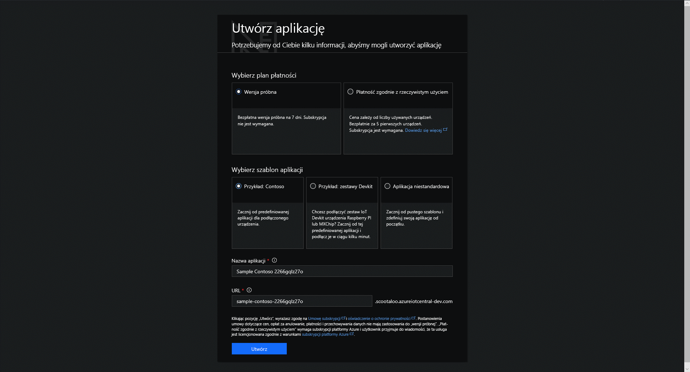

# Tworzenie aplikacji usługi Azure IoT Central

Jako _konstruktor_ użyjesz interfejsu użytkownika usługi Azure IoT Central w celu zdefiniowania aplikacji usługi Microsoft Azure IoT Central. W tym przewodniku Szybki start przedstawiono sposób tworzenia aplikacji usługi Azure IoT Central zawierającej przykładowy _szablon urządzenia_ i symulowane _urządzenia_.

Przejdź na stronę [Menedżer aplikacji](https://aka.ms/iotcentral) usługi Azure IoT Central. Musisz zalogować się przy użyciu osobistego konta Microsoft lub konta służbowego.

Aby rozpocząć tworzenie nowej aplikacji usługi Azure IoT Central, wybierz pozycję **Nowa aplikacja**. Spowoduje to przejście do strony **Tworzenie aplikacji**.

Aby utworzyć nową aplikację usługi Azure IoT Central:

1. Wybierz plan płatności:
   - Aplikacje typu **Wersja próbna** są bezpłatne przez 7 dni, a następnie ich ważność wygasa. W dowolnym momencie przed wygaśnięciem można przekonwertować te aplikacje na typ Płatność zgodnie z rzeczywistym użyciem.
   - Opłaty za aplikacje typu **Płatność za rzeczywiste użycie** są naliczane na urządzenie. 5 pierwszych urządzeń jest bezpłatnych.

     Więcej informacji o cenach znajdziesz na [stronie cennika usługi Azure IoT Central](https://azure.microsoft.com/pricing/details/iot-central/).

1. Wybierz przyjazną nazwę aplikacji, na przykład **Contoso IoT**. Usługa Azure IoT Central wygeneruje unikatowy prefiks adresu URL. Ten prefiks adresu URL możesz zmienić na łatwiejszy do zapamiętania.

1. Wybierz szablon aplikacji. Szablon aplikacji może zawierać wstępnie zdefiniowane elementy, takie jak pulpity nawigacyjne i szablony urządzeń, które pomogą Ci rozpocząć pracę.

    | Szablon aplikacji | Opis |
    | -------------------- | ----------- |
    | Przykład dotyczący firmy Contoso       | Tworzy aplikację, która zawiera już utworzony szablon urządzenia typu Automat do sprzedaży z chłodziarką. Użyj tego szablonu, aby rozpocząć eksplorowanie usługi Azure IoT Central. |
    | Przykład dotyczący zestawów deweloperskich       | Tworzy aplikację z gotowymi szablonami urządzeń, które umożliwiają łączenie z urządzeniem MXChip lub Raspberry Pi. Użyj tego szablonu, jeśli jesteś deweloperem urządzenia, który przeprowadza eksperymenty związane z dowolnym spośród tych urządzeń. |
    | Aplikacja niestandardowa   | Tworzy pustą aplikację, którą wypełnisz własnymi urządzeniami i szablonami urządzeń. |

1. Jeśli tworzysz aplikację typu **Płatność zgodnie z rzeczywistym użyciem**, musisz wybrać *katalog*, *subskrypcję platformy Azure* i *region*. 

   - *Katalog* jest usługi Azure Active Directory (AD) do tworzenia aplikacji. Zawiera on tożsamości użytkowników, poświadczenia i inne informacje o organizacji. Jeśli nie masz usługi Azure AD, utworzony automatycznie podczas tworzenia subskrypcji platformy Azure.

   - *Subskrypcja platformy Azure* umożliwia tworzenie wystąpień usług platformy Azure. Usługa IoT Central przeprowadzi aprowizację zasobów w ramach subskrypcji. Jeśli nie masz subskrypcji platformy Azure, możesz ją utworzyć na [stronie tworzenia konta platformy Azure](https://aka.ms/createazuresubscription). Po utworzeniu subskrypcji platformy Azure przejdź z powrotem do strony **Tworzenie aplikacji**. Nowa subskrypcja zostanie wyświetlona na liście rozwijanej **Subskrypcja platformy Azure**.

   - *Region* to fizyczna lokalizacja, w której chcesz utworzyć aplikację. Zazwyczaj należy wybrać region, który jest fizycznie najbliżej urządzenia, co pozwoli na uzyskanie optymalnej wydajności. Listę regionów, w których usługa Azure IoT Central jest dostępna, można znaleźć na stronie [Dostępność produktów według regionów](https://azure.microsoft.com/regions/services/).

     > [!Note]
     > Po wybraniu regionu nie można później przenieść aplikacji do innego regionu.

1. Wybierz pozycję **Utwórz**.

## Kolejne kroki

W tym przewodniku Szybki start utworzono aplikację usługi IoT Central. Poniżej przedstawiono następny sugerowany krok:

> [!div class="nextstepaction"]
> [Zapoznaj się z prezentacją usługi IoT Central](overview-iot-central-tour.md)
