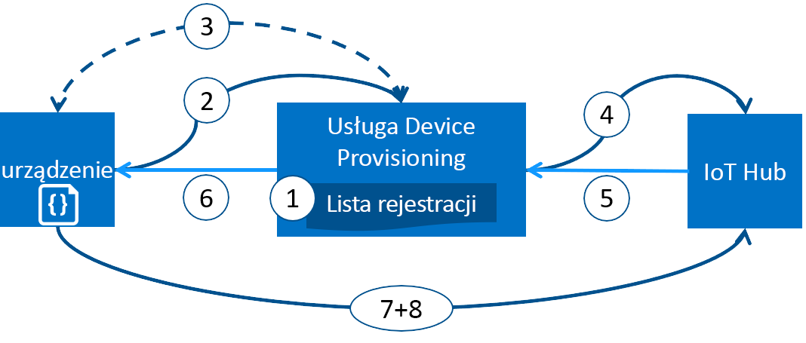

# Aprowizowanie urządzeń za pomocą usługi Azure IoT Hub Device Provisioning Service
Platforma Microsoft Azure zapewnia bogaty zestaw zintegrowanych usług w chmurze publicznej spełniający wszelkie potrzeby rozwiązania IoT. IoT Hub Device Provisioning Service (DPS) to usługa pomocnika dla IoT Hub, która umożliwia zainicjowanie obsługi "just in Time" do odpowiedniego centrum IoT Hub bez konieczności interwencji człowieka. Usługa DPS umożliwia bezpieczne i skalowalne Inicjowanie obsługi milionów urządzeń.

## Kiedy stosować usługę Device Provisioning Service
Istnieje wiele scenariuszy aprowizacji, w których usługa DPS jest doskonałym wyborem do uzyskiwania urządzeń podłączonych i skonfigurowanych do IoT Hub, takich jak:

* Bezobsługowe aprowizowanie w jednym rozwiązaniu IoT bez trwałego kodowania informacji o połączeniu z usługą IoT Hub w fabryce (konfiguracja początkowa)
* Równoważenie obciążenia urządzeń w wielu centrach
* Łączenie urządzeń z rozwiązaniem IoT ich właściciela na podstawie danych o transakcji sprzedaży (wielodostępność)
* Łączenie urządzeń z określonym rozwiązaniem IoT w zależności od przypadku użycia (izolacja rozwiązania)
* Łączenie urządzenia z centrum IoT o najmniejszym opóźnieniu (geograficzne dzielenie na fragmenty)
* Ponowne aprowizowanie na podstawie zmiany w urządzeniu
* Przerzucanie kluczy używanych przez urządzenie do nawiązywania połączenia z usługą IoT Hub (gdy na potrzeby połączenia nie są używane certyfikaty X.509)

## Za kulisami
Wszystkie scenariusze wymienione w poprzedniej sekcji można wykonać przy użyciu usługi DPS do obsługi aprowizacji bez dotknięcia tego samego przepływu. Wiele ręcznych kroków tradycyjnie związanych z obsługą administracyjną jest zautomatyzowany z usługą DPS w celu skrócenia czasu wdrażania urządzeń IoT i obniżenia ryzyka ręcznego błędu. W poniższej sekcji opisano, co dzieje się za kulisami, aby aprowizować urządzenie. Pierwszy krok jest ręczny, a wszystkie następne kroki są zautomatyzowane.

1. Producent urządzenia dodaje jego informacje o rejestracji do listy rejestracji w witrynie Azure Portal.
2. Urządzenie kontaktuje się z punktem końcowym DPS ustawionym w fabryce. Urządzenie przekazuje informacje identyfikujące do punktu dystrybucji, aby potwierdzić jego tożsamość.
3. Usługa DPS sprawdza poprawność tożsamości urządzenia, sprawdzając Identyfikator rejestracji i klucz związany z wpisem listy rejestracji przy użyciu żądania nonce ([moduł TPM](https://trustedcomputinggroup.org/work-groups/trusted-platform-module/)) lub standardowej weryfikacji x. 509 (x. 509).
4. Usługa DPS rejestruje urządzenie w usłudze IoT Hub i wypełnia [stan odpowiedniej przędzy](../iot-hub/iot-hub-devguide-device-twins.md)urządzenia.
5. Usługa IoT Hub zwraca informacje o IDENTYFIKATORze urządzenia do funkcji DPS.
6. Usługa DPS zwraca informacje o połączeniu usługi IoT Hub z urządzeniem. Urządzenie może teraz rozpocząć przesyłanie danych bezpośrednio do centrum IoT.
7. Urządzenie łączy się z centrum IoT.
8. Urządzenie pobiera żądany stan ze swojej bliźniaczej reprezentacji urządzenia w centrum IoT.

## Proces aprowizacji
Istnieją dwa odrębne kroki procesu wdrażania urządzenia, w którym usługa DPS bierze część, którą można wykonać niezależnie:

* **Krok produkcji**, w ramach którego urządzenie jest tworzone i przygotowywane w fabryce.
* **Krok konfiguracji chmury**, w ramach którego usługa Device Provisioning Service jest konfigurowana na potrzeby automatycznego aprowizowania.

Oba te kroki bezproblemowo wpisują się w istniejące procesy produkcji i wdrażania. Usługa DPS nawet upraszcza niektóre procesy wdrażania, które obejmują pracę ręczną, aby uzyskać informacje o połączeniu na urządzeniu.

### Krok produkcji
Ten krok obejmuje wszystko to, co dzieje się na linii produkcyjnej. Role biorące udział w tym kroku to projektant układów scalonych, producent układów scalonych, integrator i/lub końcowy producent urządzenia. Ten krok dotyczy tworzenia samego sprzętu.

Usługa DPS nie wprowadza nowego kroku w procesie produkcyjnym; Zamiast tego wiąże się to z istniejącym krokiem, który instaluje początkowe oprogramowanie i (najlepiej) moduł HSM na urządzeniu. W tym kroku, zamiast tworzyć identyfikator urządzenia, urządzenie jest programowane tak, aby zawierało informacje o usłudze aprowizowania, co umożliwia mu wywołanie usługi aprowizowania w celu uzyskania informacji dotyczących połączenia/przypisania do rozwiązania IoT po jego włączeniu.

Ponadto w tym kroku producent dostarcza osobie wdrażającej urządzenia/operatorowi urządzeń informacje o kluczu identyfikacyjnym. Dostarczenie tych informacji może być proste (np. potwierdzenie, że wszystkie urządzenia mają certyfikat X.509 wygenerowany na podstawie certyfikatu podpisywania udostępnionego przez osobę wdrażającą urządzenia/operatora urządzeń) lub skomplikowane (np. wyodrębnienie publicznej części klucza poręczenia modułu TPM z każdego urządzenia TPM). Te usługi są obecnie oferowane przez wielu producentów układów scalonych.

### Krok konfiguracji chmury
Ten krok dotyczy konfigurowania chmury na potrzeby odpowiedniego aprowizowania automatycznego. Zasadniczo w krok konfiguracji chmury są zaangażowane dwa typy użytkowników: ktoś, kto wie, jak urządzenia mają być wstępnie skonfigurowane (operator urządzeń) oraz ktoś inny, kto wie, jak urządzenia mają być podzielone między centrami IoT (operator rozwiązania).

Należy wykonać jednorazową początkową konfigurację aprowizowania. Zwykle zajmuje się tym operator rozwiązania. Gdy usługa aprowizowania zostanie skonfigurowana, nie trzeba jej modyfikować, chyba że przypadek użycia ulegnie zmianie.

Po skonfigurowaniu usługi na potrzeby automatycznego aprowizowania musi ona zostać przygotowana do rejestrowania urządzeń. Ten krok jest wykonywany przez operatora urządzeń, który zna żądaną konfigurację urządzeń i odpowiada za zapewnienie, że usługa aprowizowania może prawidłowo potwierdzić tożsamość urządzenia, gdy będzie ono wyszukiwać swoje centrum IoT. Operator urządzeń dodaje informacje o kluczu identyfikacyjnym, uzyskane od producenta, do listy rejestracji. Lista rejestracji może być później aktualizowana przez dodawanie nowych wpisów lub aktualizowanie istniejących przy użyciu najnowszych informacji o urządzeniach.

## Rejestracja i aprowizowanie
*Aprowizowanie* w zależności od branży, w której ten termin jest używany, może oznaczać coś innego. W kontekście aprowizowania urządzeń IoT w ich rozwiązaniu w chmurze aprowizowanie to proces składający się z dwóch części:

1. Pierwsza część to ustanowienie połączenia początkowego między urządzeniem a rozwiązaniem IoT przez rejestrację urządzenia.
2. Druga część to zastosowanie odpowiedniej konfiguracji do urządzenia na podstawie określonych wymagań rozwiązania, w którym zostało ono zarejestrowane.

Po wykonaniu tych dwóch kroków można powiedzieć, że urządzenie zostało w pełni aprowizowane. Niektóre usługi w chmurze umożliwiają wykonanie tylko pierwszego kroku tego procesu aprowizowania przez zarejestrowanie urządzeń w punkcie końcowym rozwiązania IoT, ale nie zapewniają konfiguracji początkowej. Usługa DPS automatyzuje obie kroki, aby zapewnić bezproblemową obsługę administracyjną urządzenia.

## Funkcje usługi Device Provisioning Service
Usługa DPS ma wiele funkcji, dzięki czemu jest idealnym rozwiązaniem do aprowizacji urządzeń.

* Obsługa **bezpiecznego zaświadczania** dla tożsamości opartych zarówno na standardzie X.509, jak i module TPM.
* **Lista rejestracji** zawierająca pełny rejestr urządzeń/grup urządzeń, które w pewnym momencie mogą zostać zarejestrowane. Lista rejestracji zawiera informacje dotyczące żądanej konfiguracji urządzenia po jego zarejestrowaniu i może być aktualizowana w dowolnym momencie.
* **Wiele zasad alokacji** do kontrolowania, w jaki sposób usługa DPS przypisuje urządzenia do centrów IoT w ramach obsługi Twoich scenariuszy: najniższy czas oczekiwania (domyślnie) i Konfiguracja statyczna za pośrednictwem listy rejestracji. Czas oczekiwania jest określany przy użyciu tej samej metody co [Traffic Manager](https://docs.microsoft.com/azure/traffic-manager/traffic-manager-routing-methods#performance).
* **Monitorowanie i rejestrowanie diagnostyczne** w celu zapewnienia poprawnego działania.
* **Obsługa wielocentrów** umożliwia usłudze DPS późne wiązanie urządzeń z Centrum IoT w czasie wykonywania. Usługa DPS może komunikować się z centrami w wielu subskrypcjach platformy Azure.
* **Obsługa wielu regionów** pozwala usłudze DPS przypisywać urządzenia do centrów IoT w innych regionach.

Więcej informacji o pojęciach i funkcjach z zakresu aprowizowania urządzeń możesz znaleźć w artykułach na temat [pojęć dotyczących urządzeń](concepts-device.md), [pojęć dotyczących usługi](concepts-service.md) oraz [pojęć dotyczących zabezpieczeń](concepts-security.md).

## Obsługa wielu platform
Podobnie jak w przypadku wszystkich usług Azure IoT, usługa DPS działa na wielu platformach z różnymi systemami operacyjnymi. Platforma Azure oferuje zestawy SDK typu open source w wielu różnych [językach](https://github.com/Azure/azure-iot-sdks), aby usprawnić łączenie urządzeń i zarządzanie usługą. Usługa DPS obsługuje następujące protokoły do łączenia urządzeń:

* HTTPS
* AMQP
* AMQP za pośrednictwem obiektów Web Socket
* MQTT
* MQTT za pośrednictwem obiektów Web Socket

Usługa DPS obsługuje tylko połączenia HTTPS dla operacji usługi.

## Regiony
Usługa DPS jest dostępna w wielu regionach. Aktualna lista obecnych i nowo ogłoszonych regionów dla wszystkich usług jest dostępna na stronie [Regiony świadczenia usługi Azure](https://azure.microsoft.com/regions/). Dostępność usługi Device Provisioning Service można sprawdzić na stronie [Stan platformy Azure](https://azure.microsoft.com/status/).

> [!NOTE]
> Usługa DPS jest globalna i nie jest powiązana z lokalizacją. Należy jednak określić region, w którym będą znajdować się metadane skojarzone z Twoim profilem DPS.

## Dostępność
Istnieje 99,9% Umowa dotycząca poziomu usług usługi DPS i można [przeczytać umowę SLA](https://azure.microsoft.com/support/legal/sla/iot-hub/). Pełna treść [umowy SLA dotyczącej usługi Azure](https://azure.microsoft.com/support/legal/sla/) wyjaśnia w całości kwestię gwarantowanej dostępności platformy Azure.

## Przydziały
W każdej subskrypcji platformy Azure obowiązują domyślne limity przydziału, które mogą mieć wpływ na zakres rozwiązania IoT. Aktualny limit dla każdej subskrypcji wynosi 10 usług Device Provisioning Service na subskrypcję.

[!INCLUDE [azure-iotdps-limits](../../includes/iot-dps-limits.md)]

Więcej informacji na temat limitów przydziałów znajduje się w artykułach:
* [Azure Subscription Service Limits](../azure-resource-manager/management/azure-subscription-service-limits.md) (Limity usług subskrypcji platformy Azure)

## Powiązane składniki platformy Azure
Usługa DPS automatyzuje Inicjowanie obsługi urządzeń za pomocą usługi Azure IoT Hub. Dowiedz się więcej na temat usługi [IoT Hub](https://docs.microsoft.com/azure/iot-hub/).

## Następne kroki
Teraz ogólnie wiesz, na czym polega aprowizowanie urządzeń IoT na platformie Azure. Następnym krokiem jest wypróbowanie kompletnego scenariusza IoT.
> [!div class="nextstepaction"]
> [Konfigurowanie usługi IoT Hub Device Provisioning Service przy użyciu witryny Azure Portal](quick-setup-auto-provision.md)
> [Tworzenie i aprowizowanie urządzenia symulowanego](quick-create-simulated-device.md)
> [Konfigurowanie urządzenia pod kątem aprowizacji](tutorial-set-up-device.md)
