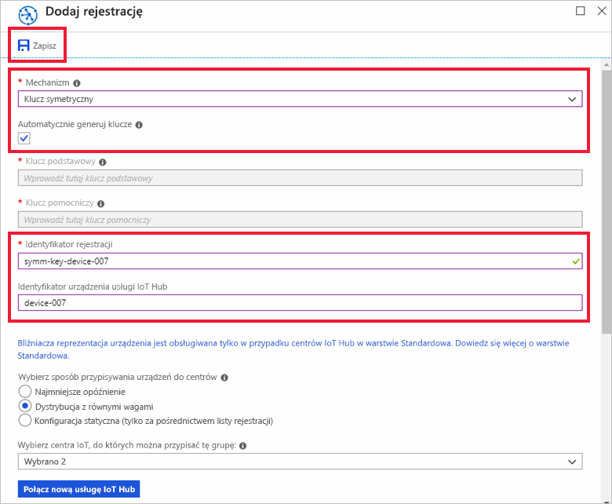
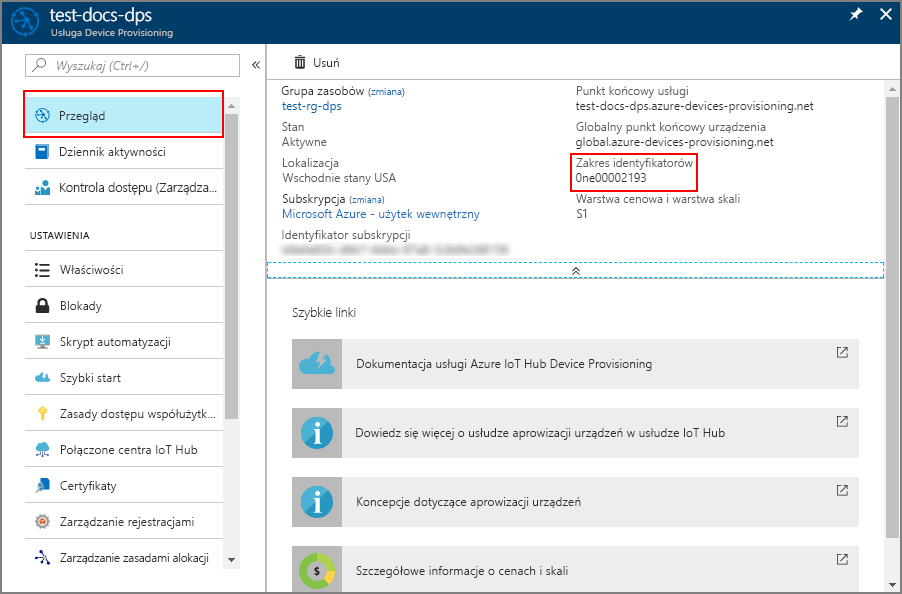

# <a name="quickstart-provision-a-simulated-device-with-symmetric-keys"></a>Szybki start: aprowizowanie urządzenia symulowanego przy użyciu kluczy symetrycznych

Z tego przewodnika Szybki start dowiesz się, jak utworzyć i uruchomić symulator urządzenia na maszynie deweloperskiej z systemem Windows. To urządzenie symulowane skonfigurujesz pod kątem używania klucza symetrycznego w celu uwierzytelnienia w wystąpieniu usługi Device Provisioning Service i przypisania do centrum IoT. W celu symulowania sekwencji uruchamiania dla tego urządzenia, które inicjuje aprowizowanie, będzie używany przykładowy kod z [zestawu SDK języka C usługi Azure IoT](https://github.com/Azure/azure-iot-sdk-c). Urządzenie zostanie rozpoznane na podstawie indywidualnej rejestracji w wystąpieniu usługi aprowizowania i przypisane do centrum IoT.

Chociaż w tym artykule przedstawiono Inicjowanie obsługi przy użyciu rejestracji indywidualnej, można użyć grup rejestracji. W przypadku korzystania z grup rejestracji istnieją pewne różnice. Na przykład należy użyć pochodnego klucza urządzenia z unikatowym IDENTYFIKATORem rejestracji dla urządzenia. Mimo że grupy rejestracji klucza symetrycznego nie są ograniczone do starszych urządzeń, artykuł [Aprowizowanie starszych urządzeń za pomocą zaświadczenia klucza symetrycznego](how-to-legacy-device-symm-key.md) zawiera przykład grupy rejestracji. Aby uzyskać więcej informacji, zobacz [Rejestrowanie grupy dla zaświadczania klucza symetrycznego](concepts-symmetric-key-attestation.md#group-enrollments).

Jeśli nie znasz procesu automatycznego aprowizowania, zapoznaj się z tematem [Auto-provisioning concepts (Pojęcia związane z automatycznym aprowizowaniem)](concepts-auto-provisioning.md). 

Pamiętaj również, aby przed rozpoczęciem pracy z tym przewodnikiem Szybki start wykonać kroki przedstawione w części [Konfigurowanie usługi IoT Hub Device Provisioning za pomocą witryny Azure Portal](./quick-setup-auto-provision.md). Ten przewodnik Szybki start wymaga utworzonego już wystąpienia usługi Device Provisioning Service.

Ten artykuł został opracowany z myślą o stacjach roboczych z systemem Windows. Jednak opisane procedury można wykonać także w systemie Linux. Aby uzyskać przykład dla systemu Linux, zobacz [Aprowizowanie pod kątem wielu dzierżaw](how-to-provision-multitenant.md).


[!INCLUDE [quickstarts-free-trial-note](../../includes/quickstarts-free-trial-note.md)]


## <a name="prerequisites"></a>Wymagania wstępne

Poniższe wymagania wstępne dotyczą środowiska projektowego systemu Windows. W systemie Linux lub macOS zapoznaj się z odpowiednią sekcją w sekcji [Przygotowywanie środowiska deweloperskiego](https://github.com/Azure/azure-iot-sdk-c/blob/master/doc/devbox_setup.md) w dokumentacji zestawu SDK.

* [Program Visual Studio](https://visualstudio.microsoft.com/vs/) 2019 z włączonym obciążeniem ["Programowanie aplikacji klasycznych C++"](https://docs.microsoft.com/cpp/?view=vs-2019#pivot=workloads) . Obsługiwane są również programy Visual Studio 2015 i Visual Studio 2017.

* Zainstalowana najnowsza wersja usługi[Git](https://git-scm.com/download/).

<a id="setupdevbox"></a>

## <a name="prepare-an-azure-iot-c-sdk-development-environment"></a>Przygotowywanie środowiska deweloperskiego dla zestawu SDK języka C usługi Azure IoT

W tej sekcji przygotujesz środowisko deweloperskie używane do opracowania [zestawu SDK języka C usługi Azure IoT](https://github.com/Azure/azure-iot-sdk-c). 

Zestaw SDK zawiera przykładowy kod dla urządzenia symulowanego. To urządzenie symulowane podejmie próbę aprowizacji podczas sekwencji rozruchu urządzenia.

1. Pobierz [system kompilacji CMAKE](https://cmake.org/download/).

    Ważne jest, aby wstępnie wymagane składniki (program Visual Studio oraz pakiet roboczy „Programowanie aplikacji klasycznych w języku C++”) były zainstalowane na tym komputerze **przed** uruchomieniem `CMake` instalacji. Gdy wymagania wstępne zostaną spełnione, a pobrane pliki zweryfikowane, zainstaluj system kompilacji CMake.

2. Kliknij pozycję **Tagi** i Znajdź nazwę tagu dla najnowszej wersji na [stronie wydanie zestawu SDK języka C usługi Azure IoT](https://github.com/Azure/azure-iot-sdk-c/releases/latest).

3. Otwórz wiersz polecenia lub powłokę Git Bash. Uruchom następujące polecenia, aby sklonować najnowszą wersję repozytorium [usługi Azure IoT C SDK](https://github.com/Azure/azure-iot-sdk-c) w witrynie GitHub. Użyj znacznika znalezionego w poprzednim kroku jako wartości parametru `-b`:

    ```cmd/sh
    git clone -b <release-tag> https://github.com/Azure/azure-iot-sdk-c.git
    cd azure-iot-sdk-c
    git submodule update --init
    ```

    Należy się spodziewać, że ukończenie operacji potrwa kilka minut.

4. Utwórz podkatalog `cmake` w katalogu głównym repozytorium Git, a następnie przejdź do tego folderu. Uruchom następujące polecenia w katalogu `azure-iot-sdk-c`:

    ```cmd/sh
    mkdir cmake
    cd cmake
    ```

5. Uruchom następujące polecenie, które utworzy wersję zestawu SDK specyficzną dla platformy klienta deweloperskiego. Rozwiązanie programu Visual Studio dla symulowanego urządzenia zostanie wygenerowane w katalogu `cmake`. 

    ```cmd
    cmake -Dhsm_type_symm_key:BOOL=ON -Duse_prov_client:BOOL=ON  ..
    ```
    
    Jeśli program `cmake` nie znajdzie kompilatora języka C++, mogą występować błędy kompilacji podczas uruchamiania powyższego polecenia. Jeśli tak się stanie, spróbuj uruchomić to polecenie w [wierszu polecenia programu Visual Studio](https://docs.microsoft.com/dotnet/framework/tools/developer-command-prompt-for-vs). 

    Gdy kompilacja zakończy się powodzeniem, kilka ostatnich wierszy danych wyjściowych będzie wyglądać podobnie do następujących danych wyjściowych:

    ```cmd/sh
    $ cmake -Dhsm_type_symm_key:BOOL=ON -Duse_prov_client:BOOL=ON  ..
    -- Building for: Visual Studio 15 2017
    -- Selecting Windows SDK version 10.0.16299.0 to target Windows 10.0.17134.
    -- The C compiler identification is MSVC 19.12.25835.0
    -- The CXX compiler identification is MSVC 19.12.25835.0

    ...

    -- Configuring done
    -- Generating done
    -- Build files have been written to: E:/IoT Testing/azure-iot-sdk-c/cmake
    ```

## <a name="create-a-device-enrollment-entry-in-the-portal"></a>Tworzenie wpisu rejestracji urządzenia w portalu

1. Zaloguj się do [Azure Portal](https://portal.azure.com), wybierz przycisk **wszystkie zasoby** w menu po lewej stronie i Otwórz swoją usługę Device Provisioning.

2. Wybierz kartę **Zarządzanie rejestracjami** , a następnie wybierz przycisk **Dodaj rejestrację indywidualną** u góry. 

3. W panelu **Dodaj rejestrację** Wprowadź poniższe informacje, a następnie naciśnij przycisk **Save (Zapisz** ).

   - **Mechanizm:** wybierz **Klucz symetryczny** jako *Mechanizm* poświadczania tożsamości.

   - **Automatycznie Generuj klucze**: zaznacz to pole.

   - **Identyfikator rejestracji**: wprowadź identyfikator rejestracji, aby zidentyfikować rejestrację. Użyj tylko małych znaków alfanumerycznych i kresek (-). Na przykład **Symm-Key-Device-007**.

   - **Identyfikator urządzenia usługi IoT Hub:** wprowadź identyfikator urządzenia. Na przykład **device-007**.

     

4. Po zapisaniu rejestracji **klucz podstawowy** i **klucz pomocniczy** zostaną wygenerowane i dodane do wpisu rejestracji. Rejestracja urządzenia klucza symetrycznego jest wyświetlana jako **symm-key-device-007** w kolumnie *Identyfikator rejestracji* na karcie *Indywidualne rejestracje*. 

    Otwórz rejestrację i skopiuj wartość wygenerowanego **klucza podstawowego**.


<a id="firstbootsequence"></a>

## <a name="simulate-first-boot-sequence-for-the-device"></a>Symulowanie sekwencji pierwszego uruchamiania dla urządzenia

W tej sekcji zaktualizujesz kod przykładowy w celu wysłania sekwencji uruchamiania urządzenia do wystąpienia usługi Device Provisioning Service. Ta sekwencja uruchamiania spowoduje, że urządzenie zostanie rozpoznane i przypisane do centrum IoT Hub połączonego z wystąpieniem usługi Device Provisioning Service.


1. W Azure Portal wybierz kartę **Przegląd** dla swojej usługi Device Provisioning i zanotuj wartość **_Identyfikator zakresu_** .

     

2. W programie Visual Studio otwórz plik rozwiązania **azure_iot_sdks.sln**, który został wygenerowany przez uruchomienie narzędzia CMake. Plik rozwiązania powinien znajdować się w następującej lokalizacji:

    ```
    \azure-iot-sdk-c\cmake\azure_iot_sdks.sln
    ```

3. W oknie *Eksplorator rozwiązań* programu Visual Studio przejdź do folderu **Provision\_Samples**. Rozwiń przykładowy projekt o nazwie **prov\_dev\_client\_sample**. Rozwiń pozycję **Pliki źródłowe**, a następnie otwórz plik **prov\_dev\_client\_sample.c**.

4. Znajdź stałą `id_scope` i zastąp jej wartość wcześniej skopiowaną wartością **Zakres identyfikatorów**. 

    ```c
    static const char* id_scope = "0ne00002193";
    ```

5. Znajdź definicję funkcji `main()` w tym samym pliku. Upewnij się, że zmienna `hsm_type` jest ustawiona na `SECURE_DEVICE_TYPE_SYMMETRIC_KEY`, jak pokazano poniżej:

    ```c
    SECURE_DEVICE_TYPE hsm_type;
    //hsm_type = SECURE_DEVICE_TYPE_TPM;
    //hsm_type = SECURE_DEVICE_TYPE_X509;
    hsm_type = SECURE_DEVICE_TYPE_SYMMETRIC_KEY;
    ```

6. Znajdź wywołanie funkcji `prov_dev_set_symmetric_key_info()` w pliku **prov\_dev\_client\_sample.c**, które jest ujęte w komentarz.

    ```c
    // Set the symmetric key if using they auth type
    //prov_dev_set_symmetric_key_info("<symm_registration_id>", "<symmetric_Key>");
    ```

    Usuń znaczniki komentarza dla tego wywołania funkcji i zastąp wartości symboli zastępczych (włącznie z nawiasami ostrymi) wartościami identyfikatora rejestracji i klucza podstawowego.

    ```c
    // Set the symmetric key if using they auth type
    prov_dev_set_symmetric_key_info("symm-key-device-007", "your primary key here");
    ```
   
    Zapisz plik.

7. Kliknij prawym przyciskiem myszy projekt **prov\_dev\_client\_sample**, a następnie wybierz pozycję **Ustaw jako projekt startowy**. 

8. Z menu programu Visual Studio wybierz pozycję **Debuguj** > **Uruchom bez debugowania**, aby uruchomić rozwiązanie. W wierszu polecenia, aby ponownie skompilować projekt, wybierz opcję **tak**, aby ponownie skompilować projekt przed uruchomieniem.

    Następujące dane wyjściowe to przykład pomyślnego uruchomienia urządzenia symulowanego i połączenia z wystąpieniem usługi aprowizowania w celu przypisania do centrum IoT:

    ```cmd
    Provisioning API Version: 1.2.8

    Registering Device

    Provisioning Status: PROV_DEVICE_REG_STATUS_CONNECTED
    Provisioning Status: PROV_DEVICE_REG_STATUS_ASSIGNING
    Provisioning Status: PROV_DEVICE_REG_STATUS_ASSIGNING

    Registration Information received from service: 
    test-docs-hub.azure-devices.net, deviceId: device-007    
    Press enter key to exit:
    ```

9. W portalu przejdź do centrum IoT Hub, do którego została przypisana symulowane urządzenie, i wybierz kartę **urządzenia IoT** . Po pomyślnej aprowizacji symulowanego centrum jego identyfikator urządzenia jest wyświetlany w bloku **urządzenia IoT** z opcją *stan* jako **włączone**. Może być konieczne naciśnięcie przycisku **Odśwież** w górnej części ekranu. 

     


## <a name="clean-up-resources"></a>Oczyszczanie zasobów

Jeśli planujesz kontynuować pracę i eksplorowanie przykładowego klienta urządzenia, nie czyść zasobów utworzonych w tym przewodniku Szybki Start. Jeśli nie planujesz kontynuować pracy, wykonaj następujące kroki, aby usunąć wszystkie zasoby utworzone w ramach tego przewodnika Szybki Start.

1. Zamknij okno danych wyjściowych przykładu klienta urządzenia na swojej maszynie.
1. Z menu po lewej stronie w Azure Portal wybierz pozycję **wszystkie zasoby** , a następnie wybierz usługę Device Provisioning. Otwórz przystawkę **Zarządzanie rejestracjami** dla usługi, a następnie wybierz kartę **indywidualne rejestracje** . Zaznacz pole wyboru obok *identyfikatora rejestracji* urządzenia zarejestrowanego w tym przewodniku Szybki Start, a następnie naciśnij przycisk **Usuń** w górnej części okienka. 
1. Z menu po lewej stronie w Azure Portal wybierz pozycję **wszystkie zasoby** , a następnie wybierz swoje centrum IoT Hub. Otwórz **urządzenia IoT** dla swojego centrum, zaznacz pole wyboru obok *identyfikatora urządzenia* urządzenia zarejestrowanego w tym przewodniku Szybki Start, a następnie naciśnij przycisk **Usuń** w górnej części okienka.

## <a name="next-steps"></a>Następne kroki

W tym przewodniku szybki start utworzono symulowane urządzenie na komputerze z systemem Windows i zostało ono udostępnione w usłudze IoT Hub przy użyciu klucza symetrycznego za pomocą usługi Azure IoT Hub Device Provisioning Service w portalu. Aby dowiedzieć się, jak zarejestrować urządzenie programowo, przejdź do przewodnika Szybki Start dotyczącego rejestrowania na urządzeniach X. 509. 

> [!div class="nextstepaction"]
> [Przewodnik Szybki Start platformy Azure — rejestrowanie urządzeń X. 509 w usłudze Azure IoT Hub Device Provisioning Service](quick-enroll-device-x509-java.md)
