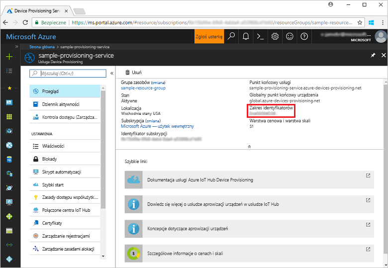
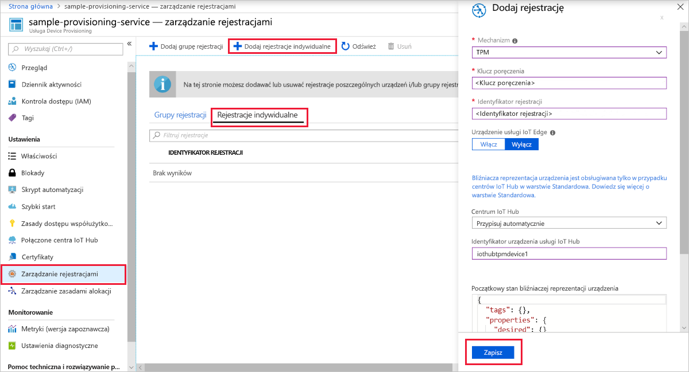
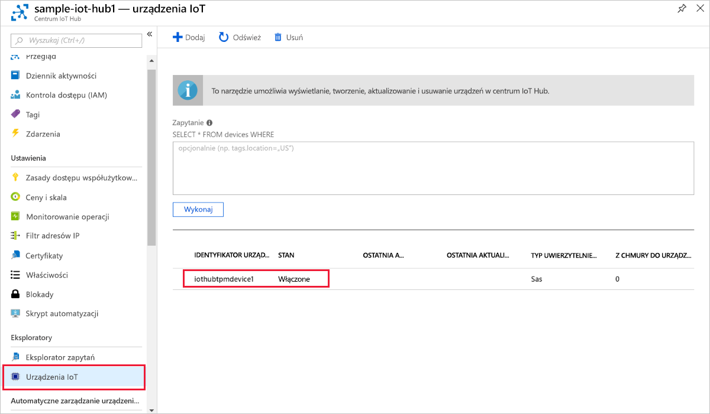

# <a name="quickstart-create-and-provision-a-simulated-tpm-device-using-c-device-sdk-for-iot-hub-device-provisioning-service"></a>Szybki Start: Tworzenie i Inicjowanie symulowanego urządzenia TPM za C# pomocą zestawu SDK urządzeń dla IoT Hub Device Provisioning Service

[!INCLUDE [iot-dps-selector-quick-create-simulated-device-tpm](../../includes/iot-dps-selector-quick-create-simulated-device-tpm.md)]

Te kroki pokazują, jak symulować urządzenie TPM na maszynie deweloperskiej z systemem operacyjnym Windows przy użyciu [przykładów usługi Azure IoT dla języka C#](https://github.com/Azure-Samples/azure-iot-samples-csharp). Ten przykład obejmuje także połączenie symulowanego urządzenia z usługą IoT Hub przy użyciu usługi Device Provisioning. 

Przykład kodu używa symulatora modułu Windows TPM jako [sprzętowego modułu zabezpieczeń (HSM, hardware security module)](https://azure.microsoft.com/blog/azure-iot-supports-new-security-hardware-to-strengthen-iot-security/) urządzenia. 

Jeśli nie znasz procesu automatycznego aprowizowania, zapoznaj się również z tematem [Auto-provisioning concepts (Pojęcia związane z automatycznym aprowizowaniem)](concepts-auto-provisioning.md). Pamiętaj również, aby wcześniej wykonać kroki przedstawione w części [Konfigurowanie usługi IoT Hub Device Provisioning za pomocą witryny Azure Portal](./quick-setup-auto-provision.md). 

Usługa Azure IoT Device Provisioning obsługuje dwa typy rejestracji:

- [Grupy rejestracji](concepts-service.md#enrollment-group): służą do rejestrowania wielu pokrewnych urządzeń.
- [Rejestracje indywidualne](concepts-service.md#individual-enrollment): służą do rejestrowania pojedynczych urządzeń.

W tym artykule przedstawiono rejestracje indywidualne.

[!INCLUDE [IoT Device Provisioning Service basic](../../includes/iot-dps-basic.md)]

<a id="setupdevbox"></a>
## <a name="prepare-the-development-environment"></a>Przygotowywanie środowiska deweloperskiego 

1. Upewnij się, że na maszynie jest zainstalowany [zestaw SDK dla platformy .NET Core 2,1 lub nowszy](https://www.microsoft.com/net/download/windows) . 

1. Upewnij się, że na swojej maszynie masz zainstalowane oprogramowanie `git` i że jest ono dodane do zmiennych środowiskowych dostępnych z okna poleceń. Zobacz stronę z [narzędziami klienckimi Git organizacji Software Freedom Conservancy](https://git-scm.com/download/), aby uzyskać najnowszą wersję narzędzi `git` do zainstalowania, które obejmują powłokę **Git Bash**, czyli aplikację wiersza polecenia, która może służyć do interakcji z lokalnym repozytorium Git. 

1. Otwórz wiersz polecenia lub powłokę Git Bash. Sklonuj repozytorium GitHub Azure IoT Samples for C#:

    ```cmd
    git clone https://github.com/Azure-Samples/azure-iot-samples-csharp.git
    ```

## <a name="provision-the-simulated-device"></a>Aprowizowanie urządzenia symulowanego

1. Zaloguj się do Portalu Azure. Wybierz przycisk **wszystkie zasoby** w menu po lewej stronie i Otwórz swoją usługę Device Provisioning. W bloku **Przegląd** Zwróć uwagę na wartość **_Identyfikator zakresu_** .

     

1. W wierszu polecenia zmień katalogi na katalog projektu dla przykładu aprowizacji urządzenia TPM.

    ```cmd
    cd .\azure-iot-samples-csharp\provisioning\Samples\device\TpmSample
    ```

1. Wpisz następujące polecenie, aby skompilować i uruchomić przykład aprowizacji urządzenia TPM. Zastąp wartość `<IDScope>` zakresem identyfikatorów Twojej usługi aprowizacji. 

    ```cmd
    dotnet run <IDScope>
    ```

    To polecenie spowoduje uruchomienie symulatora mikroukładu urządzenia TPM w osobnym wierszu polecenia. W systemie Windows może wystąpić alert zabezpieczeń systemu Windows z pytaniem, czy chcesz zezwolić programowi symulator. exe na komunikowanie się z sieciami publicznymi. Na potrzeby tego przykładu można anulować żądanie.

1. Oryginalne okno polecenia wyświetla **_Klucz poręczenia_** , **_Identyfikator rejestracji_** i sugerowany **_Identyfikator urządzenia_** wymagany do rejestracji urządzeń. Zanotuj te wartości. Użyjesz tych wartości do utworzenia rejestracji indywidualnej w wystąpieniu usługi Device Provisioning. 
   > [!NOTE]
   > Nie pomyl okna zawierającego dane wyjściowe polecenia z oknem zawierającym dane wyjściowe z symulatora modułu TPM. Może być konieczne wybranie oryginalnego okna polecenia, aby przenieść je na pierwszy plan.

     

1. W Azure Portal z menu usługi Device Provisioning wybierz pozycję **Zarządzaj rejestracjami**. Wybierz kartę **rejestracje indywidualne** i wybierz przycisk **Dodaj indywidualną rejestrację** u góry. 

1. W panelu **Dodawanie rejestracji** wprowadź następujące informacje:
   - Wybierz opcję **TPM** jako *Mechanizm* poświadczania tożsamości.
   - Wprowadź *Identyfikator rejestracji* i *Klucz poręczenia* dla urządzenia TPM z wartości zanotowanych wcześniej.
   - Wybierz centrum IoT połączone z Twoją usługą aprowizacji.
   - Opcjonalnie można podać następujące informacje:
       - Wprowadź unikatowy *Identyfikator urządzenia* (możesz użyć sugerowanego lub podania własnych). Nadając nazwę urządzeniu, unikaj korzystania z danych poufnych. W przypadku wybrania opcji nie należy podać identyfikator rejestracji zostanie użyty do zidentyfikowania urządzenia.
       - Zaktualizuj pole **Początkowy stan bliźniaczej reprezentacji urządzenia** za pomocą wybranej konfiguracji początkowej dla urządzenia.
   - Po zakończeniu naciśnij przycisk **Zapisz** . 

       

   Po pomyślnej rejestracji *Identyfikator rejestracji* Twojego urządzenia pojawi się na liście na karcie *Indywidualne rejestracje*. 

1. Naciśnij klawisz *Enter* w oknie wiersza polecenia (taki, który wyświetla **_Klucz poręczenia_** , **_Identyfikator rejestracji_** i sugerowany **_Identyfikator urządzenia_** ), aby zarejestrować symulowane urządzenie. Zwróć uwagę na komunikaty symulujące uruchamianie urządzenia i łączenie z usługą Device Provisioning Service w celu pobrania informacji z Twojego centrum IoT. 

1. Upewnij się, że urządzenie zostało zaaprowizowane. Po pomyślnej aprowizacji symulowanego urządzenia w centrum IoT Hub powiązanym z Twoją usługą aprowizacji identyfikator urządzenia jest wyświetlany w bloku **urządzenia IoT** centrum. 

     

    Jeśli zmienisz wartość w polu *Początkowy stan bliźniaczej reprezentacji urządzenia* z domyślnej na inną we wpisie rejestracji dla Twojego urządzenia, może to spowodować pobranie z centrum żądanego stanu reprezentacji bliźniaczej i odpowiednie do niego działanie. Aby uzyskać więcej informacji, zobacz [Opis bliźniaczej reprezentacji urządzenia w usłudze IoT Hub oraz sposoby jej używania](../iot-hub/iot-hub-devguide-device-twins.md).

## <a name="clean-up-resources"></a>Oczyszczanie zasobów

Jeśli planujesz kontynuować pracę i eksplorowanie przykładowego klienta urządzenia, nie czyść zasobów utworzonych w tym przewodniku Szybki Start. Jeśli nie planujesz kontynuować pracy, wykonaj następujące kroki, aby usunąć wszystkie zasoby utworzone w ramach tego przewodnika Szybki Start.

1. Zamknij okno danych wyjściowych przykładu klienta urządzenia na swojej maszynie.
1. Zamknij okno symulatora modułu TPM na swojej maszynie.
1. Z menu po lewej stronie w Azure Portal wybierz pozycję **wszystkie zasoby** , a następnie wybierz usługę Device Provisioning. W górnej części bloku **Przegląd** naciśnij pozycję **Usuń** w górnej części okienka.  
1. Z menu po lewej stronie w Azure Portal wybierz pozycję **wszystkie zasoby** , a następnie wybierz swoje centrum IoT Hub. W górnej części bloku **Przegląd** naciśnij pozycję **Usuń** w górnej części okienka.  

## <a name="next-steps"></a>Następne kroki

W tym przewodniku szybki start utworzono symulowane urządzenie modułu TPM na maszynie i udostępniono je Centrum IoT Hub przy użyciu IoT Hub Device Provisioning Service. Aby dowiedzieć się, jak zarejestrować urządzenie TPM programowo, przejdź do przewodnika Szybki Start dotyczącego rejestrowania programowego dla urządzenia TPM. 

> [!div class="nextstepaction"]
> [Przewodnik Szybki Start platformy Azure — rejestrowanie urządzenia TPM w usłudze Azure IoT Hub Device Provisioning Service](quick-enroll-device-tpm-csharp.md)
