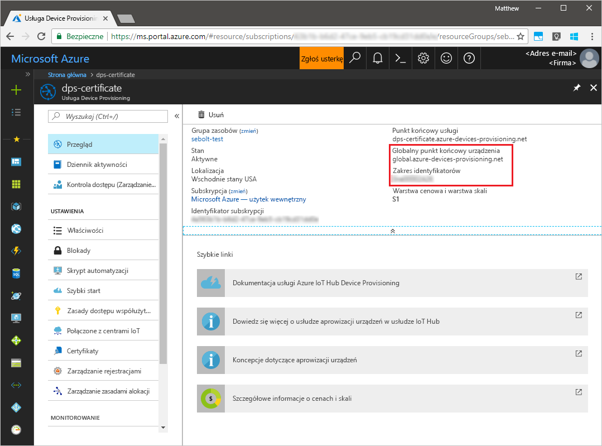
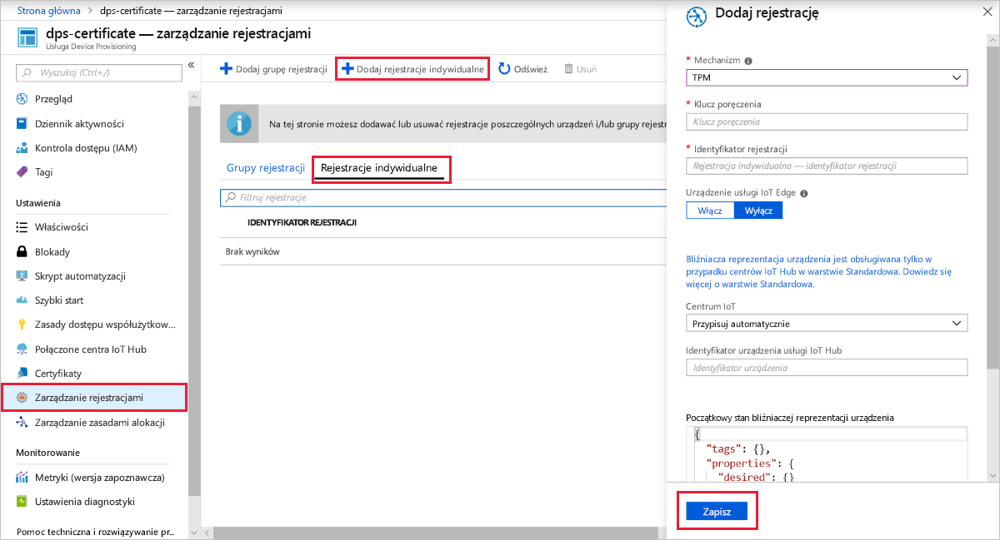

# <a name="quickstart-create-and-provision-a-simulated-tpm-device-using-java-device-sdk-for-azure-iot-hub-device-provisioning-service"></a>Szybki Start: Tworzenie i Inicjowanie symulowanego urządzenia TPM za pomocą zestawu SDK urządzenia Java dla platformy Azure IoT Hub Device Provisioning Service

[!INCLUDE [iot-dps-selector-quick-create-simulated-device-tpm](../../includes/iot-dps-selector-quick-create-simulated-device-tpm.md)]

Te kroki pokazują, jak utworzyć symulowane urządzenie na maszynie deweloperskiej z systemem operacyjnym Windows OS, uruchomić symulator modułu Windows TPM jako [sprzętowy moduł zabezpieczeń (HSM)](https://azure.microsoft.com/blog/azure-iot-supports-new-security-hardware-to-strengthen-iot-security/) urządzenia i użyć przykładowego kodu do połączenia tego symulowanego urządzenia z usługą Device Provisioning Service i Twoim centrum IoT. 

Jeśli nie znasz procesu automatycznego aprowizowania, zapoznaj się również z tematem [Auto-provisioning concepts (Pojęcia związane z automatycznym aprowizowaniem)](concepts-auto-provisioning.md). Pamiętaj również, aby wcześniej wykonać kroki przedstawione w części [Konfigurowanie usługi IoT Hub Device Provisioning za pomocą witryny Azure Portal](./quick-setup-auto-provision.md). 

Usługa Azure IoT Device Provisioning obsługuje dwa typy rejestracji:
- [Grupy rejestracji](concepts-service.md#enrollment-group): służą do rejestrowania wielu pokrewnych urządzeń.
- [Rejestracje indywidualne](concepts-service.md#individual-enrollment): służą do rejestrowania pojedynczych urządzeń.

W tym artykule przedstawiono rejestracje indywidualne.

[!INCLUDE [IoT Device Provisioning Service basic](../../includes/iot-dps-basic.md)]

## <a name="prepare-the-environment"></a>Przygotowywanie środowiska 

1. Upewnij się, że na maszynie zainstalowano środowisko [Java SE Development Kit 8](https://aka.ms/azure-jdks).

1. Pobierz i zainstaluj pakiet [Maven](https://maven.apache.org/install.html).

1. Upewnij się, że na swojej maszynie masz zainstalowane oprogramowanie `git` i że jest ono dodane do zmiennych środowiskowych dostępnych z okna poleceń. Zobacz stronę z [narzędziami klienckimi Git organizacji Software Freedom Conservancy](https://git-scm.com/download/), aby uzyskać najnowszą wersję narzędzi `git` do zainstalowania, które obejmują powłokę **Git Bash**, czyli aplikację wiersza polecenia, która może służyć do interakcji z lokalnym repozytorium Git. 

1. Otwórz wiersz polecenia. Sklonuj repozytorium GitHub dla przykładu kodu symulacji urządzenia.
    
    ```cmd/sh
    git clone https://github.com/Azure/azure-iot-sdk-java.git --recursive
    ```

1. Uruchom symulator [TPM](https://docs.microsoft.com/windows/device-security/tpm/trusted-platform-module-overview). Kliknij pozycję **Zezwól na dostęp**, aby zezwolić na wprowadzanie zmian ustawień _Zapory systemu Windows_. Nasłuchuje on przez gniazdo na portach 2321 i 2322. Nie zamykaj tego okna; należy zachować ten symulator do momentu zakończenia tego przewodnika Szybki Start. 

    ```cmd/sh
    .\azure-iot-sdk-java\provisioning\provisioning-tools\tpm-simulator\Simulator.exe
    ```

    

1. W osobnym wierszu polecenia przejdź do folderu głównego i skompiluj przykładowe zależności.

    ```cmd/sh
    cd azure-iot-sdk-java
    mvn install -DskipTests=true
    ```

1. Przejdź do folderu przykładów.

    ```cmd/sh
    cd provisioning/provisioning-samples/provisioning-tpm-sample
    ```

1. Zaloguj się do Azure Portal, wybierz przycisk **wszystkie zasoby** w menu po lewej stronie i Otwórz swoją usługę Device Provisioning. Zanotuj wartości _Zakres identyfikatorów_ i _Globalny punkt końcowy usługi Provisioning Service_.

    

1. Edytuj plik `src/main/java/samples/com/microsoft/azure/sdk/iot/ProvisioningTpmSample.java`, aby uwzględnić w nim wspomniane wcześniej wartości _Identyfikatora zakresu_ i _Globalnego punktu końcowego usługi aprowizacji_.  

    ```java
    private static final String idScope = "[Your ID scope here]";
    private static final String globalEndpoint = "[Your Provisioning Service Global Endpoint here]";
    private static final ProvisioningDeviceClientTransportProtocol PROVISIONING_DEVICE_CLIENT_TRANSPORT_PROTOCOL = ProvisioningDeviceClientTransportProtocol.HTTPS;
    ```
    Zapisz plik.

1. Użyj następujących poleceń, aby skompilować projekt, przejdź do folderu docelowego i wykonaj utworzony plik JAR. Zastąp symbol zastępczy `version` wersją języka Java.

    ```cmd/sh
    mvn clean install
    cd target
    java -jar ./provisioning-tpm-sample-{version}-with-deps.jar
    ```

1. Rozpocznie się działanie programu. Zanotuj _Klucz poręczenia_ i _Identyfikator rejestracji_ następnej sekcji i pozostaw uruchomiony program.

    
    

## <a name="create-a-device-enrollment-entry"></a>Tworzenie wpisu rejestracji urządzenia

1. Zaloguj się do Azure Portal, wybierz przycisk **wszystkie zasoby** w menu po lewej stronie i Otwórz swoją usługę Device Provisioning.

1. W menu usługi Device Provisioning wybierz pozycję **Zarządzaj rejestracjami**. Wybierz kartę **indywidualne rejestracje** i wybierz u góry przycisk **Dodaj rejestrację indywidualną** . 

1. W panelu **Dodawanie rejestracji** wprowadź następujące informacje:
   - Wybierz opcję **TPM** jako *Mechanizm* poświadczania tożsamości.
   - Wprowadź *Identyfikator rejestracji* i *Klucz poręczenia* dla urządzenia TPM z wartości zanotowanych wcześniej.
   - Wybierz centrum IoT połączone z Twoją usługą aprowizacji.
   - Opcjonalnie można podać następujące informacje:
       - Wprowadź unikatowy *Identyfikator urządzenia*. Nadając nazwę urządzeniu, unikaj korzystania z danych poufnych. W przypadku wybrania opcji nie należy podać identyfikator rejestracji zostanie użyty do zidentyfikowania urządzenia.
       - Zaktualizuj pole **Początkowy stan bliźniaczej reprezentacji urządzenia** za pomocą wybranej konfiguracji początkowej dla urządzenia.
   - Po zakończeniu naciśnij przycisk **Zapisz** . 

       

   Po pomyślnej rejestracji *Identyfikator rejestracji* Twojego urządzenia pojawia się na liście na karcie *Indywidualne rejestracje*. 


## <a name="simulate-the-device"></a>Symulowanie urządzenia

1. W oknie polecenia z uruchomionym przykładowym kodem Java na maszynie naciśnij klawisz *Enter* , aby kontynuować uruchamianie aplikacji. Zwróć uwagę na komunikaty symulujące uruchamianie urządzenia i łączenie z usługą Device Provisioning Service w celu pobrania informacji z Twojego centrum IoT.  

    

1. Po pomyślnej aprowizacji symulowanego urządzenia w centrum IoT Hub powiązanym z Twoją usługą aprowizacji identyfikator urządzenia jest wyświetlany w bloku **urządzenia IoT** centrum.

     

    Jeśli zmienisz wartość w polu *Początkowy stan bliźniaczej reprezentacji urządzenia* z domyślnej na inną we wpisie rejestracji dla Twojego urządzenia, może to spowodować pobranie z centrum żądanego stanu reprezentacji bliźniaczej i odpowiednie do niego działanie. Aby uzyskać więcej informacji, zobacz [Opis bliźniaczej reprezentacji urządzenia w usłudze IoT Hub oraz sposoby jej używania](../iot-hub/iot-hub-devguide-device-twins.md).


## <a name="clean-up-resources"></a>Oczyszczanie zasobów

Jeśli planujesz kontynuować pracę i eksplorowanie przykładowego klienta urządzenia, nie czyść zasobów utworzonych w tym przewodniku Szybki Start. Jeśli nie planujesz kontynuować pracy, wykonaj następujące kroki, aby usunąć wszystkie zasoby utworzone w ramach tego przewodnika Szybki Start.

1. Zamknij okno danych wyjściowych przykładu klienta urządzenia na swojej maszynie.
1. Zamknij okno symulatora modułu TPM na swojej maszynie.
1. Z menu po lewej stronie w Azure Portal wybierz pozycję **wszystkie zasoby** , a następnie wybierz usługę Device Provisioning. Otwórz blok **Zarządzanie rejestracjami** dla usługi, a następnie wybierz kartę **indywidualne rejestracje** . Zaznacz pole wyboru obok *identyfikatora rejestracji* urządzenia zarejestrowanego w tym przewodniku Szybki Start, a następnie naciśnij przycisk **Usuń** w górnej części okienka. 
1. Z menu po lewej stronie w Azure Portal wybierz pozycję **wszystkie zasoby** , a następnie wybierz swoje centrum IoT Hub. Otwórz blok **urządzenia IoT** dla centrum, zaznacz pole wyboru obok *identyfikatora urządzenia* urządzenia zarejestrowanego w tym przewodniku Szybki Start, a następnie naciśnij przycisk **Usuń** w górnej części okienka.

## <a name="next-steps"></a>Następne kroki

W tym przewodniku szybki start utworzono symulowane urządzenie modułu TPM na maszynie i udostępniono je Centrum IoT Hub przy użyciu IoT Hub Device Provisioning Service. Aby dowiedzieć się, jak zarejestrować urządzenie TPM programowo, przejdź do przewodnika Szybki Start dotyczącego rejestrowania programowego dla urządzenia TPM. 

> [!div class="nextstepaction"]
> [Przewodnik Szybki Start platformy Azure — rejestrowanie urządzenia TPM w usłudze Azure IoT Hub Device Provisioning Service](quick-enroll-device-tpm-java.md)
