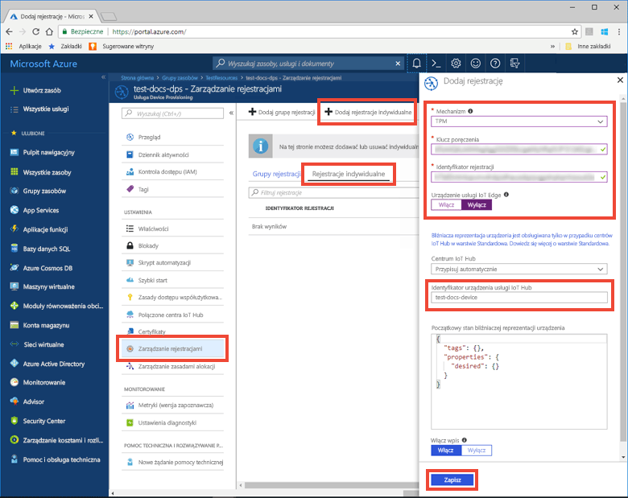
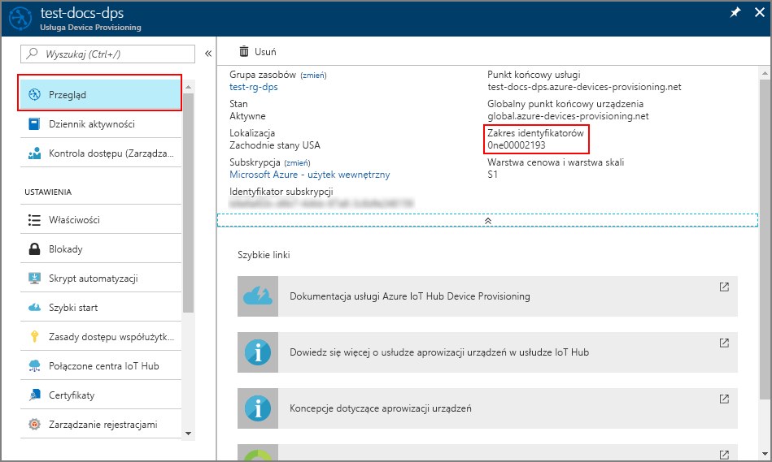
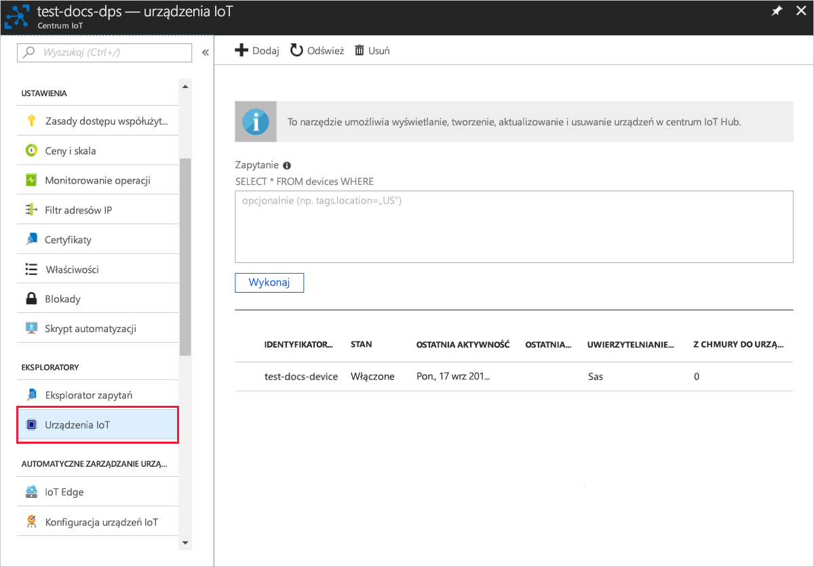

# <a name="quickstart-create-and-provision-a-simulated-tpm-device-using-nodejs-device-sdk-for-iot-hub-device-provisioning-service"></a>Quickstart: Create and provision a simulated TPM device using Node.js device SDK for IoT Hub Device Provisioning Service

[!INCLUDE [iot-dps-selector-quick-create-simulated-device-tpm](../../includes/iot-dps-selector-quick-create-simulated-device-tpm.md)]

Te kroki pokazują, jak utworzyć symulowane urządzenie na maszynie deweloperskiej z systemem operacyjnym Windows OS, uruchomić symulator modułu Windows TPM jako [sprzętowy moduł zabezpieczeń (HSM)](https://azure.microsoft.com/blog/azure-iot-supports-new-security-hardware-to-strengthen-iot-security/) urządzenia i użyć przykładowego kodu do połączenia tego symulowanego urządzenia z usługą Device Provisioning Service i Twoim centrum IoT. 

Jeśli nie znasz procesu automatycznego aprowizowania, zapoznaj się również z tematem [Auto-provisioning concepts (Pojęcia związane z automatycznym aprowizowaniem)](concepts-auto-provisioning.md). Pamiętaj również, aby wcześniej wykonać kroki przedstawione w części [Konfigurowanie usługi IoT Hub Device Provisioning za pomocą witryny Azure Portal](./quick-setup-auto-provision.md). 

Usługa Azure IoT Device Provisioning obsługuje dwa typy rejestracji:
- [Grupy rejestracji](concepts-service.md#enrollment-group): służą do rejestrowania wielu pokrewnych urządzeń.
- [Rejestracje indywidualne](concepts-service.md#individual-enrollment): służą do rejestrowania pojedynczych urządzeń.

W tym artykule przedstawiono rejestracje indywidualne.

[!INCLUDE [IoT Device Provisioning Service basic](../../includes/iot-dps-basic.md)]

## <a name="prepare-the-environment"></a>Przygotowywanie środowiska 

1. Upewnij się, że na komputerze jest zainstalowane [środowisko Node.js w wersji 4.0 lub nowszej](https://nodejs.org).

1. Upewnij się, że na swojej maszynie masz zainstalowane oprogramowanie `git` i że jest ono dodane do zmiennych środowiskowych dostępnych z okna poleceń. Zobacz stronę z [narzędziami klienckimi Git organizacji Software Freedom Conservancy](https://git-scm.com/download/), aby uzyskać najnowszą wersję narzędzi `git` do zainstalowania, które obejmują powłokę **Git Bash**, czyli aplikację wiersza polecenia, która może służyć do interakcji z lokalnym repozytorium Git. 


## <a name="simulate-a-tpm-device"></a>Symulowanie urządzenia TPM

1. Otwórz wiersz polecenia lub powłokę Git Bash. Sklonuj repozytorium GitHub `azure-utpm-c`:
    
    ```cmd/sh
    git clone https://github.com/Azure/azure-utpm-c.git --recursive
    ```

1. Przejdź do folderu głównego usługi GitHub i uruchom symulator modułu [TPM](https://docs.microsoft.com/windows/device-security/tpm/trusted-platform-module-overview). Nasłuchuje on przez gniazdo na portach 2321 i 2322. Do not close this command window; you need to keep this simulator running until the end of this quickstart guide: 

    ```cmd/sh
    .\azure-utpm-c\tools\tpm_simulator\Simulator.exe
    ```

1. Utwórz nowy, pusty folder o nazwie **registerdevice**. W folderze **registerdevice** utwórz plik package.json przy użyciu następującego polecenia z poziomu wiersza polecenia. Pamiętaj, aby odpowiedzieć na wszystkie pytania zadawane przez narzędzie `npm` lub zaakceptuj wartości domyślne, jeśli Ci one odpowiadają:
   
    ```cmd/sh
    npm init
    ```

1. Zainstaluj następujące pakiety prekursorów:

    ```cmd/sh
    npm install node-gyp -g
    npm install ffi -g
    ```

    > [!NOTE]
    > Istnieją znane problemy związane z instalowaniem powyższych pakietów. Aby je rozwiązać, uruchom polecenie `npm install --global --production windows-build-tools` przy użyciu wiersza polecenia w trybie **Uruchom jako administrator**, uruchom polecenie `SET VCTargetsPath=C:\Program Files (x86)\MSBuild\Microsoft.Cpp\v4.0\V140` po zastąpieniu ścieżki zainstalowaną wersją, a następnie uruchom ponownie powyższe polecenia instalacji.
    >

1. Zainstaluj następujące pakiety zawierające składniki używane podczas rejestracji:

   - klienta zabezpieczeń, który współdziała z modułem TPM: `azure-iot-security-tpm`
   - transport dla urządzenia w celu połączenia z usługą aprowizowania urządzeń: `azure-iot-provisioning-device-http` albo `azure-iot-provisioning-device-amqp`
   - klienta do używania transportu i klienta zabezpieczeń: `azure-iot-provisioning-device`

     Po zarejestrowaniu urządzenia możesz użyć zwykłych pakietów klienta urządzenia centrum IoT w celu połączenia urządzenia przy użyciu poświadczeń dostarczonych podczas rejestracji. Potrzebne są:

   - klient urządzenia: `azure-iot-device`
   - transport: dowolne z `azure-iot-device-amqp`, `azure-iot-device-mqtt` lub `azure-iot-device-http`
   - klient zabezpieczeń, który został już zainstalowany: `azure-iot-security-tpm`

     > [!NOTE]
     > Poniższe przykłady używają transportów `azure-iot-provisioning-device-http` i `azure-iot-device-mqtt`.
     > 

     Możesz zainstalować wszystkie te pakiety jednocześnie, uruchamiając następujące polecenie w wierszu polecenia w folderze **registereddevice**:

       ```cmd/sh
       npm install --save azure-iot-device azure-iot-device-mqtt azure-iot-security-tpm azure-iot-provisioning-device-http azure-iot-provisioning-device
       ```

1. Za pomocą edytora tekstów utwórz nowy plik **ExtractDevice.js** w folderze **registerdevice**.

1. Dodaj następujące instrukcje `require` na początku pliku **ExtractDevice.js**:
   
    ```
    'use strict';

    var tpmSecurity = require('azure-iot-security-tpm');
    var tssJs = require("tss.js");

    var myTpm = new tpmSecurity.TpmSecurityClient(undefined, new tssJs.Tpm(true));
    ```

1. Dodaj następującą funkcję, aby wdrożyć metodę:
   
    ```
    myTpm.getEndorsementKey(function(err, endorsementKey) {
      if (err) {
        console.log('The error returned from get key is: ' + err);
      } else {
        console.log('the endorsement key is: ' + endorsementKey.toString('base64'));
        myTpm.getRegistrationId((getRegistrationIdError, registrationId) => {
          if (getRegistrationIdError) {
            console.log('The error returned from get registration id is: ' + getRegistrationIdError);
          } else {
            console.log('The Registration Id is: ' + registrationId);
            process.exit();
          }
        });
      }
    });
    ```

1. Zapisz i zamknij plik **ExtractDevice.js**. Uruchom przykład:

    ```cmd/sh
    node ExtractDevice.js
    ```

1. The output window displays the **_Endorsement key_** and the **_Registration ID_** needed for device enrollment. Zapisz te wartości. 


## <a name="create-a-device-entry"></a>Tworzenie wpisu urządzenia

1. Sign in to the Azure portal, select the **All resources** button on the left-hand menu and open your Device Provisioning service.

1. From the Device Provisioning Service menu, select **Manage enrollments**. Select **Individual Enrollments** tab and select the **Add individual enrollment** button at the top. 

1. In the **Add Enrollment** panel, enter the following information:
   - Wybierz opcję **TPM** jako *Mechanizm* poświadczania tożsamości.
   - Enter the *Registration ID* and *Endorsement key* for your TPM device from the values you noted previously.
   - Wybierz centrum IoT połączone z Twoją usługą aprowizacji.
   - Opcjonalnie można podać następujące informacje:
       - Enter a unique *Device ID*. Nadając nazwę urządzeniu, unikaj korzystania z danych poufnych. If you choose not to provide one, the registration ID will be used to identify the device instead.
       - Zaktualizuj pole **Początkowy stan bliźniaczej reprezentacji urządzenia** za pomocą wybranej konfiguracji początkowej dla urządzenia.
   - Once complete, press the **Save** button. 

       

   Po pomyślnej rejestracji *Identyfikator rejestracji* Twojego urządzenia pojawia się na liście na karcie *Indywidualne rejestracje*. 


## <a name="register-the-device"></a>Rejestrowanie urządzenia

1. In the Azure portal, select the **Overview** blade for your Device Provisioning service and note the **_Global Device Endpoint_** and **_ID Scope_** values.

     

1. Za pomocą edytora tekstów utwórz nowy plik **RegisterDevice.js** w folderze **registerdevice**.

1. Dodaj następujące instrukcje `require` na początku pliku **RegisterDevice.js**:
   
    ```
    'use strict';

    var ProvisioningTransport = require('azure-iot-provisioning-device-http').Http;
    var iotHubTransport = require('azure-iot-device-mqtt').Mqtt;
    var Client = require('azure-iot-device').Client;
    var Message = require('azure-iot-device').Message;
    var tpmSecurity = require('azure-iot-security-tpm');
    var ProvisioningDeviceClient = require('azure-iot-provisioning-device').ProvisioningDeviceClient;
    ```

    > [!NOTE]
    > **Zestaw Azure IoT SDK dla środowiska Node.js** obsługuje dodatkowe protokoły, takie jak _AMQP_, _AMQP WS_ i _MQTT WS_.  Aby uzyskać więcej przykładów, zobacz [Device Provisioning Service SDK for Node.js samples (Przykłady zestawu SDK aprowizacji urządzeń dla środowiska Node.js)](https://github.com/Azure/azure-iot-sdk-node/tree/master/provisioning/device/samples).
    > 

1. Dodaj zmienne **globalDeviceEndpoint** i **idScope** oraz użyj ich do utworzenia wystąpienia **ProvisioningDeviceClient**. Zastąp elementy **{globalDeviceEndpoint}** i **{idScope}** wartościami **_Globalny punkt końcowy urządzenia_** i **_Zakres identyfikatorów_** z **kroku 1**:
   
    ```
    var provisioningHost = '{globalDeviceEndpoint}';
    var idScope = '{idScope}';

    var tssJs = require("tss.js");
    var securityClient = new tpmSecurity.TpmSecurityClient('', new tssJs.Tpm(true));
    // if using non-simulated device, replace the above line with following:
    //var securityClient = new tpmSecurity.TpmSecurityClient();

    var provisioningClient = ProvisioningDeviceClient.create(provisioningHost, idScope, new ProvisioningTransport(), securityClient);
    ```

1. Dodaj następującą funkcję, aby wdrożyć metodę na urządzeniu:
   
    ```
    provisioningClient.register(function(err, result) {
      if (err) {
        console.log("error registering device: " + err);
      } else {
        console.log('registration succeeded');
        console.log('assigned hub=' + result.registrationState.assignedHub);
        console.log('deviceId=' + result.registrationState.deviceId);
        var tpmAuthenticationProvider = tpmSecurity.TpmAuthenticationProvider.fromTpmSecurityClient(result.registrationState.deviceId, result.registrationState.assignedHub, securityClient);
        var hubClient = Client.fromAuthenticationProvider(tpmAuthenticationProvider, iotHubTransport);

        var connectCallback = function (err) {
          if (err) {
            console.error('Could not connect: ' + err.message);
          } else {
            console.log('Client connected');
            var message = new Message('Hello world');
            hubClient.sendEvent(message, printResultFor('send'));
          }
        };

        hubClient.open(connectCallback);

        function printResultFor(op) {
          return function printResult(err, res) {
            if (err) console.log(op + ' error: ' + err.toString());
            if (res) console.log(op + ' status: ' + res.constructor.name);
            process.exit(1);
          };
        }
      }
    });
    ```

1. Zapisz i zamknij plik **RegisterDevice.js**. Uruchom przykład:

    ```cmd/sh
    node RegisterDevice.js
    ```

1. Zwróć uwagę na komunikaty symulujące uruchamianie urządzenia i łączenie z usługą Device Provisioning Service w celu pobrania informacji z Twojego centrum IoT. On successful provisioning of your simulated device to the IoT hub linked with your provisioning service, the device ID appears on the hub's **IoT devices** blade. 

     

    Jeśli zmienisz wartość w polu *Początkowy stan bliźniaczej reprezentacji urządzenia* z domyślnej na inną we wpisie rejestracji dla Twojego urządzenia, może to spowodować pobranie z centrum żądanego stanu reprezentacji bliźniaczej i odpowiednie do niego działanie. Aby uzyskać więcej informacji, zobacz [Opis bliźniaczej reprezentacji urządzenia w usłudze IoT Hub oraz sposoby jej używania](../iot-hub/iot-hub-devguide-device-twins.md)


## <a name="clean-up-resources"></a>Oczyszczanie zasobów

If you plan to continue working on and exploring the device client sample, do not clean up the resources created in this quickstart. If you do not plan to continue, use the following steps to delete all resources created by this quickstart.

1. Zamknij okno danych wyjściowych przykładu klienta urządzenia na swojej maszynie.
1. Zamknij okno symulatora modułu TPM na swojej maszynie.
1. From the left-hand menu in the Azure portal, select **All resources** and then select your Device Provisioning service. Open the **Manage Enrollments** blade for your service, and then select the **Individual Enrollments** tab. Select the check box next to the *REGISTRATION ID* of the device you enrolled in this quickstart, and press the **Delete** button at the top of the pane. 
1. From the left-hand menu in the Azure portal, select **All resources** and then select your IoT hub. Open the **IoT devices** blade for your hub, select the check box next to the *DEVICE ID* of the device you registered in this quickstart, and then press the **Delete** button at the top of the pane.


## <a name="next-steps"></a>Następne kroki

In this quickstart, you’ve created a TPM simulated device on your machine and provisioned it to your IoT hub using the IoT Hub Device Provisioning Service. To learn how to enroll your TPM device programmatically, continue to the quickstart for programmatic enrollment of a TPM device. 

> [!div class="nextstepaction"]
> [Azure quickstart - Enroll TPM device to Azure IoT Hub Device Provisioning Service](quick-enroll-device-tpm-node.md)
