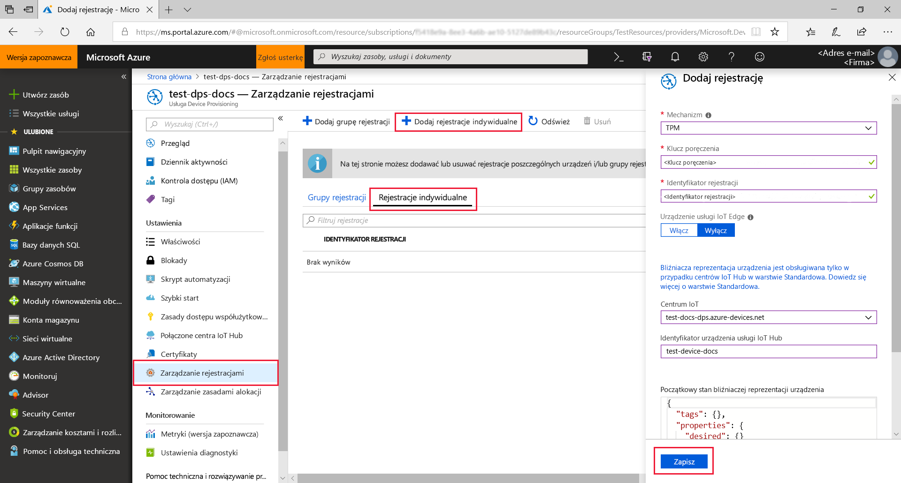
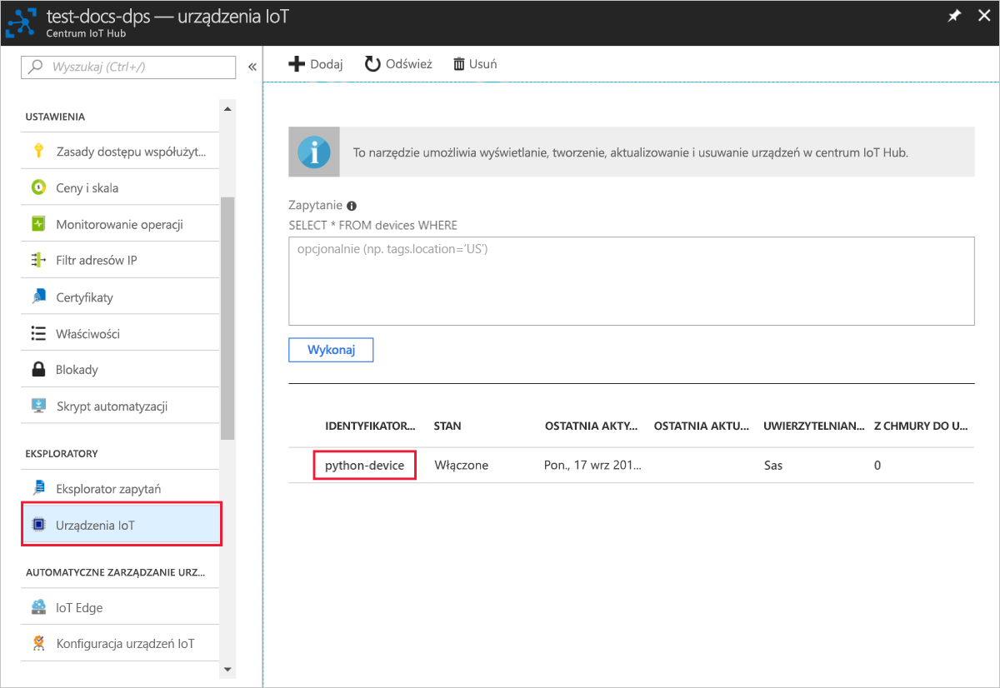

# <a name="quickstart-create-and-provision-a-simulated-tpm-device-using-python-device-sdk-for-iot-hub-device-provisioning-service"></a>Szybki Start: Tworzenie i Inicjowanie symulowanego urządzenia TPM za pomocą zestawu SDK języka Python dla IoT Hub Device Provisioning Service

[!INCLUDE [iot-dps-selector-quick-create-simulated-device-tpm](../../includes/iot-dps-selector-quick-create-simulated-device-tpm.md)]

Te kroki pokazują, jak utworzyć symulowane urządzenie na maszynie deweloperskiej z systemem operacyjnym Windows, uruchomić symulator modułu Windows TPM jako [sprzętowy moduł zabezpieczeń (HSM)](https://azure.microsoft.com/blog/azure-iot-supports-new-security-hardware-to-strengthen-iot-security/) urządzenia i użyć przykładowego kodu Python do połączenia tego symulowanego urządzenia z usługą Device Provisioning i Twoim centrum IoT. 

Jeśli nie znasz procesu automatycznego aprowizowania, zapoznaj się również z tematem [Auto-provisioning concepts (Pojęcia związane z automatycznym aprowizowaniem)](concepts-auto-provisioning.md). Pamiętaj również, aby wcześniej wykonać kroki przedstawione w części [Konfigurowanie usługi IoT Hub Device Provisioning za pomocą witryny Azure Portal](./quick-setup-auto-provision.md). 

Usługa Azure IoT Device Provisioning obsługuje dwa typy rejestracji:
- [Grupy rejestracji](concepts-service.md#enrollment-group): służą do rejestrowania wielu pokrewnych urządzeń.
- [Rejestracje indywidualne](concepts-service.md#individual-enrollment): służą do rejestrowania pojedynczych urządzeń.

W tym artykule przedstawiono rejestracje indywidualne.

[!INCLUDE [IoT Device Provisioning Service basic](../../includes/iot-dps-basic.md)]

> [!NOTE]
> Ten przewodnik dotyczy tylko obecnie przestarzałego zestawu SDK języka Python w wersji 1. Symulowane urządzenia TPM nie są jeszcze obsługiwane w wersji 2. Zespół jest obecnie trudny w pracy, dzięki czemu od 2 do funkcji parzystości.

## <a name="prepare-the-environment"></a>Przygotowywanie środowiska 

1. Upewnij się, że zainstalowano [program Visual studio](https://visualstudio.microsoft.com/vs/) 2015 lub nowszy z włączonym obciążeniem C++"Programowanie aplikacji klasycznych" na potrzeby instalacji programu Visual Studio.

1. Pobierz i zainstaluj [system kompilacji CMake](https://cmake.org/download/).

1. Upewnij się, że na swojej maszynie masz zainstalowane oprogramowanie `git` i że jest ono dodane do zmiennych środowiskowych dostępnych z okna poleceń. Zobacz stronę z [narzędziami klienckimi Git organizacji Software Freedom Conservancy](https://git-scm.com/download/), aby uzyskać najnowszą wersję narzędzi `git` do zainstalowania, które obejmują powłokę **Git Bash**, czyli aplikację wiersza polecenia, która może służyć do interakcji z lokalnym repozytorium Git. 

1. Otwórz wiersz polecenia lub powłokę Git Bash. Sklonuj repozytorium GitHub dla przykładu kodu symulacji urządzenia:
    
    ```cmd/sh
    git clone --single-branch --branch v1-deprecated https://github.com/Azure/azure-iot-sdk-python.git --recursive
    ```

1. Utwórz folder w swojej lokalnej kopii tego repozytorium GitHub dla procesu kompilacji CMake. 

    ```cmd/sh
    cd azure-iot-sdk-python/c
    mkdir cmake
    cd cmake
    ```

1. Przykład kodu korzysta z symulatora modułu Windows TPM. Uruchom następujące polecenie, aby włączyć uwierzytelnianie tokenu sygnatury dostępu współdzielonego. Polecenie to generuje także rozwiązanie programu Visual Studio dla symulowanego urządzenia.

    ```cmd/sh
    cmake -Duse_prov_client:BOOL=ON -Duse_tpm_simulator:BOOL=ON ..
    ```

1. W osobnym wierszu polecenia przejdź do folderu symulatora modułu TPM i uruchom symulator [modułu TPM](https://docs.microsoft.com/windows/device-security/tpm/trusted-platform-module-overview). Kliknij pozycję **Zezwól na dostęp**. Nasłuchuje on przez gniazdo na portach 2321 i 2322. Nie zamykaj tego okna polecenia; należy zachować ten symulator do momentu zakończenia tego przewodnika Szybki Start. 

    ```cmd/sh
    .\azure-iot-sdk-python\c\provisioning_client\deps\utpm\tools\tpm_simulator\Simulator.exe
    ```

    


## <a name="create-a-device-enrollment-entry"></a>Tworzenie wpisu rejestracji urządzenia

1. Otwórz rozwiązanie wygenerowane w folderze programu *cmake* o nazwie `azure_iot_sdks.sln` i skompiluj je w programie Visual Studio.

1. Kliknij prawym przyciskiem myszy projekt **tpm_device_provision** i wybierz pozycję **Ustaw jako projekt startowy**. Uruchom rozwiązanie. W oknie danych wyjściowych zostanie wyświetlony **_Klucz poręczenia_** i **_Identyfikator rejestracji_** wymagany do rejestracji urządzeń. Zapisz te wartości. 

    

1. Zaloguj się do Azure Portal, wybierz przycisk **wszystkie zasoby** w menu po lewej stronie i Otwórz swoją usługę Device Provisioning.

1. W menu usługi Device Provisioning wybierz pozycję **Zarządzaj rejestracjami**. Wybierz kartę **indywidualne rejestracje** i wybierz u góry przycisk **Dodaj rejestrację indywidualną** . 

1. W panelu **Dodawanie rejestracji** wprowadź następujące informacje:
   - Wybierz opcję **TPM** jako *Mechanizm* poświadczania tożsamości.
   - Wprowadź *Identyfikator rejestracji* i *Klucz poręczenia* dla urządzenia TPM z wartości zanotowanych wcześniej.
   - Wybierz centrum IoT połączone z Twoją usługą aprowizacji.
   - Opcjonalnie można podać następujące informacje:
       - Wprowadź unikatowy *Identyfikator urządzenia*. Nadając nazwę urządzeniu, unikaj korzystania z danych poufnych. W przypadku wybrania opcji nie należy podać identyfikator rejestracji zostanie użyty do zidentyfikowania urządzenia.
       - Zaktualizuj pole **Początkowy stan bliźniaczej reprezentacji urządzenia** za pomocą wybranej konfiguracji początkowej dla urządzenia.
   - Po zakończeniu naciśnij przycisk **Zapisz** . 

       

   Po pomyślnej rejestracji *Identyfikator rejestracji* Twojego urządzenia pojawi się na liście na karcie *Indywidualne rejestracje*. 


## <a name="simulate-the-device"></a>Symulowanie urządzenia

1. Pobierz i zainstaluj środowisko [Python 2.x lub 3.x](https://www.python.org/downloads/). Upewnij się, że używasz 32-bitowej lub 64-bitowej instalacji zgodnie z wymaganiami konfiguracji. Po wyświetleniu monitu podczas instalacji upewnij się, że język Python został dodany do zmiennych środowiskowych specyficznych dla platformy.
    - Zainstaluj [Pakiet redystrybucyjny języka Visual C++](https://www.microsoft.com/download/confirmation.aspx?id=48145) (jeśli używasz systemu operacyjnego Windows) umożliwiający korzystanie z natywnych bibliotek DLL języka Python.

1. Postępuj zgodnie z [tymi instrukcjami](https://github.com/Azure/azure-iot-sdk-python/blob/master/doc/python-devbox-setup.md), aby skompilować pakiety języka Python.

   > [!NOTE]
   > W przypadku korzystania ze skryptu `build_client.cmd` pamiętaj, aby użyć flagi `--use-tpm-simulator`.
   > 
   > [!NOTE]
   > Jeśli korzystasz z systemu `pip`, zainstaluj również pakiet `azure-iot-provisioning-device-client`. Pamiętaj, że wydane pakiety PIP korzystają z rzeczywistych modułów TPM, a nie z symulatora. Aby użyć symulatora, należy przeprowadzić kompilowanie ze źródła przy użyciu flagi `--use-tpm-simulator`.

1. Przejdź do folderu z przykładami.

    ```cmd/sh
    cd azure-iot-sdk-python/provisioning_device_client/samples
    ```

1. Korzystając ze zintegrowanego środowiska projektowego Python, poddaj edycji skrypt python o nazwie **provisioning\_device\_client\_sample.py**. Zmodyfikuj zmienne *GLOBAL\_PROV\_URI* i *ID\_SCOPE*, ustawiając dla nich podane wcześniej wartości. Upewnij się również, że zmienna *SECURITY\_DEVICE\_TYPE* ma ustawioną wartość `ProvisioningSecurityDeviceType.TPM`

    ```python
    GLOBAL_PROV_URI = "{globalServiceEndpoint}"
    ID_SCOPE = "{idScope}"
    SECURITY_DEVICE_TYPE = ProvisioningSecurityDeviceType.TPM
    PROTOCOL = ProvisioningTransportProvider.HTTP
    ```

    

1. Uruchom przykład. 

    ```cmd/sh
    python provisioning_device_client_sample.py
    ```

1. Zwróć uwagę na komunikaty symulujące uruchamianie urządzenia i łączenie z usługą Device Provisioning Service w celu pobrania informacji z Twojego centrum IoT. 

    

1. Po pomyślnej aprowizacji symulowanego urządzenia w centrum IoT Hub powiązanym z Twoją usługą aprowizacji identyfikator urządzenia jest wyświetlany w bloku **urządzenia IoT** centrum.

     

    Jeśli zmienisz wartość w polu *Początkowy stan bliźniaczej reprezentacji urządzenia* z domyślnej na inną we wpisie rejestracji dla Twojego urządzenia, może to spowodować pobranie z centrum żądanego stanu reprezentacji bliźniaczej i odpowiednie do niego działanie. Aby uzyskać więcej informacji, zobacz [Opis bliźniaczej reprezentacji urządzenia w usłudze IoT Hub oraz sposoby jej używania](../iot-hub/iot-hub-devguide-device-twins.md)


## <a name="clean-up-resources"></a>Oczyszczanie zasobów

Jeśli planujesz kontynuować pracę i eksplorowanie przykładowego klienta urządzenia, nie czyść zasobów utworzonych w tym przewodniku Szybki Start. Jeśli nie planujesz kontynuować pracy, wykonaj następujące kroki, aby usunąć wszystkie zasoby utworzone w ramach tego przewodnika Szybki Start.

1. Zamknij okno danych wyjściowych przykładu klienta urządzenia na swojej maszynie.
1. Zamknij okno symulatora modułu TPM na swojej maszynie.
1. Z menu po lewej stronie w Azure Portal wybierz pozycję **wszystkie zasoby** , a następnie wybierz usługę Device Provisioning. Otwórz blok **Zarządzanie rejestracjami** dla usługi, a następnie wybierz kartę **indywidualne rejestracje** . Zaznacz pole wyboru obok *identyfikatora rejestracji* urządzenia zarejestrowanego w tym przewodniku Szybki Start, a następnie naciśnij przycisk **Usuń** w górnej części okienka. 
1. Z menu po lewej stronie w Azure Portal wybierz pozycję **wszystkie zasoby** , a następnie wybierz swoje centrum IoT Hub. Otwórz blok **urządzenia IoT** dla centrum, zaznacz pole wyboru obok *identyfikatora urządzenia* urządzenia zarejestrowanego w tym przewodniku Szybki Start, a następnie naciśnij przycisk **Usuń** w górnej części okienka.

## <a name="next-steps"></a>Następne kroki

W tym przewodniku szybki start utworzono symulowane urządzenie modułu TPM na maszynie i udostępniono je Centrum IoT Hub przy użyciu IoT Hub Device Provisioning Service. Aby dowiedzieć się, jak zarejestrować urządzenie TPM programowo, przejdź do przewodnika Szybki Start dotyczącego rejestrowania programowego dla urządzenia TPM. 

> [!div class="nextstepaction"]
> [Przewodnik Szybki Start platformy Azure — rejestrowanie urządzenia TPM w usłudze Azure IoT Hub Device Provisioning Service](quick-enroll-device-tpm-python.md)
