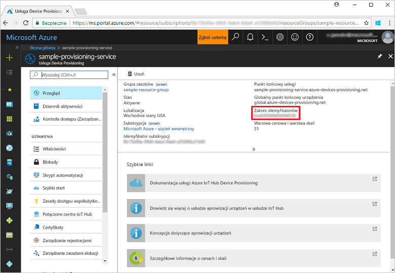
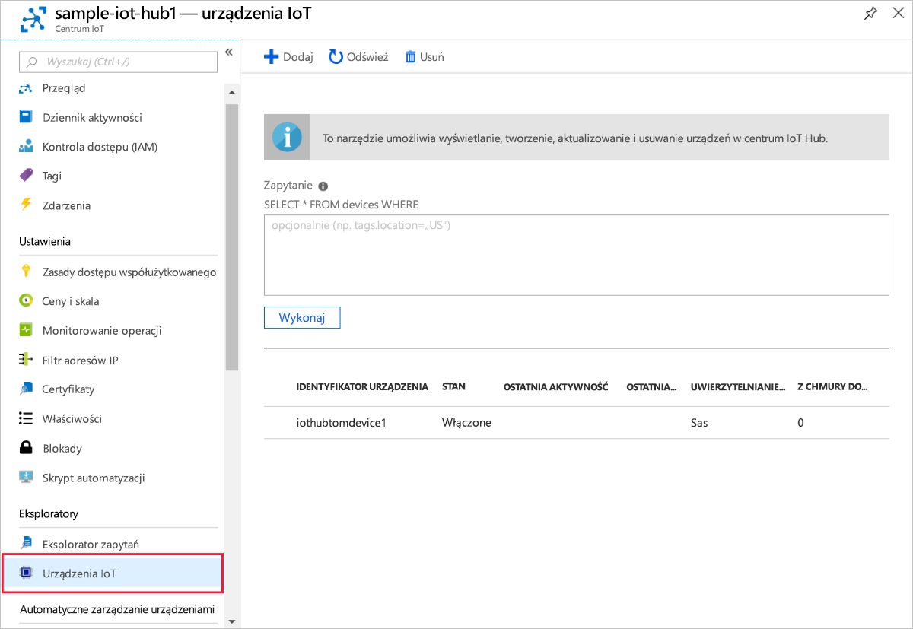

# <a name="quickstart-create-and-provision-a-simulated-x509-device-using-c-device-sdk-for-iot-hub-device-provisioning-service"></a>Szybki Start: Tworzenie i Inicjowanie obsługi symulowanego urządzenia X. 509 C# za pomocą zestawu SDK urządzeń dla IoT Hub Device Provisioning Service

[!INCLUDE [iot-dps-selector-quick-create-simulated-device-x509](../../includes/iot-dps-selector-quick-create-simulated-device-x509.md)]

Te kroki pokazują, jak symulować urządzenie X.509 na maszynie deweloperskiej z systemem operacyjnym Windows przy użyciu [przykładów usługi Azure IoT dla języka C#](https://github.com/Azure-Samples/azure-iot-samples-csharp). Ten przykład obejmuje także połączenie symulowanego urządzenia z usługą IoT Hub przy użyciu usługi Device Provisioning.

Jeśli nie znasz procesu automatycznego aprowizowania, zapoznaj się również z tematem [Auto-provisioning concepts (Pojęcia związane z automatycznym aprowizowaniem)](concepts-auto-provisioning.md). Pamiętaj również, aby wcześniej wykonać kroki przedstawione w części [Konfigurowanie usługi IoT Hub Device Provisioning za pomocą witryny Azure Portal](./quick-setup-auto-provision.md). 

Usługa Azure IoT Device Provisioning obsługuje dwa typy rejestracji:
- [Grupy rejestracji](concepts-service.md#enrollment-group): służą do rejestrowania wielu pokrewnych urządzeń.
- [Rejestracje indywidualne](concepts-service.md#individual-enrollment): służą do rejestrowania pojedynczych urządzeń.

W tym artykule przedstawiono rejestracje indywidualne.

[!INCLUDE [IoT Device Provisioning Service basic](../../includes/iot-dps-basic.md)]

<a id="setupdevbox"></a>
## <a name="prepare-the-development-environment"></a>Przygotowywanie środowiska deweloperskiego 

1. Upewnij się, że na maszynie jest zainstalowany [zestaw SDK dla platformy .NET Core 2,1 lub nowszy](https://www.microsoft.com/net/download/windows) . 

1. Upewnij się, że na swojej maszynie masz zainstalowane oprogramowanie `git` i że jest ono dodane do zmiennych środowiskowych dostępnych z okna poleceń. Zobacz stronę z [narzędziami klienckimi Git organizacji Software Freedom Conservancy](https://git-scm.com/download/), aby uzyskać najnowszą wersję narzędzi `git` do zainstalowania, które obejmują powłokę **Git Bash**, czyli aplikację wiersza polecenia, która może służyć do interakcji z lokalnym repozytorium Git. 

1. Otwórz wiersz polecenia lub powłokę Git Bash. Sklonuj repozytorium GitHub Azure IoT Samples for C#:
    
    ```cmd
    git clone https://github.com/Azure-Samples/azure-iot-samples-csharp.git
    ```

## <a name="create-a-self-signed-x509-device-certificate-and-individual-enrollment-entry"></a>Tworzenie certyfikatu urządzenia X.509 z podpisem własnym i wpisu rejestracji indywidualnej

W tej sekcji zostanie użyty certyfikat z podpisem własnym X.509. Ważne jest, aby pamiętać o następujących kwestiach:

* Certyfikaty z podpisem własnym są przeznaczone tylko do celów testowania i nie powinny być używane w środowisku produkcyjnym.
* Domyślny termin wygaśnięcia certyfikatu z podpisem własnym to jeden rok.

Przykładowy kod z [przykładu aprowizacji urządzenia klienta — zaświadczanie za pomocą certyfikatu X.509](https://github.com/Azure-Samples/azure-iot-samples-csharp/tree/master/provisioning/Samples/device/X509Sample) zostanie użyty do utworzenia certyfikatu, który będzie używany z indywidualnym wpisem rejestracji dla urządzenia symulowanego.


1. W wierszu polecenia zmień katalogi na katalog projektu dla przykładu aprowizacji urządzenia X.509.

    ```cmd
    cd .\azure-iot-samples-csharp\provisioning\Samples\device\X509Sample
    ```

2. Przykładowy kod jest skonfigurowany do używania certyfikatów X.509 przechowywanych w chronionym hasłem sformatowanym pliku PKCS12 (certificate.pfx). Ponadto do utworzenia rejestracji indywidualnej w dalszej części tego przewodnika Szybki Start potrzebny jest plik certyfikatu klucza publicznego (Certificate. cer). Aby wygenerować certyfikat z podpisem własnym oraz skojarzone z nim pliki cer i pfx, uruchom następujące polecenie:

    ```cmd
    powershell .\GenerateTestCertificate.ps1
    ```

3. Skrypt wyświetli monit o podanie hasła PFX. Zapamiętaj to hasło, ponieważ trzeba będzie je podać podczas uruchamiania przykładu.

      


4. Zaloguj się do Azure Portal, wybierz przycisk **wszystkie zasoby** w menu po lewej stronie i Otwórz swoją usługę aprowizacji.

5. W menu usługi Device Provisioning wybierz pozycję **Zarządzaj rejestracjami**. Wybierz kartę **indywidualne rejestracje** i wybierz u góry przycisk **Dodaj rejestrację indywidualną** . 

6. W panelu **Dodawanie rejestracji** wprowadź następujące informacje:
   - Wybierz opcję **X.509** jako *Mechanizm* poświadczania tożsamości.
   - W obszarze *plik PEM lub CER certyfikatu podstawowego*wybierz *pozycję Wybierz plik* , aby wybrać certyfikat pliku certyfikatu **. cer** utworzony w poprzednich krokach.
   - Zostaw pole **Identyfikator urządzenia** puste. Urządzenie zostanie zaaprowizowane z identyfikatorem urządzenia ustawionym na nazwę pospolitą (CN) w certyfikacie X.509 **iothubx509device1**. Ta nazwa będzie również używana na potrzeby identyfikatora rejestracji dla wpisu rejestracji indywidualnej. 
   - Opcjonalnie można podać następujące informacje:
       - Wybierz centrum IoT połączone z Twoją usługą aprowizacji.
       - Zaktualizuj pole **Początkowy stan bliźniaczej reprezentacji urządzenia** za pomocą wybranej konfiguracji początkowej dla urządzenia.
   - Po zakończeniu naciśnij przycisk **Zapisz** . 

     [](./media/quick-create-simulated-device-x509-csharp/device-enrollment.png#lightbox)
    
   Po pomyślnej rejestracji wpis rejestracji X.509 jest wyświetlany jako **iothubx509device1** w kolumnie *Identyfikator rejestracji* na karcie *Indywidualne rejestracje*. 

## <a name="provision-the-simulated-device"></a>Aprowizowanie urządzenia symulowanego

1. W bloku **Przegląd** dla usługi aprowizacji Zanotuj wartość **_Identyfikator zakresu_** .

     


2. Wpisz następujące polecenie, aby skompilować i uruchomić przykład aprowizacji urządzenia X.509. Zastąp wartość `<IDScope>` zakresem identyfikatorów Twojej usługi aprowizacji. 

    ```cmd
    dotnet run <IDScope>
    ```

3. Gdy zostanie wyświetlony monit, wprowadź hasło utworzonego wcześniej pliku PFX. Zwróć uwagę na komunikaty symulujące uruchamianie urządzenia i łączenie z usługą Device Provisioning Service w celu pobrania informacji z Twojego centrum IoT. 

     

4. Upewnij się, że urządzenie zostało zaaprowizowane. Po pomyślnej aprowizacji symulowanego urządzenia w centrum IoT Hub powiązanym z Twoją usługą aprowizacji identyfikator urządzenia jest wyświetlany w bloku **urządzenia IoT** centrum. 

     

    Jeśli zmienisz wartość w polu *Początkowy stan bliźniaczej reprezentacji urządzenia* z domyślnej na inną we wpisie rejestracji dla Twojego urządzenia, może to spowodować pobranie z centrum żądanego stanu reprezentacji bliźniaczej i odpowiednie do niego działanie. Aby uzyskać więcej informacji, zobacz [Opis bliźniaczej reprezentacji urządzenia w usłudze IoT Hub oraz sposoby jej używania](../iot-hub/iot-hub-devguide-device-twins.md)


## <a name="clean-up-resources"></a>Oczyszczanie zasobów

Jeśli planujesz kontynuować pracę i eksplorowanie przykładowego klienta urządzenia, nie czyść zasobów utworzonych w tym przewodniku Szybki Start. Jeśli nie planujesz kontynuować pracy, wykonaj następujące kroki, aby usunąć wszystkie zasoby utworzone w ramach tego przewodnika Szybki Start.

1. Zamknij okno danych wyjściowych przykładu klienta urządzenia na swojej maszynie.
1. Zamknij okno symulatora modułu TPM na swojej maszynie.
1. Z menu po lewej stronie w Azure Portal wybierz pozycję **wszystkie zasoby** , a następnie wybierz usługę Device Provisioning. W górnej części bloku **Przegląd** naciśnij pozycję **Usuń** w górnej części okienka.  
1. Z menu po lewej stronie w Azure Portal wybierz pozycję **wszystkie zasoby** , a następnie wybierz swoje centrum IoT Hub. W górnej części bloku **Przegląd** naciśnij pozycję **Usuń** w górnej części okienka.  

## <a name="next-steps"></a>Następne kroki

W tym przewodniku szybki start utworzono symulowane urządzenie X. 509 na komputerze z systemem Windows i udostępniono je Centrum IoT Hub przy użyciu IoT Hub Device Provisioning Service platformy Azure w portalu. Aby dowiedzieć się, jak zarejestrować urządzenie X. 509 programowo, przejdź do przewodnika Szybki Start dotyczącego rejestrowania na urządzeniach X. 509. 

> [!div class="nextstepaction"]
> [Przewodnik Szybki Start platformy Azure — rejestrowanie urządzeń X. 509 w usłudze Azure IoT Hub Device Provisioning Service](quick-enroll-device-x509-csharp.md)
