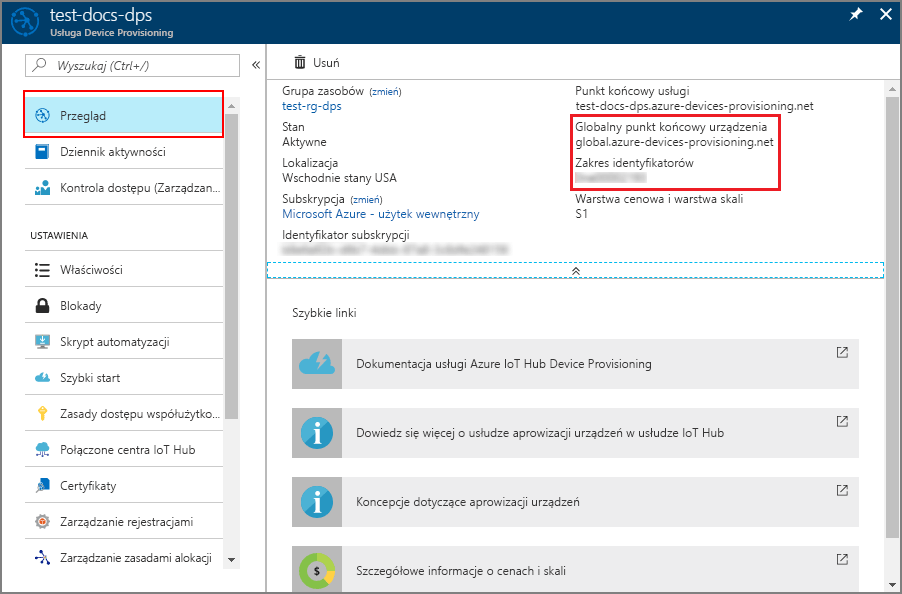
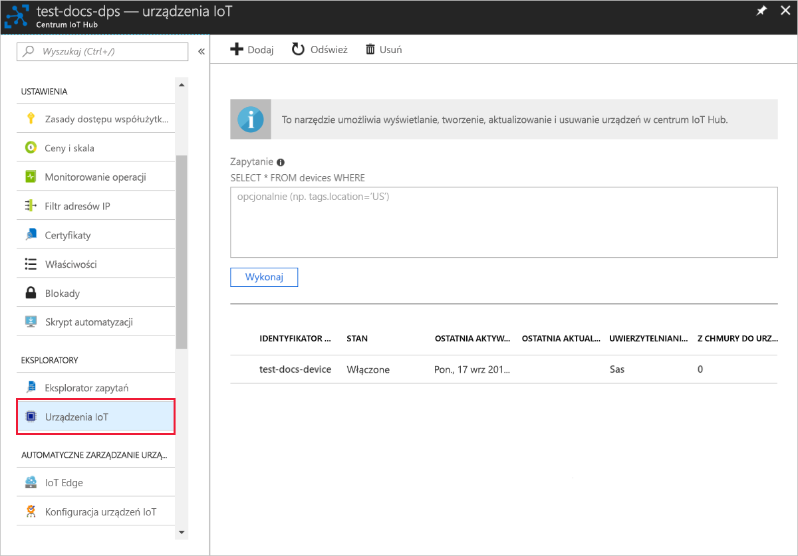

# <a name="quickstart-create-and-provision-an-x509-simulated-device-using-nodejs-device-sdk-for-iot-hub-device-provisioning-service"></a>Quickstart: Create and provision an X.509 simulated device using Node.js device SDK for IoT Hub Device Provisioning Service
[!INCLUDE [iot-dps-selector-quick-create-simulated-device-x509](../../includes/iot-dps-selector-quick-create-simulated-device-x509.md)]

W poniższych krokach pokazano, jak utworzyć wpis rejestracji w usłudze Device Provisioning, symulować urządzenie X.509 na maszynie deweloperskiej, połączyć symulowane urządzenie z usługą Device Provisioning oraz zarejestrować urządzenie w centrum IoT przy użyciu [zestawu SDK urządzenia środowiska Node.js dla usługi Azure IoT Hub](https://github.com/Azure/azure-iot-sdk-node).

Jeśli nie znasz procesu automatycznego aprowizowania, zapoznaj się również z tematem [Auto-provisioning concepts (Pojęcia związane z automatycznym aprowizowaniem)](concepts-auto-provisioning.md). Pamiętaj również, aby wcześniej wykonać kroki przedstawione w części [Konfigurowanie usługi IoT Hub Device Provisioning za pomocą witryny Azure Portal](./quick-setup-auto-provision.md). 

Usługa Azure IoT Device Provisioning obsługuje dwa typy rejestracji:
- [Grupy rejestracji](concepts-service.md#enrollment-group): służą do rejestrowania wielu pokrewnych urządzeń.
- [Rejestracje indywidualne](concepts-service.md#individual-enrollment): służą do rejestrowania pojedynczych urządzeń.

W tym artykule przedstawiono rejestracje indywidualne.

[!INCLUDE [IoT Device Provisioning Service basic](../../includes/iot-dps-basic.md)]

## <a name="prepare-the-environment"></a>Przygotowywanie środowiska 

1. Zanim przejdziesz dalej, wykonaj kroki przedstawione w artykule [Konfigurowanie usługi IoT Hub Device Provisioning w witrynie Azure Portal](./quick-setup-auto-provision.md).

2. Upewnij się, że na komputerze jest zainstalowane [środowisko Node.js w wersji 4.0 lub nowszej](https://nodejs.org).

3. Upewnij się, że na Twojej maszynie jest zainstalowane oprogramowanie [Git](https://git-scm.com/download/) i że jest ono dodane do zmiennych środowiskowych dostępnych z okna poleceń. 

4. Upewnij się, że na Twojej maszynie jest zainstalowana biblioteka [OpenSSL](https://www.openssl.org/) i że jest ona dodana do zmiennych środowiskowych dostępnych z okna poleceń. Ta biblioteka może zostać skompilowana i zainstalowana ze źródła lub pobrana i zainstalowana od [innego podmiotu](https://wiki.openssl.org/index.php/Binaries), takiego jak [ten](https://sourceforge.net/projects/openssl/). 

    > [!NOTE]
    > Jeśli masz już utworzony certyfikat _główny_, _pośredni_ i/lub _liścia_ X.509, możesz pominąć ten krok i wszystkie następne czynności dotyczące generowania certyfikatów.
    >

## <a name="create-a-self-signed-x509-device-certificate-and-individual-enrollment-entry"></a>Tworzenie certyfikatu urządzenia X.509 z podpisem własnym i wpisu rejestracji indywidualnej

W tej sekcji zostanie użyty certyfikat z podpisem własnym X.509. Ważne jest, aby pamiętać o następujących kwestiach:

* Certyfikaty z podpisem własnym są przeznaczone tylko do celów testowania i nie powinny być używane w środowisku produkcyjnym.
* Domyślny termin wygaśnięcia certyfikatu z podpisem własnym to jeden rok.

Przykładowy kod z [zestawu Azure IoT SDK dla środowiska Node.js](https://github.com/Azure/azure-iot-sdk-node.git) zostanie użyty do utworzenia certyfikatu, który będzie używany z indywidualnym wpisem rejestracji dla urządzenia symulowanego.


1. Otwórz wiersz polecenia. Sklonuj repozytorium GitHub, aby uzyskać przykłady kodu:
    
    ```cmd/sh
    git clone https://github.com/Azure/azure-iot-sdk-node.git --recursive
    ```

2. Przejdź do skryptu generatora certyfikatu i skompiluj projekt. 

    ```cmd/sh
    cd azure-iot-sdk-node/provisioning/tools
    npm install
    ```

3. Utwórz certyfikat X.509 _liścia_, uruchamiając skrypt z użyciem Twojego parametru _certificate-name_. Nazwa pospolita certyfikatu liścia staje się [identyfikatorem rejestracji](https://docs.microsoft.com/azure/iot-dps/concepts-device#registration-id), dlatego używaj tylko małych znaków alfanumerycznych i łączników.

    ```cmd/sh
    node create_test_cert.js device {certificate-name}
    ```

4. Zaloguj się w witrynie [Azure Portal](https://portal.azure.com), kliknij przycisk **Wszystkie zasoby** w menu po lewej stronie i otwórz swoje wystąpienie usługi Device Provisioning Service.

5. W bloku podsumowania usługi Device Provisioning Service wybierz pozycję **Zarządzaj rejestracjami**. Wybierz kartę **Rejestracje indywidualne** i kliknij przycisk **Dodaj rejestrację indywidualną** u góry strony. 

6. W panelu **Dodawanie rejestracji** wprowadź następujące informacje:
   - Wybierz opcję **X.509** jako *Mechanizm* poświadczania tożsamości.
   - W obszarze *Plik PEM lub CER certyfikatu podstawowego* kliknij opcję *Wybierz plik*, aby wybrać plik certyfikatu **{certificate-name}_cert.pem** utworzony we wcześniejszych krokach.  
   - Opcjonalnie można podać następujące informacje:
     - Wybierz centrum IoT połączone z Twoją usługą aprowizacji.
     - Wprowadź unikatowy identyfikator urządzenia. Nadając nazwę urządzeniu, unikaj korzystania z danych poufnych. 
     - Zaktualizuj pole **Początkowy stan bliźniaczej reprezentacji urządzenia** za pomocą wybranej konfiguracji początkowej dla urządzenia.
     - Gdy skończysz, kliknij przycisk **Zapisz**. 

     [](./media/quick-create-simulated-device-x509-node/device-enrollment.png#lightbox)

     On successful enrollment, your X.509 device appears as **{certificatename}** under the *Registration ID* column in the *Individual Enrollments* tab. Note this value for later.

## <a name="simulate-the-device"></a>Symulowanie urządzenia

[Zestaw SDK urządzenia środowiska Node.js usługi Azure IoT Hub](https://github.com/Azure/azure-iot-sdk-node) zapewnia prosty sposób symulowania urządzenia. Aby przeczytać więcej, zobacz [Device concepts (Pojęcia dotyczące urządzeń)](https://docs.microsoft.com/azure/iot-dps/concepts-device).

1. W witrynie Azure Portal wybierz blok **Przegląd** dla swojej usługi Device Provisioning i zapisz wartości **_Globalny punkt końcowy urządzenia_** oraz **_Zakres identyfikatorów_** .

     

2. Skopiuj _certyfikat_ i _klucz_ do przykładowego folderu.

    ```cmd/sh
    copy .\{certificate-name}_cert.pem ..\device\samples\{certificate-name}_cert.pem
    copy .\{certificate-name}_key.pem ..\device\samples\{certificate-name}_key.pem
    ```

3. Przejdź do skryptu testowego urządzenia i skompiluj projekt. 

    ```cmd/sh
    cd ..\device\samples
    npm install
    ```

4. Przeprowadź edycję pliku **register\_x509.js**. Po wprowadzeniu poniższych zmian zapisz plik.
    - Zastąp wartość `provisioning host` **_globalnym punktem końcowym urządzenia_** zanotowanym w **kroku 1** powyżej.
    - Zastąp wartość `id scope` **_zakresem identyfikatorów_** zanotowanym w **kroku 1** powyżej. 
    - Zastąp wartość `registration id` **_identyfikatorem rejestracji_** zanotowanym w poprzedniej sekcji.
    - Zastąp wartości `cert filename` i `key filename` plikami skopiowanymi w **kroku 2** powyżej. 

5. Uruchom skrypt i sprawdź, czy urządzenie zostało pomyślnie aprowizowane.

    ```cmd/sh
    node register_x509.js
    ```   

6. W portalu przejdź do centrum IoT połączonego z usługą aprowizacji, a następnie otwórz blok **Urządzenia IoT**. Po pomyślnej aprowizacji symulowanego urządzenia X.509 w centrum identyfikator urządzenia jest wyświetlany w bloku **Urządzenia IoT** z pozycją *STATUS* (stan) ustawioną na wartość **enabled** (włączone). Jeśli blok został otwarty przed uruchomieniem przykładowej aplikacji urządzenia, konieczne może być kliknięcie przycisku **Odśwież** znajdującego się u góry. 

     

    Jeśli zmienisz wartość w polu *Początkowy stan bliźniaczej reprezentacji urządzenia* z domyślnej na inną we wpisie rejestracji dla Twojego urządzenia, może to spowodować pobranie z centrum żądanego stanu reprezentacji bliźniaczej i odpowiednie do niego działanie. Aby uzyskać więcej informacji, zobacz [Opis bliźniaczej reprezentacji urządzenia w usłudze IoT Hub oraz sposoby jej używania](../iot-hub/iot-hub-devguide-device-twins.md).


## <a name="clean-up-resources"></a>Oczyszczanie zasobów

Jeśli planujesz dalszą pracę z przykładem klienta urządzenia i eksplorowanie go, nie czyść zasobów utworzonych w ramach tego przewodnika Szybki start. Jeśli nie planujesz kontynuować pracy, wykonaj poniższe kroki, aby usunąć wszystkie zasoby utworzone w ramach tego przewodnika Szybki start.

1. Zamknij okno danych wyjściowych przykładu klienta urządzenia na swojej maszynie.
2. W witrynie Azure Portal w menu po lewej stronie kliknij pozycję **Wszystkie zasoby**, a następnie wybierz swoją usługę Device Provisioning Service. Open the **Manage Enrollments** blade for your service, and then click the **Individual Enrollments** tab. Select the *REGISTRATION ID* of the device you enrolled in this Quickstart, and click the **Delete** button at the top. 
3. W witrynie Azure Portal w menu po lewej stronie kliknij pozycję **Wszystkie zasoby**, a następnie wybierz swoje centrum IoT. Otwórz blok **Urządzenia IoT** Twojego centrum, wybierz *IDENTYFIKATOR URZĄDZENIA* zarejestrowanego w ramach tego przewodnika Szybki start, a następnie kliknij przycisk **Usuń** u góry.


## <a name="next-steps"></a>Następne kroki

W tym przewodniku Szybki start utworzono symulowane urządzenie X.509, które zostało następnie aprowizowane w Twoim centrum IoT Hub przy użyciu usługi Azure IoT Hub Device Provisioning i portalu. Aby dowiedzieć się, jak zarejestrować urządzenie X.509 programowo, przejdź do przewodnika Szybki start dotyczącego programowej rejestracji urządzeń X.509. 

> [!div class="nextstepaction"]
> [Przewodnik Szybki start platformy Azure — Rejestrowanie urządzenia X.509 w usłudze Azure IoT Hub Device Provisioning](quick-enroll-device-x509-node.md)
