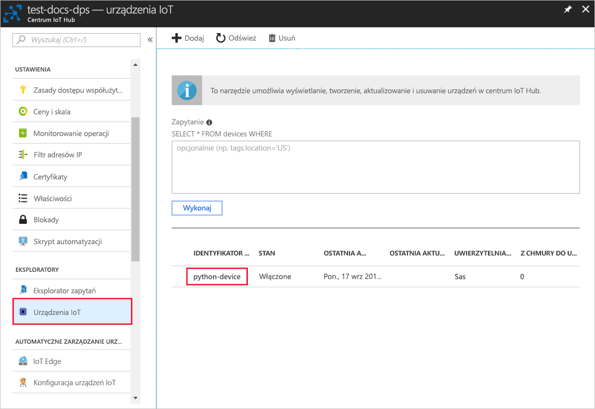

# <a name="create-and-provision-a-simulated-x509-device-using-python-device-sdk-for-iot-hub-device-provisioning-service"></a>Tworzenie i aprowizowanie symulowanego urządzenia X.509 za pomocą zestawu SDK języka Python dla usługi IoT Hub Device Provisioning

[!INCLUDE [iot-dps-selector-quick-create-simulated-device-x509](../../includes/iot-dps-selector-quick-create-simulated-device-x509.md)]

Te kroki pokazują, jak zasymulować urządzenie X.509 na maszynie deweloperskiej z systemem operacyjnym Windows OS i użyć przykładowego kodu w języku Python do połączenia tego symulowanego urządzenia z usługą Device Provisioning i Twoim centrum IoT. 

Jeśli nie znasz procesu automatycznego aprowizowania, zapoznaj się również z tematem [Auto-provisioning concepts (Pojęcia związane z automatycznym aprowizowaniem)](concepts-auto-provisioning.md). Pamiętaj również, aby wcześniej wykonać kroki przedstawione w części [Konfigurowanie usługi IoT Hub Device Provisioning za pomocą witryny Azure Portal](./quick-setup-auto-provision.md). 

Usługa Azure IoT Device Provisioning obsługuje dwa typy rejestracji:
- [Grupy rejestracji](concepts-service.md#enrollment-group): służą do rejestrowania wielu pokrewnych urządzeń.
- [Rejestracje indywidualne](concepts-service.md#individual-enrollment): służą do rejestrowania pojedynczych urządzeń.

W tym artykule przedstawiono rejestracje indywidualne.

[!INCLUDE [IoT Device Provisioning Service basic](../../includes/iot-dps-basic.md)]

> [!NOTE]
> Ten przewodnik dotyczy tylko obecnie przestarzałego zestawu SDK języka Python w wersji 1. Symulowane urządzenia X. 509 nie są jeszcze obsługiwane w wersji 2. Zespół jest obecnie trudny w pracy, dzięki czemu od 2 do funkcji parzystości.

## <a name="prepare-the-environment"></a>Przygotowywanie środowiska 

1. Upewnij się, że zainstalowano [program Visual studio](https://visualstudio.microsoft.com/vs/) 2015 lub nowszy z włączonym obciążeniem C++"Programowanie aplikacji klasycznych" na potrzeby instalacji programu Visual Studio.

2. Pobierz i zainstaluj [system kompilacji CMake](https://cmake.org/download/).

3. Upewnij się, że na swojej maszynie masz zainstalowane oprogramowanie `git` i że jest ono dodane do zmiennych środowiskowych dostępnych z okna poleceń. Zobacz stronę z [narzędziami klienckimi Git organizacji Software Freedom Conservancy](https://git-scm.com/download/), aby uzyskać najnowszą wersję narzędzi `git` do zainstalowania, które obejmują powłokę **Git Bash**, czyli aplikację wiersza polecenia, która może służyć do interakcji z lokalnym repozytorium Git. 

4. Otwórz wiersz polecenia lub powłokę Git Bash. Sklonuj repozytorium GitHub dla przykładu kodu symulacji urządzenia.
    
    ```cmd/sh
    git clone https://github.com/Azure/azure-iot-sdk-python.git --recursive
    ```

5. Utwórz folder w swojej lokalnej kopii tego repozytorium GitHub dla procesu kompilacji CMake. 

    ```cmd/sh
    cd azure-iot-sdk-python/c
    mkdir cmake
    cd cmake
    ```

6. Uruchom następujące polecenie, aby utworzyć rozwiązanie programu Visual Studio służące do aprowizacji klienta.

    ```cmd/sh
    cmake -Duse_prov_client:BOOL=ON ..
    ```


## <a name="create-a-self-signed-x509-device-certificate-and-individual-enrollment-entry"></a>Tworzenie certyfikatu urządzenia X.509 z podpisem własnym i wpisu rejestracji indywidualnej

W tej sekcji użyjesz certyfikatu z podpisem własnym X.509. Należy pamiętać o następujących ważnych kwestiach:

* Certyfikaty z podpisem własnym są przeznaczone tylko do celów testowania i nie powinny być używane w środowisku produkcyjnym.
* Domyślny termin wygaśnięcia certyfikatu z podpisem własnym to jeden rok.

Przykładowy kod z zestawu SDK języka C platformy usługi Azure IoT zostanie użyty do utworzenia certyfikatu, który będzie używany z indywidualnym wpisem rejestracji dla urządzenia symulowanego.

1. Otwórz rozwiązanie wygenerowane w folderze programu *cmake* o nazwie `azure_iot_sdks.sln` i skompiluj je w programie Visual Studio.

2. Kliknij prawym przyciskiem myszy projekt **dice\_device\_enrollment** w folderze **Provision\_Tools**, a następnie wybierz pozycję **Ustaw jako projekt startowy**. Uruchom rozwiązanie. 

3. W oknie danych wyjściowych po wyświetleniu monitu wprowadź wartość `i`, aby przeprowadzić rejestrację indywidualną. W oknie danych wyjściowych zostanie wyświetlony lokalnie wygenerowany certyfikat X.509 dla symulowanego urządzenia. 
    
    Skopiuj pierwszy certyfikat do schowka. Rozpocznij od pierwszego wystąpienia elementu:
    
        -----BEGIN CERTIFICATE----- 
        
    Zakończ kopiowanie po pierwszym wystąpieniu elementu:
    
        -----END CERTIFICATE-----
        
    Pamiętaj, aby uwzględnić również obydwa wiersze. 

    
 
4. Utwórz plik o nazwie **_X509testcertificate.pem_** na maszynie z systemem Windows, otwórz go w wybranym edytorze, a następnie skopiuj zawartość schowka do tego pliku. Zapisz plik. 

5. Zaloguj się do witryny Azure Portal, kliknij przycisk **Wszystkie zasoby** w menu po lewej stronie, a następnie otwórz używaną usługę aprowizacji.

6. W bloku podsumowania usługi Device Provisioning Service wybierz pozycję **Zarządzaj rejestracjami**. Wybierz kartę **Rejestracje indywidualne** i kliknij przycisk **Dodaj rejestrację indywidualną** u góry strony. 

7. W panelu **Dodawanie rejestracji** wprowadź następujące informacje:
   - Wybierz opcję **X.509** jako *Mechanizm* poświadczania tożsamości.
   - W obszarze *Plik PEM lub CER certyfikatu podstawowego* kliknij opcję *Wybierz plik*, aby wybrać plik certyfikatu **X509testcertificate.pem** utworzony w poprzednich krokach.
   - Opcjonalnie można podać następujące informacje:
     - Wybierz centrum IoT połączone z Twoją usługą aprowizacji.
     - Wprowadź unikatowy identyfikator urządzenia. Nadając nazwę urządzeniu, unikaj korzystania z danych poufnych. 
     - Zaktualizuj pole **Początkowy stan bliźniaczej reprezentacji urządzenia** za pomocą wybranej konfiguracji początkowej dla urządzenia.
   - Gdy skończysz, kliknij przycisk **Zapisz**. 

     [](./media/python-quick-create-simulated-device-x509/device-enrollment.png#lightbox)

   Po pomyślnej rejestracji urządzenie X.509 jest wyświetlane jako **riot-device-cert** w kolumnie *Identyfikator rejestracji* na karcie *Indywidualne rejestracje*. 

## <a name="simulate-the-device"></a>Symulowanie urządzenia

1. W bloku podsumowania usługi Device Provisioning wybierz pozycję **Przegląd**. Zwróć uwagę na wartości w polach _Zakres identyfikatorów_ i _Punkt końcowy usługi globalnej_.

    

2. Pobierz i zainstaluj środowisko [Python 2.x lub 3.x](https://www.python.org/downloads/). Upewnij się, że używasz 32-bitowej lub 64-bitowej instalacji zgodnie z wymaganiami konfiguracji. Po wyświetleniu monitu podczas instalacji upewnij się, że język Python został dodany do zmiennych środowiskowych specyficznych dla platformy. Jeśli używasz środowiska Python 2.x, może być konieczne [zainstalowanie lub uaktualnienie systemu zarządzania pakietami języka Python — *pip*](https://pip.pypa.io/en/stable/installing/).
    
    > [!NOTE] 
    > Jeśli korzystasz z systemu Windows, zainstaluj również pakiet [Visual C++ Redistributable for Visual Studio 2015](https://www.microsoft.com/download/confirmation.aspx?id=48145). Pakiety pip wymagają pakietu redystrybucyjnego, aby ładować/wykonywać biblioteki DLL języka C.

3. Postępuj zgodnie z [tymi instrukcjami](https://github.com/Azure/azure-iot-sdk-python/blob/master/doc/python-devbox-setup.md), aby skompilować pakiety języka Python.

   > [!NOTE]
   > Jeśli korzystasz z systemu `pip`, zainstaluj również pakiet `azure-iot-provisioning-device-client`.

4. Przejdź do folderu z przykładami.

    ```cmd/sh
    cd azure-iot-sdk-python/provisioning_device_client/samples
    ```

5. Korzystając ze zintegrowanego środowiska projektowego Python, poddaj edycji skrypt python o nazwie **provisioning\_device\_client\_sample.py**. Zmodyfikuj zmienne _GLOBAL\_PROV\_URI_ i _ID\_SCOPE_, ustawiając dla nich podane wcześniej wartości.

    ```python
    GLOBAL_PROV_URI = "{globalServiceEndpoint}"
    ID_SCOPE = "{idScope}"
    SECURITY_DEVICE_TYPE = ProvisioningSecurityDeviceType.X509
    PROTOCOL = ProvisioningTransportProvider.HTTP
    ```

6. Uruchom przykład. 

    ```cmd/sh
    python provisioning_device_client_sample.py
    ```

7. Aplikacja nawiąże połączenie, zarejestruje urządzenie i wyświetli komunikat o pomyślnej rejestracji.

    

8. W portalu przejdź do centrum IoT Hub połączonego z usługą aprowizacji, a następnie otwórz blok **Device Explorer**. Po pomyślnej aprowizacji symulowanego urządzenia X.509 w centrum identyfikator urządzenia jest wyświetlany w bloku **Device Explorer** z pozycją *STATUS* (stan) ustawioną na wartość **enabled** (włączone). Jeśli blok został otwarty przed uruchomieniem przykładowej aplikacji urządzenia, konieczne może być kliknięcie przycisku **Odśwież** znajdującego się u góry. 

     

> [!NOTE]
> Jeśli zmienisz wartość w polu *Początkowy stan bliźniaczej reprezentacji urządzenia* z domyślnej na inną we wpisie rejestracji dla Twojego urządzenia, może to spowodować pobranie z centrum żądanego stanu reprezentacji bliźniaczej i odpowiednie do niego działanie. Aby uzyskać więcej informacji, zobacz [Opis bliźniaczej reprezentacji urządzenia w usłudze IoT Hub oraz sposoby jej używania](../iot-hub/iot-hub-devguide-device-twins.md).
>

## <a name="clean-up-resources"></a>Oczyszczanie zasobów

Jeśli planujesz dalszą pracę z przykładem klienta urządzenia i eksplorowanie go, nie czyść zasobów utworzonych w ramach tego przewodnika Szybki start. Jeśli nie planujesz kontynuować pracy, wykonaj poniższe kroki, aby usunąć wszystkie zasoby utworzone w ramach tego przewodnika Szybki start.

1. Zamknij okno danych wyjściowych przykładu klienta urządzenia na swojej maszynie.
2. W witrynie Azure Portal w menu po lewej stronie kliknij pozycję **Wszystkie zasoby**, a następnie wybierz swoją usługę Device Provisioning Service. Otwórz blok **Zarządzanie rejestracjami** dla usługi, a następnie kliknij kartę **Rejestracje indywidualne**. Wybierz *IDENTYFIKATOR REJESTRACJI* urządzenia zarejestrowanego w ramach tego przewodnika Szybki start i kliknij przycisk **Usuń** u góry. 
3. W witrynie Azure Portal w menu po lewej stronie kliknij pozycję **Wszystkie zasoby**, a następnie wybierz swoje centrum IoT. Otwórz blok **Urządzenia IoT** Twojego centrum, wybierz *IDENTYFIKATOR URZĄDZENIA* zarejestrowanego w ramach tego przewodnika Szybki start, a następnie kliknij przycisk **Usuń** u góry.

## <a name="next-steps"></a>Następne kroki

W tym przewodniku Szybki start na Twojej maszynie z systemem Windows utworzono symulowane urządzenie X.509, które zostało następnie zaaprowizowane do Twojego centrum IoT przy użyciu usługi Azure IoT Hub Device Provisioning w portalu. Aby dowiedzieć się, jak zarejestrować urządzenie X.509 programowo, przejdź do przewodnika Szybki start dotyczącego programowej rejestracji urządzeń X.509. 

> [!div class="nextstepaction"]
> [Przewodnik Szybki start platformy Azure — Rejestrowanie urządzenia X.509 w usłudze Azure IoT Hub Device Provisioning](quick-enroll-device-x509-python.md)
