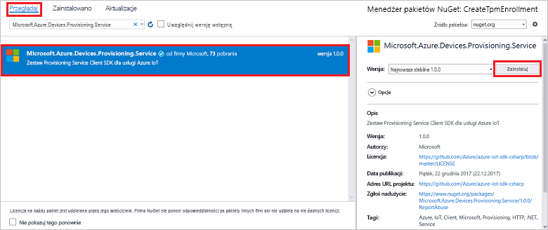

# <a name="enroll-tpm-device-to-iot-hub-device-provisioning-service-using-c-service-sdk"></a>Rejestrowanie urządzenia TPM w usłudze IoT Hub Device Provisioning przy użyciu zestawu SDK usługi C#

[!INCLUDE [iot-dps-selector-quick-enroll-device-tpm](../../includes/iot-dps-selector-quick-enroll-device-tpm.md)]

W tym artykule pokazano, jak programowo utworzyć rejestrację indywidualną dla urządzenia TPM w usłudze Azure IoT Hub Device Provisioning Service przy użyciu [ C# zestawu SDK usługi](https://github.com/Azure/azure-iot-sdk-csharp) i przykładowej C# aplikacji platformy .NET Core. Opcjonalnie można zarejestrować symulowane urządzenie TPM w usłudze aprowizacji przy użyciu tego wpisu rejestracji indywidualnej. Chociaż te kroki działają na komputerach z systemem Windows i Linux, w tym artykule jest wykorzystywany komputer deweloperski systemu Windows.

## <a name="prepare-the-development-environment"></a>Przygotowywanie środowiska deweloperskiego

1. Upewnij się, że na komputerze jest zainstalowany [program Visual Studio 2019](https://www.visualstudio.com/vs/) .

1. Upewnij się, że na komputerze zainstalowano [zestaw .NET Core SDK](https://www.microsoft.com/net/download/windows) .

1. Przed kontynuowaniem wykonaj kroki opisane w temacie [konfigurowanie IoT Hub Device Provisioning Service przy użyciu Azure Portal](./quick-setup-auto-provision.md) .

1. Obowiązkowe Jeśli chcesz zarejestrować symulowane urządzenie na końcu tego przewodnika Szybki Start, postępuj zgodnie z procedurą opisaną w temacie [Tworzenie i udostępnianie symulowanego urządzenia TPM C# za pomocą zestawu SDK urządzenia](quick-create-simulated-device-tpm-csharp.md) do kroku, w którym uzyskujesz Klucz poręczenia dla urządzenia. Zapisz klucz poręczenia, Identyfikator rejestracji i, opcjonalnie, identyfikator urządzenia, ponieważ musisz użyć ich w dalszej części tego przewodnika Szybki Start.

   > [!NOTE]
   > Nie wykonuj kroków, aby utworzyć rejestrację indywidualną przy użyciu Azure Portal.

## <a name="get-the-connection-string-for-your-provisioning-service"></a>Uzyskiwanie parametrów połączenia usługi aprowizacji

Na potrzeby przykładu w tym przewodniku Szybki start będą potrzebne parametry połączenia usługi aprowizacji.

1. Zaloguj się do Azure Portal, wybierz pozycję **wszystkie zasoby**, a następnie usługę Device Provisioning.

1. Wybierz pozycję **zasady dostępu współdzielonego**, a następnie wybierz zasady dostępu, których chcesz użyć, aby otworzyć jego właściwości. W obszarze **zasady dostępu**skopiuj i Zapisz parametry połączenia klucza podstawowego.

    

## <a name="create-the-individual-enrollment-sample"></a>Tworzenie przykładowej rejestracji indywidualnej

W tej sekcji przedstawiono sposób tworzenia aplikacji konsolowej .NET Core, która dodaje rejestrację indywidualną dla urządzenia TPM do usługi aprowizacji. Wprowadzając pewne modyfikacje, za pomocą tych kroków można również utworzyć aplikację konsolową [Windows IoT Core](https://developer.microsoft.com/en-us/windows/iot) służącą do dodawania rejestracji indywidualnej. Aby dowiedzieć się więcej na temat programowania przy użyciu programu IoT Core, zobacz [dokumentację dla deweloperów w systemie Windows IoT Core](https://docs.microsoft.com/windows/iot-core/).

1. Otwórz program Visual Studio i wybierz pozycję **Utwórz nowy projekt**. W obszarze **Utwórz nowy projekt**wybierz szablon projektu **aplikacja konsoli (.NET Core)** dla C# i wybierz pozycję **dalej**.

1. Nazwij projekt *CreateTpmEnrollment*, a następnie wybierz pozycję **Utwórz**.

    

1. W **Eksplorator rozwiązań**kliknij prawym przyciskiem myszy projekt **CreateTpmEnrollment** , a następnie wybierz pozycję **Zarządzaj pakietami NuGet**.

1. W **Menedżerze pakietów NuGet**wybierz pozycję **Przeglądaj**, Wyszukaj i wybierz pozycję **Microsoft. Azure. Devices. Provisioning. Service**, a następnie wybierz pozycję **Zainstaluj**.

   

   Ten krok spowoduje pobranie, zainstalowanie i dodanie odwołania do pakietu NuGet [zestawu SDK klienta usługi Azure IoT](https://www.nuget.org/packages/Microsoft.Azure.Devices.Provisioning.Service/) i jego zależności.

1. Dodaj następujące `using` instrukcje `using` w górnej części `Program.cs`okna:
  
   ```csharp
   using System.Threading.Tasks;
   using Microsoft.Azure.Devices.Provisioning.Service;
   ```

1. Dodaj następujące pola do `Program` klasy i wprowadź zmiany na liście.

   ```csharp
   private static string ProvisioningConnectionString = "{Your provisioning service connection string}";
   private const string RegistrationId = "sample-registrationid-csharp";
   private const string TpmEndorsementKey =
       "AToAAQALAAMAsgAgg3GXZ0SEs/gakMyNRqXXJP1S124GUgtk8qHaGzMUaaoABgCAAEMAEAgAAAAAAAEAxsj2gUS" +
       "cTk1UjuioeTlfGYZrrimExB+bScH75adUMRIi2UOMxG1kw4y+9RW/IVoMl4e620VxZad0ARX2gUqVjYO7KPVt3d" +
       "yKhZS3dkcvfBisBhP1XH9B33VqHG9SHnbnQXdBUaCgKAfxome8UmBKfe+naTsE5fkvjb/do3/dD6l4sGBwFCnKR" +
       "dln4XpM03zLpoHFao8zOwt8l/uP3qUIxmCYv9A7m69Ms+5/pCkTu/rK4mRDsfhZ0QLfbzVI6zQFOKF/rwsfBtFe" +
       "WlWtcuJMKlXdD8TXWElTzgh7JS4qhFzreL0c1mI0GCj+Aws0usZh7dLIVPnlgZcBhgy1SSDQMQ==";
       
   // Optional parameters
   private const string OptionalDeviceId = "myCSharpDevice";
   private const ProvisioningStatus OptionalProvisioningStatus = ProvisioningStatus.Enabled;
   ```

   * Zastąp `ProvisioningConnectionString` wartość symbolu zastępczego parametrami połączenia usługi aprowizacji, dla której chcesz utworzyć rejestrację.

   * Opcjonalnie możesz zmienić identyfikator rejestracji, klucz poręczenia, identyfikator urządzenia i stan aprowizowania.

   * Jeśli korzystasz z tego przewodnika Szybki Start wraz z opcją [Utwórz i Udostępnij symulowane urządzenie C# TPM przy użyciu zestawu SDK urządzenia](quick-create-simulated-device-tpm-csharp.md) z przewodnikiem Szybki Start, aby udostępnić symulowane urządzenie, Zastąp Klucz poręczenia i Identyfikator rejestracji wartościami zanotowanymi w tym miejscu. Start. Identyfikator urządzenia można zastąpić wartością sugerowaną w tym przewodniku Szybki Start, użyć własnej wartości lub użyć wartości domyślnej w tym przykładzie.

1. Dodaj następującą metodę do `Program` klasy.  Ten kod tworzy poszczególne wpisy rejestracji, a następnie wywołuje `CreateOrUpdateIndividualEnrollmentAsync` metodę `ProvisioningServiceClient` w celu dodania rejestracji indywidualnej do usługi aprowizacji.

   ```csharp
   public static async Task RunSample()
   {
       Console.WriteLine("Starting sample...");

       using (ProvisioningServiceClient provisioningServiceClient =
               ProvisioningServiceClient.CreateFromConnectionString(ProvisioningConnectionString))
       {
           #region Create a new individualEnrollment config
           Console.WriteLine("\nCreating a new individualEnrollment...");
           Attestation attestation = new TpmAttestation(TpmEndorsementKey);
           IndividualEnrollment individualEnrollment =
                   new IndividualEnrollment(
                           RegistrationId,
                           attestation);

           // The following parameters are optional. Remove them if you don't need them.
           individualEnrollment.DeviceId = OptionalDeviceId;
           individualEnrollment.ProvisioningStatus = OptionalProvisioningStatus;
           #endregion

           #region Create the individualEnrollment
           Console.WriteLine("\nAdding new individualEnrollment...");
           IndividualEnrollment individualEnrollmentResult =
               await provisioningServiceClient.CreateOrUpdateIndividualEnrollmentAsync(individualEnrollment).ConfigureAwait(false);
           Console.WriteLine("\nIndividualEnrollment created with success.");
           Console.WriteLine(individualEnrollmentResult);
           #endregion
        
       }
   }
   ```

1. Na koniec Zastąp treść `Main` metody następującymi wierszami:

   ```csharp
   RunSample().GetAwaiter().GetResult();
   Console.WriteLine("\nHit <Enter> to exit ...");
   Console.ReadLine();
   ```

1. Skompiluj rozwiązanie.

## <a name="run-the-individual-enrollment-sample"></a>Uruchamianie przykładowej rejestracji indywidualnej
  
Uruchom przykład w programie Visual Studio, aby utworzyć rejestrację indywidualną dla urządzenia TPM.

Po pomyślnym utworzeniu w oknie wiersza polecenia zostaną wyświetlone właściwości nowej rejestracji indywidualnej.

Możesz sprawdzić, czy Rejestracja indywidualna została utworzona. Przejdź do podsumowania usługi Device Provisioning, a następnie wybierz pozycję **Zarządzaj rejestracjami**, a następnie wybierz pozycję **rejestracje indywidualne**. Powinien zostać wyświetlony nowy wpis rejestracji odpowiadający identyfikatorowi rejestracji użytemu w przykładzie.


Wybierz wpis, aby zweryfikować Klucz poręczenia i inne właściwości wpisu.

Jeśli wykonano kroki opisane w temacie [Tworzenie i udostępnianie symulowanego urządzenia TPM za pomocą C# zestawu SDK urządzenia](quick-create-simulated-device-tpm-csharp.md) , możesz kontynuować pracę z pozostałymi krokami w tym przewodniku Szybki Start, aby zarejestrować symulowane urządzenie. Pomiń kroki tworzenia rejestracji indywidualnej przy użyciu witryny Azure Portal.

## <a name="clean-up-resources"></a>Oczyszczanie zasobów

Jeśli planujesz Eksplorowanie przykładu C# usługi, nie czyść zasobów utworzonych w tym przewodniku Szybki Start. W przeciwnym razie wykonaj następujące kroki, aby usunąć wszystkie zasoby utworzone w ramach tego przewodnika Szybki Start.

1. Zamknij okno C# przykładowe dane wyjściowe na komputerze.

1. Przejdź do usługi Device Provisioning w Azure Portal wybierz pozycję **Zarządzaj rejestracjami**, a następnie wybierz kartę **rejestracje indywidualne** . Wybierz *Identyfikator rejestracji* wpisu rejestracji utworzonego w ramach tego przewodnika Szybki Start, a następnie wybierz pozycję **Usuń**.

1. Jeśli wykonano kroki opisane w temacie [Tworzenie i udostępnianie symulowanego urządzenia TPM za C# pomocą zestawu SDK urządzenia](quick-create-simulated-device-tpm-csharp.md) w celu utworzenia symulowanego urządzenia TPM, wykonaj następujące czynności:

    1. Zamknij okno symulatora modułu TPM i przykładowe okno danych wyjściowych urządzenia symulowanego.

    1. W witrynie Azure Portal przejdź do usługi IoT Hub, w której zaaprowizowano urządzenie. W menu w obszarze **Explorer**wybierz pozycję **urządzenia IoT**, zaznacz pole wyboru obok urządzenia, a następnie wybierz pozycję **Usuń**.

## <a name="next-steps"></a>Następne kroki

W tym przewodniku szybki start utworzysz indywidualny wpis rejestracji dla urządzenia TPM. Opcjonalnie utworzono symulowane urządzenie TPM na komputerze i zainicjowano je do centrum IoT Hub przy użyciu IoT Hub Device Provisioning Service platformy Azure. Aby uzyskać dokładne informacje na temat aprowizowania urządzeń, przejdź do samouczka poświęconego konfiguracji usługi Device Provisioning Service w witrynie Azure portal.

> [!div class="nextstepaction"]
> [Samouczki dla usługi Azure IoT Hub Device Provisioning Service](./tutorial-set-up-cloud.md)
