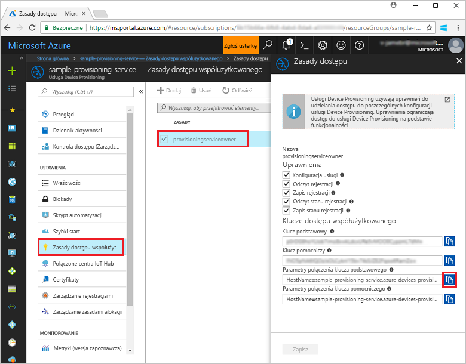
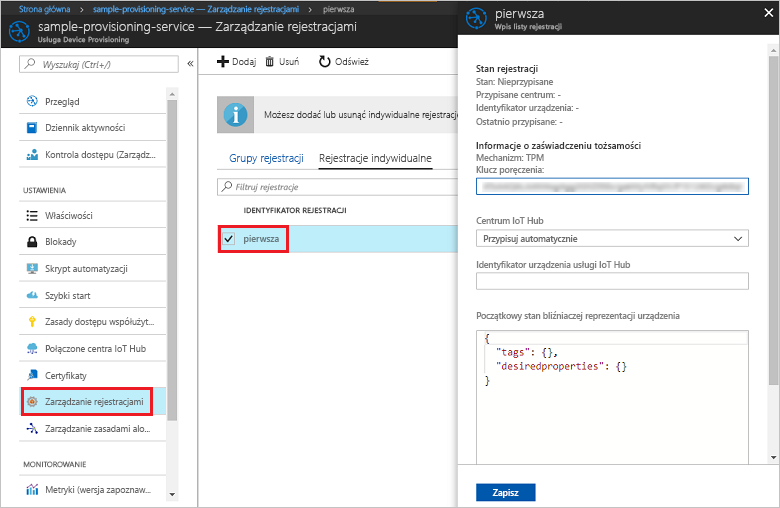

# <a name="quickstart-enroll-tpm-device-to-iot-hub-device-provisioning-service-using-nodejs-service-sdk"></a>Szybki Start: rejestrowanie urządzenia TPM w IoT Hub Device Provisioning Service przy użyciu zestawu SDK usługi Node. js

[!INCLUDE [iot-dps-selector-quick-enroll-device-tpm](../../includes/iot-dps-selector-quick-enroll-device-tpm.md)]


W tych instrukcjach pokazano, jak programowo utworzyć rejestrację indywidualną dla urządzenia TPM w usłudze Azure IoT Hub Device Provisioning przy użyciu [zestawu SDK usługi Node.js](https://github.com/Azure/azure-iot-sdk-node) i przykładowej aplikacji Node.js. Opcjonalnie można zarejestrować symulowane urządzenie TPM w usłudze aprowizacji przy użyciu tego wpisu rejestracji indywidualnej. Mimo że ta procedura działa zarówno na maszynach z systemem Windows, jak i Linux, na potrzeby tego artykułu zostanie użyta maszyna deweloperska z systemem Windows.

## <a name="prerequisites"></a>Wymagania wstępne

- Pamiętaj, aby wcześniej wykonać kroki przedstawione w części [Konfigurowanie usługi IoT Hub Device Provisioning za pomocą witryny Azure Portal](./quick-setup-auto-provision.md). 
-  Upewnij się, że na komputerze jest zainstalowane [środowisko Node.js w wersji 4.0 lub nowszej](https://nodejs.org).
- Jeśli chcesz zarejestrować symulowane urządzenie na końcu tego przewodnika Szybki Start, postępuj zgodnie z instrukcjami w temacie [Tworzenie i udostępnianie symulowanego urządzenia](quick-create-simulated-device.md) do momentu, w którym uzyskasz Klucz poręczenia dla urządzenia. Zanotuj klucz poręczenia, który będzie używany później w tym przewodniku Szybki Start. **Nie wykonuj kroków tworzenia rejestracji indywidualnej przy użyciu witryny Azure Portal.**
 
## <a name="create-the-individual-enrollment-sample"></a>Tworzenie przykładowej rejestracji indywidualnej 

 
1. Z poziomu okna polecenia w folderze roboczym uruchom następujące polecenie:
  
    ```cmd\sh
    npm install azure-iot-provisioning-service
    ```  

2. Za pomocą edytora tekstu utwórz plik **create_individual_enrollment.js** w folderze roboczym. Dodaj następujący kod do pliku i zapisz go:

    ```
    'use strict';

    var provisioningServiceClient = require('azure-iot-provisioning-service').ProvisioningServiceClient;

    var serviceClient = provisioningServiceClient.fromConnectionString(process.argv[2]);
    var endorsementKey = process.argv[3];

    var enrollment = {
      registrationId: 'first',
      attestation: {
        type: 'tpm',
        tpm: {
          endorsementKey: endorsementKey
        }
      }
    };

    serviceClient.createOrUpdateIndividualEnrollment(enrollment, function(err, enrollmentResponse) {
      if (err) {
        console.log('error creating the individual enrollment: ' + err);
      } else {
        console.log("enrollment record returned: " + JSON.stringify(enrollmentResponse, null, 2));
      }
    });
    ```

## <a name="run-the-individual-enrollment-sample"></a>Uruchamianie przykładowej rejestracji indywidualnej
  
1. Do uruchomienia przykładu będą potrzebne parametry połączenia usługi aprowizacji. 
    1. Zaloguj się do Azure Portal, wybierz przycisk **wszystkie zasoby** w menu po lewej stronie i Otwórz swoją usługę Device Provisioning. 
    2. Wybierz pozycję **zasady dostępu współdzielonego**, a następnie wybierz zasady dostępu, których chcesz użyć, aby otworzyć jego właściwości. W oknie **Zasady dostępu** skopiuj i zanotuj parametry połączenia klucza podstawowego. 

        


2. Wymagany jest również klucz poręczenia dla danego urządzenia. Jeśli w celu utworzenia symulowanego urządzenia TPM wykonano kroki z sekcji [Tworzenie i aprowizowanie symulowanego urządzenia](quick-create-simulated-device.md) przewodnika Szybki start, użyj klucza utworzonego dla tego urządzenia. W przeciwnym razie, aby utworzyć przykładową rejestrację indywidualną, można użyć następującego klucza poręczenia dostarczonego razem z zestawem SDK:

    ```
    AToAAQALAAMAsgAgg3GXZ0SEs/gakMyNRqXXJP1S124GUgtk8qHaGzMUaaoABgCAAEMAEAgAAAAAAAEAxsj2gUScTk1UjuioeTlfGYZrrimExB+bScH75adUMRIi2UOMxG1kw4y+9RW/IVoMl4e620VxZad0ARX2gUqVjYO7KPVt3dyKhZS3dkcvfBisBhP1XH9B33VqHG9SHnbnQXdBUaCgKAfxome8UmBKfe+naTsE5fkvjb/do3/dD6l4sGBwFCnKRdln4XpM03zLpoHFao8zOwt8l/uP3qUIxmCYv9A7m69Ms+5/pCkTu/rK4mRDsfhZ0QLfbzVI6zQFOKF/rwsfBtFeWlWtcuJMKlXdD8TXWElTzgh7JS4qhFzreL0c1mI0GCj+Aws0usZh7dLIVPnlgZcBhgy1SSDQMQ==
    ```

3. Aby utworzyć rejestrację indywidualną dla urządzenia TPM, uruchom następujące polecenie (z uwzględnieniem cudzysłowów wokół argumentów polecenia):
 
     ```cmd\sh
     node create_individual_enrollment.js "<the connection string for your provisioning service>" "<endorsement key>"
     ```
 
3. Po pomyślnym utworzeniu nowej rejestracji indywidualnej w oknie polecenia zostaną wyświetlone jej właściwości.

     

4. Sprawdź, czy rejestracja indywidualna została utworzona. W witrynie Azure Portal w bloku podsumowania usługi Device Provisioning wybierz pozycję **Zarządzaj rejestracjami**. Wybierz kartę **rejestracje indywidualne** i wybierz nowy wpis rejestracji (*pierwszy*), aby zweryfikować Klucz poręczenia i inne właściwości wpisu.

     
 
Jeśli po utworzeniu rejestracji indywidualnej dla urządzenia TPM chcesz zarejestrować symulowane urządzenie, możesz wykonać pozostałe kroki z sekcji [Tworzenie i aprowizowanie symulowanego urządzenia](quick-create-simulated-device.md). Pamiętaj, aby pominąć procedurę tworzenia rejestracji indywidualnej przy użyciu Azure Portal w tym przewodniku Szybki Start.

## <a name="clean-up-resources"></a>Oczyszczanie zasobów
Jeśli planujesz Eksplorowanie przykładów usługi Node. js, nie czyść zasobów utworzonych w tym przewodniku Szybki Start. Jeśli nie planujesz kontynuować pracy, wykonaj następujące kroki, aby usunąć wszystkie zasoby utworzone w ramach tego przewodnika Szybki Start.

1. Zamknij okno danych wyjściowych przykładu środowiska Node.js na swojej maszynie.
1. Jeśli utworzono symulowane urządzenie TPM, zamknij okno symulatora modułu TPM.
2. Przejdź do usługi Device Provisioning w Azure Portal, wybierz pozycję **Zarządzaj rejestracjami**, a następnie wybierz kartę **indywidualne rejestracje** . Zaznacz pole wyboru obok *identyfikatora rejestracji* wpisu rejestracji utworzonego w ramach tego przewodnika Szybki Start, a następnie naciśnij przycisk **Usuń** w górnej części okienka. 
 
## <a name="next-steps"></a>Następne kroki
W tym przewodniku szybki start został utworzony indywidualny wpis rejestracji dla urządzenia TPM i, opcjonalnie, utworzono symulowane urządzenie TPM na komputerze i zostało ono zainicjowane w usłudze IoT Hub przy użyciu IoT Hub Device Provisioning Service platformy Azure. Aby uzyskać dokładne informacje na temat aprowizowania urządzeń, przejdź do samouczka poświęconego konfiguracji usługi Device Provisioning Service w witrynie Azure portal. 
 
> [!div class="nextstepaction"]
> [Samouczki dla usługi Azure IoT Hub Device Provisioning Service](./tutorial-set-up-cloud.md)