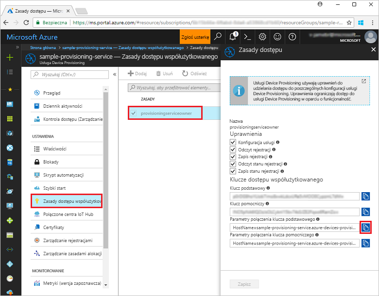
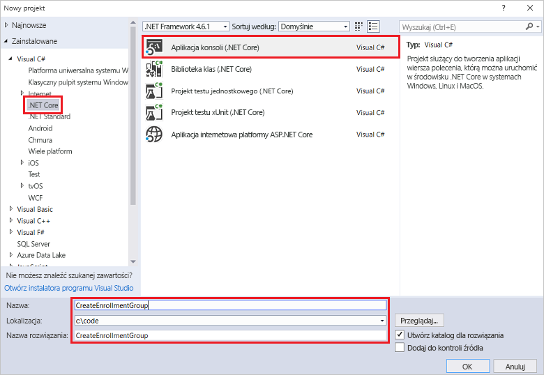
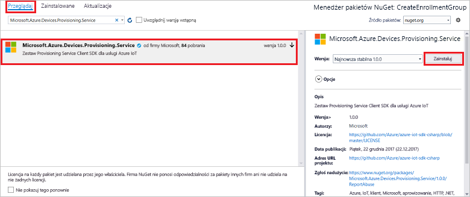
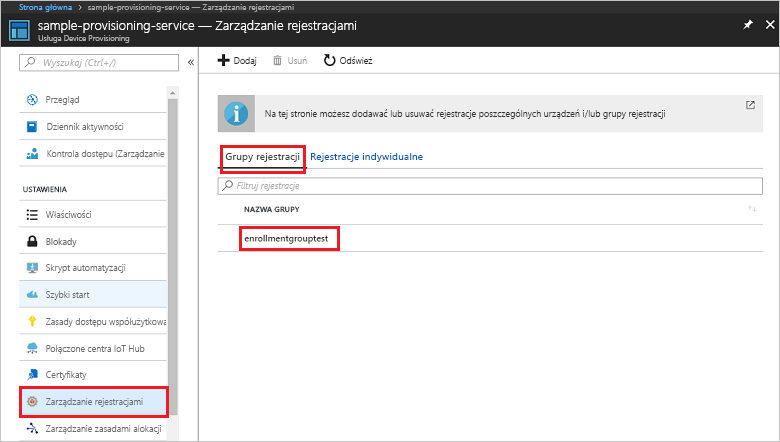

# <a name="quickstart-enroll-x509-devices-to-the-device-provisioning-service-using-c"></a>Szybki start: rejestrowanie urządzeń X.509 w usłudze Device Provisioning przy użyciu języka C#

[!INCLUDE [iot-dps-selector-quick-enroll-device-x509](../../includes/iot-dps-selector-quick-enroll-device-x509.md)]


Ten przewodnik szybki Start przedstawia sposób użycia języka C# w celu programowego utworzenia [grupy rejestracji](concepts-service.md#enrollment-group), która będzie używać certyfikatów X.509 pośredniego lub głównego urzędu certyfikacji. Grupa rejestracji jest tworzona przy użyciu [Zestawu SDK usługi Microsoft Azure IoT dla środowiska .NET](https://github.com/Azure/azure-iot-sdk-csharp) oraz przykładowej aplikacji środowiska .NET Core napisanej w języku C#. Grupa rejestracji steruje dostępem do usługi aprowizacji dla urządzeń, które mają wspólny certyfikat podpisywania w swoim łańcuchu certyfikatów. Aby dowiedzieć się więcej, zobacz [Sterowanie dostępem urządzenia do usługi aprowizacji za pomocą certyfikatów X.509](./concepts-security.md#controlling-device-access-to-the-provisioning-service-with-x509-certificates). Aby uzyskać więcej informacji na temat używania infrastruktury kluczy publicznych opartej na certyfikatach X.509 z usługą Azure IoT Hub i Device Provisioning, zobacz [Omówienie zabezpieczeń certyfikatu X.509 urzędu certyfikacji](https://docs.microsoft.com/azure/iot-hub/iot-hub-x509ca-overview). 

Ten przewodnik Szybki start zakłada, że utworzono już wystąpienie usług IoT Hub i Device Provisioning Service. Jeżeli nie utworzono jeszcze tych zasobów, ukończ przewodnik Szybki start [Konfigurowanie usługi IoT Hub Device Provisioning Service przy użyciu witryny Azure Portal](./quick-setup-auto-provision.md) przed dalszą lekturą tego artykułu.

Mimo że kroki opisane w tym artykule działają zarówno na maszynach z systemem Windows, jak i Linux, ten artykuł został opracowany dla maszyny deweloperskiej z systemem Windows.

[!INCLUDE [quickstarts-free-trial-note](../../includes/quickstarts-free-trial-note.md)]


## <a name="prerequisites"></a>Wymagania wstępne

* Zainstaluj program [Visual Studio 2017](https://www.visualstudio.com/vs/).
* Zainstaluj [platformy .NET Core SDK](https://www.microsoft.com/net/download/windows).
* [Zainstaluj oprogramowanie Git](https://git-scm.com/download/).


## <a name="prepare-test-certificates"></a>Przygotowywanie certyfikatów testowych

Na potrzeby tego przewodnika Szybki start musisz mieć plik pem lub cer, który zawiera publiczną część certyfikatu X.509 pośredniego lub głównego urzędu certyfikacji. Ten certyfikat musi zostać przekazany do usługi aprowizacji i zweryfikowany przez usługę. 

[Zestaw SDK języka C usługi Azure IoT](https://github.com/Azure/azure-iot-sdk-c) zawiera narzędzia testowe, które mogą ułatwić tworzenie łańcucha certyfikatów X.509, przekazywanie certyfikatu głównego lub pośredniego z tego łańcucha oraz wykonywanie operacji dowodu posiadania w usłudze w celu weryfikacji certyfikatu. Certyfikaty utworzone za pomocą narzędzi zestawu SDK są przeznaczone tylko do użycia na potrzeby **testowania podczas programowania**. Te certyfikaty **nie mogą być stosowane w produkcji**. Zawierają one zapisane na stałe hasła („1234”), które wygasają po 30 dniach. Informacje na temat uzyskiwania certyfikatów odpowiednich do użycia w produkcji znajdują się w artykule [Jak uzyskać certyfikat X.509 urzędu certyfikacji](https://docs.microsoft.com/azure/iot-hub/iot-hub-x509ca-overview#how-to-get-an-x509-ca-certificate) w dokumentacji usługi Azure IoT Hub.

Aby użyć tych narzędzi testowych do wygenerowania certyfikatów, wykonaj następujące kroki: 
 
1. Otwórz wiersz polecenia lub powłokę Git Bash i przejdź do folderu roboczego na swojej maszynie. Wykonaj następujące polecenie, aby sklonować repozytorium GitHub [zestawu SDK języka C usługi IoT Azure](https://github.com/Azure/azure-iot-sdk-c):
    
   ```cmd/sh
   git clone https://github.com/Azure/azure-iot-sdk-c.git --recursive
   ```

   Należy się spodziewać, że ukończenie operacji potrwa kilka minut.

   Narzędzia testowe znajdują się w folderze *azure-iot-sdk-c/tools/CACertificates* sklonowanego repozytorium.    

2. Postępuj zgodnie z instrukcjami opisanymi w artykule [Zarządzanie certyfikatami testowymi urzędu certyfikacji na potrzeby przykładów i samouczków](https://github.com/Azure/azure-iot-sdk-c/blob/master/tools/CACertificates/CACertificateOverview.md). 

Oprócz narzędzi z zestawu SDK języka C, w [przykładzie weryfikacji certyfikatu grupy](https://github.com/Azure-Samples/azure-iot-samples-csharp/tree/master/provisioning/Samples/service/GroupCertificateVerificationSample) z *zestawu SDK usługi Microsoft Azure IoT dla środowiska .NET* pokazano, jak wykonać operację dowodu posiadania w języku C# z użyciem istniejącego certyfikatu X.509 pośredniego lub głównego urzędu certyfikacji. 


## <a name="get-the-connection-string-for-your-provisioning-service"></a>Uzyskiwanie parametrów połączenia usługi aprowizacji

Na potrzeby przykładu w tym przewodniku Szybki start będą potrzebne parametry połączenia usługi aprowizacji.
1. Zaloguj się w witrynie Azure Portal, kliknij przycisk **Wszystkie zasoby** w menu po lewej stronie i otwórz swoją usługę Device Provisioning Service. 
2. Kliknij pozycję **Zasady dostępu współużytkowanego**, a następnie kliknij odpowiednie zasady dostępu, aby otworzyć ich właściwości. W oknie **Zasady dostępu** skopiuj i zanotuj parametry połączenia klucza podstawowego. 

    

## <a name="create-the-enrollment-group-sample"></a>Tworzenie przykładowej grupy rejestracji 

Kroki opisane w tej sekcji przedstawiają sposób tworzenia aplikacji konsolowej .NET Core, która dodaje grupę rejestracji do usługi aprowizacji. Wprowadzając pewne modyfikacje, za pomocą tych kroków można również utworzyć aplikację konsolową [Windows IoT Core](https://developer.microsoft.com/en-us/windows/iot) służącą do dodawania grupy rejestracji. Aby dowiedzieć się więcej na temat programowania w systemie IoT Core, zobacz [dokumentację dla deweloperów systemu Windows IoT Core](https://docs.microsoft.com/windows/iot-core/).
1. W programie Visual Studio dodaj projekt aplikacji konsolowej .NET Core w języku Visual C# do nowego rozwiązania, używając szablonu projektu **Aplikacja konsolowa (.NET Core)**. Upewnij się, że program .NET Framework jest w wersji 4.5.1 lub nowszej. Nadaj projektowi nazwę **CreateEnrollmentGroup**.

    

2. W Eksploratorze rozwiązań kliknij prawym przyciskiem myszy projekt **CreateEnrollmentGroup**, a następnie kliknij pozycję **Zarządzaj pakietami NuGet**.
3. W oknie **Menedżer pakietów NuGet** wybierz opcję **Przeglądaj**, wyszukaj pozycję **Microsoft.Azure.Devices.Provisioning.Service**, wybierz opcję **Zainstaluj**, aby zainstalować pakiet **Microsoft.Azure.Devices.Provisioning.Service**, i zaakceptuj warunki użytkowania. Ta procedura spowoduje pobranie, zainstalowanie i dodanie odwołania do pakietu NuGet [zestawu SDK klienta usługi aprowizacji usługi Azure IoT](https://www.nuget.org/packages/Microsoft.Azure.Devices.Provisioning.Service/) oraz jego zależności.

    

4. Dodaj następujące instrukcje `using` po istniejących instrukcjach `using` na początku pliku **Program.cs**:
   
   ```csharp
   using System.Security.Cryptography.X509Certificates;
   using System.Threading.Tasks;
   using Microsoft.Azure.Devices.Provisioning.Service;
   ```
    
5. Dodaj następujące pola do klasy **Program**:  
   - Zamień wartość zastępczą **ProvisioningConnectionString** na parametry połączenia usługi aprowizacji, dla której ma zostać utworzona rejestracja.
   - Zamień wartość zastępczą **X509RootCertPath** na ścieżkę do pliku pem lub cer reprezentującego publiczną część pośredniego lub głównego certyfikatu X.509 urzędu certyfikacji, który został wcześniej przekazany do usługi aprowizacji i przez nią zweryfikowany.
   - Opcjonalnie możesz zmienić wartość **EnrollmentGroupId**. Ciąg może zawierać tylko małe litery i łączniki. 

   > [!IMPORTANT]
   > W kodzie produkcyjnym pamiętaj o następujących kwestiach dotyczących zabezpieczeń:
   >
   > - Trwałe kodowanie parametrów połączenia administratora usługi aprowizacji jest niezgodne z najlepszymi rozwiązaniami dotyczącymi zabezpieczeń. Zamiast tego parametry połączenia powinny być przechowywane w sposób bezpieczny, np. w zabezpieczonym pliku konfiguracji lub rejestrze.
   > - Pamiętaj, aby przekazać tylko publiczną część certyfikatu podpisywania. Nigdy nie przekazuj plików pfx (PKCS12) ani plików pem zawierających klucze prywatne do usługi aprowizacji.
        
   ```csharp
   private static string ProvisioningConnectionString = "{Your provisioning service connection string}";
   private static string EnrollmentGroupId = "enrollmentgrouptest";
   private static string X509RootCertPath = @"{Path to a .cer or .pem file for a verified root CA or intermediate CA X.509 certificate}";
   ```
    
6. Dodaj następującą metodę do klasy **Program**. Ten kod tworzy wpis grupy rejestracji, a następnie wywołuje metodę **CreateOrUpdateEnrollmentGroupAsync** względem obiektu **ProvisioningServiceClient**, aby dodać grupę rejestracji do usługi aprowizacji.
   
   ```csharp
   public static async Task RunSample()
   {
       Console.WriteLine("Starting sample...");
 
       using (ProvisioningServiceClient provisioningServiceClient =
               ProvisioningServiceClient.CreateFromConnectionString(ProvisioningConnectionString))
       {
           #region Create a new enrollmentGroup config
           Console.WriteLine("\nCreating a new enrollmentGroup...");
           var certificate = new X509Certificate2(X509RootCertPath);
           Attestation attestation = X509Attestation.CreateFromRootCertificates(certificate);
           EnrollmentGroup enrollmentGroup =
                   new EnrollmentGroup(
                           EnrollmentGroupId,
                           attestation)
                   {
                       ProvisioningStatus = ProvisioningStatus.Enabled
                   };
           Console.WriteLine(enrollmentGroup);
           #endregion
 
           #region Create the enrollmentGroup
           Console.WriteLine("\nAdding new enrollmentGroup...");
           EnrollmentGroup enrollmentGroupResult =
               await provisioningServiceClient.CreateOrUpdateEnrollmentGroupAsync(enrollmentGroup).ConfigureAwait(false);
           Console.WriteLine("\nEnrollmentGroup created with success.");
           Console.WriteLine(enrollmentGroupResult);
           #endregion
 
       }
   }
   ```

7. Na koniec zastąp treść metody **Main** następującymi wierszami:
   
   ```csharp
   RunSample().GetAwaiter().GetResult();
   Console.WriteLine("\nHit <Enter> to exit ...");
   Console.ReadLine();
   ```
        
8. Skompiluj rozwiązanie.

## <a name="run-the-enrollment-group-sample"></a>Uruchamianie przykładowej grupy rejestracji
  
1. Uruchom przykład w programie Visual Studio, aby utworzyć grupę rejestracji.
 
2. Po pomyślnym utworzeniu nowej grupy rejestracji w oknie polecenia zostaną wyświetlone jej właściwości.

    

3. Aby sprawdzić, czy grupa rejestracji została utworzona, w bloku podsumowania usługi Device Provisioning witryny Azure Portal wybierz pozycję **Zarządzanie rejestracjami**, a następnie wybierz kartę **Grupy rejestracji**. Powinien zostać wyświetlony nowy wpis rejestracji odpowiadający identyfikatorowi rejestracji użytemu w przykładzie. Kliknij wpis, aby zweryfikować odcisk palca certyfikatu oraz inne właściwości wpisu.

    
 
## <a name="clean-up-resources"></a>Oczyszczanie zasobów
Jeśli planujesz eksplorować przykładową usługę C#, nie usuwaj zasobów utworzonych w tym przewodniku Szybki start. Jeśli nie planujesz kontynuować pracy, wykonaj poniższe kroki, aby usunąć wszystkie zasoby utworzone w ramach tego przewodnika Szybki start.

1. Zamknij okno danych wyjściowych przykładu C# na swojej maszynie.
2. Przejdź do usługi Device Provisioning w witrynie Azure Portal, kliknij pozycję **Zarządzanie rejestracjami**, a następnie wybierz kartę **Grupy rejestracji**. Wybierz *Identyfikator rejestracji* wpisu rejestracji utworzonego w ramach tego przewodnika Szybki start i kliknij przycisk **Usuń** w górnej części bloku.  
3. Z poziomu usługi Device Provisioning kliknij pozycję **Certyfikaty**, kliknij certyfikat przekazany w ramach tego przewodnika Szybki start, a następnie kliknij przycisk **Usuń** w górnej części okna **Szczegóły certyfikatu**.  
 
## <a name="next-steps"></a>Kolejne kroki
W tym przewodniku Szybki start utworzono grupę rejestracji dla pośredniego lub głównego certyfikatu X.509 urzędu certyfikacji przy użyciu usługi Azure IoT Hub Device Provisioning. Aby uzyskać dokładne informacje na temat aprowizowania urządzeń, przejdź do samouczka poświęconego konfiguracji usługi Device Provisioning Service w witrynie Azure portal. 
 
> [!div class="nextstepaction"]
> [Samouczki dotyczące usługi Azure IoT Hub Device Provisioning Service](./tutorial-set-up-cloud.md)
