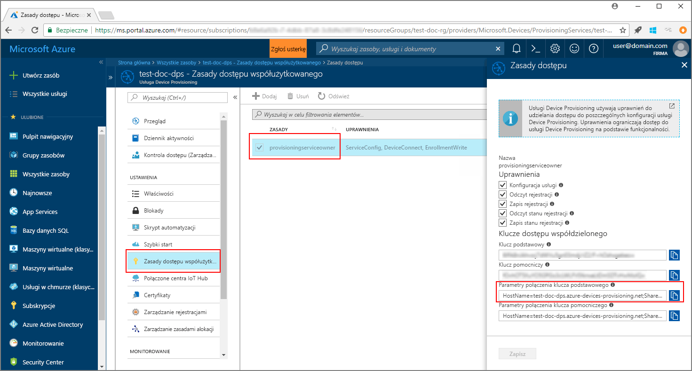
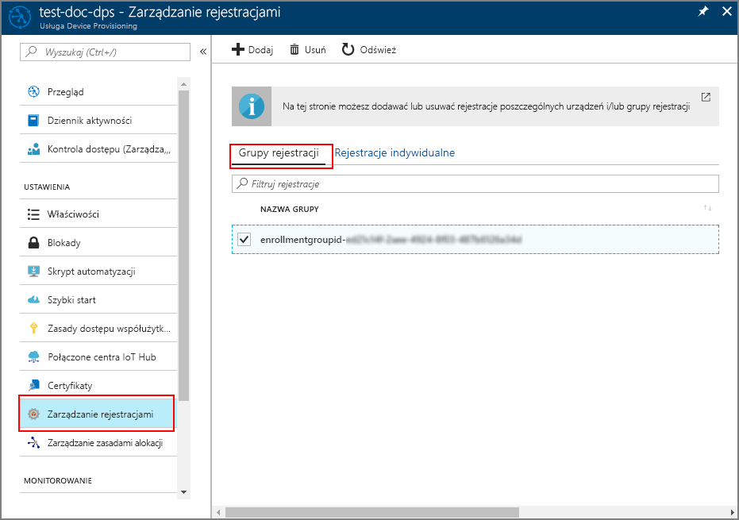

# <a name="quickstart-enroll-x509-devices-to-the-device-provisioning-service-using-java"></a>Przewodnik Szybki start: rejestrowanie urządzeń X.509 w usłudze Device Provisioning przy użyciu języka Java

[!INCLUDE [iot-dps-selector-quick-enroll-device-x509](../../includes/iot-dps-selector-quick-enroll-device-x509.md)]

W tym przewodniku szybki start używasz języka Java do programistycznego rejestrowania grupy symulowanych urządzeń X. 509 w usłudze Azure IoT Hub Device Provisioning Service. Urządzenia są rejestrowane w wystąpieniu usługi aprowizacji przez utworzenie grupy rejestracji lub rejestracji indywidualnej. Ten przewodnik Szybki Start przedstawia sposób tworzenia obu typów rejestracji przy użyciu zestawu SDK usługi Java i przykładowej aplikacji Java.

## <a name="prerequisites"></a>Wymagania wstępne

- Zakończenie [konfigurowania IoT Hub Device Provisioning Service przy użyciu Azure Portal](./quick-setup-auto-provision.md).
- Konto platformy Azure z aktywną subskrypcją. [Utwórz je bezpłatnie](https://azure.microsoft.com/free/?ref=microsoft.com&utm_source=microsoft.com&utm_medium=docs&utm_campaign=visualstudio).
- [Java SE Development Kit 8](https://aka.ms/azure-jdks). Ten przewodnik Szybki Start instaluje [zestaw SDK usługi Java](https://azure.github.io/azure-iot-sdk-java/service/) poniżej. Działa on zarówno w systemie Windows, jak i Linux. Ten przewodnik Szybki Start używa systemu Windows.
- [Maven 3](https://maven.apache.org/download.cgi).
- [Git](https://git-scm.com/download/).

<a id="javasample"></a>

## <a name="download-and-modify-the-java-sample-code"></a>Pobieranie i modyfikowanie przykładowego kodu Java

W tej sekcji używany jest certyfikat z podpisem własnym X.509. Ważne jest, aby pamiętać o następujących kwestiach:

* Certyfikaty z podpisem własnym są przeznaczone tylko do celów testowania i nie powinny być używane w środowisku produkcyjnym.
* Domyślny termin wygaśnięcia certyfikatu z podpisem własnym to jeden rok.

W poniższych krokach przedstawiono sposób dodawania szczegółów aprowizacji urządzenia X.509 do przykładowego kodu. 

1. Otwórz wiersz polecenia. Sklonuj repozytorium GitHub na potrzeby przykładowego kodu rejestracji urządzenia przy użyciu [zestawu SDK usługi Java](https://azure.github.io/azure-iot-sdk-java/service/):
    
    ```cmd\sh
    git clone https://github.com/Azure/azure-iot-sdk-java.git --recursive
    ```

2. W pobranym kodzie źródłowym przejdź do folderu przykładu **_azure-iot-sdk-java/provisioning/provisioning-samples/service-enrollment-group-sample_** . Otwórz plik **_/src/main/java/samples/com/microsoft/azure/sdk/iot/ServiceEnrollmentGroupSample.java_** w dowolnym edytorze i dodaj następujące szczegółowe informacje:

    1. Dodaj ciąg `[Provisioning Connection String]` dla usługi aprowizacji z portalu, jako pokazano poniżej:
        1. Przejdź do usługi aprowizacji w witrynie [Azure Portal](https://portal.azure.com). 
        2. Otwórz **Zasady dostępu współużytkowanego** i wybierz zasadę, która ma uprawnienie *EnrollmentWrite*.
        3. Skopiuj **Parametry połączenia klucza podstawowego**. 

              

        4. W przykładowym pliku kodu **_ServiceEnrollmentGroupSample.java_** zastąp ciąg `[Provisioning Connection String]`**parametrami połączenia klucza podstawowego**.

            ```Java
            private static final String PROVISIONING_CONNECTION_STRING = "[Provisioning Connection String]";
            ```

    2. Dodaj certyfikat główny dla grupy urządzeń. Jeśli potrzebujesz przykładowego certyfikatu głównego, użyj narzędzia _Generator certyfikatów X.509_ w następujący sposób:
        1. W oknie polecenia przejdź do folderu **_azure-iot-sdk-java/provisioning/provisioning-tools/provisioning-x509-cert-generator_** .
        2. Skompiluj narzędzie, uruchamiając następujące polecenie:

                ```cmd\sh
                mvn clean install
                ```

        4. Uruchom narzędzie przy użyciu następujących poleceń:

                ```cmd\sh
                cd target
                java -jar ./provisioning-x509-cert-generator-{version}-with-deps.jar
                ```

        5. Po wyświetleniu monitu można opcjonalnie wprowadzić _nazwę pospolitą_ dla certyfikatów.
        6. To narzędzie generuje lokalnie **Certyfikat klienta**, **Klucz prywatny certyfikatu klienta** oraz **Certyfikat główny**.
        7. Skopiuj **Certyfikat główny** razem z wierszami **_-----BEGIN CERTIFICATE-----_** i **_-----END CERTIFICATE-----_** . 
        8. Przypisz wartość **certyfikatu głównego** do parametru **PUBLIC_KEY_CERTIFICATE_STRING** w sposób przedstawiony poniżej:

                ```Java
                private static final String PUBLIC_KEY_CERTIFICATE_STRING =
                        "-----BEGIN CERTIFICATE-----\n" +
                        "XXXXXXXXXXXXXXXXXXXXXXXXXXXXXXXXXXXXXXXXXXXXXXXXXXXXXXXXXXXXXXXX\n" +
                        "XXXXXXXXXXXXXXXXXXXXXXXXXXXXXXXXXXXXXXXXXXXXXXXXXXXXXXXXXXXXXXXX\n" +
                        "XXXXXXXXXXXXXXXXXXXXXXXXXXXXXXXXXXXXXXXXXXXXXXXXXXXXXXXXXXXXXXXX\n" +
                        "XXXXXXXXXXXXXXXXXXXXXXXXXXXXXXXXXXXXXXXXXXXXXXXXXXXXXXXXXXXXXXXX\n" +
                        "XXXXXXXXXXXXXXXXXXXXXXXXXXXXXXXXXXXXXXXXXXXXXXXXXXXXXXXXXXXXXXXX\n" +
                        "XXXXXXXXXXXXXXXXXXXXXXXXXXXXXXXXXXXXXXXXXXXXXXXXXXXXXXXXXXXXXXXX\n" +
                        "XXXXXXXXXXXXXXXXXXXXXXXXXXXXXXXXXXXXXXXXXXXXXXXXXXXXXXXXXXXXXXXX\n" +
                        "XXXXXXXXXXXXXXXXXXXXXXXXXXXXXXXXXXXXXXXXXXXXXXXXXXXXXXXXXXXXXXXX\n" +
                        "XXXXXXXXXXXXXXXXXXXXXXXXXXXXXXXXXXXXXXXXXXXXXXXXXXXXXXXXXXXXXXXX\n" +
                        "XXXXXXXXXXXXXXXXXXXXXXXXXXXXXXXXXXXXXXXXXXXXXXXXXXXXXXXXXXXXXXXX\n" +
                        "-----END CERTIFICATE-----\n";
                ```

        9. Zamknij okno polecenia lub wprowadź **n** po wyświetleniu monitu o *kod weryfikacyjny*. 
 
    3. Opcjonalnie możesz skonfigurować usługę aprowizacji za pośrednictwem przykładowego kodu:
        - Aby dodać tę konfigurację do przykładu, wykonaj następujące kroki:
            1. Przejdź do centrum IoT połączonego z usługą aprowizacji w witrynie [Azure Portal](https://portal.azure.com). Otwórz kartę **Przegląd** centrum i skopiuj wartość pola **Nazwa hosta**. Przypisz tę **nazwę hosta** do parametru *IOTHUB_HOST_NAME*.

                ```Java
                private static final String IOTHUB_HOST_NAME = "[Host name].azure-devices.net";
                ```
            2. Przypisz przyjazną nazwę do parametru *DEVICE_ID* i zachowaj dla parametru *PROVISIONING_STATUS* wartość domyślną *ENABLED*. 

        - LUB, jeśli nie chcesz konfigurować usługi aprowizacji, oznacz jako komentarze bądź usuń następujące instrukcje w pliku _ServiceEnrollmentGroupSample.java_:

            ```Java
            enrollmentGroup.setIotHubHostName(IOTHUB_HOST_NAME);                // Optional parameter.
            enrollmentGroup.setProvisioningStatus(ProvisioningStatus.ENABLED);  // Optional parameter.
            ```

    4. Przejrzyj przykładowy kod. Tworzy on, aktualizuje i usuwa rejestrację grupową urządzeń X.509 oraz tworzy do niej zapytanie. Aby sprawdzić poprawność rejestracji w portalu, tymczasowo oznacz jako komentarz następujące wiersze kodu na końcu pliku _ServiceEnrollmentGroupSample.java_:

        ```Java
        // ************************************** Delete info of enrollmentGroup ***************************************
        System.out.println("\nDelete the enrollmentGroup...");
        provisioningServiceClient.deleteEnrollmentGroup(enrollmentGroupId);
        ```

    5. Zapisz plik _ServiceEnrollmentGroupSample.java_. 
 

<a id="runjavasample"></a>

## <a name="build-and-run-sample-group-enrollment"></a>Kompilowanie i uruchamianie przykładowej rejestracji grupowej

Usługa Azure IoT Device Provisioning obsługuje dwa typy rejestracji:

- [Grupy rejestracji](concepts-service.md#enrollment-group): służą do rejestrowania wielu pokrewnych urządzeń.
- [Rejestracje indywidualne](concepts-service.md#individual-enrollment): służy do rejestrowania jednego urządzenia.

Ta procedura powoduje użycie grupy rejestracji. Następna sekcja używa rejestracji indywidualnej.

1. Otwórz okno polecenia i przejdź do folderu **_azure-iot-sdk-java/provisioning/provisioning-samples/service-enrollment-group-sample_** .

2. Skompiluj przykładowy kod za pomocą tego polecenia:

    ```cmd\sh
    mvn install -DskipTests
    ```

   To polecenie pobiera pakiet Maven [`com.microsoft.azure.sdk.iot.provisioning.service`](https://mvnrepository.com/artifact/com.microsoft.azure.sdk.iot.provisioning/provisioning-service-client) na komputer. Ten pakiet zawiera pliki binarne zestawu SDK usługi Java wymagane przez przykładowy kod na potrzeby kompilacji. W przypadku uruchomienia narzędzia _Generator certyfikatów X.509_ w poprzedniej sekcji ten pakiet będzie już pobrany na Twoim komputerze. 

3. Uruchom przykładowy kod przy użyciu tych poleceń w oknie polecenia:

    ```cmd\sh
    cd target
    java -jar ./service-enrollment-group-sample-{version}-with-deps.jar
    ```

4. Sprawdź poprawność rejestracji w oknie danych wyjściowych.

5. Przejdź do usługi aprowizacji w witrynie Azure Portal. Kliknij pozycję **Zarządzanie rejestracjami**. Zauważ, że grupa urządzeń X.509 jest wyświetlana na karcie **Grupy rejestracji** z automatycznie wygenerowaną *NAZWĄ GRUPY*. 

      

## <a name="modifications-to-enroll-a-single-x509-device"></a>Modyfikacje wymagane w celu zarejestrowania pojedynczego urządzenia X.509

Aby zarejestrować pojedyncze urządzenie X.509, zmodyfikuj kod przykładowy *rejestracji indywidualnej* używany w sekcji [Rejestrowanie urządzenia TPM w usłudze IoT Hub Device Provisioning przy użyciu zestawu SDK usługi Java](quick-enroll-device-tpm-java.md#javasample) w następujący sposób:

1. Skopiuj *nazwę pospolitą* certyfikatu klienta X.509 do schowka. Jeśli chcesz użyć narzędzia _Generator certyfikatów X.509_ jak pokazano w [poprzedzającej sekcji z przykładowym kodem](#javasample), wprowadź _nazwę pospolitą_ certyfikatu lub użyj identyfikatora domyślnego **microsoftriotcore**. Użyj tej **nazwy pospolitej** jako wartości zmiennej *REGISTRATION_ID*. 

    ```Java
    // Use common name of your X.509 client certificate
    private static final String REGISTRATION_ID = "[RegistrationId]";
    ```

2. Zmień nazwę zmiennej *TPM_ENDORSEMENT_KEY* na *PUBLIC_KEY_CERTIFICATE_STRING*. Skopiuj certyfikat klienta lub wartość z obszaru **Certyfikat klienta** z danych wyjściowych narzędzia _Generator certyfikatów X.509_ jako wartość zmiennej *PUBLIC_KEY_CERTIFICATE_STRING*. 

    ```Java
    // Rename the variable *TPM_ENDORSEMENT_KEY* as *PUBLIC_KEY_CERTIFICATE_STRING*
    private static final String PUBLIC_KEY_CERTIFICATE_STRING =
            "-----BEGIN CERTIFICATE-----\n" +
            "XXXXXXXXXXXXXXXXXXXXXXXXXXXXXXXXXXXXXXXXXXXXXXXXXXXXXXXXXXXXXXXX\n" +
            "XXXXXXXXXXXXXXXXXXXXXXXXXXXXXXXXXXXXXXXXXXXXXXXXXXXXXXXXXXXXXXXX\n" +
            "XXXXXXXXXXXXXXXXXXXXXXXXXXXXXXXXXXXXXXXXXXXXXXXXXXXXXXXXXXXXXXXX\n" +
            "XXXXXXXXXXXXXXXXXXXXXXXXXXXXXXXXXXXXXXXXXXXXXXXXXXXXXXXXXXXXXXXX\n" +
            "XXXXXXXXXXXXXXXXXXXXXXXXXXXXXXXXXXXXXXXXXXXXXXXXXXXXXXXXXXXXXXXX\n" +
            "XXXXXXXXXXXXXXXXXXXXXXXXXXXXXXXXXXXXXXXXXXXXXXXXXXXXXXXXXXXXXXXX\n" +
            "XXXXXXXXXXXXXXXXXXXXXXXXXXXXXXXXXXXXXXXXXXXXXXXXXXXXXXXXXXXXXXXX\n" +
            "XXXXXXXXXXXXXXXXXXXXXXXXXXXXXXXXXXXXXXXXXXXXXXXXXXXXXXXXXXXXXXXX\n" +
            "XXXXXXXXXXXXXXXXXXXXXXXXXXXXXXXXXXXXXXXXXXXXXXXXXXXXXXXXXXXXXXXX\n" +
            "XXXXXXXXXXXXXXXXXXXXXXXXXXXXXXXXXXXXXXXXXXXXXXXXXXXXXXXXXXXXXXXX\n" +
            "-----END CERTIFICATE-----\n";
    ```
3. W funkcji **main** zastąp wiersz `Attestation attestation = new TpmAttestation(TPM_ENDORSEMENT_KEY);` następującym ciągiem, aby użyć certyfikatu klienta X.509:
    ```Java
    Attestation attestation = X509Attestation.createFromClientCertificates(PUBLIC_KEY_CERTIFICATE_STRING);
    ```

4. Zapisz, skompiluj i uruchom przykładowy plik *rejestracji indywidualnej*, korzystając z procedury z sekcji [Kompilowanie i uruchamianie przykładowego kodu na potrzeby rejestracji indywidualnej](quick-enroll-device-tpm-java.md#runjavasample).


## <a name="clean-up-resources"></a>Oczyszczanie zasobów
Jeśli planujesz Eksplorowanie przykładu usługi Java, nie czyść zasobów utworzonych w tym przewodniku Szybki Start. Jeśli nie planujesz kontynuować pracy, wykonaj następujące kroki, aby usunąć wszystkie zasoby utworzone w ramach tego przewodnika Szybki Start.

1. Zamknij okno danych wyjściowych przykładowej usługi Java na swojej maszynie.
1. Zamknij okno _Generator certyfikatów X509_ na swojej maszynie.
1. Przejdź do usługi Device Provisioning w Azure Portal wybierz pozycję **Zarządzaj rejestracjami**, a następnie wybierz kartę **grupy rejestracji** . Zaznacz pole wyboru obok *nazwy grupy* dla urządzeń X. 509 zarejestrowanych w ramach tego przewodnika Szybki Start, a następnie naciśnij przycisk **Usuń** w górnej części okienka.  

## <a name="next-steps"></a>Następne kroki
W tym przewodniku szybki start zarejestrowano symulowaną grupę urządzeń X. 509 w usłudze Device Provisioning. Aby uzyskać dokładne informacje na temat aprowizowania urządzeń, przejdź do samouczka poświęconego konfiguracji usługi Device Provisioning Service w witrynie Azure portal. 

> [!div class="nextstepaction"]
> [Samouczki dla usługi Azure IoT Hub Device Provisioning Service](./tutorial-set-up-cloud.md)
