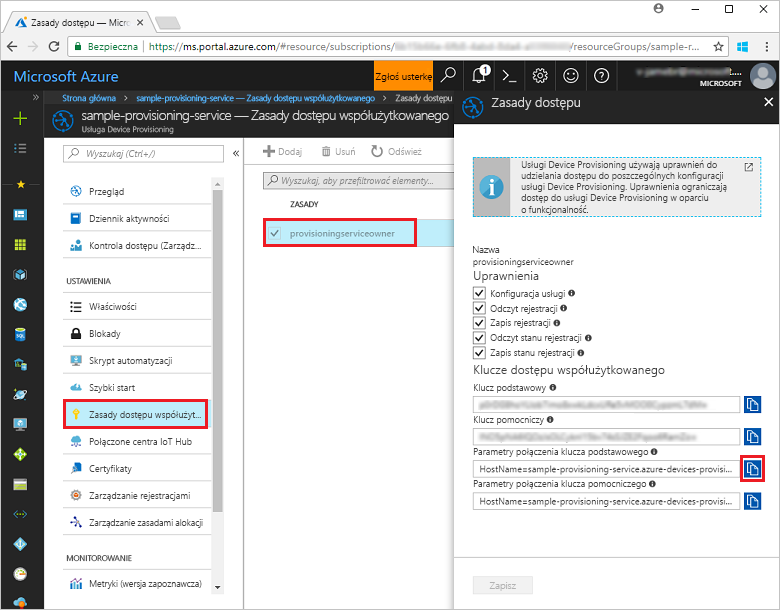
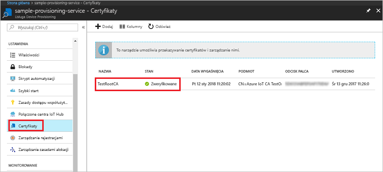
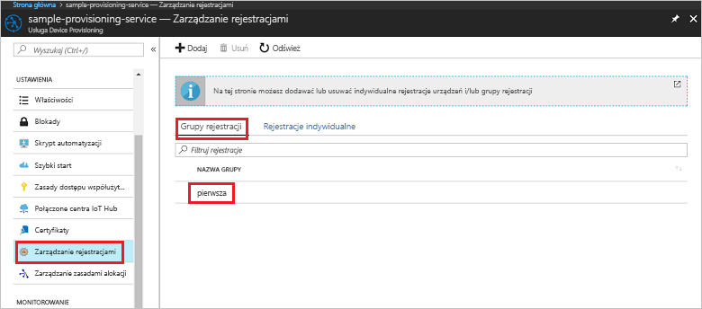

# <a name="quickstart-enroll-x509-devices-to-the-device-provisioning-service-using-nodejs"></a>Przewodnik Szybki start: rejestrowanie urządzeń X.509 w usłudze Device Provisioning Service przy użyciu środowiska Node.js

[!INCLUDE [iot-dps-selector-quick-enroll-device-x509](../../includes/iot-dps-selector-quick-enroll-device-x509.md)]

Ten przewodnik szybki Start przedstawia sposób użycia środowiska Node.js w celu programowego utworzenia [grupy rejestracji](concepts-service.md#enrollment-group), która będzie używać certyfikatów X.509 pośredniego lub głównego urzędu certyfikacji. Grupa rejestracji jest tworzona przy użyciu [zestawu SDK usługi IoT dla środowiska Node.js](https://github.com/Azure/azure-iot-sdk-node) oraz przykładowej aplikacji Node.js. Grupa rejestracji steruje dostępem do usługi aprowizacji dla urządzeń, które mają wspólny certyfikat podpisywania w swoim łańcuchu certyfikatów. Aby dowiedzieć się więcej, zobacz [Sterowanie dostępem urządzenia do usługi aprowizacji za pomocą certyfikatów X.509](./concepts-security.md#controlling-device-access-to-the-provisioning-service-with-x509-certificates). Aby uzyskać więcej informacji na temat używania infrastruktury kluczy publicznych opartej na certyfikatach X.509 z usługą Azure IoT Hub i Device Provisioning, zobacz [Omówienie zabezpieczeń certyfikatu X.509 urzędu certyfikacji](https://docs.microsoft.com/azure/iot-hub/iot-hub-x509ca-overview). 

Ten przewodnik Szybki start zakłada, że utworzono już wystąpienie usług IoT Hub i Device Provisioning Service. Jeżeli nie utworzono jeszcze tych zasobów, ukończ przewodnik Szybki start [Konfigurowanie usługi IoT Hub Device Provisioning Service przy użyciu witryny Azure Portal](./quick-setup-auto-provision.md) przed dalszą lekturą tego artykułu.

Mimo że kroki opisane w tym artykule działają zarówno na maszynach z systemem Windows, jak i Linux, ten artykuł został opracowany dla maszyny deweloperskiej z systemem Windows.

[!INCLUDE [quickstarts-free-trial-note](../../includes/quickstarts-free-trial-note.md)]


## <a name="prerequisites"></a>Wymagania wstępne

- Zainstaluj [środowisko Node.js w wersji 4.0 lub nowszej](https://nodejs.org).
- [Zainstaluj oprogramowanie Git](https://git-scm.com/download/).


## <a name="prepare-test-certificates"></a>Przygotowywanie certyfikatów testowych

Na potrzeby tego przewodnika Szybki start musisz mieć plik pem lub cer, który zawiera publiczną część certyfikatu X.509 pośredniego lub głównego urzędu certyfikacji. Ten certyfikat musi zostać przekazany do usługi aprowizacji i zweryfikowany przez usługę. 

[Zestaw SDK języka C usługi Azure IoT](https://github.com/Azure/azure-iot-sdk-c) zawiera narzędzia testowe, które mogą ułatwić tworzenie łańcucha certyfikatów X.509, przekazywanie certyfikatu głównego lub pośredniego z tego łańcucha oraz wykonywanie operacji dowodu posiadania w usłudze w celu weryfikacji certyfikatu. Certyfikaty utworzone za pomocą narzędzi zestawu SDK są przeznaczone tylko do użycia na potrzeby **testowania podczas programowania**. Te certyfikaty **nie mogą być stosowane w produkcji**. Zawierają one zapisane na stałe hasła („1234”), które wygasają po 30 dniach. Informacje na temat uzyskiwania certyfikatów odpowiednich do użycia w produkcji znajdują się w artykule [Jak uzyskać certyfikat X.509 urzędu certyfikacji](https://docs.microsoft.com/azure/iot-hub/iot-hub-x509ca-overview#how-to-get-an-x509-ca-certificate) w dokumentacji usługi Azure IoT Hub.

Aby użyć tych narzędzi testowych do wygenerowania certyfikatów, wykonaj następujące kroki: 
 
1. Otwórz wiersz polecenia lub powłokę Git Bash i przejdź do folderu roboczego na swojej maszynie. Wykonaj następujące polecenie, aby sklonować repozytorium GitHub [zestawu SDK języka C usługi IoT Azure](https://github.com/Azure/azure-iot-sdk-c):
    
   ```cmd/sh
   git clone https://github.com/Azure/azure-iot-sdk-c.git --recursive
   ```

   Należy się spodziewać, że ukończenie operacji potrwa kilka minut.

   Narzędzia testowe znajdują się w folderze *azure-iot-sdk-c/tools/CACertificates* sklonowanego repozytorium.    

2. Postępuj zgodnie z instrukcjami opisanymi w artykule [Zarządzanie certyfikatami testowymi urzędu certyfikacji na potrzeby przykładów i samouczków](https://github.com/Azure/azure-iot-sdk-c/blob/master/tools/CACertificates/CACertificateOverview.md). 


## <a name="create-the-enrollment-group-sample"></a>Tworzenie przykładowej grupy rejestracji 

 
1. Z poziomu okna polecenia w folderze roboczym uruchom następujące polecenie:
  
     ```cmd\sh
     npm install azure-iot-provisioning-service
     ```  

2. Za pomocą edytora tekstu utwórz plik **create_enrollment_group.js** w folderze roboczym. Dodaj następujący kod do pliku i zapisz go:

    ```
    'use strict';
    var fs = require('fs');

    var provisioningServiceClient = require('azure-iot-provisioning-service').ProvisioningServiceClient;

    var serviceClient = provisioningServiceClient.fromConnectionString(process.argv[2]);

    var enrollment = {
      enrollmentGroupId: 'first',
      attestation: {
        type: 'x509',
        x509: {
          signingCertificates: {
            primary: {
              certificate: fs.readFileSync(process.argv[3], 'utf-8').toString()
            }
          }
        }
      },
      provisioningStatus: 'disabled'
    };

    serviceClient.createOrUpdateEnrollmentGroup(enrollment, function(err, enrollmentResponse) {
      if (err) {
        console.log('error creating the group enrollment: ' + err);
      } else {
        console.log("enrollment record returned: " + JSON.stringify(enrollmentResponse, null, 2));
        enrollmentResponse.provisioningStatus = 'enabled';
        serviceClient.createOrUpdateEnrollmentGroup(enrollmentResponse, function(err, enrollmentResponse) {
          if (err) {
            console.log('error updating the group enrollment: ' + err);
          } else {
            console.log("updated enrollment record returned: " + JSON.stringify(enrollmentResponse, null, 2));
          }
        });
      }
    });
    ```

## <a name="run-the-enrollment-group-sample"></a>Uruchamianie przykładowej grupy rejestracji
 
1. Do uruchomienia przykładu będą potrzebne parametry połączenia usługi aprowizacji. 
    1. Zaloguj się w witrynie Azure Portal, kliknij przycisk **Wszystkie zasoby** w menu po lewej stronie i otwórz swoją usługę Device Provisioning. 
    2. Kliknij pozycję **Zasady dostępu współużytkowanego**, a następnie kliknij odpowiednie zasady dostępu, aby otworzyć ich właściwości. W oknie **Zasady dostępu** skopiuj i zanotuj parametry połączenia klucza podstawowego. 

        


3. Jak określono w [przygotowaniu certyfikatów testowych](quick-enroll-device-x509-node.md#prepare-test-certificates), potrzebny będzie także plik pem zawierający certyfikat X.509 pośredniego lub głównego urzędu certyfikacji, który został wcześniej przesłany do usługi aprowizacji i przez nią zweryfikowany. Aby sprawdzić, czy certyfikat został przekazany i zweryfikowany, kliknij pozycję **Certyfikaty** na stronie podsumowania usługi Device Provisioning w witrynie Azure Portal. Znajdź certyfikat, którego chcesz używać na potrzeby rejestracji grupowej, i upewnij się, że jego stan ma wartość *zweryfikowany*.

     

1. Aby utworzyć grupę rejestracji dla certyfikatu, uruchom następujące polecenie (z uwzględnieniem cudzysłowów wokół argumentów polecenia):
 
     ```cmd\sh
     node create_enrollment_group.js "<the connection string for your provisioning service>" "<your certificate's .pem file>"
     ```
 
3. Po pomyślnym utworzeniu nowej grupy rejestracji w oknie polecenia zostaną wyświetlone jej właściwości.

     

4. Upewnij się, że grupa rejestracji została utworzona. W witrynie Azure Portal w bloku podsumowania usługi Device Provisioning wybierz pozycję **Zarządzaj rejestracjami**. Wybierz kartę **Grupy rejestracji** i upewnij się, że obecny jest nowy wpis rejestracji (*pierwszy*).

     
 
## <a name="clean-up-resources"></a>Oczyszczanie zasobów
Jeśli planujesz eksplorować przykłady środowiska Node.js, nie usuwaj zasobów utworzonych w tym przewodniku Szybki start. Jeśli nie planujesz kontynuować pracy, wykonaj poniższe kroki, aby usunąć wszystkie zasoby platformy Azure utworzone w ramach tego przewodnika Szybki start.
 
1. Zamknij okno danych wyjściowych przykładu środowiska Node.js na swojej maszynie.
2. Navigate to your Device Provisioning service in the Azure portal, click **Manage enrollments**, and then select the **Enrollment Groups** tab. Select the *Registration ID* for the enrollment entry you created using this Quickstart and click the **Delete** button at the top of the blade.  
3. Z poziomu usługi Device Provisioning kliknij pozycję **Certyfikaty**, kliknij certyfikat przekazany w ramach tego przewodnika Szybki start, a następnie kliknij przycisk **Usuń** w górnej części okna **Szczegóły certyfikatu**.  
 
## <a name="next-steps"></a>Następne kroki
W tym przewodniku Szybki start utworzono rejestrację grupową dla pośredniego lub głównego certyfikatu X.509 urzędu certyfikacji przy użyciu usługi Azure IoT Hub Device Provisioning. Aby uzyskać dokładne informacje na temat aprowizowania urządzeń, przejdź do samouczka poświęconego konfiguracji usługi Device Provisioning Service w witrynie Azure portal. 
 
> [!div class="nextstepaction"]
> [Samouczki dla usługi Azure IoT Hub Device Provisioning Service](./tutorial-set-up-cloud.md)