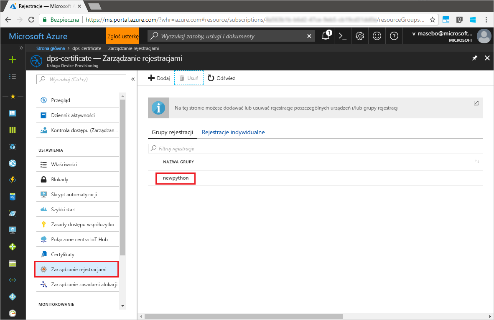

# <a name="quickstart-enroll-x509-devices-to-the-device-provisioning-service-using-python"></a>Szybki start: rejestrowanie urządzeń X.509 w usłudze Device Provisioning przy użyciu języka Python

[!INCLUDE [iot-dps-selector-quick-enroll-device-x509](../../includes/iot-dps-selector-quick-enroll-device-x509.md)]

Urządzenia są rejestrowane w wystąpieniu usługi aprowizacji przez utworzenie [grupy rejestracji](concepts-service.md#enrollment-group) lub za pomocą [rejestracji indywidualnej](concepts-service.md#individual-enrollment). Ten przewodnik szybki Start przedstawia sposób użycia języka Python w celu programowego utworzenia [grupy rejestracji](concepts-service.md#enrollment-group), która będzie używać certyfikatów pośrednich lub certyfikatów X.509 głównego urzędu certyfikacji. Grupa rejestracji steruje dostępem do usługi aprowizacji dla urządzeń, które mają wspólny certyfikat podpisywania w swoim łańcuchu certyfikatów. Grupa rejestracji jest tworzona przy użyciu [zestawu SDK usługi aprowizacji języka Python](https://github.com/Azure/azure-iot-sdk-python/tree/master/provisioning_service_client) i przykładowej aplikacji w języku Python. Obsługa tworzenia rejestracji indywidualnych za pomocą *zestawu SDK usługi aprowizacji języka Python* jest w toku. Aby dowiedzieć się więcej, zobacz [Sterowanie dostępem urządzenia do usługi aprowizacji za pomocą certyfikatów X.509](./concepts-security.md#controlling-device-access-to-the-provisioning-service-with-x509-certificates). Aby uzyskać więcej informacji na temat używania infrastruktury kluczy publicznych opartej na certyfikatach X.509 z usługą Azure IoT Hub i Device Provisioning, zobacz [Omówienie zabezpieczeń certyfikatu X.509 urzędu certyfikacji](https://docs.microsoft.com/azure/iot-hub/iot-hub-x509ca-overview).

Ten przewodnik Szybki start zakłada, że utworzono już wystąpienie usług IoT Hub i Device Provisioning Service. Jeżeli nie utworzono jeszcze tych zasobów, ukończ przewodnik Szybki start [Konfigurowanie usługi IoT Hub Device Provisioning Service przy użyciu witryny Azure Portal](./quick-setup-auto-provision.md) przed dalszą lekturą tego artykułu.

Mimo że kroki opisane w tym artykule działają zarówno na maszynach z systemem Windows, jak i Linux, ten artykuł został opracowany dla maszyny deweloperskiej z systemem Windows.

[!INCLUDE [quickstarts-free-trial-note](../../includes/quickstarts-free-trial-note.md)]


## <a name="prerequisites"></a>Wymagania wstępne

- Zainstaluj język [Python 2.x lub 3.x](https://www.python.org/downloads/). Upewnij się, że używasz 32-bitowej lub 64-bitowej instalacji zgodnie z wymaganiami konfiguracji. Po wyświetleniu monitu podczas instalacji upewnij się, że język Python został dodany do zmiennych środowiskowych specyficznych dla platformy.
- [Zainstaluj lub uaktualnij *pip* — system zarządzania pakietami języka Python](https://pip.pypa.io/en/stable/installing/).
- [Zainstaluj oprogramowanie Git](https://git-scm.com/download/).


## <a name="prepare-test-certificates"></a>Przygotowywanie certyfikatów testowych

Na potrzeby tego przewodnika Szybki start musisz mieć plik pem lub cer, który zawiera publiczną część certyfikatu X.509 pośredniego lub głównego urzędu certyfikacji. Ten certyfikat musi zostać przekazany do usługi aprowizacji i zweryfikowany przez usługę. 

[Zestaw SDK języka C usługi Azure IoT](https://github.com/Azure/azure-iot-sdk-c) zawiera narzędzia testowe, które mogą ułatwić tworzenie łańcucha certyfikatów X.509, przekazywanie certyfikatu głównego lub pośredniego z tego łańcucha oraz wykonywanie operacji dowodu posiadania w usłudze w celu weryfikacji certyfikatu. Certyfikaty utworzone za pomocą narzędzi zestawu SDK są przeznaczone tylko do użycia na potrzeby **testowania podczas programowania**. Te certyfikaty **nie mogą być stosowane w produkcji**. Zawierają one zapisane na stałe hasła („1234”), które wygasają po 30 dniach. Informacje na temat uzyskiwania certyfikatów odpowiednich do użycia w produkcji znajdują się w artykule [Jak uzyskać certyfikat X.509 urzędu certyfikacji](https://docs.microsoft.com/azure/iot-hub/iot-hub-x509ca-overview#how-to-get-an-x509-ca-certificate) w dokumentacji usługi Azure IoT Hub.

Aby użyć tych narzędzi testowych do wygenerowania certyfikatów, wykonaj następujące kroki: 
 
1. Otwórz wiersz polecenia lub powłokę Git Bash i przejdź do folderu roboczego na swojej maszynie. Wykonaj następujące polecenie, aby sklonować repozytorium GitHub [zestawu SDK języka C usługi IoT Azure](https://github.com/Azure/azure-iot-sdk-c):
    
   ```cmd/sh
   git clone https://github.com/Azure/azure-iot-sdk-c.git --recursive
   ```

   Należy się spodziewać, że ukończenie operacji potrwa kilka minut.

   Narzędzia testowe znajdują się w folderze *azure-iot-sdk-c/tools/CACertificates* sklonowanego repozytorium.    

2. Postępuj zgodnie z instrukcjami opisanymi w artykule [Zarządzanie certyfikatami testowymi urzędu certyfikacji na potrzeby przykładów i samouczków](https://github.com/Azure/azure-iot-sdk-c/blob/master/tools/CACertificates/CACertificateOverview.md). 


## <a name="modify-the-python-sample-code"></a>Modyfikowanie przykładowego kodu w języku Python

W tej sekcji przedstawiono sposób dodawania szczegółów aprowizacji urządzenia X.509 do przykładowego kodu. 

1. Przy użyciu edytora tekstów utwórz nowy plik **EnrollmentGroup.py**.

1. Dodaj następujące instrukcje `import` i zmienne na początku pliku **EnrollmentGroup.py**. Następnie zastąp element `dpsConnectionString` parametrami połączenia zawartymi w **zasadach dostępu współużytkowanego** usługi **Device Provisioning Service** w witrynie **Azure Portal**. Zastąp symbol zastępczy certyfikatu certyfikatem utworzonym wcześniej w kroku [Przygotowywanie certyfikatów testowych](quick-enroll-device-x509-python.md#prepare-test-certificates). Na koniec utwórz unikatowy identyfikator `registrationid` i upewnij się, że zawiera on wyłącznie małe litery, cyfry i łączniki.  
   
    ```python
    from provisioningserviceclient import ProvisioningServiceClient
    from provisioningserviceclient.models import EnrollmentGroup, AttestationMechanism

    CONNECTION_STRING = "{dpsConnectionString}"

    SIGNING_CERT = """-----BEGIN CERTIFICATE-----
    XXXXXXXXXXXXXXXXXXXXXXXXXXXXXXXXXXXXXXXXXXXXXXXXXXXXXXXXXXXXXXXX
    XXXXXXXXXXXXXXXXXXXXXXXXXXXXXXXXXXXXXXXXXXXXXXXXXXXXXXXXXXXXXXXX
    XXXXXXXXXXXXXXXXXXXXXXXXXXXXXXXXXXXXXXXXXXXXXXXXXXXXXXXXXXXXXXXX
    XXXXXXXXXXXXXXXXXXXXXXXXXXXXXXXXXXXXXXXXXXXXXXXXXXXXXXXXXXXXXXXX
    XXXXXXXXXXXXXXXXXXXXXXXXXXXXXXXXXXXXXXXXXXXXXXXXXXXXXXXXXXXXXXXX
    XXXXXXXXXXXXXXXXXXXXXXXXXXXXXXXXXXXXXXXXXXXXXXXXXXXXXXXXXXXXXXXX
    XXXXXXXXXXXXXXXXXXXXXXXXXXXXXXXXXXXXXXXXXXXXXXXXXXXXXXXXXXXXXXXX
    XXXXXXXXXXXXXXXXXXXXXXXXXXXXXXXXXXXXXXXXXXXXXXXXXXXXXXXXXXXXXXXX
    XXXXXXXXXXXXXXXXXXXXXXXXXXXXXXXXXXXXXXXXXXXXXXXXXXXXXXXXXXXXXXXX
    XXXXXXXXXXXXXXXXXXXXXXXXXXXXXXXXXXXXXXXXXXXXXXXXXXXXXXXXXXXXXXXX
    XXXXXXXXXXXXXXXXXXXXXXXXXXXXXXXXXXXXXXXXXXXXXXXXXXXXXXXXXXXXXXXX
    XXXXXXXXXXXXXXXXXXXXXXXXXXXXXXXXXXXXXXXXXXXXXXXXXXXXXXXXXXXXXXXX
    XXXXXXXXXXXXXXXXXXXXXXXXXXXXXXXXXXXXXXXXXXXXXXXXXXXXXXXXXXXXXXXX
    XXXXXXXXXXXXXXXXXXXXXXXXXXXXXXXXXXXXXXXXXXXXXXXXXXXXXXXXXXXXXXXX
    XXXXXXXXXXXXXXXXXXXXXXXXXXXXXXXXXXXXXXXXXXXXXXXXXXXXXXXX
    -----END CERTIFICATE-----"""

    GROUP_ID = "{registrationid}"
    ```

1. Dodaj następującą funkcję i wywołanie funkcji w celu zaimplementowania tworzenia rejestracji grupowej:
   
    ```python
    def main():
        print ( "Initiating enrollment group creation..." )

        psc = ProvisioningServiceClient.create_from_connection_string(CONNECTION_STRING)
        att = AttestationMechanism.create_with_x509_signing_certs(SIGNING_CERT)
        eg = EnrollmentGroup.create(GROUP_ID, att)

        eg = psc.create_or_update(eg)
    
        print ( "Enrollment group created." )

    if __name__ == '__main__':
        main()
    ```

1. Zapisz i zamknij plik **EnrollmentGroup.py**.
 

## <a name="run-the-sample-group-enrollment"></a>Uruchamianie przykładowej rejestracji grupowej

1. Otwórz wiersz polecenia i uruchom następujące polecenie w celu zainstalowania klienta [azure-iot-provisioning-device-client](https://pypi.org/project/azure-iot-provisioning-device-client).

    ```cmd/sh
    pip install azure-iothub-provisioningserviceclient    
    ```

2. W wierszu polecenia uruchom skrypt.

    ```cmd/sh
    python EnrollmentGroup.py
    ```

3. Sprawdź poprawność rejestracji w danych wyjściowych.

4. Przejdź do usługi aprowizacji w witrynie Azure Portal. Kliknij pozycję **Zarządzanie rejestracjami**. Zauważ, że grupa urządzeń X.509 jest wyświetlana na karcie **Grupy rejestracji** z nazwą `registrationid` utworzoną wcześniej. 

      


## <a name="clean-up-resources"></a>Oczyszczanie zasobów
Jeśli planujesz eksplorować przykładową usługę Java, nie usuwaj zasobów utworzonych w tym przewodniku Szybki start. Jeśli nie planujesz kontynuować pracy, wykonaj poniższe kroki, aby usunąć wszystkie zasoby utworzone w ramach tego przewodnika Szybki start.

1. Zamknij okno danych wyjściowych przykładowej usługi Java na swojej maszynie.
1. Zamknij okno _Generator certyfikatów X509_ na swojej maszynie.
1. Przejdź do usługi Device Provisioning w witrynie Azure Portal, kliknij pozycję **Zarządzanie rejestracjami**, a następnie wybierz kartę **Grupy rejestracji**. Wybierz *NAZWĘ GRUPY* urządzeń X.509 zarejestrowanych w ramach tego przewodnika Szybki start i kliknij przycisk **Usuń** u góry bloku.  


## <a name="next-steps"></a>Kolejne kroki
W tym przewodniku Szybki start zarejestrowano symulowaną grupę urządzeń X.509 w usłudze Device Provisioning. Aby uzyskać dokładne informacje na temat aprowizowania urządzeń, przejdź do samouczka poświęconego konfiguracji usługi Device Provisioning Service w witrynie Azure portal. 

> [!div class="nextstepaction"]
> [Samouczki dla usługi Azure IoT Hub Device Provisioning Service](./tutorial-set-up-cloud.md)
