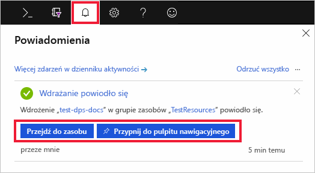
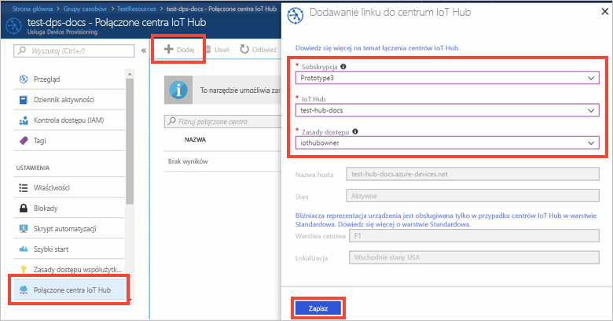

# Szybki start: konfigurowanie usługi inicjowania obsługi administracyjnej urządzeń w centrum Usługi IoT za pomocą witryny Azure portal

Usługi inicjowania obsługi administracyjnej urządzeń usługi IoT Hub można używać z Usługą IoT Hub, aby umożliwić obsługę obsługi administracyjnej typu "tylko w czasie" dla żądanego centrum IoT bez konieczności interwencji człowieka, umożliwiając klientom aprowizowanie milionów urządzeń IoT w bezpieczny i skalowalny sposób. Usługa inicjowania obsługi administracyjnej urządzeń usługi Azure IoT Hub obsługuje urządzenia IoT z uwierzytelnianiem certyfikatów TPM, kluczem symetrycznym i uwierzytelnianiem certyfikatów X.509. Aby uzyskać więcej informacji, zapoznaj się z [omówieniem usługi inicjowania obsługi urządzeń usługi IoT Hub](./about-iot-dps.md)

W tym przewodniku Szybki start dowiesz się, jak skonfigurować usługę inicjowania obsługi administracyjnej urządzeń usługi Usługi obsługi klienta usługi IoT Hub w witrynie Azure Portal w celu inicjowania obsługi administracyjnej urządzeń w następujących krokach:
> [!div class="checklist"]
> * Tworzenie centrum IoT Hub za pomocą portalu Azure
> * Użycie witryny Azure Portal do utworzenia usługi IoT Hub Device Provisioning i pobrania zakresu identyfikatorów
> * Połączenie centrum IoT z usługą Device Provisioning

Jeśli nie masz subskrypcji platformy Azure, utwórz [bezpłatne konto](https://azure.microsoft.com/free/?WT.mc_id=A261C142F) przed rozpoczęciem.

## Tworzenie centrum IoT Hub

[!INCLUDE [iot-hub-include-create-hub](../../includes/iot-hub-include-create-hub.md)]

## Tworzenie nowej usługi inicjowania obsługi administracyjnej urządzeń w centrum IoT

1. Ponownie wybierz przycisk **+ Utwórz zasób.**

2. *Wyszukaj w portalu Marketplace* **usługę inicjowania obsługi administracyjnej urządzeń**. Wybierz pozycję **Usługa inicjowania obsługi administracyjnej urządzeń w centrum IoT** i naciśnij przycisk **Utwórz.** 

3. Podaj następujące informacje dotyczące nowego wystąpienia usługi inicjowania obsługi administracyjnej urządzeń i naciśnij przycisk **Utwórz**.

    * **Nazwa:** Podaj unikatową nazwę dla nowego wystąpienia usługi inicjowania obsługi administracyjnej urządzeń. Jeśli wprowadzona nazwa jest dostępna, zostanie wyświetlony zielony znacznik wyboru.
    * **Subskrypcja:** Wybierz subskrypcję, której chcesz użyć do utworzenia tego wystąpienia usługi inicjowania obsługi administracyjnej urządzeń.
    * **Grupa zasobów:** w tym polu możesz utworzyć nową grupę zasobów lub wybrać istniejącą grupę, w której ma znajdować się nowe wystąpienie. Wybierz tę grupę zasobów, w której znajduje się utworzone wcześniej centrum IoT Hub, na przykład **TestResources**. Dzięki umieszczeniu wszystkich powiązanych zasobów w jednej grupie można nimi zarządzać jednocześnie. Na przykład usunięcie grupy zasobów powoduje usunięcie wszystkich zasobów w tej grupie. Aby uzyskać więcej informacji, zobacz [Zarządzanie grupami zasobów usługi Azure Resource Manager](../azure-resource-manager/management/manage-resource-groups-portal.md).
    * **Lokalizacja:** Wybierz najbliższą lokalizację urządzeń.

        

4. Wybierz przycisk powiadomień, aby monitorować tworzenie wystąpienia zasobu. Po pomyślnym wdrożeniu usługi wybierz pozycję **Przypnij do pulpitu nawigacyjnego**, a następnie **przejdź do zasobu**.

    

## Łączenie centrum IoT i usługi inicjowania obsługi urządzeń

W tej sekcji zostanie dodana konfiguracja do wystąpienia usługi inicjowania obsługi administracyjnej urządzeń. Ta konfiguracja określa centrum IoT Hub, dla którego będą aprowizowane urządzenia.

1. Wybierz przycisk **Wszystkie zasoby** z menu po lewej stronie witryny Azure portal. Wybierz wystąpienie usługi Device Provisioning Service utworzone we wcześniejszej sekcji. 

    Jeśli menu jest skonfigurowane przy użyciu funkcji **wysuwania** zamiast trybu **zadokowanego** w ustawieniach portalu, należy kliknąć 3 linie w lewym górnym rogu, aby otworzyć menu portalu po lewej stronie.  

2. Z menu Usługi aprowizacji urządzeń wybierz pozycję **Połączone centra IoT**. Naciśnij przycisk **+ Dodaj** widoczny u góry. 

3. Na stronie **Dodaj łącze do centrum IoT** podaj następujące informacje, aby połączyć nowe wystąpienie usługi inicjowania obsługi administracyjnej urządzeń z centrum IoT hub. Następnie naciśnij **zapisz**. 

    * **Subskrypcja:** Wybierz subskrypcję zawierającą centrum IoT hub, który chcesz połączyć z nowym wystąpieniem usługi inicjowania obsługi administracyjnej urządzeń.
    * **Piasta Iot:** Wybierz centrum IoT, aby połączyć się z nowym wystąpieniem usługi inicjowania obsługi administracyjnej urządzeń.
    * **Zasady dostępu:** wybierz **iothubowner** jako poświadczenia do nawiązania połączenia z centrum IoT Hub.  

        

3. Teraz wybrane centrum powinno być widoczne w bloku **Powiązane centra IoT**. Może być konieczne **naciśnięcie przycisku Odśwież,** aby się okazało.

## Oczyszczanie zasobów

Inne przewodniki Szybki start w tej kolekcji bazują na tym przewodniku. Jeśli planujesz kontynuować pracę z kolejnymi przewodnikami Szybki start lub samouczkami, nie usuwaj zasobów utworzonych w tym przewodniku Szybki start. Jeśli nie planujesz kontynuować pracy, wykonaj następujące czynności, aby usunąć wszystkie zasoby utworzone w witrynie Azure Portal w ramach tego przewodnika Szybki start.

1. Z menu po lewej stronie w witrynie Azure portal wybierz **pozycję Wszystkie zasoby,** a następnie wybierz usługę inicjowania obsługi administracyjnej urządzeń. U góry okienka szczegółów urządzenia wybierz pozycję **Usuń**.  
2. Z menu po lewej stronie w witrynie Azure portal wybierz **pozycję Wszystkie zasoby,** a następnie wybierz centrum IoT Hub. U góry okienka szczegółów koncentratora wybierz pozycję **Usuń**.  

## Następne kroki

W tym przewodniku Szybki start wdrożono centrum IoT hub i wystąpienie usługi inicjowania obsługi administracyjnej urządzeń i połączono te dwa zasoby. Aby dowiedzieć się, jak użyć tej konfiguracji do aprowizowania symulowanego urządzenia, przejdź do przewodnika Szybki start w celu utworzenia symulowanego urządzenia.

> [!div class="nextstepaction"]
> [Szybki start w celu utworzenia symulowanego urządzenia](./quick-create-simulated-device-symm-key.md)
