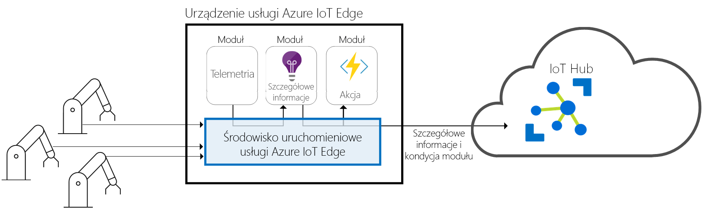
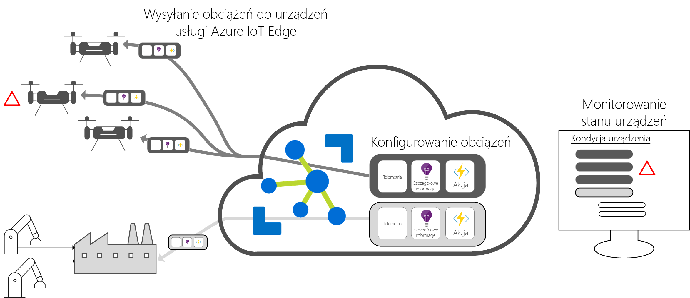

# Co to jest usługa Azure IoT Edge

Usługa IoT Edge przenosi analizę w chmurze i niestandardową logikę biznesową na urządzenia, aby Twoja organizacja mogła skoncentrować się na szczegółowych informacjach dotyczących działalności zamiast na zarządzaniu danymi. Skalowanie w poziomie rozwiązania IoT upakowanie logikę biznesową do standardowych kontenerów, a następnie można wdrażanie tych kontenerów na dowolnych urządzeniach i monitorować je wszystkie z chmury. 

Dzięki analizie wzrasta wartość biznesowa w rozwiązaniach IoT, ale nie wszystkie operacje analizy muszą być wykonywane w chmurze. Jeśli chcesz reagować na sytuacje awaryjne tak szybko, jak to możliwe, można uruchomić obciążeń wykrywania anomalii na urządzeniach brzegowych. Chcesz obniżyć koszty przepustowości i uniknąć przesyłania terabajtów danych pierwotnych, można wyczyścić i agregować dane lokalnie następnie Wysyłaj tylko wgląd w dane do chmury na potrzeby analizy. 

Usługa Azure IoT Edge obejmuje trzy składniki:
* **Moduły usługi IoT Edge** to kontenery, które uruchamiania usług platformy Azure, usługi innych firm lub Twój własny kod. Moduły są wdrażane na urządzeniach usługi IoT Edge i wykonywane lokalnie na tych urządzeniach. 
* **Środowisko uruchomieniowe usługi IoT Edge** działa na każdym urządzeniu usługi IoT Edge i zarządza nimi moduły wdrożone do każdego urządzenia. 
* A **interfejsu opartego na chmurze** umożliwia zdalne monitorowanie i zarządzanie urządzeniami usługi IoT Edge.

>[!NOTE]
>Usługa Azure IoT Edge jest dostępna w warstwie Bezpłatna oraz Standardowa usługi IoT Hub. Warstwa Bezpłatna służy wyłącznie do testowania i oceny. Aby uzyskać więcej informacji na temat warstw Podstawowa i Standardowa, zobacz [Jak wybrać właściwą warstwę usługi IoT Hub](../iot-hub/iot-hub-scaling.md).

## Moduły usługi IoT Edge

Moduły usługi IoT Edge to jednostki wykonywania, zaimplementowane jako kontenery zgodne z platformą Docker, które uruchamiają logikę biznesową na urządzeniach brzegowych. Wiele modułów można skonfigurować do komunikowania się ze sobą i w ten sposób utworzyć potok przetwarzania danych. Aby zapewnić szczegółowe informacje w trybie offline i na urządzeniach brzegowych, możesz opracować moduły niestandardowe lub spakować niektóre usługi platformy Azure w moduły. 

### Sztuczna inteligencja na urządzeniach brzegowych

Usługa Azure IoT Edge pozwala na wdrożenie kompleksowego przetwarzania zdarzeń, uczenia maszynowego, rozpoznawania obrazów i innych możliwości SI o wysokiej wartości bez samodzielnego ich tworzenia. Usługi platformy Azure, takich jak Azure Functions, Azure Stream Analytics i Azure Machine Learning wszystkie można uruchomić w środowisku lokalnym za pomocą usługi Azure IoT Edge. Nie trzeba się ograniczać do usług platformy Azure, mimo że. Każdy może utworzyć moduły SI i udostępnić je społeczności do użycia za pośrednictwem witryny Azure Marketplace. 

### Model dostarczania własnego kodu

Usługa Azure IoT Edge obsługuje również wdrażanie własnego kodu na urządzeniach. Usługa Azure IoT Edge korzysta z tego samego modelu programowania co inne usługi Azure IoT. Ten sam kod można uruchomić na urządzeniu lub w chmurze. Usługa Azure IoT Edge obsługuje zarówno system Linux, jak i Windows, więc możesz tworzyć kod na wybraną platformę. Obsługiwane języki to Java, .NET Core 2.0, Node.js, C i Python, dzięki czemu deweloperzy mogą tworzyć kod w znanym języku i używać istniejącej logiki biznesowej.

## Środowisko uruchomieniowe usługi IoT Edge

Środowisko uruchomieniowe usługi Azure IoT Edge umożliwia stosowanie logiki niestandardowej i logiki w chmurze na urządzeniach usługi IoT Edge. Działa ono na urządzeniu usługi IoT Edge oraz wykonuje operacje zarządzania i komunikacji. Środowisko uruchomieniowe wykonuje kilka zadań:

* Instaluje i aktualizuje pakiety robocze na urządzeniu.
* Utrzymuje standardy zabezpieczeń usługi Azure IoT Edge na urządzeniu.
* Zapewnia nieprzerwane działanie modułów usługi IoT Edge.
* Przesyła raporty o kondycji modułów do chmury na potrzeby zdalnego monitorowania.
* Zarządza komunikacją między podrzędnymi urządzeniami liścia usługi IoT Edge, między modułami na urządzeniu usługi IoT Edge oraz między urządzeniem usługi IoT Edge a chmurą.

Sposób używania urządzenia usługi Azure IoT Edge zależy od Ciebie. Środowisko uruchomieniowe jest często używany do wdrażania funkcji SI w urządzenia bramy, które agregowanie i przetwarzanie danych z innych urządzeń lokalnych, ale ten model wdrażania wymaga tylko jedną opcję. 

Środowisko uruchomieniowe usługi Azure IoT Edge działa na wielu różnych urządzeniach IoT, aby umożliwić używanie go na wiele różnych sposobów. Obsługuje zarówno system operacyjny Linux, jak i Windows oraz tworzy abstrakcję szczegółów sprzętu. Jeśli nie jesteś przetwarzanie dużej ilości danych lub uruchamianie obciążeń intensywnie korzystających z zasobów przy użyciu serwera przemysłowego za pomocą urządzenia mniejszych niż Raspberry Pi 3.

## Interfejs chmurowy usługi IoT Edge

Jest trudne do zarządzania cyklem życia oprogramowania dla milionów urządzeń IoT, które są często różnych marek i modeli ani geograficznie rozproszone. Obciążenia są tworzone i skonfigurowany dla konkretnego typu urządzenia, wdrożone na wszystkich urządzeniach i monitorowane, aby wyłapywać nieprawidłowo funkcjonujące urządzenia. Tych działań nie można wykonywać dla poszczególnych urządzeń. Muszą być wykonywane na dużą skalę.

Usługa Azure IoT Edge bezproblemowo integruje się z akceleratorami rozwiązań Azure IoT w celu zapewnienia jednej warstwy kontroli na potrzeby rozwiązania. Usługi w chmurze umożliwiają:

* Tworzenie i konfigurowanie obciążeń do uruchamiania na określonym typie urządzenia.
* Wysyłanie obciążeń do zestawu urządzeń.
* Monitorowanie obciążeń działających na urządzeniach w terenie.

## Kolejne kroki

Wypróbuj te koncepcje w praktyce, [wdrażając usługę IoT Edge na symulowanym urządzeniu](quickstart.md).