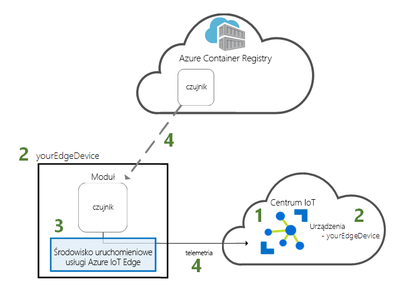
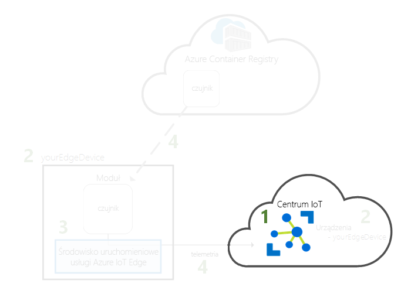
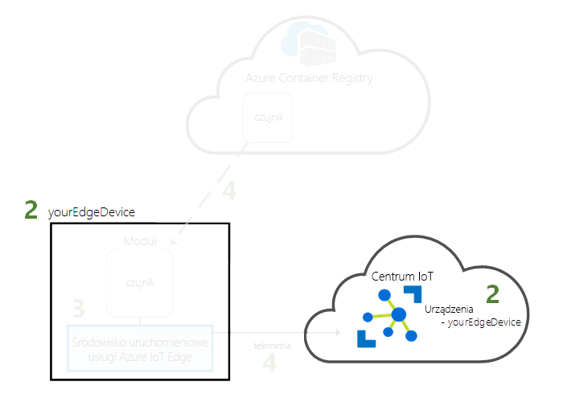
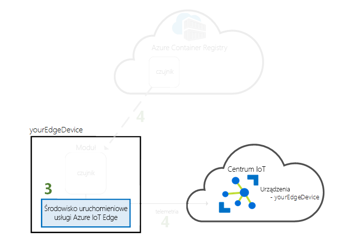
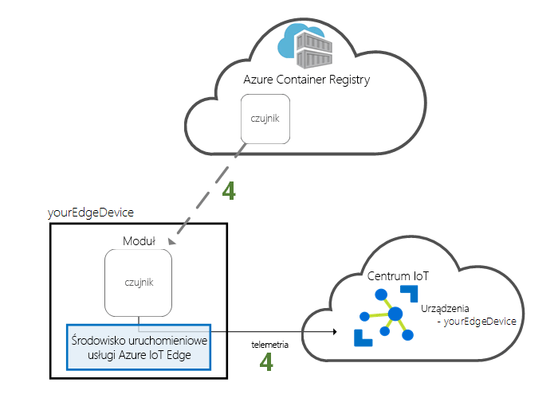

# <a name="quickstart-deploy-your-first-iot-edge-module-to-a-virtual-linux-device"></a>Quickstart: Deploy your first IoT Edge module to a virtual Linux device

Test out Azure IoT Edge in this quickstart by deploying containerized code to a virtual IoT Edge device. IoT Edge allows you to remotely manage code on your devices so that you can send more of your workloads to the edge. For this quickstart, we recommend using an Azure virtual machine for your IoT Edge device, which allows you to quickly create a test machine with all prerequisites installed and then delete it when you're finished. 

W tym przewodniku Szybki start zawarto informacje na temat wykonywania następujących czynności:

1. Tworzenie centrum IoT Hub.
2. Rejestrowanie urządzenia usługi IoT Edge w centrum IoT Hub.
3. Install and start the IoT Edge runtime on your virtual device.
4. Zdalne wdrażanie modułu na urządzeniu usługi IoT Edge.



This quickstart walks you through creating a Linux virtual machine that's configured to be IoT Edge device. Następnie wdrożysz modułu z witryny Azure Portal na swoim urządzeniu. Moduł wdrażany podczas pracy z tym przewodnikiem Szybki start to symulowany czujnik generujący dane dotyczące temperatury, wilgotności i ciśnienia. Z wykonanej tutaj pracy będziesz korzystać w pozostałych samouczkach usługi Azure IoT Edge, wdrażając moduły do analizy symulowanych danych na potrzeby biznesowe.

Jeśli nie masz aktywnej subskrypcji platformy Azure, przed rozpoczęciem utwórz [bezpłatne konto](https://azure.microsoft.com/free).

[!INCLUDE [cloud-shell-try-it.md](../../includes/cloud-shell-try-it.md)]

Podczas wykonywania wielu kroków tego przewodnika Szybki start jest używany interfejs wiersza polecenia platformy Azure, a usługa Azure IoT ma rozszerzenie umożliwiające włączenie dodatkowych funkcji.

Dodaj rozszerzenie usługi Azure IoT do wystąpienia powłoki chmury.

   ```azurecli-interactive
   az extension add --name azure-cli-iot-ext
   ```

## <a name="prerequisites"></a>Wymagania wstępne

Zasoby w chmurze:

* Grupa zasobów do zarządzania wszystkimi zasobami używanymi w tym przewodniku Szybki start.

   ```azurecli-interactive
   az group create --name IoTEdgeResources --location westus2
   ```

Urządzenie usługi IoT Edge:

* Urządzenie lub maszyna wirtualna z systemem Linux, która będzie działać jako urządzenie usługi IoT Edge. You should use the Microsoft-provided [Azure IoT Edge on Ubuntu](https://azuremarketplace.microsoft.com/marketplace/apps/microsoft_iot_edge.iot_edge_vm_ubuntu) virtual machine, which preinstalls everything you need to run IoT Edge on a device. Accept the terms of use and create this virtual machine using the following commands:

   ```azurecli-interactive
   az vm image accept-terms --urn microsoft_iot_edge:iot_edge_vm_ubuntu:ubuntu_1604_edgeruntimeonly:latest
   az vm create --resource-group IoTEdgeResources --name EdgeVM --image microsoft_iot_edge:iot_edge_vm_ubuntu:ubuntu_1604_edgeruntimeonly:latest --admin-username azureuser --generate-ssh-keys
   ```

   Utworzenie i uruchomienie nowej maszyny wirtualnej może zająć kilka minut.

   Podczas tworzenia nowej maszyny wirtualnej zanotuj wartość elementu **publicIpAddress**. Jest ona widoczna w danych wyjściowych polecenia create. Tego publicznego adresu IP użyjesz później w tym przewodniku Szybki start do nawiązania połączenia z maszyną wirtualną.

* If you prefer to run the Azure IoT Edge runtime on your own device, follow instructions at [Install the Azure IoT Edge runtime on Linux](how-to-install-iot-edge-linux.md).

## <a name="create-an-iot-hub"></a>Tworzenie centrum IoT Hub

Rozpocznij pracę z przewodnikiem Szybki start od utworzenia centrum IoT za pomocą interfejsu wiersza polecenia platformy Azure.



W tym przewodniku Szybki start wystarcza warstwa bezpłatna usługi IoT Hub. Jeśli w przeszłości używano usługi IoT Hub i masz już utworzone bezpłatne centrum, możesz używać tego centrum IoT Hub. Każda subskrypcja może zawierać tylko jedno bezpłatne centrum IoT Hub.

Poniższy kod tworzy bezpłatne centrum **F1** w grupie zasobów **IoTEdgeResources**. Zastąp nazwę *{hub_name}* unikatową nazwą centrum IoT Hub.

   ```azurecli-interactive
   az iot hub create --resource-group IoTEdgeResources --name {hub_name} --sku F1
   ```

   Jeśli wystąpi błąd, ponieważ w subskrypcji jest już jedno bezpłatne centrum, zmień jednostkę SKU na **S1**. Jeśli wystąpi błąd polegający na niedostępności nazwy centrum IoT Hub, oznacza to, że ktoś inny ma już centrum o takiej nazwie. Wypróbuj nową nazwę.

## <a name="register-an-iot-edge-device"></a>Rejestracja urządzenia usługi IoT Edge

Zarejestruj urządzenie usługi IoT Edge, korzystając z nowo utworzonego centrum IoT.



Utwórz tożsamość urządzenia dla urządzenia IoT Edge, aby umożliwić mu komunikowanie się z centrum IoT. Tożsamość urządzenia jest przechowywana w chmurze. Aby skojarzyć urządzenie fizyczne z tożsamością urządzenia, używane są unikatowe parametry połączenia.

Ponieważ urządzenia usługi IoT Edge zachowują się inaczej niż typowe urządzenia IoT, a także mogą być inaczej zarządzane, zadeklaruj tę tożsamość jako należącą do urządzenia usługi IoT Edge za pomocą flagi `--edge-enabled`.

1. W powłoce chmury platformy Azure wprowadź poniższe polecenie, aby utworzyć urządzenie o nazwie **myEdgeDevice** w swoim centrum.

   ```azurecli-interactive
   az iot hub device-identity create --hub-name {hub_name} --device-id myEdgeDevice --edge-enabled
   ```

   Jeśli wystąpi błąd dotyczący kluczy zasad iothubowner, upewnij się, że usługa Cloud Shell działa, bazując na najnowszej wersji rozszerzenia azure-cli-iot-ext.

2. Pobierz parametry połączenia danego urządzenia, które łączy urządzenie fizyczne z tożsamością w usłudze IoT Hub.

   ```azurecli-interactive
   az iot hub device-identity show-connection-string --device-id myEdgeDevice --hub-name {hub_name}
   ```

3. Skopiuj wartość klucza `connectionString` z danych wyjściowych JSON i zapisz ją. Ta wartość to parametry połączenia urządzenia. Za pomocą tych parametrów połączenia skonfigurujesz środowisko uruchomieniowe usługi IoT Edge w następnej sekcji.

   

## <a name="configure-your-iot-edge-device"></a>Konfigurowanie urządzenia usługi IoT Edge

Uruchom środowisko uruchomieniowe usługi Azure IoT Edge na urządzeniu usługi IoT Edge.



Środowisko uruchomieniowe usługi IoT Edge jest wdrażane na wszystkich urządzeniach usługi IoT Edge. Składa się ono z trzech składników. **Demon zabezpieczeń usługi IoT Edge** jest uruchamiany przy każdym uruchomieniu urządzenia IoT Edge przez rozpoczęcie działania agenta usługi IoT Edge. Agent usługi **IoT Edge** ułatwia wdrażanie i monitorowanie modułów na urządzeniu usługi IoT Edge, w tym centrum usługi IoT Edge. **Centrum usługi IoT Edge** zarządza komunikacją między modułami na urządzeniu usługi IoT Edge oraz między urządzeniem a usługą IoT Hub.

Podczas konfigurowania środowiska uruchomieniowego należy podać parametry połączenia urządzenia. Użyj parametrów pobranych za pomocą wiersza polecenia platformy Azure. Za pomocą tych parametrów urządzenie fizyczne jest kojarzone z tożsamością urządzenia usługi IoT Edge na platformie Azure.

### <a name="set-the-connection-string-on-the-iot-edge-device"></a>Ustawianie parametrów połączenia na urządzeniu usługi IoT Edge

If you're using the Azure IoT Edge on Ubuntu virtual machine as described in the prerequisites, then your device already has the IoT Edge runtime installed. Wystarczy skonfigurować urządzenie przy użyciu parametrów połączenia urządzenia pobranych w poprzedniej sekcji. Można to zrobić zdalnie bez konieczności nawiązywania połączenia z maszyną wirtualną. Uruchom następujące polecenie po zastąpieniu ciągu **{device_connection_string}** własnymi parametrami połączenia.

   ```azurecli-interactive
   az vm run-command invoke -g IoTEdgeResources -n EdgeVM --command-id RunShellScript --script "/etc/iotedge/configedge.sh '{device_connection_string}'"
   ```

If you're running IoT Edge on your local machine or an ARM32 or ARM64 device, you need to install the IoT Edge runtime and its prerequisites on your device. Follow the instructions in [Install the Azure IoT Edge runtime on Linux](how-to-install-iot-edge-linux.md), then return to this quickstart.

### <a name="view-the-iot-edge-runtime-status"></a>Wyświetlanie stanu środowiska uruchomieniowego usługi IoT Edge

Pozostałe polecenia w tym przewodniku Szybki start są wykonywane na samym urządzeniu usługi IoT Edge, dzięki czemu można zobaczyć, co dzieje się na urządzeniu. Jeśli używasz maszyny wirtualnej, połącz się z nią teraz, używając publicznego adresu IP z danych wyjściowych polecenia użytego do jej utworzenia. Publiczny adres IP możesz również znaleźć na stronie przeglądu swojej maszyny wirtualnej w witrynie Azure Portal. Użyj następującego polecenia, aby nawiązać połączenie z maszyną wirtualną. Zastąp ciąg **{azureuser}** , jeśli używasz innej nazwy użytkownika niż sugerowana w wymaganiach wstępnych. Zastąp ciąg **{publicIpAddress}** adresem swojej maszyny.

   ```azurecli-interactive
   ssh azureuser@{publicIpAddress}
   ```

Sprawdź, czy środowisko uruchomieniowe zostało pomyślnie zainstalowane i skonfigurowane na urządzeniu usługi IoT Edge.

>[!TIP]
>Uruchomienie poleceń `iotedge` wymaga podniesionych uprawnień. Po wylogowaniu się z komputera i ponownym zalogowaniu się do niego po raz pierwszy od zainstalowania środowiska uruchomieniowego usługi IoT Edge Twoje uprawnienia zostaną automatycznie zaktualizowane. Dopóki nie zostanie to zrobione, umieszczaj przedrostek **„sudo”** przed poleceniami.

1. Check to see that the IoT Edge security daemon is running as a system service.

   ```bash
   sudo systemctl status iotedge
   ```

   

2. Jeśli potrzebujesz rozwiązać problem z usługą, pobierz jej dzienniki.

   ```bash
   journalctl -u iotedge
   ```

3. Wyświetl moduły uruchomione na urządzeniu.

   ```bash
   sudo iotedge list
   ```

   

Urządzenie usługi IoT Edge jest teraz skonfigurowane. Jest ono gotowe do uruchamiania modułów wdrożonych w chmurze.

## <a name="deploy-a-module"></a>Wdrażanie modułu

Zarządzając urządzeniem usługi Azure IoT Edge z chmury, wdróż moduł przesyłający dane telemetryczne do centrum IoT Hub.


[!INCLUDE [iot-edge-deploy-module](../../includes/iot-edge-deploy-module.md)]

## <a name="view-generated-data"></a>Wyświetlanie wygenerowanych danych

W tym przewodniku Szybki start utworzono nowe urządzenie usługi IoT Edge i zainstalowano na nim środowisko uruchomieniowe usługi IoT Edge. Następnie użyto witryny Azure Portal do wdrożenia modułu usługi IoT Edge w celu uruchomienia go na urządzeniu bez konieczności wprowadzenia zmian na samym urządzeniu.

W tym przypadku wypchnięty moduł tworzy dane przykładowe, których można użyć na potrzeby testowania. Moduł symulowanego czujnika temperatury generuje dane środowiskowe, których można użyć do testowania później. Symulowany czujnik monitoruje maszynę i środowisko wokół maszyny. Na przykład ten czujnik może być umieszczony w serwerowni, w hali fabrycznej lub na turbinie wiatrowej. Komunikat zawiera temperaturę i wilgotność otoczenia, temperaturę maszyny, ciśnienie oraz znacznik czasu. W samouczkach usługi IoT Edge dane utworzone przez ten moduł są używane jako dane testowe do analizy.

Otwórz ponownie wiersz polecenia na urządzeniu usługi IoT Edge lub użyj połączenia SSH z interfejsu wiersza polecenia platformy Azure. Upewnij się, że moduł wdrożony z chmury jest uruchomiony na urządzeniu usługi IoT Edge:

   ```bash
   sudo iotedge list
   ```

   

Wyświetl komunikaty wysyłane z modułu czujnika temperatury:

   ```bash
   sudo iotedge logs SimulatedTemperatureSensor -f
   ```

   >[!TIP]
   >Przy odwoływaniu się do nazw modułów w poleceniach usługi IoT Edge jest rozróżniana wielkość liter.

   

Możesz również wyświetlić komunikaty odbierane przez centrum IoT Hub przy użyciu [rozszerzenia zestawu narzędzi usługi Azure IoT Hub dla programu Visual Studio Code](https://marketplace.visualstudio.com/items?itemName=vsciot-vscode.azure-iot-toolkit) (wcześniej nazywane rozszerzeniem zestawu narzędzi usługi Azure IoT).

## <a name="clean-up-resources"></a>Oczyszczanie zasobów

Jeśli chcesz przejść do samouczków dotyczących usługi IoT Edge, możesz użyć urządzenia, które zostało zarejestrowane i skonfigurowane w ramach tego przewodnika Szybki start. Otherwise, you can delete the Azure resources that you created to avoid charges.

Jeśli maszyna wirtualna i centrum IoT Hub zostały utworzone w nowej grupie zasobów, możesz usunąć tę grupę i wszystkie powiązane zasoby. Sprawdź dokładnie zawartość grupy zasobów, aby się upewnić, że nie ma w niej żadnych elementów, które chcesz zachować. Jeśli nie chcesz usuwać całej grupy, możesz usunąć poszczególne zasoby.

Usuń grupę **IoTEdgeResources**.

```azurecli-interactive
az group delete --name IoTEdgeResources
```

## <a name="next-steps"></a>Następne kroki


W tym przewodniku Szybki start utworzono urządzenie usługi IoT Edge i wdrożono na nim kod przy użyciu interfejsu usługi Azure IoT Edge w chmurze. Masz teraz urządzenie testowe generujące dane pierwotne dotyczące jego otoczenia.

The next step is to set up your local development environment so that you can start creating IoT Edge modules that run your business logic. 

> [!div class="nextstepaction"]
> [Start developing IoT Edge modules for Linux devices](tutorial-develop-for-linux.md)
