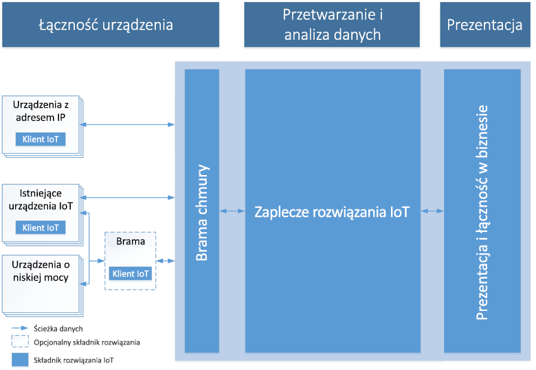

# Wprowadzenie do platformy Azure i usługi Internet of Things

Usługa Azure IoT składa się z trzech obszarów technologii i rozwiązań — rozwiązań, usług platformy i brzegu sieci — zaprojektowanych tak, aby ułatwić cały proces opracowywania aplikacji IoT. Ten artykuł rozpoczyna się od opisu typowych cech rozwiązania IoT w chmurze, a po nim następuje omówienie rozwiązań udostępnianych przez usługę Azure IoT dla wyzwań związanych z projektami IoT oraz przedstawienie przyczyn, dla których należy się zastanowić nad wdrożeniem usługi Azure IoT.

## Architektura rozwiązania IoT

Rozwiązania IoT wymagają bezpiecznej, dwukierunkowej komunikacji między urządzeniami, których liczba może być liczona nawet w milionach, oraz zaplecza rozwiązania. Rozwiązanie może na przykład korzystać z automatycznej analizy predykcyjnej w celu uzyskiwania wglądu w dane ze strumienia zdarzeń przesyłanego z urządzenia do chmury. 

Poniższy schemat przedstawia kluczowe elementy typowej architektury rozwiązania IoT. Diagram jest niezależny od szczegółów konkretnej implementacji, takich jak użyte usługi platformy Azure i systemy operacyjne urządzeń. W ramach tej architektury urządzenia IoT zbierają dane, które wysyłają do bramy chmury. Brama chmury udostępnia dane do przetwarzania przez inne usługi zaplecza. Te usługi zaplecza mogą dostarczyć dane do:

* Innych aplikacji biznesowych.
* Osób pełniących rolę operatorów za pośrednictwem pulpitu nawigacyjnego lub innego urządzenia do prezentacji.

> [!NOTE]
> Szczegółowe omówienie architektury IoT można znaleźć w temacie [Architektura referencyjna IoT platformy Microsoft Azure](https://aka.ms/iotrefarchitecture).

### Łączność urządzeń

W ramach architektury rozwiązania IoT urządzenia zwykle wysyłają dane telemetryczne do chmury w celu przechowywania i przetwarzania. Na przykład w scenariuszu konserwacji predykcyjnej zaplecze rozwiązania może używać strumienia danych z czujnika do określenia, kiedy dana pompa wymaga konserwacji. Urządzenia mogą również odbierać komunikaty przesyłane z chmury do urządzenia oraz odpowiadać na nie, odczytując komunikaty z punktu końcowego w chmurze. W tym samym przykładzie zaplecze rozwiązania może wysyłać komunikaty do innych pomp w przepompowni w celu zainicjowania zmiany trasy przepływów przed samym rozpoczęciem zaplanowanej konserwacji. Procedura ta zapewnia możliwość rozpoczęcia pracy od razu po przybyciu inżyniera serwisu.

Podłączanie urządzeń w sposób bezpieczny i niezawodny jest często największym wyzwaniem w rozwiązaniach IoT. Wynika to z tego, że urządzenia IoT charakteryzują się innymi cechami niż pozostałe rozwiązania klienckie, takie jak przeglądarki i aplikacje mobilne. W szczególności urządzenia IoT:

* są często systemami osadzonymi bez osoby pełniącej rolę operatora (w odróżnieniu od telefonu);
* mogą być wdrażane w lokalizacjach zdalnych, gdzie dostęp fizyczny jest bardzo kosztowny;
* mogą być dostępne tylko za pośrednictwem zaplecza rozwiązania. Nie istnieje inny sposób interakcji z urządzeniem;
* mogą mieć ograniczone zasoby w zakresie zasilania i przetwarzania;
* mogą korzystać z przerywanej, powolnej lub kosztownej łączności sieciowej;
* mogą wymagać używania zastrzeżonych, niestandardowych lub branżowych protokołów aplikacji;
* mogą być tworzone przy użyciu szerokiej gamy popularnych platform sprzętowych i programowych.

Oprócz powyższych ograniczeń każde rozwiązanie IoT musi być również skalowalne, bezpieczne i niezawodne.

W zależności od protokołu komunikacyjnego i dostępności sieci urządzenie może się komunikować z chmurą bezpośrednio albo przy użyciu bramy pośredniej. Architektury IoT często mają kombinację tych dwóch wzorców komunikacji.

### Przetwarzanie danych i analiza

W nowoczesnych rozwiązaniach IoT przetwarzanie danych może nastąpić w chmurze lub po stronie urządzenia. Przetwarzanie po stronie urządzenia jest określane jako *obliczenia brzegowe*. Wybór miejsca przetwarzania danych zależy od takich czynników, jak:

* Ograniczenia sieci. Jeśli przepustowość między urządzeniami i chmurą jest ograniczona, stanowi to zachętę do zwiększenia obliczeń brzegowych.
* Czas odpowiedzi. Jeśli jest wymagane działanie urządzenia w czasie bliskim rzeczywistemu, lepszym rozwiązaniem może być przetworzenie odpowiedzi na samym urządzeniu. Na przykład ramię robota, które musi zostać zatrzymane w nagłym wypadku.
* Środowisko prawne. Niektórych danych nie można wysłać do chmury.

Ogólnie rzecz biorąc przetwarzanie danych zarówno na brzegu, jak i w chmurze to kombinacja następujących możliwości:

* odbierania telemetrii z urządzeń we właściwej skali i określania sposobu przetwarzania i przechowywania tych danych;
* analizowania danych telemetrycznych w celu udostępnienia szczegółowych informacji, czy są one określane w czasie rzeczywistym, czy też po fakcie;
* wysyłania poleceń z chmury lub urządzenia bramy do określonego urządzenia.

Ponadto zaplecze chmury IoT powinno zapewniać:

* Możliwości rejestracji urządzenia, które umożliwiają:
    * Aprowizację urządzeń.
    * Kontrolowanie tego, które urządzenia są uprawnione do łączenia się z Twoją infrastrukturą.
* Zarządzanie urządzeniami w celu śledzenia stanu Twoich urządzeń i monitorowania ich działania.

Na przykład w scenariuszu konserwacji predykcyjnej zaplecze chmury przechowuje historyczne dane telemetryczne. Rozwiązanie używa tych danych do identyfikowania potencjalnych nietypowych zachowań określonych pomp zanim spowodują one rzeczywisty problem. Za pomocą analizy danych może ono ustalić, że rozwiązanie prewencyjne polega na wysłaniu z powrotem do urządzenia polecenia podjęcia akcji naprawczej. Ten proces generuje pętlę automatycznego sprzężenia zwrotnego między urządzeniem i chmurą, która znacznie zwiększa wydajność rozwiązania.

### Prezentacja i łączność biznesowa

Warstwa prezentacji i łączności biznesowej umożliwia użytkownikom końcowym interakcję z rozwiązaniem IoT i urządzeniami. Pozwala użytkownikom wyświetlać i analizować dane zbierane z urządzeń. Widoki te mogą mieć formę pulpitów nawigacyjnych i raportów analizy biznesowej, które zawierają zarówno dane historyczne, jak i dane uzyskiwane niemal w czasie rzeczywistym. Na przykład operator może sprawdzić stan określonej przepompowni i wyświetlić wszystkie alerty wygenerowane przez system. Ta warstwa umożliwia także integrację zaplecza rozwiązania IoT z istniejącymi aplikacjami branżowymi w celu ich powiązania w ramach procesów biznesowych i przepływów pracy przedsiębiorstwa. Na przykład rozwiązanie do konserwacji predykcyjnej można zintegrować z systemem planowania w celu zarezerwowania wizyty serwisanta w przepompowni, gdy zidentyfikuje ono pompę wymagającą konserwacji.

## Dlaczego warto wybrać usługę Azure IoT?

Usługa Azure IoT zmniejsza złożoność projektów IoT i udostępnia rozwiązania dla związanych z nimi wyzwań, takich jak zabezpieczenia, niezgodność infrastruktury i skalowanie rozwiązania IoT. Osiąga to dzięki następującym cechom:

### Zwinność

Przyspiesz swoją podróż do środowiska IoT.

* Skalowanie: rozpocznij od czegoś małego i rośnij bez ograniczeń — gdziekolwiek i wszędzie — miliony urządzeń, terabajty danych w większości regionów na całym świecie.

* Otwartość: użyj tego, co masz, lub modernizuj z myślą o przyszłości, łącząc się z dowolnym urządzeniem, oprogramowaniem lub usługą.

* Hybrydowość: twórz zgodnie z potrzebami, wdrażając rozwiązanie IoT na brzegu sieci, w chmurze lub w dowolnym miejscu między nimi.

* Tempo: wdrażaj szybciej, przyspiesz wprowadzenie na rynek, wyprzedź konkurencję razem z liderem branży akceleratorów rozwiązań i nadawaj tempo innowacjom związanym z technologiami IoT.

### Wszechstronność

Miej wpływ na swój biznes.

* Kompletność: firma Microsoft to jedyny dostawca rozwiązań IoT oferujący pełną platformę obejmującą urządzenia i chmurę, w tym dane big data, zaawansowane funkcje analizy i usługi zarządzane.

* Partner sukcesu: skorzystaj z potęgi największego na świecie ekosystemu partnerskiego i tchnij życie w biznes oraz technologię na skalę całej branży i całego świata.

* Oparcie na danych: technologie IoT dotyczą danych, a najlepsze rozwiązania IoT łączą wszystkie narzędzia potrzebne do przechowywania, interpretowania, przekształcania, analizowania i prezentowania danych właściwemu użytkownikowi we właściwym miejscu i czasie.

* Koncentracja na urządzeniach: usługa Microsoft IoT umożliwia łączenie ze sobą wszystkiego — od starszego wyposażenia do ogromnego ekosystemu certyfikowanego sprzętu — oraz tworzenie własnych urządzeń obejmujących brzeg sieci, a także systemy mobilne i wbudowane.

### Bezpieczeństwo

Rozwiąż najtrudniejszy problem technologii IoT — zabezpieczenia.

* Możliwości: usługa Microsoft IoT umożliwia połączenie Twojej wizji z technologią, najlepszymi rozwiązaniami i możliwościami w celu rozwiązania najtrudniejszego problemu technologii IoT — obsługi zabezpieczeń.

* Podejmij działania: zabezpiecz Twoje dane IoT i zarządzaj ryzykiem za pomocą różnorodnych funkcji: zarządzania tożsamościami i dostępem, ochrony informacji i ochrony przed zagrożeniami oraz zarządzania zabezpieczeniami.

* Spokój ducha: zapewnienie bezpieczeństwa informacji poufnych znajdujących się na urządzeniach oraz w oprogramowaniu, aplikacjach i usługach w chmurze, a także w środowiskach lokalnych.

* Zgodność: firma Microsoft jest liderem branży w ustanawianiu wymagań dotyczących zabezpieczeń, które spełniają szeroką gamę standardów międzynarodowych i branżowych dotyczących urządzeń IoT, danych i usług.

## Następne kroki

Zapoznaj się z następującymi obszarami technologicznymi i rozwiązaniami.

**Rozwiązania**

* [Akceleratory rozwiązań IoT](/azure/iot-suite)
* [Centrala IoT](/azure/iot-central)

**Usługi platformy**

* [IoT Hub](/azure/iot-hub)
* [Usługa IoT Hub Device Provisioning](/azure/iot-dps)
* [Azure Maps](/azure/azure-maps/)
* [Time Series Insights](/azure/time-series-insights)

**Edge**

* [Omówienie usługi IoT Edge](/azure/iot-edge)
* [Co to jest usługa IoT Edge](/azure/how-iot-edge-works)
