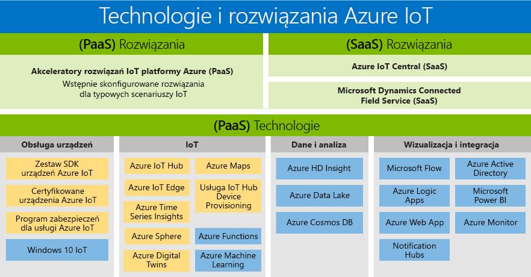

# Technologie i rozwiązania Internetu rzeczy (IoT): PaaS i SaaS

Rozbudowana oferta firmy Microsoft może zaspokoić potrzeby wszystkich klientów, dzięki czemu każdy może mieć dostęp do korzyści wynikających z cyfrowej rewolucji. Ten opis produktów Azure IoT jest omówieniem dostępnych technologii i rozwiązań PaaS/SaaS. Przedstawiono tu dwie ścieżki dostępne podczas tworzenia własnego rozwiązania:

- Platforma jako usługa (PaaS): tworzenie aplikacji przy użyciu dowolnej z poniższych usług.
    - [Akceleratory rozwiązania Azure IoT](https://www.azureiotsolutions.com/) — kolekcja wstępnie skonfigurowanych rozwiązań klasy korporacyjnej umożliwiających przyspieszenie tworzenia niestandardowych rozwiązań IoT. 
    - [Azure Digital Twins](https://azure.microsoft.com/services/digital-twins/) — usługa, która umożliwia modelowanie środowiska fizycznego w celu utworzenia kontekstowych rozwiązań IoT za pomocą grafu analizy przestrzennej modeli obiektów określonych domen.

- Oprogramowanie jako usługa (SaaS) — szybko rozpocznij pracę dzięki usłudze [Azure IoT Central](https://azure.microsoft.com/services/iot-central/), nowemu rozwiązaniu SaaS, i opracuj aplikacje IoT bez styczności ze złożonością rozwiązania IoT. Jeśli Twoja organizacja nie ma zasobów do utworzenia własnego rozwiązania IoT, usługa Azure IoT Central jest bezkodowym rozwiązaniem IoT, który pozwala na tworzenie modeli urządzeń, pulpitów nawigacyjnych oraz reguł w ciągu kilku minut.

## Rozwiązania

Szybko rozpocznij pracę z akceleratorami rozwiązań i ofertami SaaS. Wybierz dowolne ze wstępnie skonfigurowanych rozwiązań, które obsługują typowe scenariusze IoT obejmujące na przykład zdalne monitorowanie, konserwację zapobiegawczą czy połączoną fabrykę, i utwórz w pełni dostosowane rozwiązanie. Możesz też skorzystać z usługi Azure IoT Central, czyli w pełni zarządzanego i kompleksowego rozwiązania, które obsługuje zaawansowane scenariusze IoT, nie wymagając fachowej wiedzy w zakresie rozwiązań w chmurze.

### Akceleratory rozwiązań usługi Azure IoT (PaaS)

Akceleratory rozwiązań usługi Azure IoT to zbiór rozwiązań PaaS klasy korporacyjnej, które można dostosować i które zapewniają wysoki stopień kontroli nad rozwiązaniem IoT. Jeśli Twoja firma wdraża technologię IoT na potrzeby połączonych operacji lub ma określone wymagania w zakresie dostosowywania dla połączonych produktów, akceleratory rozwiązań usługi Azure IoT oferują kontrolę, której potrzebujesz. 

Akceleratory rozwiązań IoT mogą przynieść największe korzyści na przykład organizacjom z dużą liczbą urządzeń lub ich modeli oraz producentom poszukującym rozwiązań typu „połączona fabryka”. Tworzenie rozwiązań, które można w dużym stopniu dostosować do złożonych potrzeb — tutaj akceleratory rozwiązań IoT zapewniają następujące korzyści: 

- Wstępnie przygotowane rozwiązania
    - Zdalne monitorowanie
    - Połączona fabryka
    - Konserwacja zapobiegawcza
    - Symulacja urządzenia
- Możliwość wdrożenia w ciągu kilku minut
- Skracanie czasu uzyskiwania wartości
- Rozwiązania, które pozwalają na pełną kontrolę 
 
### Azure IoT Central (SaaS)

Azure IoT Central to w pełni zarządzane rozwiązanie SaaS, które pozwala na szybkie rozpoczęcie pracy — nawet w przypadku posiadania niewielkiego doświadczenia w korzystaniu z Internetu rzeczy. Jeśli Twojej firmie zależy bardziej na szybkości niż na dostosowywaniu, modele SaaS mogą być doskonałym rozwiązaniem, biorąc pod uwagę potrzeby związane z wdrażaniem IoT. 

Organizacje używające mniejszej liczby modeli urządzeń, bardziej przewidywalnych scenariuszy oraz ograniczonych możliwości IoT/IT, mogą teraz czerpać korzyści z rozwiązań IoT za pośrednictwem rozwiązania SaaS. Firmy, którym wcześniej brakowało czasu, pieniędzy i wiedzy, by tworzyć połączone produkty, mogą teraz szybko rozpocząć pracę dzięki usłudze Azure IoT Central. Microsoft jest liderem branżowym w zakresie dostarczania dojrzałych rozwiązań SaaS, które spełniają standardowe wymagania związane z wdrożeniami IoT. 

- W pełni zarządzane rozwiązanie IoT SaaS
- Fachowa wiedza dotycząca opracowywania rozwiązań w chmurze nie jest wymagana
- Konfigurowanie w zależności od potrzeb
- Idealne rozwiązanie do prostych potrzeb w zakresie IoT

### Porównanie akceleratorów rozwiązań usługi Azure IoT i rozwiązania Azure IoT Central

Na potrzeby implementacji typowej [architektury rozwiązania IoT](/azure/iot-fundamentals/iot-introduction) usługa Azure IoT oferuje kilka możliwości, takich jak [akceleratory rozwiązań usługi Azure IoT](/azure/iot-suite) i rozwiązanie [Azure IoT Central](https://www.microsoft.com/internet-of-things/iot-central-saas-solutions), z których każda spełnia różne wymagania klientów.

Usługa [Azure IoT Hub](https://azure.microsoft.com/services/iot-hub/) to podstawowe rozwiązanie PaaS dostępne w ramach platformy Azure, z którego korzysta zarówno usługa Microsoft IoT Central, jak i akceleratory rozwiązań usługi Azure IoT. Usługa IoT Hub umożliwia bezpieczną i niezawodną dwukierunkową komunikację między milionami urządzeń IoT i rozwiązaniem w chmurze. Usługa IoT Hub ułatwia spełnienie wymagań dotyczących implementacji IoT, takich jak:

* Utrzymywanie łączności zapewniającej przepływ dużej ilości danych między urządzeniami i zarządzanie nimi.
* Pozyskiwanie dużej ilości danych telemetrycznych.
* Sterowanie urządzeniami i kontrola nad nimi.
* Wymuszanie zabezpieczeń urządzeń.

Wybór produktu IoT Azure to decydujący etap planowania rozwiązania IoT. IoT Hub jest autonomiczną usługą platformy Azure, która sama nie zapewnia kompleksowego rozwiązania IoT. Usługa IoT Hub może służyć jako punkt początkowy dla dowolnego rozwiązania IoT. Aby z niej korzystać, nie trzeba używać akceleratorów rozwiązań usługi Azure IoT ani rozwiązania Azure IoT Central. Zarówno akceleratory rozwiązań usługi Azure IoT, jak i rozwiązanie Azure IoT Central używają usługi IoT Hub razem z innymi usługami platformy Azure. W poniższej tabeli przedstawiono podsumowanie najważniejszych różnic między akceleratorami rozwiązań usługi Azure IoT i rozwiązaniem Azure IoT Central, aby ułatwić wybór rozwiązania najbardziej odpowiedniego dla konkretnych wymagań:

|                        | Akceleratory rozwiązań Azure IoT | Azure IoT Central |
| ---------------------- | --------- | ----------- |
| Podstawowe zastosowanie | Przyspieszenie opracowania niestandardowych rozwiązań IoT wymagających maksymalnej elastyczności. | Skrócenie czasu wprowadzenia na rynek prostych rozwiązań IoT, które nie wymagają znaczącego dostosowania usług. |
| Dostęp do podstawowych usług PaaS          | Dostęp do podstawowych usług platformy Azure, możliwość zarządzania nimi i zastępowania ich w razie potrzeb. | SaaS. W pełni zarządzane rozwiązanie, podstawowe usługi nie są widoczne. |
| Elastyczność            | Wysoka. Kod mikrousług jest typu „open source”, można go modyfikować w dowolny sposób w celu dopasowania do własnych potrzeb. Ponadto można dostosować infrastrukturę wdrażania.| Średnia. Wbudowane, oparte na przeglądarce środowisko użytkownika umożliwia dostosowywanie modelu rozwiązania i aspektów interfejsu użytkownika. Infrastruktury nie można modyfikować, ponieważ poszczególne składniki nie są widoczne.|
| Poziom umiejętności                 | Średnio wysoki. Konieczna jest znajomość języka Java lub .NET, aby móc dostosować zaplecze rozwiązania. Konieczna jest znajomość języka JavaScript w celu dostosowania wizualizacji. | Niski. Wymagane jest posiadanie umiejętności modelowania w celu dostosowania rozwiązania. Nie są wymagane umiejętności programowania. |
| Rozpoczynanie pracy | Akceleratory rozwiązań implementują typowe scenariusze IoT. Można je wdrożyć w kilka minut. | Szablony aplikacji i urządzeń udostępniają wstępnie wbudowane modele. Można je wdrożyć w kilka minut. |
| Cennik                | Koszty można kontrolować, dostosowując usługi. | Prosta, przewidywalna struktura cen. |

Podjęcie decyzji, którego produktu użyć w celu zbudowania rozwiązania IoT, zależy od następujących czynników:

* Wymagania biznesowe
* Typ budowanego rozwiązania.
* Posiadany przez organizację zestaw umiejętności do tworzenia i obsługi rozwiązania w długim okresie

## Technologie (PaaS)

Na platformie Azure dostępna jest najbardziej kompleksowa oferta IoT w zakresie usług platformowych i technologii PaaS (Platform-as-a-Service). Dzięki niej możliwe jest łatwe tworzenie, dostosowywanie i kontrolowanie wszystkich aspektów używanego rozwiązania IoT. Uzyskaj dwukierunkową komunikację z miliardami urządzeń IoT i zarządzań nimi na dużą skalę. Następnie zintegruj swoje dane z urządzeń IoT z innymi usługami platformowymi, takimi jak Azure Cosmos DB czy Azure Time Series Insights, aby zwiększyć wgląd w obrębie swojego rozwiązania. 

### Obsługa urządzeń

Bez obaw rozpocznij pracę nad projektem IoT, korzystając z [pakietów startowych usługi Azure IoT](https://catalog.azureiotsolutions.com/kits) lub wybierając spośród setek urządzeń z certyfikatem dla usługi IoT w [wykazie urządzeń](https://catalog.azureiotsolutions.com/). Wszystkie urządzenia są niezależne od platformy i zostały przetestowane pod kątem bezproblemowego łączenia się z usługą IoT Hub.
Połącz wszystkie swoje urządzenia z usługą Azure IoT przy użyciu [zestawów SDK urządzeń](/azure/iot-hub/iot-hub-devguide-sdks) typu open source. Nasze zestawy SDK obsługują wiele systemów operacyjnych (np. Linux i Windows) oraz systemy operacyjne czasu rzeczywistego, a także wiele języków programowania, takich jak [C](https://github.com/Azure/azure-iot-sdk-c), [Node.js](https://github.com/Azure/azure-iot-sdk-node), [Java](https://github.com/Azure/azure-iot-sdk-java), [.NET](https://github.com/Azure/azure-iot-sdk-csharp) oraz [Python](https://github.com/Azure/azure-iot-sdk-python).

### IoT 
[Azure IoT Hub](https://azure.microsoft.com/services/iot-hub/) to w pełni zarządzana usługa, która umożliwia bezpieczną i niezawodną komunikację dwukierunkową między milionami urządzeń IoT a zapleczem rozwiązania. Usługa Azure IoT Hub Device Provisioning to usługa pomocnika usługi IoT Hub, która umożliwia automatyczną aprowizację w miarę potrzeb na zasadach usługi IoT Hub, nie wymagając przy tym interwencji człowieka, co umożliwia klientom aprowizację milionów urządzeń w sposób bezpieczny i ekonomiczny.

### Brzeg
Usługa [Azure IoT Edge](https://azure.microsoft.com/services/iot-edge/) jest usługą IoT. Ta usługa jest przeznaczona dla klientów, którzy chcą analizować dane na urządzeniach, czyli „na brzegu”. Przez przeniesienie części obciążenia na brzeg zapewnisz mniejsze opóźnienia i zyskasz możliwość użycia scenariuszy w trybie offline.

### Analiza przestrzenna
[Azure Digital Twins](https://azure.microsoft.com/services/digital-twins/) to usługa IoT, która umożliwia utworzenie modelu środowiska fizycznego. Udostępnia ona graf analizy przestrzennej pozwalający modelować relacje między osobami, miejscami i urządzeniami. Możesz tworzyć rozwiązania kontekstowe przez korelowanie danych między środowiskiem cyfrowym i fizycznym.  

### Dane i analiza
Skorzystaj z tablicy ofert PaaS w zakresie danych i analityki platformy Azure w ramach swojego rozwiązania IoT: przeprowadź zaawansowaną analizę chmury przy użyciu Azure Machine Learning, przechowuj dane urządzenia IoT w wydajny sposób dzięki rozwiązaniu Azure Data Lake, wizualizuj duże ilości danych z urządzeń IoT za pomocą usługi [Azure Time Series Insights](https://azure.microsoft.com/services/time-series-insights/).

### Wizualizacja i integracja
Platforma Microsoft Azure oferuje pełne rozwiązanie w chmurze, które stanowi połączenie stale rosnącego zbioru zintegrowanych usług w chmurze oraz wyjątkowego w branży zaangażowania w kwestie ochrony danych i zapewnienia prywatności. Dowiedz się więcej na temat platformy [Microsoft Azure](https://azure.microsoft.com/).

## Kolejne kroki

Zapoznaj się z sekcją [Wprowadzenie w dokumentacji usługi IoT Hub](/azure/iot-hub/iot-hub-get-started), aby móc szybko i łatwo korzystać z funkcji IoT. Aby uzyskać wskazówki praktyczne, wypróbuj jeden z [samouczków dotyczących usługi IoT Edge](/azure/iot-edge/tutorial-simulate-device-windows).
