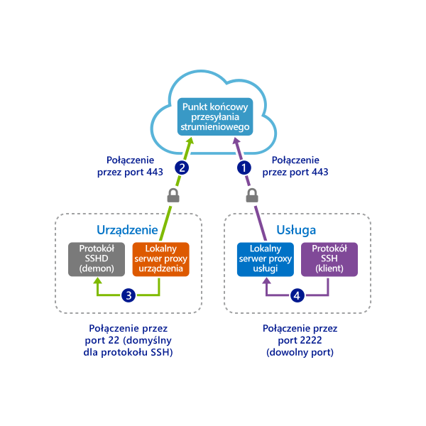
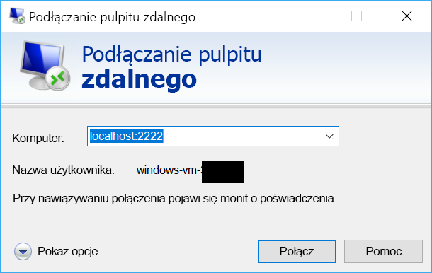

# <a name="quickstart-sshrdp-over-iot-hub-device-streams-using-c-proxy-applications-preview"></a>Szybki start: Obsługa protokołu SSH/RDP w strumieniach urządzeń usługi IoT Hub za pomocą aplikacji serwera proxy C# (wersja zapoznawcza)

[!INCLUDE [iot-hub-quickstarts-4-selector](../../includes/iot-hub-quickstarts-4-selector.md)]

Microsoft Azure IoT Hub obsługuje obecnie strumieni urządzenia jako [funkcja w wersji zapoznawczej](https://azure.microsoft.com/support/legal/preview-supplemental-terms/).

[Strumienie urządzeń usługi IoT Hub](./iot-hub-device-streams-overview.md) umożliwiają aplikacjom usług i urządzeń bezpieczną komunikację w sposób przyjazny dla zapory. Ten przewodnik Szybki start obejmuje dwa programy C#, które umożliwiają wysyłanie ruchu klient/serwer aplikacji (takiego jak SSH i RDP) w strumieniu urządzenia utworzonym za pomocą usługi IoT Hub. Omówienie konfiguracji można znaleźć [tutaj](./iot-hub-device-streams-overview.md#local-proxy-sample-for-ssh-or-rdp).

Najpierw opisano konfigurację protokołu SSH (za pomocą portu 22). Następnie opisano sposób modyfikowania portu konfiguracji dla protokołu RDP. Strumienie urządzeń nie wymagają protokołu i aplikacji, dlatego można zmodyfikować ten sam przykład w celu obsługi innych typów ruchu aplikacji. Zazwyczaj wiąże się to tylko ze zmianą portu komunikacyjnego na port używany przez aplikację docelową.

## <a name="how-it-works"></a>Jak to działa?

Na poniższej ilustracji pokazano, jak skonfigurować programy serwera proxy urządzeń i usług lokalnych w tym przykładzie, aby umożliwić pełne połączenie między klientem SSH i demonem SSH. Przyjęto tutaj założenie, że demon jest uruchomiony na tym samym urządzeniu co serwer proxy urządzenia lokalnego.



1. Serwer proxy usługi lokalnej łączy się z usługą IoT Hub i inicjuje strumień urządzenia do urządzenia docelowego przy użyciu identyfikatora urządzenia.

2. Serwer proxy urządzenia lokalnego kończy uzgadnianie inicjowania strumienia i tworzy pełny tunel przesyłania strumieniowego przez punkt końcowy przesyłania strumieniowego usługi IoT Hub do usługi.

3. Serwer proxy urządzenia lokalnego łączy się z demonem SSH (SSHD), który nasłuchuje na porcie 22 w urządzeniu (ten port można skonfigurować zgodnie z opisem [poniżej](#run-the-device-local-proxy)).

4. Serwer proxy usługi lokalnej czeka na nowe połączenia SSH od użytkownika przez nasłuchiwanie na wyznaczonym porcie — w tym przypadku jest to port 2222 (również można to skonfigurować zgodnie z opisem [poniżej](#run-the-service-local-proxy)). Gdy użytkownik nawiązuje połączenie za pośrednictwem klienta SSH, tunel umożliwia wymianę ruchu aplikacji między programami klienta i serwera SSH.

> [!NOTE]
> Ruch SSH wysyłany w strumieniu będzie tunelowany za pośrednictwem punktu końcowego przesyłania strumieniowego usługi IoT Hub, a nie wysyłany bezpośrednio z usługi do urządzenia. Daje to [następujące korzyści](./iot-hub-device-streams-overview.md#benefits).

[!INCLUDE [cloud-shell-try-it.md](../../includes/cloud-shell-try-it.md)]

Jeśli nie masz subskrypcji platformy Azure, przed rozpoczęciem utwórz [bezpłatne konto](https://azure.microsoft.com/free/?WT.mc_id=A261C142F).

## <a name="prerequisites"></a>Wymagania wstępne

Strumienie urządzenia w wersji zapoznawczej jest obecnie obsługiwane tylko w przypadku centrów IoT Hub są tworzone w następujących regionach:

  - **Środkowe stany USA**
  - **Central US EUAP**

Dwie przykładowe aplikacje uruchamiane w tym przewodniku Szybki start zostały napisane w języku C#. Potrzebujesz zestawu SDK .NET Core w wersji 2.1.0 lub nowszej na komputerze deweloperskim.

Możesz pobrać zestaw SDK .NET Core dla wielu platform z repozytorium [.NET](https://www.microsoft.com/net/download/all).

Możesz sprawdzić bieżącą wersję języka C# na komputerze deweloperskim przy użyciu następującego polecenia:

```
dotnet --version
```

Uruchom następujące polecenie, aby dodać rozszerzenia usługi Microsoft Azure IoT dla interfejsu wiersza polecenia platformy Azure do swojego wystąpienia usługi Cloud Shell. Rozszerzenia IOT dodaje określone polecenia usługi IoT Hub, IoT Edge i usługi aprowizacji urządzeń IoT (DPS) do wiersza polecenia platformy Azure.

```azurecli-interactive
az extension add --name azure-cli-iot-ext
```

Pobierz przykładowy projekt C# z https://github.com/Azure-Samples/azure-iot-samples-csharp/archive/master.zip i wyodrębnij archiwum ZIP.

## <a name="create-an-iot-hub"></a>Tworzenie centrum IoT Hub

[!INCLUDE [iot-hub-include-create-hub](../../includes/iot-hub-include-create-hub-device-streams.md)]

## <a name="register-a-device"></a>Rejestrowanie urządzenia

Zanim urządzenie będzie mogło nawiązać połączenie, należy je najpierw zarejestrować w centrum IoT. W tym przewodniku Szybki start opisano rejestrowanie urządzenia symulowanego przy użyciu usługi Azure Cloud Shell.

1. Uruchom następujące polecenie w usłudze Azure Cloud Shell do tworzenia tożsamości urządzenia.

   **YourIoTHubName**: zamień ten symbol zastępczy poniżej na wybraną nazwę centrum IoT Hub.

   **MyDevice**: jest to nazwa nadana dla zarejestrowanego urządzenia. Użyj nazwy MyDevice w pokazany sposób. Jeśli wybierzesz inną nazwę dla swojego urządzenia, musisz również używać tej nazwy w tym artykule oraz zaktualizować nazwę urządzenia w przykładowych aplikacjach przed ich uruchomieniem.

    ```azurecli-interactive
    az iot hub device-identity create --hub-name YourIoTHubName --device-id MyDevice
    ```

2. Uruchom następujące polecenia w usłudze Azure Cloud Shell, aby uzyskać _parametry połączenia urządzenia_ dla urządzenia, które właśnie zostało zarejestrowane:

   **YourIoTHubName**: zamień ten symbol zastępczy poniżej na wybraną nazwę centrum IoT Hub.

    ```azurecli-interactive
    az iot hub device-identity show-connection-string --hub-name YourIoTHubName --device-id MyDevice --output table
    ```

    Zanotuj parametry połączenia urządzenia, które wyglądają jak w następującym przykładzie:

   `HostName={YourIoTHubName}.azure-devices.net;DeviceId=MyDevice;SharedAccessKey={YourSharedAccessKey}`

    Użyjesz tej wartości w dalszej części tego przewodnika Szybki start.

3. Potrzebne są też _parametry połączenia usługi_ z centrum IoT, aby umożliwić aplikacji po stronie usługi nawiązanie połączenia z centrum IoT i utworzenie strumienia urządzeń. Następujące polecenie umożliwia pobranie tej wartości dla centrum IoT:

   **YourIoTHubName**: zamień ten symbol zastępczy poniżej na wybraną nazwę centrum IoT Hub.

    ```azurecli-interactive
    az iot hub show-connection-string --policy-name service --name YourIoTHubName
    ```

    Zanotuj zwróconą wartość, która wygląda następująco:

   `"HostName={YourIoTHubName}.azure-devices.net;SharedAccessKeyName=service;SharedAccessKey={YourSharedAccessKey}"`
    

## <a name="ssh-to-a-device-via-device-streams"></a>Połączenie SSH z urządzeniem za pośrednictwem strumieni urządzeń

### <a name="run-the-device-local-proxy"></a>Uruchamianie serwera proxy urządzenia lokalnego

Przejdź do elementu `device-streams-proxy/device` w folderze rozpakowanego projektu. Przydatne będą następujące informacje:

| Nazwa argumentu | Wartość argumentu |
|----------------|-----------------|
| `deviceConnectionString` | Utworzone wcześniej parametry połączenia urządzenia. |
| `targetServiceHostName` | Adres IP, na którym nasłuchuje serwer SSH (`localhost`, jeśli jest to ten sam adres IP, pod którym działa serwer proxy urządzenia lokalnego). |
| `targetServicePort` | Port używany przez protokół aplikacji (domyślnie jest to port 22 dla protokołu SSH).  |

Skompiluj i uruchom kod w następujący sposób:

```
cd ./iot-hub/Quickstarts/device-streams-proxy/device/

# Build the application
dotnet build

# Run the application
# In Linux/MacOS
dotnet run $deviceConnectionString localhost 22

# In Windows
dotnet run %deviceConnectionString% localhost 22
```

### <a name="run-the-service-local-proxy"></a>Uruchamianie serwera proxy usługi lokalnej

Przejdź do elementu `device-streams-proxy/service` w folderze rozpakowanego projektu. Przydatne będą następujące informacje:

| Nazwa parametru | Wartość parametru |
|----------------|-----------------|
| `iotHubConnectionString` | Parametry połączenia usługi IoT Hub. |
| `deviceId` | Utworzony wcześniej identyfikator urządzenia. |
| `localPortNumber` | Port lokalny, z którym łączy się klient SSH. W tym przykładzie użyto portu 2222, ale można go zmienić na inny. |

Skompiluj i uruchom kod w następujący sposób:

```
cd ./iot-hub/Quickstarts/device-streams-proxy/service/

# Build the application
dotnet build

# Run the application
# In Linux/MacOS
dotnet run $serviceConnectionString MyDevice 2222

# In Windows
dotnet run %serviceConnectionString% MyDevice 2222
```

### <a name="run-ssh-client"></a>Uruchamianie klienta SSH

Teraz użyj programu klienckiego SSH i nawiąż połączenie z serwerem proxy usługi lokalnej na porcie 2222 (zamiast bezpośrednio z demonem SSH). 

```
ssh <username>@localhost -p 2222
```

W tym momencie zostanie wyświetlony monit logowania protokołu SSH o wprowadzenie poświadczeń.

Dane wyjściowe konsoli po stronie usługi (serwer proxy usługi lokalnej nasłuchuje na porcie 2222):


Dane wyjściowe konsoli na serwerze proxy urządzenia lokalnego, który łączy się z demonem SSH pod adresem `IP_address:22`:

]Tekst alternatywny(./media/quickstart-device-streams-proxy-csharp/device-console-output.png "")Dane wyjściowe serwera proxy urządzenia lokalnego

Dane wyjściowe konsoli programu klienta SSH (klient SSH komunikuje się z demonem SSH przez połączenie z portem 22, na którym nasłuchuje serwer proxy usługi lokalnej):


## <a name="rdp-to-a-device-via-device-streams"></a>Połączenie RDP z urządzeniem za pośrednictwem strumieni urządzeń

Konfiguracja protokołu RDP jest bardzo podobna do konfiguracji protokołu SSH (opisanej powyżej). Różnica polega na użyciu docelowego adresu IP i portu 3389 protokołu RDP oraz użyciu klienta RDP (zamiast klienta SSH).

### <a name="run-the-device-local-proxy-rdp"></a>Uruchamianie serwera proxy urządzenia lokalnego (RDP)

Przejdź do elementu `device-streams-proxy/device` w folderze rozpakowanego projektu. Przydatne będą następujące informacje:

| Nazwa argumentu | Wartość argumentu |
|----------------|-----------------|
| `DeviceConnectionString` | Utworzone wcześniej parametry połączenia urządzenia. |
| `targetServiceHostName` | Nazwa hosta lub adres IP, gdzie działa serwer RDP (`localhost`, jeśli jest to ten sam adres IP, pod którym działa serwer proxy urządzenia lokalnego). |
| `targetServicePort` | Port używany przez protokół aplikacji (domyślnie jest to port 3389 dla protokołu RDP).  |

Skompiluj i uruchom kod w następujący sposób:

```
cd ./iot-hub/Quickstarts/device-streams-proxy/device

# Run the application
# In Linux/MacOS
dotnet run $DeviceConnectionString localhost 3389

# In Windows
dotnet run %DeviceConnectionString% localhost 3389
```

### <a name="run-the-service-local-proxy-rdp"></a>Uruchamianie serwera proxy urządzenia lokalnego (RDP)

Przejdź do elementu `device-streams-proxy/service` w folderze rozpakowanego projektu. Przydatne będą następujące informacje:

| Nazwa parametru | Wartość parametru |
|----------------|-----------------|
| `iotHubConnectionString` | Parametry połączenia usługi IoT Hub. |
| `deviceId` | Utworzony wcześniej identyfikator urządzenia. |
| `localPortNumber` | Port lokalny, z którym łączy się klient SSH. W tym przykładzie użyto portu 2222, ale można go zmienić na inny. |

Skompiluj i uruchom kod w następujący sposób:

```
cd ./iot-hub/Quickstarts/device-streams-proxy/service/

# Build the application
dotnet build

# Run the application
# In Linux/MacOS
dotnet run $serviceConnectionString MyDevice 2222

# In Windows
dotnet run %serviceConnectionString% MyDevice 2222
```

### <a name="run-rdp-client"></a>Uruchamianie klienta RDP

Teraz użyj programu klienta RDP i nawiąż połączenie z serwerem proxy lokalnym dla usługi na porcie 2222 (jest to port wybrany wcześniej).



## <a name="clean-up-resources"></a>Oczyszczanie zasobów

[!INCLUDE [iot-hub-quickstarts-clean-up-resources](../../includes/iot-hub-quickstarts-clean-up-resources-device-streams.md)]

## <a name="next-steps"></a>Kolejne kroki

W tym przewodniku Szybki start skonfigurowano centrum IoT Hub, zarejestrowano urządzenie, wdrożono program serwera proxy urządzenia lokalnego i usługi lokalnej w celu utworzenia strumienia urządzenia za pomocą usługi IoT Hub oraz użyto serwerów proxy do tunelowania ruchu SSH lub RDP. Ten sam model może obsłużyć inne protokoły klienta/serwera, (gdy serwer jest uruchomiony w urządzeniu, np. demon SSH).

Aby dowiedzieć się więcej na temat strumieni urządzeń, użyj poniższych linków:

> [!div class="nextstepaction"]
> [Przegląd strumieni urządzenia](./iot-hub-device-streams-overview.md)
