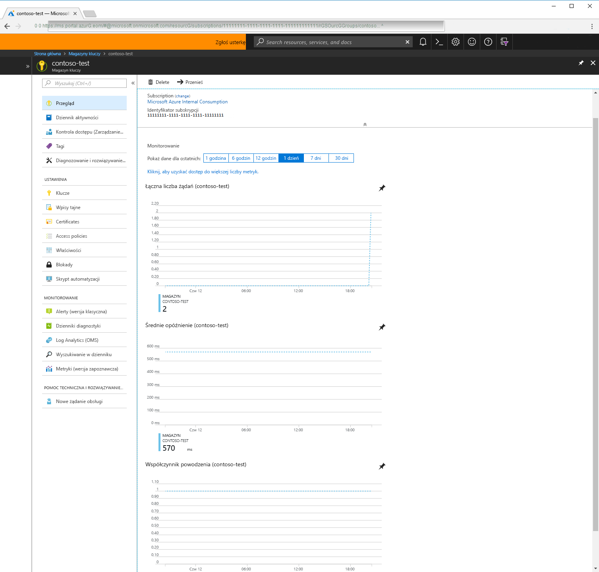

# Co to jest usługa Azure Key Vault?

Azure Key Vault to usługa w chmurze, która działa jako bezpieczny magazyn wpisów tajnych.

Korzystasz z haseł, parametrów połączenia i innych rodzajów informacji, które są konieczne do działania Twoich aplikacji. Chcesz mieć pewność, że te informacje są dostępne, lecz także zabezpieczone. W tym może pomóc usługa Azure Key Vault. Usługa Azure Key Vault ułatwia bezpieczne przechowywanie wpisów tajnych aplikacji i zarządzanie nimi.

Usługa Key Vault umożliwia utworzenie wielu zabezpieczonych kontenerów nazywanych magazynami. Te magazyny są wspierane przez sprzętowe moduły zabezpieczeń. Magazyny zmniejszają prawdopodobieństwo przypadkowej utraty danych zabezpieczeń, stanowiąc centrum przechowywania wpisów tajnych aplikacji. Magazyny usługi Key Vault umożliwiają także kontrolowanie i rejestrowanie dostępu do wszelkich elementów, które są w nich przechowywane. Usługa Azure Key Vault obsługuje żądania i odnawianie certyfikatów protokołu TLS (Transport Layer Security), udostępniając funkcje wymagane przez niezawodne rozwiązania do zarządzania cyklem życia certyfikatu.

 Usługę Azure Key Vault zaprojektowano pod kątem obsługi kluczy i wpisów tajnych aplikacji. Usługa Key Vault nie jest przeznaczona do przechowywania haseł użytkowników.

## Jakie są zalety korzystania z usługi Azure Key Vault?

### Scentralizowana obsługa wpisów tajnych aplikacji

Centralny magazyn wpisów tajnych aplikacji w usłudze Azure Key Vault umożliwia kontrolowanie ich dystrybucji. Znacznie ogranicza to prawdopodobieństwo przypadkowego ujawnienia wpisów tajnych. Korzystając z usługi Key Vault, deweloperzy aplikacji nie muszą już przechowywać informacji zabezpieczeń w aplikacji. Konieczność umieszczania ich w kodzie zostaje wyeliminowana. Na przykład aplikacja może potrzebować połączenia z bazą danych. Zamiast przechowywać parametry połączenia w kodzie aplikacji, możesz zapisać je bezpiecznie w usłudze Key Vault.

Aplikacje mogą uzyskiwać dostęp do potrzebnych informacji w bezpieczny sposób za pomocą identyfikatorów URI, które pozwalają na pobranie określonych wersji wpisu tajnego po umieszczeniu klucza lub wpisu tajnego aplikacji w usłudze Azure Key Vault. Jest to możliwe bez konieczności pisania niestandardowego kodu w celu ochrony poufnych informacji.

### Bezpieczne przechowywanie wpisów tajnych

Klucze są chronione przez platformę Azure przy użyciu branżowych standardów dotyczących algorytmów, długości klucza i sprzętowych modułów zabezpieczeń (HSM, hardware security module). Używane moduły HSM zostały zweryfikowane pod kątem zgodności ze standardem Federal Information Processing Standards (FIPS) 140-2 Level 2.

Udzielenie dostępu do magazynu kluczy wywołującemu użytkownikowi lub aplikacji wymaga odpowiedniego uwierzytelnienia i autoryzacji. Uwierzytelnianie ustala tożsamość elementu wywołującego, a autoryzacja określa, jakie operacje może on wykonywać.

Uwierzytelnianie jest wykonywane za pośrednictwem usługi Azure Active Directory. Autoryzacja może odbywać się przy użyciu funkcji kontroli dostępu na podstawie ról (RBAC, role-based access control) lub zasad dostępu usługi Key Vault. Funkcja RBAC jest używana do obsługi zarządzania magazynami, a zasady dostępu do magazynu kluczy są używane podczas próby uzyskania dostępu do danych przechowywanych w magazynie.

Usługa Azure Key Vault może być chroniona za pomocą programowego lub sprzętowego modułu HSM. W przypadku sytuacji wymagających dodatkowych zabezpieczeń możesz zaimportować klucz do modułu HSM lub wygenerować w nim klucze, które nigdy nie opuszczają modułu HSM. Firma Microsoft używa sprzętowych modułów zabezpieczeń firmy Thales. Aby przenieść klucz z modułu HSM do usługi Azure Key Vault, można użyć narzędzi firmy Thales.

Usługa Azure Key Vault jest zaprojektowana w taki sposób, aby firma Microsoft nie miała wglądu w Twoje klucze ani nie mogła ich wyodrębnić.

### Monitorowanie dostępu i użycia

Po utworzeniu kilku magazynów usługi Key Vault może zajść potrzeba monitorowania sposobu oraz czasu dostępu do kluczy i wpisów tajnych. Jest to możliwe przez włączenie rejestrowania dla usługi Key Vault. Usługę Azure Key Vault można skonfigurować w następujących celach:

- Archiwizowanie na koncie magazynu.
- Przesyłanie strumieniowe do centrum zdarzeń.
- Wysyłanie dzienników do usługi Log Analytics.

Kontrolujesz dzienniki i możesz je zabezpieczyć przez ograniczenie dostępu, a także możesz usunąć dzienniki, które nie są już potrzebne.

### Uproszczone administrowanie wpisami tajnymi aplikacji

W przypadku przechowywania cennych danych należy wykonać kilka czynności. Informacje zabezpieczające muszą być bezpieczne, podlegać procesom cyklu życia i być łatwo dostępne. Usługa Azure Key Vault w znacznym stopniu to ułatwia, na następujące sposoby:

- Brak konieczności posiadania wiedzy z zakresu modułów HSM w firmie.
- Skalowanie w górę w krótkim czasie w celu spełnienia nagłego zapotrzebowania organizacji.
- Replikowanie zawartości usługi Key Vault w regionie do regionu pomocniczego. Zapewnia to wysoką dostępność i eliminuje konieczność wykonywania jakichkolwiek czynności przez administratora w celu wyzwolenia trybu failover.
- Udostępnianie standardowych opcji administrowania platformą Azure za pośrednictwem portalu, interfejsu wiersza polecenia platformy Azure i programu PowerShell.
- Zautomatyzowanie pewnych zadań związanych z certyfikatami kupowanymi od publicznych urzędów certyfikacji, na przykład ich rejestracji i odnawiania.

Usługa Azure Key Vault umożliwia także rozdzielenie wpisów tajnych aplikacji. Aplikacje mają dostęp tylko do magazynu, do którego zezwolono im na dostęp, i są ograniczone do wykonywania tylko określonych operacji. Istnieje możliwość utworzenia usługi Azure Key Vault dla aplikacji i ograniczenia użycia wpisów tajnych przechowywanych w usłudze Key Vault do konkretnej aplikacji i konkretnego zespołu deweloperów.

### Integracja z innymi usługami platformy Azure

Usługi Key Vault, zabezpieczonego magazynu na platformie Azure, użyto do uproszczenia scenariuszy obejmujących [usługę Azure Disk Encryption](../security/azure-security-disk-encryption.md), [funkcję Always Encrypted]( https://docs.microsoft.com/sql/relational-databases/security/encryption/always-encrypted-database-engine) programu SQL Server i usługi Azure SQL oraz [usługę Azure Web Apps]( https://docs.microsoft.com/azure/app-service/web-sites-purchase-ssl-web-site). Samą usługę Key Vault można zintegrować z kontami magazynu, centrami zdarzeń i usługą Log Analytics.

## Następne kroki

- [Szybki start: tworzenie usługi Azure Key Vault przy użyciu interfejsu wiersza polecenia](quick-create-cli.md)
- [Konfigurowanie aplikacji internetowej platformy Azure w celu odczytu wpisu tajnego z usługi Key Vault](tutorial-web-application-keyvault.md)