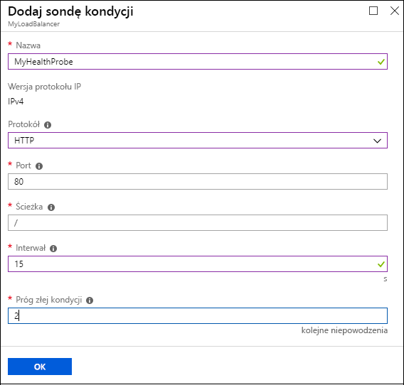
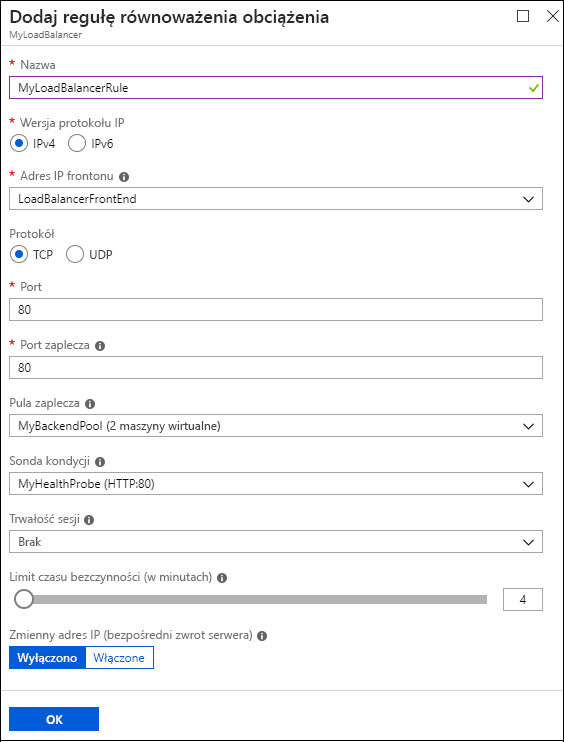

# <a name="quickstart-create-a-basic-load-balancer-by-using-the-azure-portal"></a>Szybki start: Tworzenie podstawowego modułu równoważenia obciążenia przy użyciu witryny Azure Portal

Równoważenie obciążenia zapewnia większą dostępność i możliwości skalowania dzięki rozdzielaniu żądań przychodzących między maszyny wirtualne. Za pomocą witryny Azure Portal można utworzyć moduł równoważenia obciążenia i równoważyć obciążenie wśród maszyn wirtualnych. W tym przewodniku Szybki start pokazano, jak utworzyć i skonfigurować moduł równoważenia obciążenia, serwery zaplecza i zasoby sieciowe w warstwie cenowej Podstawowa.

Jeśli nie masz subskrypcji platformy Azure, przed rozpoczęciem utwórz [bezpłatne konto](https://azure.microsoft.com/free/?WT.mc_id=A261C142F). 

Aby wykonać zadania z tego przewodnika Szybki start, zaloguj się do witryny [Azure Portal](https://portal.azure.com).

## <a name="create-a-basic-load-balancer"></a>Tworzenie podstawowego modułu równoważenia obciążenia

Najpierw utwórz publiczny podstawowy moduł równoważenia obciążenia przy użyciu portalu. Utworzona przez Ciebie nazwa i publiczny adres IP są automatycznie konfigurowane jako fronton modułu równoważenia obciążenia.

1. W lewym górnym rogu ekranu kliknij pozycję **Utwórz zasób** > **Sieć** > **Moduł równoważenia obciążenia**.
2. Na karcie **Podstawy** na stronie **Tworzenie modułu równoważenia obciążenia** wprowadź lub wybierz poniższe informacje, zaakceptuj wartości domyślne pozostałych ustawień, a następnie wybierz pozycję **Przeglądanie + tworzenie**:

    | Ustawienie                 | Wartość                                              |
    | ---                     | ---                                                |
    | Subskrypcja               | Wybierz subskrypcję.    |    
    | Grupa zasobów         | Wybierz pozycję **Utwórz nową** i wpisz *MyResourceGroupLB* w polu tekstowym.|
    | Name (Nazwa)                   | *myLoadBalancer*                                   |
    | Region         | Wybierz pozycję **Europa Zachodnia**.                                        |
    | Type          | Wybierz pozycję **Publiczna**.                                        |
    | SKU           | Wybierz pozycję **Podstawowa**.                          |
    | Publiczny adres IP | Wybierz pozycję**Utwórz nowy**. |
    | Nazwa publicznego adresu IP              | *MyPublicIP*   |
    | Przypisanie| Statyczny|

3. Na karcie **Przeglądanie + tworzenie** kliknij pozycję **Utwórz**.   


## <a name="create-back-end-servers"></a>Tworzenie serwerów zaplecza

Następnie utwórz sieć wirtualną i dwie maszyny wirtualne w puli zaplecza podstawowego modułu równoważenia obciążenia. 

### <a name="create-a-virtual-network"></a>Tworzenie sieci wirtualnej

1. W lewym górnym rogu portalu wybierz pozycję **Utwórz zasób** > **Sieć** > **Sieć wirtualna**.
   
1. W okienku **Tworzenie sieci wirtualnej** wpisz lub wybierz następujące wartości:
   
   - **Nazwa**: wpisz *MyVnet*.
   - **Grupa zasobów**: rozwiń listę **Wybierz istniejącą**, a następnie wybierz pozycję **MyResourceGroupLB**. 
   - **Podsieć** > **Nazwa**: wpisz *MyBackendSubnet*.
   
1. Wybierz pozycję **Utwórz**.

   

### <a name="create-virtual-machines"></a>Tworzenie maszyn wirtualnych

1. W lewej górnej części portalu wybierz pozycję **Utwórz zasób** > **Compute** > **Windows Server 2016 Datacenter**. 
   
1. W obszarze **Tworzenie maszyny wirtualnej** wpisz lub wybierz następujące wartości na karcie **Podstawowe**:
   - **Subskrypcja** > **Grupa zasobów**: rozwiń listę i wybierz pozycję **MyResourceGroupLB**.
   - **Szczegóły wystąpienia** > **Nazwa maszyny wirtualnej**: wpisz *MyVM1*.
   - **Szczegóły wystąpienia** > **Opcje dostępności**: 
     1. rozwiń listę i wybierz pozycję **Zestaw dostępności**. 
     2. Wybierz pozycję **Utwórz nowy**, wpisz *MyAvailabilitySet* i wybierz przycisk **OK**.
  
1. Wybierz kartę **Sieć** lub wybierz pozycję **Dalej: Dyski**, a następnie pozycję **Dalej: Sieć**. 
   
   Upewnij się, że zostały wybrane następujące opcje:
   - **Sieć wirtualna**: **MyVnet**
   - **Podsieć**: **MyBackendSubnet**
   - **Publiczny adres IP**: **MyVM1-ip**
   
   Aby utworzyć nową sieciową grupę zabezpieczeń (NSG, network security group), czyli pewien typ zapory, w obszarze **Sieciowa grupa zabezpieczeń** wybierz pozycję **Zaawansowane**. 
   1. W polu **Konfigurowanie sieciowej grupy zabezpieczeń** wybierz pozycję **Utwórz nową**. 
   1. Wpisz *MyNetworkSecurityGroup* i wybierz przycisk **OK**. 
   
1. Wybierz kartę **Zarządzanie** lub wybierz pozycję **Dalej** > **Zarządzanie**. W obszarze **Monitorowanie** dla opcji **Diagnostyka rozruchu** ustaw wartość **Wyłączone**.
   
1. Wybierz pozycję **Przegląd + utwórz**.
   
1. Przejrzyj ustawienia, a następnie wybierz pozycję **Utwórz**. 

1. Postępuj zgodnie z instrukcjami, aby utworzyć drugą maszynę wirtualną o nazwie *MyVM2* z adresem **publicznego adresu IP** w postaci *MyVM2-ip* i wszystkimi innymi ustawieniami takimi samymi, jak w przypadku maszyny MyVM1. 

### <a name="create-nsg-rules-for-the-vms"></a>Tworzenie reguł sieciowej grupy zabezpieczeń dla maszyn wirtualnych

W tej sekcji utworzysz reguły sieciowej grupy zabezpieczeń (NSG) dla maszyn wirtualnych, aby zezwolić na przychodzące połączenia internetowe (HTTP) i połączenia pulpitu zdalnego (RDP).

1. Wybierz pozycję **Wszystkie zasoby** w menu po lewej stronie. Na liście zasobów wybierz pozycję **MyNetworkSecurityGroup** w grupie zasobów **MyResourceGroupLB**.
   
1. W obszarze **Ustawienia** wybierz pozycję **Reguły zabezpieczeń dla ruchu przychodzącego**, a następnie wybierz pozycję **Dodaj**.
   
1. W oknie dialogowym **Dodawanie reguły zabezpieczeń dla ruchu przychodzącego** dla reguły protokołu HTTP wpisz lub wybierz następujące opcje:
   
   - **Źródło**: wybierz pozycję **Tag usługi**.  
   - **Tag usługi źródłowej**: wybierz pozycję **Internet**. 
   - **Zakresy portów docelowych**: wpisz wartość *80*.
   - **Protokół**: wybierz pozycję **TCP**. 
   - **Akcja**: wybierz pozycję **Zezwalaj**.  
   - **Priorytet**: wpisz wartość *100*. 
   - **Nazwa**: wpisz *MyHTTPRule*. 
   - **Opis**: wpisz *Zezwalaj na HTTP*. 
   
1. Wybierz pozycję **Dodaj**. 
   
   
   
1. Powtórz powyższe kroki dla reguły ruchu przychodzącego protokołu RDP z następującymi różnymi wartościami:
   - **Zakresy portów docelowych**: wpisz wartość *3389*.
   - **Priorytet**: wpisz wartość *200*. 
   - **Nazwa**: wpisz *MyRDPRule*. 
   - **Opis**: wpisz *Zezwalaj na RDP*. 

## <a name="create-resources-for-the-load-balancer"></a>Tworzenie zasobów na potrzeby modułu równoważenia obciążenia

W tej sekcji skonfigurujesz ustawienia modułu równoważenia obciążenia dla puli adresów zaplecza, sondy kondycji i reguły modułu równoważenia obciążenia.

### <a name="create-a-backend-address-pool"></a>Tworzenie puli adresów zaplecza

Aby dystrybuować ruch do maszyn wirtualnych, moduł równoważenia obciążenia używa puli adresów zaplecza. Ta pula adresów zaplecza zawiera adresy IP wirtualnych interfejsów sieciowych (NIC, virtual network interface) połączonych z modułem równoważenia obciążenia. 

**Aby utworzyć pulę adresów zaplecza, która obejmuje maszyny VM1 i VM2:**

1. Wybierz pozycję **Wszystkie zasoby** w menu po lewej stronie, a następnie wybierz pozycję **MyLoadBalancer** na liście zasobów.
   
1. W obszarze **Ustawienia** wybierz pozycję **Pule zaplecza**, a następnie wybierz pozycję **Dodaj**.
   
1. Na stronie **Dodawanie puli zaplecza** wpisz lub wybierz następujące wartości:
   
   - **Nazwa**: wpisz *MyBackEndPool*.
   - **Skojarzone z**: rozwiń listę i wybierz pozycję **Zestaw dostępności**.
   - **Zestaw dostępności**: wybierz pozycję **MyAvailabilitySet**.
   
1. Wybierz pozycję **Dodaj docelową konfigurację protokołu IP sieci**. 
   1. Dodaj utworzone maszyny wirtualne (**MyVM1** i **MyVM2**) do puli zaplecza.
   2. Po dodaniu każdej maszyny otwórz listę rozwijaną i wybierz dla niej pozycję **Konfiguracja adresu IP sieci**. 
   
1. Kliknij przycisk **OK**.
   
   
   
1. Na stronie **Pule zaplecza** rozwiń węzeł **MyBackendPool** i upewnij się, że na liście znajdują się obydwie maszyny wirtualne: **VM1** i **VM2**.

### <a name="create-a-health-probe"></a>Tworzenie sondy kondycji

Sonda kondycji umożliwia modułowi równoważenia obciążenia monitorowanie stanu maszyny wirtualnej. Dynamicznie dodaje lub usuwa maszyny wirtualne w rotacji modułu równoważenia obciążenia na podstawie ich odpowiedzi na kontrole kondycji. 

**Aby utworzyć sondę kondycji w celu monitorowania kondycji maszyn wirtualnych:**

1. Wybierz pozycję **Wszystkie zasoby** w menu po lewej stronie, a następnie wybierz pozycję **MyLoadBalancer** na liście zasobów.
   
1. W obszarze **Ustawienia** wybierz pozycję **Sondy kondycji**, a następnie wybierz pozycję **Dodaj**.
   
1. Na stronie **Dodawanie sondy kondycji** wpisz lub wybierz następujące wartości:
   
   - **Nazwa**: wpisz *MyHealthProbe*.
   - **Protokół**: rozwiń listę i wybierz pozycję **HTTP**. 
   - **Port**: wpisz wartość *80*. 
   - **Ścieżka**: zaakceptuj */* dla domyślnego identyfikatora URI. Tę wartość można zastąpić dowolnym innym identyfikatorem URI. 
   - **Interwał**: wpisz wartość *15*. Interwał to liczba sekund między próbami sondy.
   - **Próg złej kondycji**: wpisz wartość *2*. Ta wartość to liczba kolejnych niepowodzeń sondy, które występują, zanim kondycja maszyny wirtualnej zostanie uznana za złą.
   
1. Kliknij przycisk **OK**.
   
   

### <a name="create-a-load-balancer-rule"></a>Tworzenie reguły modułu równoważenia obciążenia

Reguła modułu równoważenia obciążenia definiuje sposób dystrybucji ruchu do maszyn wirtualnych. Reguła definiuje konfigurację adresu IP frontonu na potrzeby ruchu przychodzącego, pulę adresów IP zaplecza do odbierania ruchu oraz wymagany port źródłowy i docelowy. 

Reguła modułu równoważenia obciążenia o nazwie **MyLoadBalancerRule** nasłuchuje na porcie 80 frontonu **LoadBalancerFrontEnd**. Ta reguła wysyła ruch sieciowy do puli adresów zaplecza **MyBackEndPool**, również przy użyciu portu 80. 

**Aby utworzyć regułę modułu równoważenia obciążenia:**


1. Wybierz pozycję **Wszystkie zasoby** w menu po lewej stronie, a następnie wybierz pozycję **MyLoadBalancer** na liście zasobów.
   
1. W obszarze **Ustawienia** wybierz pozycję **Reguły równoważenia obciążenia**, a następnie wybierz pozycję **Dodaj**.
   
1. Na stronie **Dodawanie reguły równoważenia obciążenia** wpisz lub wybierz następujące wartości:
   
   - **Nazwa**: wpisz *MyLoadBalancerRule*.
   - **Adres IP frontonu:** wpisz *LoadBalancerFrontend*.
   - **Protokół**: wybierz pozycję **TCP**.
   - **Port**: wpisz wartość *80*.
   - **Port zaplecza**: wpisz wartość *80*.
   - **Pula zaplecza**: wybierz pozycję **MyBackendPool**.
   - **Sonda kondycji**: wybierz pozycję **MyHealthProbe**. 
   
1. Kliknij przycisk **OK**.
   
   

## <a name="test-the-load-balancer"></a>Testowanie modułu równoważenia obciążenia

W celu przetestowania modułu równoważenia obciążenia na maszynach wirtualnych użyjesz publicznego adresu IP. 

W portalu na stronie **Przegląd** dla modułu **MyLoadBalancer** znajdź publiczny adres IP w obszarze **Publiczny adres IP**. Umieść kursor na tym adresie i wybierz ikonę **Kopiuj**, aby go skopiować. 

### <a name="install-iis-on-the-vms"></a>Instalowanie usług IIS na maszynach wirtualnych

Zainstaluj usługi Internet Information Services (IIS) na maszynach wirtualnych, aby ułatwić testowanie modułu równoważenia obciążenia.

**Aby połączyć pulpit zdalny (RDP) z maszyną wirtualną:**

1. W portalu wybierz pozycję **Wszystkie zasoby** w menu po lewej stronie. Z listy zasobów wybierz pozycję **MyVM1** w grupie zasobów **MyResourceGroupLB**.
   
1. Na stronie **Przegląd** wybierz pozycję **Połącz**, a następnie wybierz pozycję **Pobierz plik RDP**. 
   
1. Otwórz pobrany plik RDP i wybierz pozycję **Połącz**.
   
1. Na ekranie zabezpieczeń systemu Windows wybierz pozycję **Więcej opcji**, a następnie pozycję **Użyj innego konta**. 
   
   Wprowadź nazwę użytkownika i hasło, a następnie wybierz przycisk **OK**.
   
1. Na każdy monit dotyczący certyfikatu odpowiedz **Tak**. 
   
   Pulpit maszyny wirtualnej zostanie otwarty w nowym oknie. 
   
**Aby zainstalować usługi IIS**

1. Wybierz **wszystkich usług** w menu po lewej stronie wybierz **wszystkie zasoby**, a następnie na liście zasobów wybierz **myVM1** znajdującą się w  *myResourceGroupSLB* grupy zasobów.
2. Na stronie **Przegląd** wybierz pozycję **Połącz** dla protokołu RDP z maszyną wirtualną.
5. Zaloguj się do maszyny wirtualnej przy użyciu poświadczeń podanych podczas jej tworzenia. Spowoduje to uruchomienie sesji pulpitu zdalnego z maszyną wirtualną — *myVM1*.
6. Na pulpicie serwera przejdź do pozycji **Narzędzia administracyjne systemu Windows**>**Windows PowerShell**.
7. W oknie programu PowerShell uruchom poniższe polecenia, aby zainstalować serwer usług IIS, usunąć domyślny plik iisstart.htm i dodać nowy plik iisstart.htm, który wyświetla nazwę maszyny wirtualnej:

   ```azurepowershell
    
    # install IIS server role
    Install-WindowsFeature -name Web-Server -IncludeManagementTools
    
    # remove default htm file
    remove-item  C:\inetpub\wwwroot\iisstart.htm
    
    # Add a new htm file that displays server name
    Add-Content -Path "C:\inetpub\wwwroot\iisstart.htm" -Value $("Hello World from " + $env:computername)
   ```
6. Zamknij sesję protokołu RDP na maszynie wirtualnej *myVM1*.
7. Powtórz kroki od 1 do 6, aby zainstalować usługi IIS i zaktualizowany plik iisstart.htm na maszynie wirtualnej *myVM2*.
   
1. Powtórz te kroki dla maszyny wirtualnej **MyVM2**, tylko dla serwera docelowego ustaw wartość **MyVM2**.

### <a name="test-the-load-balancer"></a>Testowanie modułu równoważenia obciążenia

Otwórz przeglądarkę i wklej publiczny adres IP modułu równoważenia obciążenia na pasku adresu przeglądarki. W przeglądarce powinna zostać wyświetlona domyślna strona serwera internetowego usług IIS.


Aby zobaczyć, jak moduł równoważenia obciążenia rozdziela ruch między dwie maszyny wirtualne używane przez aplikację, możesz wymusić odświeżenie w przeglądarce internetowej.
## <a name="clean-up-resources"></a>Oczyszczanie zasobów

Aby usunąć moduł równoważenia obciążenia i wszystkie powiązane z nim zasoby, kiedy nie będą już potrzebne, otwórz grupę zasobów **MyResourceGroupLB** i wybierz pozycję **Usuń grupę zasobów**.

## <a name="next-steps"></a>Następne kroki

W tym przewodniku Szybki Start utworzono moduł równoważenia obciążenia w warstwie Podstawowa. Utworzono i skonfigurowano grupę zasobów, zasoby sieciowe, serwery zaplecza, sondę kondycji i reguły do użytku z modułem równoważenia obciążenia. Zainstalowano usługi IIS na maszynach wirtualnych i użyto ich do przetestowania modułu równoważenia obciążenia. 

Aby dowiedzieć się więcej na temat usługi Azure Load Balancer, przejdź do samouczków.

> [!div class="nextstepaction"]
> [Samouczki usługi Azure Load Balancer](tutorial-load-balancer-basic-internal-portal.md)
