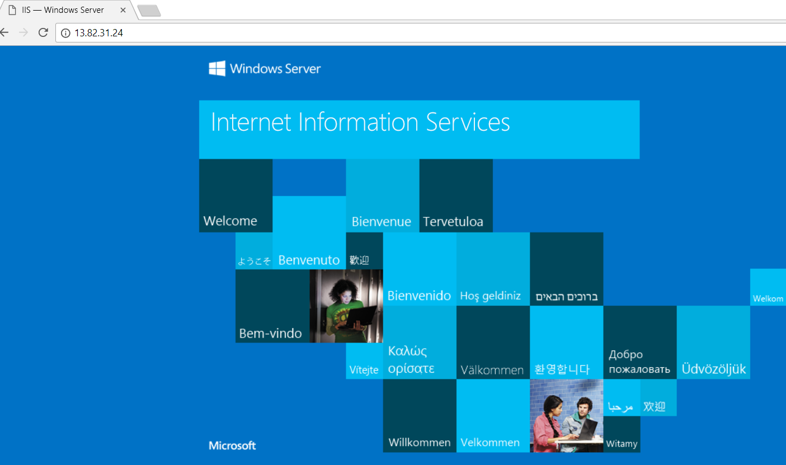

# Szybki start: Tworzenie usługi Load Balancer w warstwie Standardowa przy użyciu witryny Azure Portal w celu równoważenia obciążenia maszyn wirtualnych

Równoważenie obciążenia zapewnia większą dostępność i możliwości skalowania dzięki rozdzielaniu żądań przychodzących między wiele maszyn wirtualnych. Za pomocą witryny Azure Portal można utworzyć moduł równoważenia obciążenia na potrzeby równoważenia obciążenia maszyn wirtualnych. W tym przewodniku Szybki start pokazano, jak zrównoważyć obciążenie maszyn wirtualnych przy użyciu usługi Load Balancer w warstwie Standardowa.

Jeśli nie masz subskrypcji platformy Azure, przed rozpoczęciem utwórz [bezpłatne konto](https://azure.microsoft.com/free/?WT.mc_id=A261C142F). 

## Logowanie do platformy Azure

Zaloguj się do witryny Azure Portal pod adresem [https://portal.azure.com](https://portal.azure.com).

## Tworzenie usługi Load Balancer w warstwie Standardowa

W tej sekcji opisano tworzenie standardowego modułu równoważenia obciążenia, który pomaga równoważyć obciążenie maszyn wirtualnych. Usługa Load Balancer w warstwie Standardowa obsługuje tylko publiczny adres IP w warstwie Standardowa. Podczas tworzenia usługi Load Balancer w warstwie Standardowa musisz także utworzyć nowy publiczny adres IP w warstwie Standardowa, który jest skonfigurowany jako fronton (domyślnie o nazwie *LoadBalancerFrontend*) dla usługi Load Balancer w warstwie Standardowa. 

1. W lewym górnym rogu ekranu wybierz **Utwórz zasób** > **sieć** > **modułu równoważenia obciążenia**.
2. Na karcie **Podstawy** na stronie **Tworzenie modułu równoważenia obciążenia** wprowadź lub wybierz poniższe informacje, zaakceptuj wartości domyślne pozostałych ustawień, a następnie wybierz pozycję **Przeglądanie + tworzenie**:

    | Ustawienie                 | Wartość                                              |
    | ---                     | ---                                                |
    | Subskrypcja               | Wybierz subskrypcję.    |    
    | Grupa zasobów         | Wybierz **Utwórz nową** i typ *myResourceGroupSLB* w polu tekstowym.|
    | Name (Nazwa)                   | *myLoadBalancer*                                   |
    | Region         | Wybierz pozycję **Europa Zachodnia**.                                        |
    | Type          | Wybierz pozycję **Publiczna**.                                        |
    | SKU           | Wybierz opcję **Standardowa**.                          |
    | Publiczny adres IP | Wybierz pozycję**Utwórz nowy**. |
    | Nazwa publicznego adresu IP              | Wpisz *myPublicIP* w polu tekstowym.   |
    |Strefa dostępności| Wybierz pozycję **Strefowo nadmiarowy**.    |
3. W **przeglądu + Utwórz** zaznacz **Utwórz**.   

    

## Tworzenie zasobów modułu równoważenia obciążenia

W tej sekcji należy skonfigurować ustawienia usługi równoważenia obciążenia dla puli adresów zaplecza, sondę kondycji i określić reguły modułu równoważenia.

### Tworzenie puli adresów zaplecza

Kierowanie ruchu do maszyn wirtualnych, adres IP zawiera pulę adresów zaplecza adresów wirtualnych kart sieciowych połączonych z modułem równoważenia obciążenia. Tworzenie puli adresów zaplecza *myBackendPool* obejmujący maszyny wirtualne na potrzeby równoważenia obciążenia ruchu internetowego.

1. Wybierz **wszystkich usług** w menu po lewej stronie wybierz **wszystkie zasoby**, a następnie wybierz pozycję **myLoadBalancer** na liście zasobów.
2. W obszarze **ustawienia**, wybierz opcję **pule zaplecza**, a następnie wybierz **Dodaj**.
3. Na **Dodawanie puli zaplecza** strony dla nazwy, typu *myBackendPool*, jako nazwę puli zaplecza, a następnie wybierz **Dodaj**.

### Tworzenie sondy kondycji

Aby zezwolić na moduł równoważenia obciążenia monitorować stan aplikacji, należy użyć sondy kondycji. Sonda kondycji dynamicznie dodaje lub usuwa maszyny wirtualne w rotacji modułu równoważenia obciążenia na podstawie ich odpowiedzi na kontrole kondycji. Utwórz sondę kondycji *myHealthProbe*, aby monitorować kondycję maszyn wirtualnych.

1. Wybierz **wszystkich usług** w menu po lewej stronie wybierz **wszystkie zasoby**, a następnie wybierz pozycję **myLoadBalancer** na liście zasobów.
2. W obszarze **ustawienia**, wybierz opcję **sondy kondycji**, a następnie wybierz **Dodaj**.
    
    | Ustawienie | Wartość |
    | ------- | ----- |
    | Name (Nazwa) | Wprowadź *myHealthProbe*. |
    | Protokół | Wybierz **HTTP**. |
    | Port | Wprowadź *80*.|
    | Interval | Wprowadź *15* liczbę **interwał** w ciągu kilku sekund między próbami sondy. |
    | Próg złej kondycji | Wybierz *2* liczbę **próg złej kondycji** lub kolejnych niepowodzeń sondy musi wystąpić, zanim maszyny Wirtualnej jest uznawana za złą.|
    | Sonda kondycji | Wybierz *myHealthProbe*. |
4. Kliknij przycisk **OK**.

### Tworzenie reguły modułu równoważenia obciążenia
Reguła modułu równoważenia obciążenia służy do definiowania sposobu dystrybucji ruchu do maszyn wirtualnych. Zdefiniuj konfigurację adresu IP frontonu na potrzeby ruchu przychodzącego oraz pulę adresów IP zaplecza do odbierania ruchu, wraz z wymaganym portem źródłowym i docelowym. Utwórz regułę modułu równoważenia obciążenia *myLoadBalancerRuleWeb* w celu nasłuchiwania na porcie 80 w frontonie *Myfrontendpool* i wysyłania ruchu sieciowego o zrównoważonym obciążeniu do puli adresów zaplecza *myBackEndPool* również przy użyciu portu 80. 

1. Wybierz **wszystkich usług** w menu po lewej stronie wybierz **wszystkie zasoby**, a następnie wybierz pozycję **myLoadBalancer** na liście zasobów.
2. W obszarze **ustawienia**, wybierz opcję **reguły równoważenia obciążenia**, a następnie wybierz **Dodaj**.
3. Skonfiguruj regułę równoważenia obciążenia, używając następujących wartości:
    
    | Ustawienie | Wartość |
    | ------- | ----- |
    | Name (Nazwa) | Wprowadź *myHTTPRule*. |
    | Protokół | wybierz pozycję **TCP**. |
    | Port | Wprowadź *80*.|
    | Port zaplecza | Wprowadź *80*. |
    | Pula zaplecza | Select *myBackendPool*.|
    | Sonda kondycji | Wybierz *myHealthProbe*. |
4. Pozostaw resztę ustawień domyślnych, a następnie wybierz pozycję **OK**.
4. Kliknij przycisk **OK**.

## Tworzenie serwerów zaplecza

W tej sekcji Utwórz sieć wirtualną, Utwórz dwie maszyny wirtualne dla puli zaplecza modułu równoważenia obciążenia i następnie zainstalujesz usługi IIS na maszynach wirtualnych, aby ułatwić testowanie modułu równoważenia obciążenia.

### Tworzenie sieci wirtualnej
1. W lewym górnym rogu ekranu wybierz pozycję **Utwórz zasób** > **Sieć** > **Sieć wirtualna**.

1. W obszarze **Utwórz sieć wirtualną** wprowadź lub wybierz następujące informacje:

    | Ustawienie | Wartość |
    | ------- | ----- |
    | Name (Nazwa) | Wprowadź nazwę *myVNet*. |
    | Przestrzeń adresowa | Wprowadź adres *10.1.0.0/16*. |
    | Subskrypcja | Wybierz subskrypcję.|
    | Grupa zasobów | Wybierz istniejący zasób - *myResourceGroupSLB*. |
    | Lokalizacja | Wybierz pozycję **Europa Zachodnia**.|
    | Podsieć — nazwa | Wprowadź nazwę podsieci *myBackendSubnet*. |
    | Zakres adresów podsieci: 10.41.0.0/24 | Wprowadź *10.1.0.0/24*. |
1. Pozostaw resztę ustawień domyślnych, a następnie wybierz pozycję **Utwórz**.

### Tworzenie maszyn wirtualnych
Load Balancer w warstwie standardowa obsługuje tylko maszyny wirtualne z adresami IP w warstwie standardowa w puli zaplecza. W tej sekcji utworzysz dwie maszyny wirtualne (*myVM1* i *myVM2*) przy użyciu standardowego publicznego adresu IP w dwóch różnych stref (*strefa 1* i *strefa 2*), są dodawane do puli zaplecza standardowego modułu równoważenia obciążenia, który został utworzony wcześniej.

1. W lewej górnej części portalu wybierz pozycję **Utwórz zasób** > **Compute** > **Windows Server 2016 Datacenter**. 
   
1. W obszarze **Tworzenie maszyny wirtualnej** wpisz lub wybierz następujące wartości na karcie **Podstawowe**:
   - **Subskrypcja** > **Grupa zasobów**: Select **myResourceGroupSLB**.
   - **Szczegóły wystąpienia** > **Nazwa maszyny wirtualnej**: Typ *myVM1*.
   - **Szczegóły wystąpienia** > **Region** > Wybierz **Europa Zachodnia**.
   - **Szczegóły wystąpienia** > **opcji dostępności** > Wybierz **strefy dostępności**. 
   - **Szczegóły wystąpienia** > **strefy dostępności** > Wybierz **1**.
  
1. Wybierz kartę **Sieć** lub wybierz pozycję **Dalej: Dyski**, a następnie pozycję **Dalej: Sieć**. 
   
   - Upewnij się, że zostały wybrane następujące opcje:
       - **Sieć wirtualna**: *myVnet*
       - **Podsieci**: *myBackendSubnet*
       - **Publiczny adres IP** > Wybierz **Utwórz nową**i w **tworzenie publicznego adresu IP** oknie dla **jednostki SKU**, wybierz opcję **standardowa**, i **strefy dostępności**, wybierz opcję **strefowo nadmiarowe**, a następnie wybierz pozycję **OK**.
   - Aby utworzyć nową sieciową grupę zabezpieczeń (NSG, network security group), czyli pewien typ zapory, w obszarze **Sieciowa grupa zabezpieczeń** wybierz pozycję **Zaawansowane**. 
       1. W polu **Konfigurowanie sieciowej grupy zabezpieczeń** wybierz pozycję **Utwórz nową**. 
       1. Typ *myNetworkSecurityGroup*i wybierz **OK**.
   - Aby utworzyć maszynę Wirtualną częścią puli zaplecza modułu równoważenia obciążenia, wykonaj następujące czynności:
        - W **Równoważenie obciążenia**, aby uzyskać **umieścić tej maszyny wirtualnej za modułem istniejące rozwiązanie do równoważenia obciążenia?**, wybierz opcję **tak**.
        - W **ustawienia równoważenia obciążenia**, aby uzyskać **opcje równoważenia obciążenia**, wybierz opcję **usługa Azure load balancer**.
        - Aby uzyskać **wybrać moduł równoważenia obciążenia**, *myLoadBalancer*. 
1. Wybierz kartę **Zarządzanie** lub wybierz pozycję **Dalej** > **Zarządzanie**. W obszarze **Monitorowanie** dla opcji **Diagnostyka rozruchu** ustaw wartość **Wyłączone**. 
1. Wybierz pozycję **Przegląd + utwórz**.   
1. Przejrzyj ustawienia, a następnie wybierz pozycję **Utwórz**.
1. Postępuj zgodnie z instrukcjami, aby utworzyć drugą maszynę Wirtualną o nazwie *myVM2*, za pomocą standardowej jednostki SKU publicznego adresu IP o nazwie *myVM2 ip*, i **strefy dostępności** ustawienie **2** i inne ustawienia takie same jak *myVM1*. 

### Tworzenie reguły sieciowej grupy zabezpieczeń

W tej sekcji utworzysz reguły sieciowej grupy zabezpieczeń, aby zezwolić na połączenia przychodzące za pośrednictwem protokołu HTTP.

1. Wybierz **wszystkich usług** w menu po lewej stronie wybierz **wszystkie zasoby**, a następnie z zasobów z listy wybierz **myNetworkSecurityGroup** znajdującą się w **myResourceGroupSLB** grupy zasobów.
2. W obszarze **Ustawienia** wybierz pozycję **Reguły zabezpieczeń dla ruchu przychodzącego**, a następnie wybierz pozycję **Dodaj**.
3. Wprowadź następujące wartości dla reguły zabezpieczeń dla ruchu przychodzącego o nazwie *myHTTPRule*, aby umożliwić obsługę przychodzących połączeń HTTP przy użyciu portu 80:
    - *Tag usługi* — w polu **Źródło**.
    - *Internet* — w polu **Tag usługi źródłowej**
    - *80* — w polu **Docelowe zakresy portów**
    - *TCP* — w polu **Protokół**
    - *Zezwalaj* — w polu **Akcja**
    - *100* — w polu **Priorytet**
    - *myHTTPRule* — jako nazwę
    - *Zezwalaj na HTTP* —jako opis
4. Kliknij przycisk **OK**.
 
### Instalowanie usług IIS

1. Wybierz **wszystkich usług** w menu po lewej stronie wybierz **wszystkie zasoby**, a następnie na liście zasobów wybierz **myVM1** znajdującą się w  *myResourceGroupSLB* grupy zasobów.
2. Na stronie **Przegląd** wybierz pozycję **Połącz** dla protokołu RDP z maszyną wirtualną.
3. Zaloguj się do maszyny wirtualnej przy użyciu nazwy użytkownika *azureuser*.
4. Na pulpicie serwera przejdź do pozycji **Narzędzia administracyjne systemu Windows**>**Menedżer serwera**.
5. W Menedżerze serwera wybierz **Dodaj role i funkcje**.
6. W **kreatorze dodawania ról i funkcji** użyj następujących wartości:
    - W **Wybieranie typu instalacji** wybierz **Instalacja oparta na rolach lub oparta na funkcjach**.
    - W **serwer docelowy wybierz** wybierz **myVM1**
    - W **Wybieranie roli serwera** wybierz **serwer sieci Web (IIS)**
    - Postępuj zgodnie z instrukcjami, aby ukończyć pozostałą część kreatora. 
7. Powtórz kroki od 1 do 6 dla maszyny wirtualnej *myVM2*.

## Testowanie modułu równoważenia obciążenia
1. Znajdź publiczny adres IP dla usługi Load Balancer na ekranie **Przegląd**. Wybierz **wszystkich usług** w menu po lewej stronie wybierz **wszystkie zasoby**, a następnie wybierz pozycję **myPublicIP**.

2. Skopiuj publiczny adres IP, a następnie wklej go na pasku adresu przeglądarki. W przeglądarce jest wyświetlana domyślna strona internetowego serwera usług IIS.

      

Aby zobaczyć moduł równoważenia obciążenia rozdziela ruch między wszystkie trzy maszyny wirtualne z tą aplikacją, możesz wymusić odświeżenie przeglądarki sieci web.

## Oczyszczanie zasobów

Gdy nie są już potrzebne, Usuń grupę zasobów, moduł równoważenia obciążenia i wszystkich powiązanych zasobów. Aby to zrobić, wybierz grupę zasobów (*myResourceGroupSLB*), zawierający modułu równoważenia obciążenia, a następnie wybierz pozycję **Usuń**.

## Kolejne kroki

W tym przewodniku Szybki Start utworzono standardowego modułu równoważenia obciążenia, dołączono maszyny wirtualne do niego, skonfigurowane reguły modułu równoważenia obciążenia ruchu, sondy kondycji i następnie przetestowano moduł równoważenia obciążenia. Aby dowiedzieć się więcej na temat usługi Azure Load Balancer, przejdź do samouczków dotyczących usługi Azure Load Balancer.

> [!div class="nextstepaction"]
> [Samouczki usługi Azure Load Balancer](tutorial-load-balancer-standard-public-zone-redundant-portal.md)
