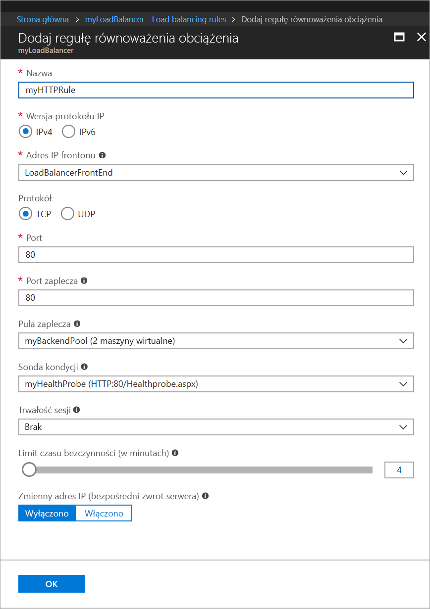

# Szybki start: Tworzenie usługi Load Balancer w warstwie Standardowa przy użyciu witryny Azure Portal w celu równoważenia obciążenia maszyn wirtualnych

Równoważenie obciążenia zapewnia większą dostępność i możliwości skalowania dzięki rozdzielaniu żądań przychodzących między wiele maszyn wirtualnych. Za pomocą witryny Azure Portal można utworzyć moduł równoważenia obciążenia na potrzeby równoważenia obciążenia maszyn wirtualnych. W tym przewodniku Szybki start pokazano, jak zrównoważyć obciążenie maszyn wirtualnych przy użyciu usługi Load Balancer w warstwie Standardowa.

Jeśli nie masz subskrypcji platformy Azure, przed rozpoczęciem utwórz [bezpłatne konto](https://azure.microsoft.com/free/?WT.mc_id=A261C142F). 

## Logowanie do platformy Azure

Zaloguj się do witryny Azure Portal pod adresem [http://portal.azure.com](http://portal.azure.com).

## Tworzenie publicznego modułu równoważenia obciążenia

W tej sekcji utworzysz publiczny moduł równoważenia obciążenia, który pomaga równoważyć obciążenie maszyn wirtualnych. Usługa Load Balancer w warstwie Standardowa obsługuje tylko publiczny adres IP w warstwie Standardowa. Podczas tworzenia usługi Load Balancer w warstwie Standardowa musisz także utworzyć nowy publiczny adres IP w warstwie Standardowa, który jest skonfigurowany jako fronton (domyślnie o nazwie *LoadBalancerFrontend*) dla usługi Load Balancer w warstwie Standardowa. 

1. W lewym górnym rogu ekranu kliknij pozycję **Utwórz zasób** > **Sieć** > **Moduł równoważenia obciążenia**.
2. Na stronie **Tworzenie modułu równoważenia obciążenia** wprowadź lub wybierz poniższe informacje, zaakceptuj wartości domyślne pozostałych ustawień, a następnie wybierz pozycję **Utwórz**:

    | Ustawienie                 | Wartość                                              |
    | ---                     | ---                                                |
    | Name (Nazwa)                   | *myLoadBalancer*                                   |
    | Typ          | Public                                        |
    | SKU           | Standardowa (Standard)                          |
    | Publiczny adres IP | Wybierz polecenie **Utwórz nowy** i w polu tekstowym wpisz wartość *myPublicIP*. Dla publicznego adresu IP domyślnie zaznaczono standardową jednostkę SKU. W obszarze **Strefa dostępności** wybierz pozycję **Strefowo nadmiarowy**. |
    | Subskrypcja               | Wybierz subskrypcję.    |
    |Grupa zasobów | Wybierz polecenie **Utwórz nową**, a następnie wpisz wartość *myResourceGroupSLB*.    |
    | Lokalizacja           | Wybierz pozycję **Europa Zachodnia**.                          |
    

## Tworzenie serwerów zaplecza

W tej sekcji utworzysz sieć wirtualną, następnie dwie maszyny wirtualne dla puli zaplecza modułu równoważenia obciążenia, a następnie zainstalujesz usługi IIS na maszynach wirtualnych, aby ułatwić testowanie modułu równoważenia obciążenia.

### Tworzenie sieci wirtualnej
1. W lewej górnej części ekranu kliknij pozycję **Nowy** > **Sieć** > **Sieć wirtualna**, a następnie wprowadź następujące wartości dla sieci wirtualnej:
    - *myVnet* — jako nazwę sieci wirtualnej.
    - *myResourceGroupSLB* — jako nazwę istniejącej grupy zasobów.
    - *myBackendSubnet* — jako nazwę podsieci.
2. Kliknij pozycję **Utwórz**, aby utworzyć sieć wirtualną.

    

### Tworzenie maszyn wirtualnych

1. W lewej górnej części ekranu kliknij pozycję **Nowy** > **Obliczenia** > **Windows Server 2016 Datacenter** i wprowadź następujące wartości dla maszyny wirtualnej:
    - *myVM1* — jako nazwę maszyny wirtualnej.        
    - *myResourceGroupSLB* — w obszarze **Grupa zasobów** wybierz opcję **Użyj istniejącej**, a następnie wybierz wartość *myResourceGroupSLB*.
2. Kliknij przycisk **OK**.
3. Wybierz **DS1_V2** jako rozmiar maszyny wirtualnej, a następnie kliknij pozycję **Wybierz**.
4. Wprowadź następujące wartości ustawień maszyny wirtualnej:
    1. Upewnij się, że wybrano sieć wirtualną *myVNet* i podsieć *myBackendSubnet*.
    2. W obszarze **Publiczny adres IP** w okienku **Utwórz publiczny adres IP** wybierz pozycję **Standardowa**, a następnie wybierz pozycję **OK**.
    3. W obszarze **Sieciowa grupa zabezpieczeń** wybierz pozycję **Zaawansowane**, a następnie wykonaj następujące czynności:
        1. Wybierz pozycję *Sieciowa grupa zabezpieczeń (zapora) i na stronie **Wybieranie grupy zabezpieczeń sieci** wybierz pozycję **Utwórz nową**. 
        2. Na stronie **Tworzenie sieciowej grupy zabezpieczeń** w polu **Nazwa** wprowadź wartość *myNetworkSecurityGroup*, a następnie wybierz pozycję **OK**.
5. Kliknij pozycję **Wyłączone**, aby wyłączyć diagnostykę rozruchu.
6. Kliknij przycisk **OK**, przejrzyj ustawienia na stronie podsumowania, a następnie kliknij przycisk **Utwórz**.
7. Korzystając z kroków 1–6, utwórz drugą maszynę wirtualną o nazwie *VM2* z następującymi ustawieniami: zestawem dostępności *myAvailibilityset*, siecią wirtualną *myVnet*, podsiecią *myBackendSubnet* i sieciową grupą zabezpieczeń *myNetworkSecurityGroup*. 

### Tworzenie reguły sieciowej grupy zabezpieczeń

W tej sekcji utworzysz reguły sieciowej grupy zabezpieczeń, aby zezwolić na połączenia przychodzące przy użyciu protokołu HTTP.

1. W menu po lewej stronie kliknij pozycję **Wszystkie zasoby**, a następnie na liście zasobów kliknij pozycję **myNetworkSecurityGroup** znajdującą się w grupie zasobów **myResourceGroupSLB**.
2. W obszarze **Ustawienia** kliknij pozycję **Reguły zabezpieczeń dla ruchu przychodzącego**, a następnie kliknij przycisk **Dodaj**.
3. Wprowadź następujące wartości dla reguły zabezpieczeń dla ruchu przychodzącego o nazwie *myHTTPRule*, aby umożliwić obsługę przychodzących połączeń HTTP przy użyciu portu 80:
    - *Tag usługi* — w polu **Źródło**.
    - *Internet* — w polu **Tag usługi źródłowej**
    - *80* — w polu **Docelowe zakresy portów**
    - *TCP* — w polu **Protokół**
    - *Zezwalaj* — w polu **Akcja**
    - *100* — w polu **Priorytet**
    - *myHTTPRule* — jako nazwę
    - *Zezwalaj na HTTP* —jako opis
4. Kliknij przycisk **OK**.
 
### Instalowanie usług IIS

1. W menu po lewej stronie kliknij pozycję **Wszystkie zasoby**, a następnie na liście zasobów kliknij pozycję **myVM1** znajdującą się w grupie zasobów *myResourceGroupLB*.
2. Na stronie **Przegląd** kliknij pozycję **Połącz** dla protokołu RDP z maszyną wirtualną.
3. Zaloguj się do maszyny wirtualnej przy użyciu nazwy użytkownika *azureuser*.
4. Na pulpicie serwera przejdź do pozycji **Narzędzia administracyjne systemu Windows**>**Menedżer serwera**.
5. W Menedżerze serwera kliknij pozycję **Dodaj role i funkcje**.
6. W **kreatorze dodawania ról i funkcji** użyj następujących wartości:
    - Na stronie **Wybieranie typu instalacji** kliknij pozycję **Instalacja oparta na rolach lub funkcjach**.
    - Na stronie **Wybieranie serwera docelowego** kliknij pozycję **myVM1**.
    - Na stronie **Wybieranie roli serwera** kliknij pozycję **Serwer sieci Web (IIS)**.
    - Postępuj zgodnie z instrukcjami, aby ukończyć pozostałą część kreatora. 
7. Powtórz kroki od 1 do 6 dla maszyny wirtualnej *myVM2*.

## Tworzenie zasobów modułu równoważenia obciążenia

W tej sekcji skonfigurujesz ustawienia modułu równoważenia obciążenia dla puli adresów zaplecza i sondy kondycji oraz określisz reguły modułu równoważenia obciążenia.

### Tworzenie puli adresów zaplecza

Na potrzeby rozdzielania ruchu między maszyny wirtualne używana jest pula adresów zaplecza, zawierająca adresy IP wirtualnych kart sieciowych połączonych z modułem równoważenia obciążenia. Utwórz pulę adresów zaplecza *myBackendPool* obejmującą maszyny wirtualne *VM1* i *VM2*.

1. W menu po lewej stronie kliknij pozycję **Wszystkie zasoby**, a następnie na liście zasobów kliknij pozycję **myLoadBalancer**.
2. W obszarze **Ustawienia** kliknij pozycję **Pule zaplecza**, a następnie kliknij pozycję **Dodaj**.
3. Na stronie **Dodawanie puli zaplecza** wykonaj następujące czynności:
   - W polu nazwy wpisz *myBackendPool* jako nazwę puli zaplecza.
   - W obszarze **Sieć wirtualna** wybierz pozycję *myVNet*.
   - W obszarze **Maszyna wirtualna** dodaj wartości *myVM1* i *my VM2* wraz z odpowiadającymi im adresami IP, a następnie wybierz polecenie **Dodaj**.
    - Kliknij przycisk **OK**.

3. Upewnij się, że ustawienie puli zaplecza modułu równoważenia obciążenia wyświetla obie maszyny wirtualne — **VM1** i **VM2**.

### Tworzenie sondy kondycji

Sonda kondycji umożliwia modułowi równoważenia obciążenia monitorowanie stanu aplikacji. Dynamicznie dodaje lub usuwa maszyny wirtualne w rotacji modułu równoważenia obciążenia na podstawie ich odpowiedzi na kontrole kondycji. Utwórz sondę kondycji *myHealthProbe*, aby monitorować kondycję maszyn wirtualnych.

1. W menu po lewej stronie kliknij pozycję **Wszystkie zasoby**, a następnie na liście zasobów kliknij pozycję **myLoadBalancer**.
2. W obszarze **Ustawienia** kliknij pozycję **Sondy kondycji**, a następnie kliknij pozycję **Dodaj**.
3. Utwórz sondę kondycji, używając następujących wartości:
    - *myHealthProbe* — jako nazwy sondy kondycji.
    - **HTTP** — jako typu protokołu.
    - *80* — jako numeru portu.
    - *Healthprobe.aspx* — jako ścieżki identyfikatora URI. Możesz zastąpić tę wartość dowolnym innym identyfikatorem URI lub zachować domyślną wartość ścieżki **"\\"**, aby uzyskać domyślny identyfikator URI.
    - *15* — w polu **Interwał** jako liczbę sekund między próbami sondy.
    - *2* — w polu **Próg złej kondycji** jako liczbę kolejnych niepowodzeń sondy, które muszą wystąpić, aby maszyna wirtualna została uznana za będącą w złej kondycji.
4. Kliknij przycisk **OK**.

   

### Tworzenie reguły modułu równoważenia obciążenia

Reguła modułu równoważenia obciążenia służy do definiowania sposobu dystrybucji ruchu do maszyn wirtualnych. Zdefiniuj konfigurację adresu IP frontonu na potrzeby ruchu przychodzącego oraz pulę adresów IP zaplecza do odbierania ruchu, wraz z wymaganym portem źródłowym i docelowym. Utwórz regułę modułu równoważenia obciążenia *myLoadBalancerRuleWeb* w celu nasłuchiwania na porcie 80 w puli frontonu *myFrontEndPool* i wysyłania ruchu sieciowego o zrównoważonym obciążeniu do puli adresów zaplecza *myBackEndPool*, również przy użyciu portu 80. 

1. W menu po lewej stronie kliknij pozycję **Wszystkie zasoby**, a następnie na liście zasobów kliknij pozycję **myLoadBalancer**.
2. W obszarze **Ustawienia** kliknij pozycję **Reguły równoważenia obciążenia**, a następnie kliknij pozycję **Dodaj**.
3. Skonfiguruj regułę równoważenia obciążenia, używając następujących wartości:
    - *myHTTPRule* — jako nazwy reguły równoważenia obciążenia.
    - **TCP** — jako typu protokołu.
    - *80* — jako numeru portu.
    - *80* — jako portu zaplecza.
    - *myBackendPool* — jako nazwy puli zaplecza.
    - *myHealthProbe* — jako nazwy sondy kondycji.
4. Kliknij przycisk **OK**.
    
    

## Testowanie modułu równoważenia obciążenia
1. Znajdź publiczny adres IP dla usługi Load Balancer na ekranie **Przegląd**. Kliknij pozycję **Wszystkie zasoby**, a następnie kliknij pozycję **myPublicIP**.

2. Skopiuj publiczny adres IP, a następnie wklej go na pasku adresu przeglądarki. W przeglądarce jest wyświetlana domyślna strona internetowego serwera usług IIS.

      

## Oczyszczanie zasobów

Gdy grupa zasobów, moduł równoważenia obciążenia i wszystkie pokrewne zasoby nie będą już potrzebne, usuń je. Aby to zrobić, wybierz grupę zasobów zawierającą moduł równoważenia obciążenia, a następnie kliknij przycisk **Usuń**.

## Następne kroki

W tym przewodniku Szybki start utworzono moduł równoważenia obciążenia usługi Load Balancer w warstwie Standardowa, dołączono do niego maszyny wirtualne, skonfigurowano regułę ruchu modułu równoważenia obciążenia i sondę kondycji, a następnie przetestowano moduł równoważenia obciążenia. Aby dowiedzieć się więcej na temat usługi Azure Load Balancer, przejdź do samouczków dotyczących usługi Azure Load Balancer.

> [!div class="nextstepaction"]
> [Samouczki usługi Azure Load Balancer](tutorial-load-balancer-standard-public-zone-redundant-portal.md)
