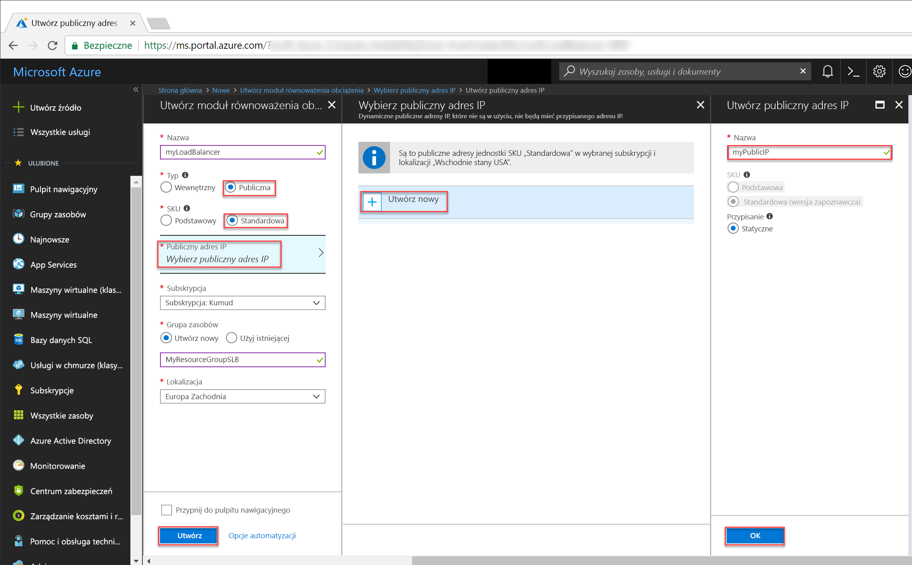
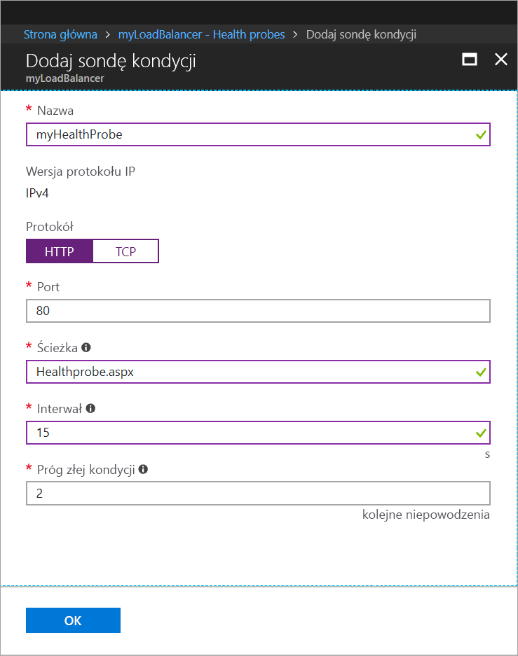
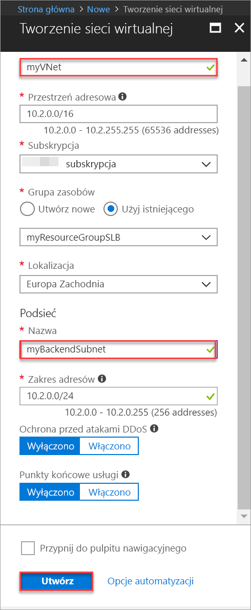

# <a name="tutorial-configure-port-fowarding-in-load-balancer-using-the-azure-portal"></a>Samouczek: konfigurowanie przekierowania portów w usłudze Load Balancer za pomocą witryny Azure Portal

Przekierowanie portów przy użyciu usługi Azure Load Balancer umożliwia zdalne łączenie się z maszynami wirtualnymi w sieci wirtualnej platformy Azure przy użyciu publicznego adresu IP usługi Load Balancer za pośrednictwem numeru portu. W tym samouczku dowiesz się, jak skonfigurować przekierowanie portów w usłudze Azure Load Balancer, i zapoznasz się z następującymi zagadnieniami:


> [!div class="checklist"]
> * Tworzenie modułu równoważenia obciążenia na platformie Azure
> * Tworzenie sondy kondycji modułu równoważenia obciążenia
> * Tworzenie reguł ruchu modułu równoważenia obciążenia
> * Tworzenie maszyn wirtualnych i instalowanie serwera usług IIS
> * Dołączanie maszyn wirtualnych do modułu równoważenia obciążenia
> * Tworzenie reguł translatora adresów sieciowych dla ruchu przychodzącego modułu równoważenia obciążenia
> * Wyświetlanie przekierowania portów w działaniu


Jeśli nie masz subskrypcji platformy Azure, przed rozpoczęciem utwórz [bezpłatne konto](https://azure.microsoft.com/free/?WT.mc_id=A261C142F). 

## <a name="log-in-to-azure"></a>Zaloguj się do platformy Azure.

Zaloguj się do witryny Azure Portal na stronie [http://portal.azure.com](http://portal.azure.com).

## <a name="create-a-standard-load-balancer"></a>Tworzenie usługi Load Balancer w warstwie Standardowa

W tej sekcji utworzysz publiczny moduł równoważenia obciążenia, który pomaga równoważyć obciążenie maszyn wirtualnych. Usługa Load Balancer w warstwie Standardowa obsługuje tylko publiczny adres IP w warstwie Standardowa. Podczas tworzenia usługi Load Balancer w warstwie Standardowa musisz także utworzyć nowy publiczny adres IP w warstwie Standardowa, który jest skonfigurowany jako fronton (domyślnie o nazwie *LoadBalancerFrontend*) dla usługi Load Balancer w warstwie Standardowa. 

1. W lewym górnym rogu ekranu kliknij pozycję **Utwórz zasób** > **Sieć** > **Moduł równoważenia obciążenia**.
2. Na stronie **Tworzenie modułu równoważenia obciążenia** wprowadź następujące wartości dla modułu równoważenia obciążenia:
    - *myLoadBalancer* — jako nazwę modułu równoważenia obciążenia.
    - **Standardowa** — jako wersję jednostki SKU modułu równoważenia obciążenia.
    - **Public** — jako typ modułu równoważenia obciążenia.
    - *myPublicIP* — jako **nowy** publiczny adres IP, który utworzono.
    - *myResourceGroupSLB* — jako nazwę **nowej** grupy zasobów, którą wybrano do utworzenia.
    - **westeurope** — jako lokalizację.
3. Kliknij pozycję **Utwórz**, aby utworzyć moduł równoważenia obciążenia.


   
## <a name="create-load-balancer-resources"></a>Tworzenie zasobów modułu równoważenia obciążenia

W tej sekcji skonfigurujesz ustawienia modułu równoważenia obciążenia dla puli adresów zaplecza i sondy kondycji oraz określisz reguły modułu równoważenia obciążenia.

### <a name="create-a-backend-address-pool"></a>Tworzenie puli adresów zaplecza

Na potrzeby rozdzielania ruchu między maszyny wirtualne używana jest pula adresów zaplecza, zawierająca adresy IP wirtualnych kart sieciowych połączonych z modułem równoważenia obciążenia. Utwórz pulę adresów zaplecza *myBackendPool* obejmującą maszyny wirtualne *VM1* i *VM2*.

1. W menu po lewej stronie kliknij pozycję **Wszystkie zasoby**, a następnie na liście zasobów kliknij pozycję **myLoadBalancer**.
2. W obszarze **Ustawienia** kliknij pozycję **Pule zaplecza**, a następnie kliknij pozycję **Dodaj**.
3. Na stronie **Dodawanie puli zaplecza** w polu nazwy wpisz *myBackEndPool* jako nazwę puli zaplecza, a następnie kliknij przycisk **OK**.

### <a name="create-a-health-probe"></a>Tworzenie sondy kondycji

Sonda kondycji umożliwia modułowi równoważenia obciążenia monitorowanie stanu aplikacji. Dynamicznie dodaje lub usuwa maszyny wirtualne w rotacji modułu równoważenia obciążenia na podstawie ich odpowiedzi na kontrole kondycji. Utwórz sondę kondycji *myHealthProbe*, aby monitorować kondycję maszyn wirtualnych.

1. W menu po lewej stronie kliknij pozycję **Wszystkie zasoby**, a następnie na liście zasobów kliknij pozycję **myLoadBalancer**.
2. W obszarze **Ustawienia** kliknij pozycję **Sondy kondycji**, a następnie kliknij pozycję **Dodaj**.
3. Utwórz sondę kondycji, używając następujących wartości:
    - *myHealthProbe* — jako nazwy sondy kondycji.
    - **HTTP** — jako typu protokołu.
    - *80* — jako numeru portu.
    - *15* — w polu **Interwał** jako liczbę sekund między próbami sondy.
    - *2* — w polu **Próg złej kondycji** jako liczbę kolejnych niepowodzeń sondy, które muszą wystąpić, aby maszyna wirtualna została uznana za będącą w złej kondycji.
4. Kliknij przycisk **OK**.

   

### <a name="create-a-load-balancer-rule"></a>Tworzenie reguły modułu równoważenia obciążenia

Reguła modułu równoważenia obciążenia służy do definiowania sposobu dystrybucji ruchu do maszyn wirtualnych. Zdefiniuj konfigurację adresu IP frontonu na potrzeby ruchu przychodzącego oraz pulę adresów IP zaplecza do odbierania ruchu, wraz z wymaganym portem źródłowym i docelowym. Utwórz regułę modułu równoważenia obciążenia *myLoadBalancerRuleWeb* w celu nasłuchiwania na porcie 80 w puli frontonu *myFrontEndPool* i wysyłania ruchu sieciowego o zrównoważonym obciążeniu do puli adresów zaplecza *myBackEndPool*, również przy użyciu portu 80. 

1. W menu po lewej stronie kliknij pozycję **Wszystkie zasoby**, a następnie na liście zasobów kliknij pozycję **myLoadBalancer**.
2. W obszarze **Ustawienia** kliknij pozycję **Reguły równoważenia obciążenia**, a następnie kliknij pozycję **Dodaj**.
3. Skonfiguruj regułę równoważenia obciążenia, używając następujących wartości:
    - *myHTTPRule* — jako nazwy reguły równoważenia obciążenia.
    - **TCP** — jako typu protokołu.
    - *80* — jako numeru portu.
    - *80* — jako portu zaplecza.
    - *myBackendPool* — jako nazwy puli zaplecza.
    - *myHealthProbe* — jako nazwy sondy kondycji.
4. Kliknij przycisk **OK**.
    
## <a name="create-backend-servers"></a>Tworzenie serwerów zaplecza

W tej sekcji utworzysz sieć wirtualną, następnie dwie maszyny wirtualne dla puli zaplecza modułu równoważenia obciążenia, a następnie zainstalujesz usługi IIS na maszynach wirtualnych, aby ułatwić testowanie przekierowania portów przy użyciu modułu równoważenia obciążenia.

### <a name="create-a-virtual-network"></a>Tworzenie sieci wirtualnej
1. W lewej górnej części ekranu kliknij pozycję **Nowy** > **Sieć** > **Sieć wirtualna**, a następnie wprowadź następujące wartości dla sieci wirtualnej:
    - *myVnet* — jako nazwę sieci wirtualnej.
    - *myResourceGroupSLB* — jako nazwę istniejącej grupy zasobów.
    - *myBackendSubnet* — jako nazwę podsieci.
2. Kliknij pozycję **Utwórz**, aby utworzyć sieć wirtualną.

    

### <a name="create-virtual-machines"></a>Tworzenie maszyn wirtualnych

1. W lewej górnej części ekranu kliknij pozycję **Nowy** > **Obliczenia** > **Windows Server 2016 Datacenter** i wprowadź następujące wartości dla maszyny wirtualnej:
    - *myVM1* — jako nazwę maszyny wirtualnej.        
    - *azureuser* — jako nazwę użytkownika administratora.    
    - *myResourceGroupSLB* — w obszarze **Grupa zasobów** wybierz opcję **Użyj istniejącej**, a następnie wybierz wartość *myResourceGroupSLB*.
2. Kliknij przycisk **OK**.
3. Wybierz **DS1_V2** jako rozmiar maszyny wirtualnej, a następnie kliknij pozycję **Wybierz**.
4. Wprowadź następujące wartości ustawień maszyny wirtualnej:
    -  *myVNet* — jako sieć wirtualną.
    - *myBackendSubnet* — jako podsieć.
    - *myNetworkSecurityGroup* — jako nazwę nowej grupy zabezpieczeń sieci (zapora), którą musisz utworzyć.
5. Kliknij pozycję **Wyłączone**, aby wyłączyć diagnostykę rozruchu.
6. Kliknij przycisk **OK**, przejrzyj ustawienia na stronie podsumowania, a następnie kliknij przycisk **Utwórz**.
7. Korzystając z kroków 1–6, utwórz kolejną maszynę wirtualną o nazwie *VM2* z następującymi ustawieniami: siecią wirtualną *myVnet*, podsiecią *myBackendSubnet* i sieciową grupą zabezpieczeń **myNetworkSecurityGroup*. 

### <a name="create-nsg-rules"></a>Tworzenie reguł sieciowej grupy zabezpieczeń

W tej sekcji utworzysz reguły sieciowej grupy zabezpieczeń, aby zezwolić na połączenia przychodzące przy użyciu protokołów HTTP i RDP.

1. W menu po lewej stronie kliknij pozycję **Wszystkie zasoby**, a następnie na liście zasobów kliknij pozycję **myNetworkSecurityGroup** znajdującą się w grupie zasobów **myResourceGroupSLB**.
2. W obszarze **Ustawienia** kliknij pozycję **Reguły zabezpieczeń dla ruchu przychodzącego**, a następnie kliknij przycisk **Dodaj**.
3. Wprowadź następujące wartości dla reguły zabezpieczeń dla ruchu przychodzącego o nazwie *myHTTPRule*, aby umożliwić obsługę przychodzących połączeń HTTP przy użyciu portu 80:
    - *Tag usługi* — w polu **Źródło**.
    - *Internet* — w polu **Tag usługi źródłowej**
    - *80* — w polu **Docelowe zakresy portów**
    - *TCP* — w polu **Protokół**
    - *Zezwalaj* — w polu **Akcja**
    - *100* — w polu **Priorytet**
    - *myHTTPRule* — jako nazwę
    - *Zezwalaj na HTTP* —jako opis
4. Kliknij przycisk **OK**.
 
 
5. Powtórz kroki od 2 do 4, używając następujących wartości, aby utworzyć inną regułę o nazwie *myRDPRule* zezwalającą na przychodzące połączenia RDP przy użyciu portu 3389:
    - *Tag usługi* — w polu **Źródło**.
    - *Internet* — w polu **Tag usługi źródłowej**
    - *3389* — w polu **Docelowe zakresy portów**
    - *TCP* — w polu **Protokół**
    - *Zezwalaj* — w polu **Akcja**
    - *200* — w polu **Priorytet**
    - *myRDPRule* — w polu nazwy
    - *Zezwalaj na RDP* — w polu opisu

### <a name="install-iis-on-vms"></a>Instalowanie usług IIS na maszynach wirtualnych

1. W menu po lewej stronie kliknij pozycję **Wszystkie zasoby**, a następnie na liście zasobów kliknij pozycję **myVM1** znajdującą się w grupie zasobów *myResourceGroupSLB*.
2. Na stronie **Przegląd** kliknij pozycję **Połącz** dla protokołu RDP z maszyną wirtualną.
3. Zaloguj się do maszyny wirtualnej przy użyciu nazwy użytkownika *azureuser*.
4. Na pulpicie serwera przejdź do pozycji **Narzędzia administracyjne systemu Windows**>**Windows PowerShell**.
5. W oknie programu PowerShell uruchom poniższe polecenia, aby zainstalować serwer usług IIS, usunąć domyślny plik iisstart.htm i dodać nowy plik iisstart.htm, który wyświetla nazwę maszyny wirtualnej:

   ```azurepowershell-interactive
    
    # install IIS server role
    Install-WindowsFeature -name Web-Server -IncludeManagementTools
    
    # remove default htm file
     remove-item  C:\inetpub\wwwroot\iisstart.htm
    
    # Add a new htm file that displays server name
     Add-Content -Path "C:\inetpub\wwwroot\iisstart.htm" -Value $("Hello World from" + $env:computername)
   ```
6. Zamknij sesję protokołu RDP na maszynie wirtualnej *myVM1*.
7. Powtórz kroki od 1 do 6, aby zainstalować usługi IIS i zaktualizowany plik iisstart.htm na maszynie wirtualnej *myVM2*.

## <a name="add-vms-to-the-backend-address-pool"></a>Dodawanie maszyn wirtualnych do puli adresów zaplecza

Aby kierować ruch do maszyn wirtualnych, dodaj maszyny wirtualne *VM1* i *VM2* do utworzonej wcześniej puli adresów zaplecza *myBackendPool*. Pula adresów zaplecza zawiera adresy IP wirtualnych kart sieciowych połączonych z modułem równoważenia obciążenia.

1. W menu po lewej stronie kliknij pozycję **Wszystkie zasoby**, a następnie na liście zasobów kliknij pozycję **myLoadBalancer**.
2. W obszarze **Ustawienia** kliknij pozycję **Pule zaplecza**, a następnie na liście pul zaplecza kliknij pozycję **myBackendPool**.
3. Na stronie **myBackendPool** wykonaj następujące czynności:
    - Kliknij pozycję **Dodaj docelową konfigurację adresu IP sieci**, aby dodać każdą utworzoną maszynę wirtualną (*myVM1* i *myVM2*) do puli zaplecza.
    - Kliknij przycisk **OK**.
4. Upewnij się, że ustawienie puli zaplecza modułu równoważenia obciążenia wyświetla wszystkie maszyny wirtualne — **VM1** i **VM2**.

## <a name="create-inbound-nat-rules"></a>Tworzenie reguł NAT dla ruchu przychodzącego
Za pomocą usługi Load Balancer można utworzyć regułę translatora adresów sieciowych dla ruchu przychodzącego w celu przekazywania ruchu na porcie z określonego portu adresu IP frontonu do określonego portu wystąpienia zaplecza w sieci wirtualnej.

Utwórz regułę translatora adresów sieciowych dla ruchu przychodzącego, aby przekazywać ruch na porcie z portów frontonu modułu równoważenia do portu 3389 dla maszyn wirtualnych zaplecza.

1. W menu po lewej stronie kliknij pozycję **Wszystkie zasoby**, a następnie na liście zasobów kliknij pozycję **myLoadBalancer**.
2. W obszarze **Ustawienia** kliknij pozycję **Reguły NAT dla ruchu przychodzącego**, a następnie na liście pul zaplecza kliknij pozycję **myBackendPool**.
3. Na stronie **Dodawanie reguły translatora adresów sieciowych dla ruchu przychodzącego** wprowadź następujące wartości:
    - Jako nazwę reguły translatora adresów sieciowych wpisz wartość *myNATRuleRDPVM1*.
    - W polu Port wpisz wartość *4221*.
    - W polu **Docelowa maszyna wirtualna** z listy rozwijanej wybierz pozycję *myVM1*.
    - W obszarze **Mapowanie portów** kliknij pozycję Niestandardowe, a następnie w polu **Port docelowy** wpisz wartość **3389**.
    - Kliknij przycisk **OK**.
4. Powtórz kroki 2 i 3, aby utworzyć regułę translatora adresów sieciowych dla ruchu przychodzącego o nazwie *myNATRuleRDPVM2* dla maszyny wirtualnej *myVM2* przy użyciu portu frontonu *4222*.

## <a name="test-the-load-balancer"></a>Testowanie modułu równoważenia obciążenia
1. Znajdź publiczny adres IP dla usługi Load Balancer na ekranie **Przegląd**. Kliknij pozycję **Wszystkie zasoby**, a następnie kliknij pozycję **myPublicIP**.

2. Skopiuj publiczny adres IP, a następnie wklej go na pasku adresu przeglądarki. W przeglądarce jest wyświetlana domyślna strona internetowego serwera usług IIS.

      

Aby zobaczyć, jak moduł równoważenia obciążenia rozdziela ruch między trzy maszyny wirtualne używane przez aplikację, możesz wymusić odświeżenie w przeglądarce internetowej.

## <a name="test-port-forwarding"></a>Testowanie przekierowania portów
Za pomocą przekierowania portów możesz utworzyć połączenie pulpitu zdalnego z maszynami wirtualnymi w puli adresów zaplecza przy użyciu adresu IP modułu równoważenia obciążenia i wartości portu frontonu, które zostały zdefiniowane w poprzednim kroku.

1. Znajdź publiczny adres IP dla usługi Load Balancer na ekranie **Przegląd**. Kliknij pozycję **Wszystkie zasoby**, a następnie kliknij pozycję **myPublicIP**.
2. Użyj następującego polecenia, aby utworzyć sesję usług pulpitu zdalnego z maszyną wirtualną *myVM2* z komputera lokalnego. Zastąp ciąg `<publicIpAddress>` adresem IP zwróconym w poprzednim kroku.

    ```
    mstsc /v:<publicIpAddress>:4222
    ```
  
3. Otwórz pobrany plik RDP. Po wyświetleniu monitu wybierz pozycję **Połącz**.

4. Wprowadź nazwę użytkownika i hasło określone podczas tworzenia maszyny wirtualnej (może okazać się konieczne wybranie pozycji **Więcej opcji** oraz **Użyj innego konta**, aby określić poświadczenia wprowadzone podczas tworzenia maszyny wirtualnej), a następnie wybierz przycisk **OK**. Podczas procesu logowania może pojawić się ostrzeżenie o certyfikacie. Wybierz pozycję **Tak**, aby nawiązać połączenie.
 
   Połączenie RDP zakończy się powodzeniem, zgodnie z regułą translatora adresów sieciowych dla ruchu przychodzącego *myNATRuleRDPVM2* ruch z portu frontonu **4222** modułu równoważenia obciążenia jest skonfigurowany do przekierowania do portu 3389 maszyny wirtualnej *myVM2*.

## <a name="clean-up-resources"></a>Oczyszczanie zasobów

Gdy grupa zasobów, moduł równoważenia obciążenia i wszystkie pokrewne zasoby nie będą już potrzebne, usuń je. Aby to zrobić, wybierz grupę zasobów zawierającą moduł równoważenia obciążenia, a następnie kliknij przycisk **Usuń**.

## <a name="next-steps"></a>Następne kroki

W tym samouczku utworzono moduł równoważenia obciążenia usługi Load Balancer w warstwie Standardowa, dołączono do niego maszyny wirtualne, skonfigurowano regułę ruchu modułu równoważenia obciążenia i sondę kondycji, a następnie przetestowano moduł równoważenia obciążenia. Ponadto usunięto maszynę wirtualną z zestawu o zrównoważonym obciążeniu i dodano ją z powrotem do puli adresów zaplecza. Aby dowiedzieć się więcej na temat usługi Azure Load Balancer, przejdź do samouczków dotyczących usługi Azure Load Balancer.

> [!div class="nextstepaction"]
> [Samouczki usługi Azure Load Balancer](tutorial-load-balancer-standard-public-zone-redundant-portal.md)
