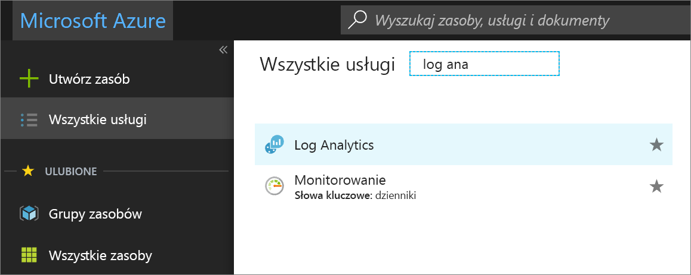

# Zarządzanie koszt kontrolując ilość danych i przechowywania w analizy dzienników
Analiza dzienników jest przeznaczone do skali i pomocy technicznej zbierania, indeksowanie i przechowywania dużych ilości danych dziennie z dowolnego źródła w przedsiębiorstwie lub wdrożona na platformie Azure.  Może to być podstawowy sterownik dla Twojej organizacji, niskich kosztów jest ostatecznie sterownika. W tym celu jego wziąć pod uwagę, że koszt obszaru roboczego Analytisc dziennika po prostu nie jest oparty na ilość danych zebranych, również jest zależny od plan wybrany, i jak długo został wybrany do przechowywania danych generowanych przez połączone źródła.  

W tym artykule, firma Microsoft analizuje jak aktywnego monitorowania wzrostu wielkości i magazynu danych i zdefiniować limity, aby kontrolować te koszty. 

Koszt danych mogą być znaczące w zależności od następujących czynników: 

- Liczba systemów, składników infrastruktury, zasobów w chmurze, itp., które są zbierane z 
- Typ danych utworzonych przez źródło, takich jak kolejki komunikatów, dzienniki, zdarzenia, dane związane z zabezpieczeniami lub metryki wydajności 
- Ilość danych wygenerowanych przez tych źródeł i pozyskanych do obszaru roboczego 
- Okresu dane są przechowywane w obszarze roboczym  
- Liczba rozwiązań do zarządzania włączone, źródła danych i częstotliwość kolekcji 

> [!NOTE]
> Zapoznaj się z dokumentacją, dla każdego rozwiązania, ponieważ zapewnia szacunkową ilość danych, które zbiera.   

Klienci z umową Enterprise podpisu przed 1 lipca 2018 lub obszar roboczy analizy dzienników kto już utworzone w ramach subskrypcji, możesz nadal mieć dostęp do *wolne* planu. Jeśli subskrypcja nie jest związana z istniejących rejestracji EA *wolne* warstwa nie jest dostępna podczas tworzenia obszaru roboczego w nową subskrypcję po 2 kwietnia 2018.  Dane są ograniczone do 7 dni przechowywania dla *wolne* warstwy.  Aby uzyskać *autonomiczny* lub *zapłacone* warstwy, dane zbierane są dostępne w ciągu ostatnich 31 dni. *Wolne* warstwa ma 500 MB dzienny limit wprowadzanie i odnalezienie stale przekracza dozwolone woluminu kwoty obszaru roboczego można zmienić na plan płatnej do zbierania danych po przekroczeniu tego limitu. 

> [!NOTE]
> Opłaty za wybranie opcji wybierz dłuższy okres przechowywania dla warstwy płatną. Możesz zmienić typ planu w dowolnym momencie, a także aby uzyskać więcej informacji o cenach, zobacz [szczegóły cennika](https://azure.microsoft.com/pricing/details/log-analytics/). 

Istnieją takie dwa sposoby, w których ilość danych może być ograniczona i pomóc kontrolować koszty, są codziennie przechowywania danych i zakończenia.  

## Przejrzyj szacowany koszt
Sprawia, że analiza dziennika go łatwo zrozumieć, co prawdopodobnie koszty oparte na najnowszych wzorców użycia.  Aby to zrobić, wykonaj następujące czynności.  

1. Zaloguj się do [Azure Portal](http://portal.azure.com). 
2. W witrynie Azure Portal kliknij pozycję **Wszystkie usługi**. Na liście zasobów wpisz **Log Analytics**. Po rozpoczęciu pisania zawartość listy jest filtrowana w oparciu o wpisywane dane. Wybierz pozycję **Log Analytics**.       
3. W okienku subskrypcje analizy dzienników, wybierz obszar roboczy, a następnie kliknij przycisk **użycia i szacowane koszty** w lewym okienku.    

W tym miejscu możesz przejrzeć woluminu dane dla danego miesiąca. Dotyczy to wszystkich danych odebranych i przechowywane w obszarze roboczym analizy dzienników.  Kliknij przycisk **szczegóły użycia** w górnej części strony, aby wyświetlić pulpit nawigacyjny użycia z informacjami na temat tendencji wolumin danych przez źródło, komputery i oferty. Aby wyświetlić i ustawić dzienny limit lub zmodyfikować okres przechowywania, kliknij przycisk **Zarządzanie woluminami danych**.
 
Dziennik analizy opłaty są dodawane do rachunku platformy Azure. Można wyświetlić szczegóły Azure naliczać opłaty sekcji rozliczeń w portalu Azure lub w [Azure Billing Portal](https://account.windowsazure.com/Subscriptions).  

## Dzienny limit
Podczas tworzenia obszaru roboczego analizy dzienników z portalu Azure i wybierz *wolne* planu, ma ustawioną wartość 500 MB limitu dnia. Nie ma żadnego limitu do innych planów cenowych. Możesz skonfigurować dzienny limit i ograniczyć wprowadzanie dziennych obszaru roboczego, ale zachować ostrożność, zgodnie z celem nie powinno być trafienie dzienny limit.  W przeciwnym razie utraty danych do końca dnia, w którym może wpłynąć na innych usług platformy Azure i rozwiązań, funkcje, których może zależeć od aktualnych danych dostępnych w obszarze roboczym.  W związku z tym możliwość obserwować i otrzymywać alerty, po wpływ na warunki kondycji zasobów Obsługa usług IT.  Dzienny limit jest przeznaczony do użycia jako sposobu zarządzania nieoczekiwany wzrost ilości danych z zarządzanych zasobów i pozostać w ramach limitu lub gdy chcesz po prostu ograniczyć nieplanowane opłat obszaru roboczego.  

Po osiągnięciu dzienny limit kolekcję typów danych rozliczeniowy zatrzymuje się do końca dnia. Transparent ostrzeżenie pojawia się w górnej części strony dla wybranego obszaru roboczego analizy dzienników i zdarzenia operacji są wysyłane do *operacji* tabeli w obszarze **LogManagement** kategorii. Zbieranie danych wznawia działanie po czasie resetowania zdefiniowane w obszarze *dzienny limit jest ustawiony na*. Zaleca się definiowania zasady alertu na podstawie zdarzeń tej operacji, skonfigurowana do wysyłania powiadomień, gdy zostanie osiągnięty dzienny limit danych. 

### Określenie, jakie dzienny limit danych, aby zdefiniować 
Przegląd [dziennika analizy użycia i szacowane koszty](log-analytics-usage.md) trend wprowadzanie danych i co to jest codziennie zakończenia woluminu do definiowania. Należy rozważyć ostrożnie, ponieważ nie można monitorować zasobów, po osiągnięciu limitu. 

### Maksymalna ilość danych codziennego zarządzania 
W poniższych krokach opisano sposób konfigurowania limitu do zarządzania ilość danych, które Log Analytics będzie pozyskiwania na dzień.  

1. Z obszaru roboczego wybierz **użycia i szacowane koszty** w lewym okienku.
2. Na **użycia i szacowane koszty** dla wybranego obszaru roboczego kliknij pozycję **Zarządzanie woluminami danych** w górnej części strony. 
5. Dzienny limit jest **OFF** domyślnie — kliknij przycisk **ON** aby ją włączyć, a następnie ustaw limit wolumin danych w GB/dzień.   

### Generuj alert, jeśli osiągnięto limit
Podczas możemy przedstawić wizualnie w portalu Azure po spełnieniu Twojej próg limitu danych to zachowanie nie zawsze są wyrównane do sposób zarządzania problemami z działaniem wymagający natychmiastowej uwagi.  Aby otrzymywać powiadomień o alertach, należy utworzyć nową regułę alertu w monitorze Azure.  Aby dowiedzieć się więcej, zobacz [jak tworzyć, wyświetlać alerty i zarządzaj nimi](../monitoring-and-diagnostics/monitor-alerts-unified-usage.md).      

Aby zacząć, Oto zalecanych ustawień dla alertu:

* Cel: Wybierz zasób analizy dzienników
* Kryteria: 
   * Nazwa sygnału: wyszukiwanie dziennika niestandardowe
   * Zapytania wyszukiwania: operacja | gdzie szczegółów ma "OverQuota"
   * Na podstawie: liczba wyników
   * Warunek: Większa niż
   * Próg: 0
   * Okres: 5 (w minutach)
   * Częstotliwość: 5 (w minutach)
* Nazwa reguły alertów: Osiągnięto limit dzienny danych
* Ważność: Ostrzeżenie (ważność: 1)

Gdy alert jest zdefiniowana i limit zostanie osiągnięty, alert zostanie wywołany i wykonuje odpowiedzi zdefiniowaną w grupie akcji. Można powiadomić Twojego zespołu za pośrednictwem wiadomości e-mail i SMS lub automatyzować czynności za pomocą elementów webhook, element runbook usługi Automatyzacja lub [integracji z rozwiązaniem zewnętrzne Zarządzanie usługami IT —](log-analytics-itsmc-overview.md#create-itsm-work-items-from-azure-alerts). 

## Zmienić okres przechowywania danych 
W poniższych krokach opisano sposób konfigurowania dziennika jak długo dane są przechowywane przez w obszarze roboczym.
 
1. Z obszaru roboczego wybierz **użycia i szacowane koszty** w lewym okienku.
2. Na **użycia i szacowane koszty** kliknij przycisk **Zarządzanie woluminami danych** w górnej części strony.
5. W okienku poruszając suwakiem, możesz zwiększyć lub zmniejszyć liczbę dni, a następnie kliknij przycisk **OK**.  Jeśli pracujesz w *wolnego* warstwy, nie można zmodyfikować okres przechowywania danych i trzeba Uaktualnij do planu płatną w celu kontrolowania tego ustawienia.   

## Rozwiązywanie problemów
**Pytanie**: jak rozwiązać Jeśli analizy dzienników nie zbiera danych? 
**Odpowiedzi**: Jeśli są na wolnych warstwy cenowej i zostały wysłane więcej niż 500 MB danych w ciągu dnia, zbieranie danych przestanie do końca dnia. Osiągnięcia dziennego limitu jest typową przyczyną analizy dzienników zatrzymuje zbieranie danych lub dane są prawdopodobnie brakuje.  
Analiza dzienników tworzy zdarzenie typu operacji podczas zbierania danych uruchamiania i zatrzymywania.  
W polu wyszukiwania, aby sprawdzić, czy osiągnięcia dziennego limitu i brakujące dane, uruchom następujące zapytanie: operacja | gdzie OperationCategory == "Stan zbierania danych"   
Po zatrzymaniu zbierania danych OperationStatus jest ostrzeżenie. Podczas uruchamiania zbierania danych OperationStatus jest zakończyło się pomyślnie.  
W poniższej tabeli opisano przyczyn, które zatrzymania zbierania danych i zalecaną akcję umożliwiającą wznowienie zbierania danych:  

|Zatrzymuje Przyczyna kolekcji| Rozwiązanie| 
|-----------------------|---------|
|Osiągnięty dzienny limit dane w warstwie bezpłatna1|Zaczekaj do następnego dnia dla kolekcji do automatycznego ponownego uruchamiania lub zmień płatną warstwę cenową.|
|Osiągnięto limit dzienny zdefiniowanych w zarządzanie woluminami danych|Zaczekaj do następnego dnia dla kolekcji do automatycznego ponownego uruchamiania, lub zwiększ dzienny limit woluminów danych opisanych w [zarządzania codziennych maksymalna ilość danych](#manage-the-maximum-daily-volume)|
|Subskrypcja platformy Azure jest w stanie wstrzymania ze względu na:  Bezpłatna wersja próbna została zakończona  Ważność Azure — dostęp próbny  Osiągnięto limit wydatków co miesiąc (na przykład na subskrypcję MSDN lub Visual Studio)|Konwertuj na płatną subskrypcję  Usuń limit lub poczekaj na zresetowanie limitu|

1 czy obszaru roboczego znajduje się na warstwę cenową bezpłatna, jest ograniczona do wysyłania do usługi 500 MB danych na dzień. Po osiągnięciu dzienny limit gromadzenie danych zatrzymuje się do następnego dnia. Dane wysyłane podczas zatrzymania zbierania danych nie jest indeksowana i nie jest dostępny do wyszukiwania. Po wznowieniu pracy zbierania danych, przetwarzanie odbywa się tylko w przypadku nowych wysłane dane. 

Analiza dzienników korzysta z czasu UTC. Podczas resetowania różnie w przypadku obszarów roboczych, aby uniemożliwić wszystkie start ograniczone obszary robocze wprowadzania danych w tym samym czasie. Jeśli obszar roboczy osiągnie limit dzienny, przetwarzania wznawia działanie po czas resetowania zdefiniowany w **dzienny limit jest ustawiony na**.   

**Pytanie**: jak można zostanie wyświetlone powiadomienie po zatrzymaniu zbierania danych? 
**Odpowiedzi**: wykonaj kroki opisane w *Utwórz dzienne dane zakończenia* alert zgłaszane po zatrzymaniu zbierania danych i wykonaj kroki, wykonaj czynności opisane w dodać skonfigurować akcje reguły alertów e-mail, element runbook lub elementu webhook Akcja reguły alertów. 

## Kolejne kroki  

Aby określić, ile danych są zbierane, jakie źródła są wysyłania, a także różne typy danych wysyłanych do zarządzania konsumenckich i kosztów, zobacz [analizowanie danych użycia w analizy dzienników](log-analytics-usage.md).