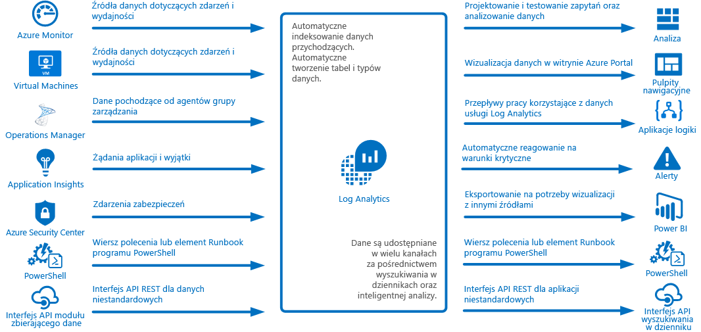
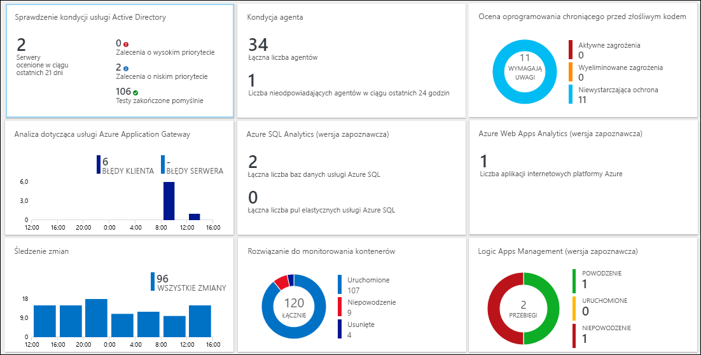
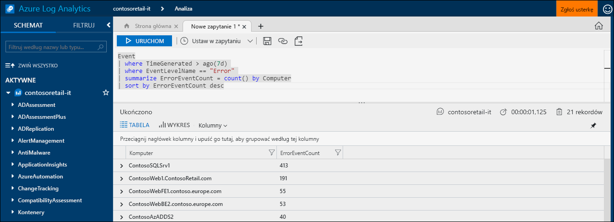
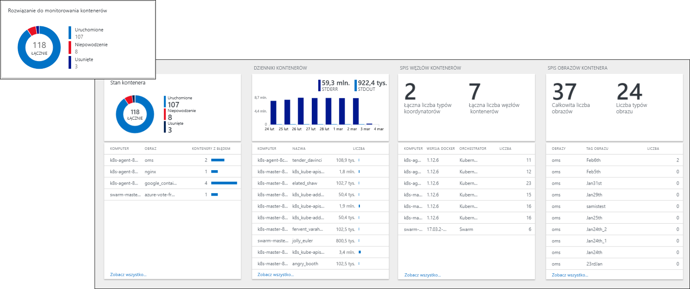
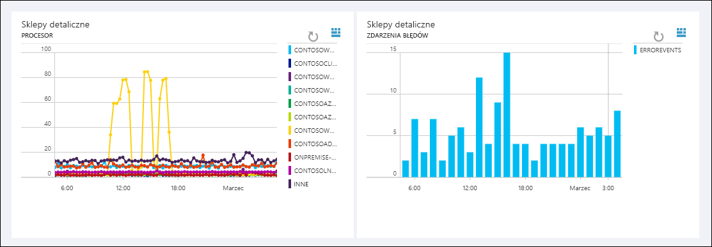
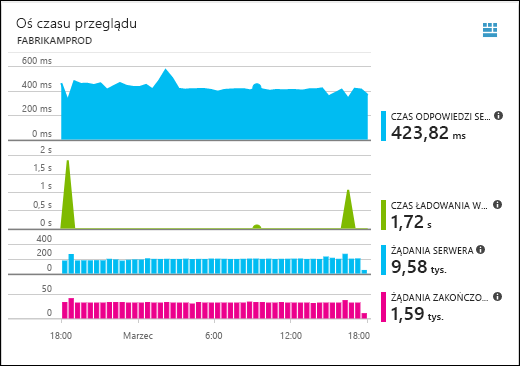
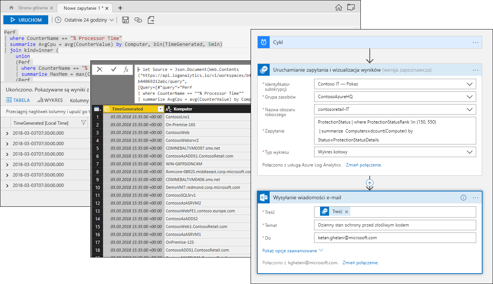

# Co to jest usługa Azure Log Analytics?
Usługa Log Analytics odgrywa centralną rolę w zarządzaniu na platformie Azure, zbierając dane telemetryczne i inne dane z różnych źródeł oraz udostępniając język zapytań i aparat analityczny, który zapewnia wgląd w działanie aplikacji i zasobów.  Możesz pracować bezpośrednio z danymi usługi Log Analytics za pomocą operacji wyszukiwania w dziennikach i widoków albo korzystać z narzędzi analizy w innych usługach platformy Azure, takich jak Application Insights lub Azure Security Center, które przechowują dane w usłudze Log Analytics.  

Usługa Log Analytics wymaga minimalnej konfiguracji i jest już zintegrowana z innymi usługami Azure.  Wystarczy utworzyć obszar roboczy, aby włączyć zbieranie danych.  Następnie możesz zainstalować agentów na maszynach wirtualnych, aby uwzględnić ich w obszarze roboczym i włączyć rozwiązania do zarządzania obejmujące logikę służącą do zapewniania dodatkowego wglądu w różne aplikacje.  W tle typy danych są wstępnie zdefiniowane lub automatycznie tworzone podczas zbierania danych.

## Rola w monitorowaniu

Różne usługi monitorowania na platformie Azure opisano w temacie [Monitoring Azure applications and resources](../monitoring-and-diagnostics/monitoring-overview.md) (Monitorowanie aplikacji i zasobów platformy Azure).  Usługa Log Analytics odgrywa centralną rolę, konsolidując dane monitorowania z różnych źródeł oraz udostępniając zaawansowany język zapytań na potrzeby konsolidacji i analizy.  

Usługa Log Analytics nie jest jednak ograniczona do monitorowania zasobów platformy Azure.  Może zbierać dane z zasobów lokalnych lub znajdujących się w innych chmurach w celu utworzenia hybrydowego środowiska monitorowania. Może także bezpośrednio łączyć się z programem System Center Operations Manager, aby zbierać dane telemetryczne z istniejących agentów.  Narzędzia analityczne w usłudze Log Analytics, takie jak operacje wyszukiwania w dziennikach, widoki i rozwiązania do zarządzania, działają na wszystkich zebranych danych i umożliwiają scentralizowaną analizę całego środowiska.

## Zbieranie danych
Usługa Log Analytics zbiera dane z różnych źródeł.  Po zebraniu dane są organizowane w oddzielnych tabelach dla każdego typu danych, dzięki czemu wszystkie dane mogą być analizowane razem niezależnie od ich oryginalnego źródła.

Istnieją następujące metody zbierania danych w usłudze Log Analytics:

- Skonfigurowanie usługi Azure Monitor w celu kopiowania metryk i dzienników, które zbiera z zasobów platformy Azure.
- Agenci na maszynach wirtualnych z systemem [Windows](log-analytics-windows-agent.md) i [Linux](log-analytics-linux-agents.md) wysyłają dane telemetryczne z systemu operacyjnego gościa i aplikacji do usługi Log Analytics zgodnie ze skonfigurowanymi [źródłami danych](log-analytics-data-sources.md).  
- Połączenie [grupy zarządzania programu System Center Operations Manager](log-analytics-om-agents.md) z usługą Log Analytics w celu zbierania danych z jej agentów.
- Usługi platformy Azure, takie jak [Application Insights](https://docs.microsoft.com/azure/application-insights/) i [Azure Security Center](https://docs.microsoft.com/azure/security-center/) przechowują swoje dane bezpośrednio w usłudze Log Analytics bez żadnej konfiguracji.
- Zapisywanie danych z wiersza polecenia programu PowerShell lub [elementu Runbook usługi Azure Automation](../automation/automation-runbook-types.md) za pomocą poleceń cmdlet usługi Log Analytics.
- Jeśli masz niestandardowe wymagania, możesz użyć [interfejsu API modułu zbierającego dane HTTP](log-analytics-data-collector-api.md) w celu zapisania danych do repozytorium z klienta interfejsu API REST.

## Dodawanie funkcjonalności dzięki rozwiązaniom do zarządzania
[Rozwiązania do zarządzania](log-analytics-add-solutions.md) to wstępnie spakowane zestawy logiki dla konkretnego produktu lub scenariusza.  Mogą one zbierać dodatkowe dane w usłudze Log Analytics lub przetwarzać dane, które już zostały zebrane.  Zwykle będą zawierały widok, który ułatwia analizowanie tych dodatkowych danych.  Dostępne są już rozwiązania związane z różnorodnymi funkcjami i cały czas dodajemy kolejne rozwiązania.  Dostępne rozwiązania można łatwo przeglądać i [dodawać do obszaru roboczego](log-analytics-add-solutions.md) z poziomu witryny Azure Marketplace.  

## Język zapytań

Usługa Log Analytics udostępnia [zaawansowany język zapytań](http://docs.loganalytics.io) na potrzeby szybkiego pobierania, konsolidacji i analizowania zebranych danych.  Zapytania można utworzyć i przetestować, korzystając z [portali przeszukiwania dzienników lub zaawansowanej analizy](log-analytics-log-search-portals.md), a następnie bezpośrednio analizować dane przy użyciu tych narzędzi lub zapisać zapytania do użycia z wizualizacjami i alertami albo do wyeksportowania do innych narzędzi, takich jak usługa Power BI lub program Excel.

Język zapytań usługi Log Analytics jest odpowiedni dla prostego wyszukiwania w dziennikach, ale oferuje także zaawansowane funkcje, takie jak agregacje, sprzężenia i analiza inteligentna. Aby szybko nauczyć się języka zapytań, skorzystaj z wielu dostępnych [samouczków](https://docs.loganalytics.io/docs/Learn/Tutorials).  Specjalne instrukcje udostępniono dla użytkowników, którzy znają już [SQL](https://docs.loganalytics.io/docs/Learn/References/SQL-to-Azure-Log-Analytics) i [Splunk](https://docs.loganalytics.io/docs/Learn/References/Splunk-to-Azure-Log-Analytics).

## Wizualizacja danych usługi Log Analytics

[Widoki w usłudze Log Analytics](log-analytics-view-designer.md) prezentują wizualnie dane z dzienników wyszukiwania.  Każdy widok zawiera kombinację wizualizacji, takich jak wykresy słupkowe i liniowe, a ponadto listy podsumowujące dane o kluczowym znaczeniu.  [Rozwiązania do zarządzania](#add-functionality-with-management-solutions) zawierają widoki, które podsumowują dane dla konkretnej aplikacji. Można także tworzyć własne widoki w celu prezentacji danych z dowolnego przeszukiwania dzienników w usłudze Log Analytics.

Możesz również przypiąć wyniki zapytania usługi Log Analytics do [pulpitu nawigacyjnego platformy Azure](../azure-portal/azure-portal-dashboards.md), co pozwala na połączenie kafelków z różnych usług platformy Azure.  Można nawet przypiąć do pulpitu nawigacyjnego widok usługi Log Analytics.

## Tworzenie alertów na podstawie danych usługi Log Analytics

[Alerty platformy Azure](../monitoring-and-diagnostics/monitoring-overview-unified-alerts.md) służą do aktywnego powiadamiania użytkownika o ważnych dla niego warunkach w danych usługi Log Analytics.  Zapytanie jest automatycznie uruchamiane w zaplanowanych odstępach czasu. Jeśli wyniki spełniają określone kryteria, tworzony jest alert.  Dzięki temu możesz połączyć zgłaszanie alertów z usługi Log Analytics z innymi źródłami, takimi jak alerty niemal w czasie rzeczywistym usługi [Azure Monitor](../monitoring-and-diagnostics/monitoring-near-real-time-metric-alerts.md) i wyjątki aplikacji usługi [Application Insights](../application-insights/app-insights-alerts.md), udostępniając [grupy akcji](../monitoring-and-diagnostics/monitoring-action-groups.md) na potrzeby odpowiedzi na warunki alertu.

## Korzystanie z danych usługi Log Analytics w innych usługach
Usługi takie jak Application Insights i Azure Security Center przechowują swoje dane bezpośrednio w usłudze Log Analytics.  Zwykle wchodzisz w interakcje z zaawansowanymi narzędziami analizy dostarczanymi przez te usługi, ale możesz również korzystać z zapytań usługi Log Analytics w celu uzyskiwania dostępu do ich danych i potencjalnie łączyć je z danymi z innych usług.  

Na przykład następujący widok pochodzi z usługi Application Insights.  Jeśli klikniesz ikonę w prawym górnym rogu, zostanie uruchomiona konsola analizy usługi Log Analytics z zapytaniami używanymi przez graf.

## Eksportowanie danych usługi Log Analytics

Usługa Log Analytics udostępnia swoje dane również poza platformą Azure.  Można skonfigurować [usługę Power BI](log-analytics-powerbi.md) w celu importowania wyników zapytania w zaplanowanych odstępach czasu, co pozwoli wykorzystać jej funkcje, takie jak łączenie danych z różnych źródeł oraz udostępnianie raportów w Internecie i na urządzeniach przenośnych.  Możesz również wykorzystywać [interfejs API wyszukiwania w dzienniku](log-analytics-log-search-api.md), aby tworzyć niestandardowe rozwiązania korzystające z danych usługi Log Analytics lub przeprowadzać integrację z innymi systemami.

Za pomocą usługi [Logic Apps](../logic-apps/logic-apps-overview.md) na platformie Azure możesz tworzyć niestandardowe przepływy pracy na podstawie danych usługi Log Analytics.  W przypadku bardziej złożonej logiki opartej na programie PowerShell można użyć [elementów runbook w usłudze Azure Automation](../automation/automation-runbook-types.md).

## Następne kroki
- Rozpocznij od [zbierania danych z maszyn wirtualnych platformy Azure](log-analytics-quick-collect-azurevm.md).
- Zapoznaj się z [samouczkiem dotyczącym analizowania danych usługi Log Analytics za pomocą prostego zapytania](log-analytics-tutorial-viewdata.md).
* [Przeglądaj dostępne rozwiązania](log-analytics-add-solutions.md), aby dodać funkcje do usługi Log Analytics.

