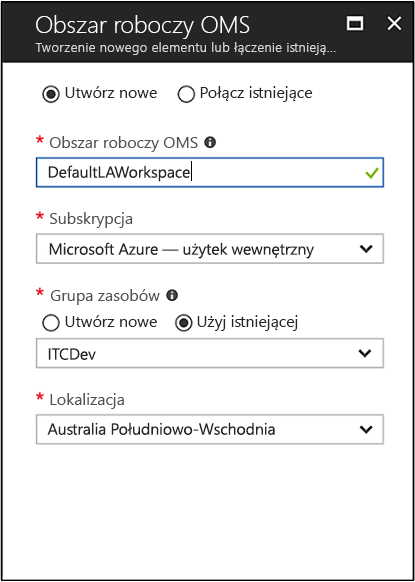

# Tworzenie obszaru roboczego analizy dzienników w portalu Azure
W portalu Azure, które można ustawić obszaru roboczego analizy dzienników, która jest unikatowym środowisku analizy dzienników z własnych danych repozytorium, źródła danych i rozwiązania.  Kroki opisane w tym artykule są wymagane, jeśli planujesz na zbieranie danych z następujących źródeł:

* Zasoby platformy Azure w ramach subskrypcji
* Lokalnych komputerów monitorowanych przez program System Center Operations Manager
* Kolekcje urządzeń z programu System Center Configuration Manager 
* Dane diagnostyczne lub dziennika z usługi Azure Storage

Dla innych źródeł, takich jak maszynach wirtualnych platformy Azure i komputery z systemem Windows lub Linux w środowisku zobacz następujące tematy:

*  [Zbierz dane o maszynach wirtualnych platformy Azure](log-analytics-quick-collect-azurevm.md) 
*  [Zbiera dane dotyczące komputerów z systemem Linux](log-analytics-quick-collect-linux-computer.md)
*  [Zbiera dane dotyczące komputerów z systemem Windows](log-analytics-quick-collect-windows-computer.md)

Jeśli nie masz subskrypcji platformy Azure, przed rozpoczęciem utwórz [bezpłatne konto](https://azure.microsoft.com/free/?WT.mc_id=A261C142F).

## Logowanie do witryny Azure Portal
Zaloguj się do witryny Azure Portal na stronie [https://portal.azure.com](https://portal.azure.com). 

## Tworzenie obszaru roboczego
1. W witrynie Azure Portal kliknij pozycję **Wszystkie usługi**. Na liście zasobów wpisz **Log Analytics**. Po rozpoczęciu pisania zawartość listy jest filtrowana w oparciu o wpisywane dane. Wybierz pozycję **Log Analytics**.       
2. Kliknij pozycję **Utwórz**, a następnie wybierz opcje dla następujących elementów:

  * Podaj nazwę dla nowego **obszaru roboczego OMS**, na przykład *DefaultLAWorkspace*. 
  * Wybierz **Subskrypcję** do połączenia poprzez wybór subskrypcji z listy rozwijanej, jeśli domyślnie wybrana subskrypcja jest niewłaściwa.
  * Aby uzyskać **grupy zasobów**, wybierz opcję, aby użyć istniejącego zasobu już grupy konfiguracji lub Utwórz nową.  
  * Wybierz dostępny **lokalizacji**.  Aby uzyskać dodatkowe informacje, sprawdź, w których [regionach jest dostępna usługa Log Analytics](https://azure.microsoft.com/regions/services/).
  * W przypadku tworzenia obszaru roboczego w nowej subskrypcji utworzone po 2 kwietnia 2018 zostaną automatycznie użyte *GB na* cenową planu wraz z opcją wybór warstwy cenowej nie są dostępne.  W przypadku tworzenia obszaru roboczego dla istniejącej subskrypcji utworzone przed 2 kwietnia lub subskrypcji, która została powiązana z istniejących rejestracji EA, wybierz preferowany warstwę cenową.  Aby uzyskać dodatkowe informacje dotyczące konkretnej warstwy, zobacz [Log Analytics — cennik](https://azure.microsoft.com/pricing/details/log-analytics/).

           

3. Po podaniu wymaganych informacji w okienku **Obszar roboczy OMS** kliknij przycisk **OK**.  

Podczas weryfikowania informacji i tworzenia obszaru roboczego możesz śledzić postęp w sekcji **Powiadomienia** z poziomu menu. 

## Kolejne kroki
Teraz, gdy masz obszaru roboczego, które są dostępne, Konfigurowanie zbierania monitorowania telemetrii, możliwe wyszukiwanie dziennika do analizowania danych i dodać rozwiązania do zarządzania, aby zapewnić dodatkowe dane i informacje analityczne. 

* Aby włączyć zbieranie danych z zasobów platformy Azure z diagnostyki Azure lub usługi Azure storage, zobacz [dzienniki usługi Azure zbieranie i metryk do użycia w analizy dzienników](log-analytics-azure-storage.md).  
* [Dodaj System Center Operations Manager jako źródła danych](log-analytics-om-agents.md) do zbierania danych z agentów raportowania grupę zarządzania programu Operations Manager i zapisz go w repozytorium obszaru roboczego analizy dzienników. 
* Połącz [programu Configuration Manager](log-analytics-sccm.md) do importowania komputery, które są członkami kolekcji w hierarchii.  
* Przegląd [rozwiązań do zarządzania](/log-analytics-add-solutions.md) dostępne i jak dodać lub usunąć rozwiązania z obszaru roboczego.

