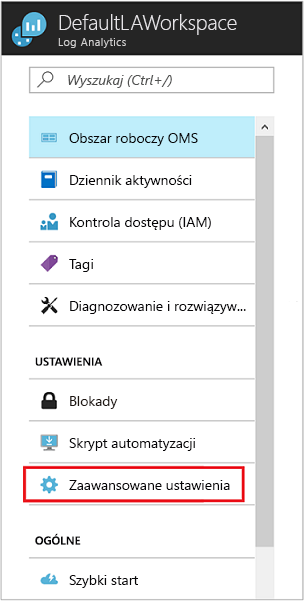

# Połącz z analizą dzienników programu Configuration Manager
Możesz łączyć środowiska System Center Configuration Manager Analiza dzienników Azure na synchronizowanie danych kolekcji urządzeń i odwołać kolekcjach analizy dzienników i automatyzacji Azure.  

## Wymagania wstępne

Analiza dzienników obsługuje System Center Configuration Manager bieżącej gałęzi, wersja 1606 i wyższych.  

## Przegląd konfiguracji
Poniższe instrukcje stanowią podsumowanie kroki konfigurowania integracji programu Configuration Manager z analizy dzienników.  

1. W portalu Azure Zarejestruj programu Configuration Manager jako aplikację aplikacji sieci Web i/lub interfejs API sieci Web i upewnij się, że użytkownik ma identyfikator klienta i klucz tajny klienta z rejestracji z usługi Azure Active Directory. Zobacz [użycia portalu do tworzenia aplikacji i usług podmiot zabezpieczeń, który ma dostęp do zasobów usługi Active Directory](../azure-resource-manager/resource-group-create-service-principal-portal.md) Aby uzyskać szczegółowe informacje na temat wykonywania tego kroku.
2. W portalu Azure [przyznać programu Configuration Manager (aplikacja sieci web w zarejestrowany) z uprawnieniami do analizy dzienników](#grant-configuration-manager-with-permissions-to-log-analytics).
3. W programie Configuration Manager [dodać połączenie za pomocą Kreatora dodawania pakietu OMS połączenia](#add-an-oms-connection-to-configuration-manager).
4. W programie Configuration Manager [zaktualizować właściwości połączenia](#update-oms-connection-properties) Jeśli kiedykolwiek klucza tajnego klienta lub hasło wygaśnie lub zostaną utracone.
5. [Pobierz i zainstaluj program Microsoft Monitoring Agent](#download-and-install-the-agent) na komputerze z systemem roli systemu lokacji punktu połączenia programu Configuration Manager service. Agent wysyła dane programu Configuration Manager do obszaru roboczego analizy dzienników.
6. W przypadku analizy dzienników [zaimportować kolekcje z programu Configuration Manager](#import-collections) jako grupy komputerów.
7. W przypadku analizy dzienników wyświetlania danych z programu Configuration Manager jako [grup komputerów](log-analytics-computer-groups.md).

Więcej o łączeniu programu Configuration Manager z usługą OMS na [synchronizowanie danych z programu Configuration Manager do programu Microsoft Operations Management Suite](https://technet.microsoft.com/library/mt757374.aspx).

## Udziel Configuration Manager z uprawnieniami do analizy dzienników
W poniższej procedurze, udzielasz *współautora* roli w obszarze roboczym analizy dzienników aplikacji usługi AD i nazwę główną usługi został utworzony wcześniej dla programu Configuration Manager.  Jeśli nie masz już obszar roboczy, zobacz [Tworzenie obszaru roboczego w Azure Log Analytics](log-analytics-quick-create-workspace.md) przed kontynuowaniem.  Dzięki temu programu Configuration Manager w celu uwierzytelniania i nawiązać połączenia z obszaru roboczego analizy dzienników.  

> [!NOTE]
> Należy określić uprawnienia w analizy dzienników programu Configuration Manager. W przeciwnym razie zostanie wyświetlony komunikat o błędzie, korzystając z Kreatora konfiguracji w programie Configuration Manager.
>

1. W portalu Azure kliknij **wszystkie usługi** w lewym górnym rogu. Na liście zasobów wpisz **Log Analytics**. Po rozpoczęciu pisania zawartość listy jest filtrowana w oparciu o wpisywane dane. Wybierz pozycję **Log Analytics**.       
2. Na liście obszarów roboczych usługi Analiza dzienników wybierz obszar roboczy, aby zmodyfikować.
3. W okienku po lewej stronie wybierz **kontroli dostępu (IAM)**.
4. Na stronie kontroli dostępu, kliknij przycisk **Dodaj** i **dodać uprawnienia** pojawi się okienko.
5. W **dodać uprawnienia** okienku w obszarze **roli** listy rozwijanej wybierz **współautora** roli.  
6. W obszarze **przypisany dostęp** listy rozwijanej wybierz utworzony wcześniej w usłudze AD aplikacji programu Configuration Manager, a następnie kliknij przycisk **OK**.  

## Pobierz i zainstaluj agenta
Zapoznaj się z artykułem [komputery Windows połączenia z usługą analizy dzienników na platformie Azure](log-analytics-agent-windows.md) zrozumienie dostępnych metod dotyczących instalacji programu Microsoft Monitoring Agent na komputerze obsługującym usługi programu Configuration Manager Rola systemu lokacji punktu połączenia.  

## Dodaj połączenie OMS do programu Configuration Manager
Aby dodać połączenie OMS, środowiska programu Configuration Manager, należy skonfigurować [punkt połączenia z usługą](https://technet.microsoft.com/library/mt627781.aspx) skonfigurowany dla trybu online.

1. W **administracji** obszaru roboczego programu Configuration Manager, wybierz **łącznik OMS**. Spowoduje to otwarcie **Kreatora dodawania pakietu OMS połączenia**. Wybierz opcję **Dalej**.
2. Na **ogólne** ekranu, upewnij się, że wykonano następujące czynności i czy masz szczegółów dla każdego elementu, a następnie wybierz **dalej**.

   1. W portalu Azure jako aplikację aplikacji sieci Web i/lub interfejs API sieci Web został zarejestrowany programu Configuration Manager i czy masz [identyfikator klienta z rejestracji](../active-directory/active-directory-integrating-applications.md).
   2. W portalu Azure zostanie utworzona aplikacja klucz tajny aplikacji zarejestrowanych w usłudze Azure Active Directory.  
   3. W portalu Azure podane aplikacji sieci web w zarejestrowany z uprawnieniami do OMS.  
      
3. Na **usługi Azure Active Directory** ekranu, skonfigurować ustawienia połączenia analizy dzienników, zapewniając Twojej **dzierżawy**, **identyfikator klienta**, i **klienta Klucz tajny**, a następnie wybierz pozycję **dalej**.  
   
4. Jeśli wykonano wszystkie inne procedury pomyślnie, następnie informacje w **konfiguracji połączenia OMS** ekranu będzie automatycznie wyświetlane na tej stronie. Informacje o ustawieniach połączenia ma być wyświetlany dla Twojego **subskrypcji platformy Azure**, **grupy zasobów platformy Azure**, i **obszar roboczy usługi Operations Management Suite**.  
   
5. Kreator łączy się z usługą analizy dzienników, korzystając z informacji podanych przez Ciebie danych wejściowych. Wybierz kolekcje urządzeń, które mają być synchronizowane z usługą, a następnie kliknij przycisk **Dodaj**.  
   
6. Sprawdź ustawienia połączenia w **Podsumowanie** ekranu, a następnie wybierz **dalej**. **Postępu** ekranu przedstawia stan połączenia, a następnie należy **Complete**.

> [!NOTE]
> Należy połączyć lokacji najwyższego poziomu w hierarchii do analizy dzienników. Jeśli można połączyć autonomicznej lokacji głównej do analizy dzienników, a następnie dodaj centralnej lokacji administracyjnej w danym środowisku, należy Usuń i Utwórz ponownie połączenie w nowej hierarchii.
>
>

Po połączeniu programu Configuration Manager do analizy dzienników Dodaj lub usuń kolekcje, a wyświetlić właściwości połączenia.

## Zaktualizuj właściwości połączenia analizy dzienników
Jeśli kiedykolwiek klucza tajnego klienta lub hasło wygaśnie lub zostaną utracone, należy ręcznie zaktualizować właściwości połączenia analizy dzienników.

1. W programie Configuration Manager przejdź do **usługi w chmurze**, a następnie wybierz pozycję **łącznik OMS** otworzyć **właściwości połączenia OMS** strony.
2. Na tej stronie, kliknij przycisk **usługi Azure Active Directory** kartę, aby wyświetlić Twojej **dzierżawy**, **identyfikator klienta**, **wygaśnięcia klucza tajnego klienta**. **Sprawdź** Twojego **klucza tajnego klienta** Jeśli wygasł.

## Importuj kolekcje
Po utworzeniu połączenie OMS dodane do programu Configuration Manager i agent zainstalowany na komputerze z uruchomionym połączenia programu Configuration Manager z usługą roli systemu lokacji punktu, następnym krokiem jest, aby zaimportować kolekcje z programu Configuration Manager w analizy dzienników jako grupy komputerów.

Po wykonaniu konfiguracji początkowej, aby zaimportować kolekcje urządzeń z hierarchii informacje członkostwa kolekcji są pobierane co 3 godziny, aby zapewnić aktualność członkostwa. Można wyłączyć tę opcję w dowolnym momencie.

1. W portalu Azure kliknij **wszystkie usługi** w lewym górnym rogu. Na liście zasobów wpisz **Log Analytics**. Po rozpoczęciu pisania zawartość listy jest filtrowana w oparciu o wpisywane dane. Wybierz pozycję **Log Analytics**.
2. Na liście obszarów roboczych usługi Analiza dzienników wybierz obszar roboczy programu Configuration Manager są rejestrowane w usłudze.  
3. Wybierz pozycję **Ustawienia zaawansowane**.       
4. Wybierz **grup komputerów** , a następnie wybierz **SCCM**.  
5. Wybierz **członkostwa w kolekcji programu Configuration Manager importu** , a następnie kliknij przycisk **zapisać**.  
   

## Wyświetlanie danych z programu Configuration Manager
Po utworzeniu połączenie OMS dodane do programu Configuration Manager i agent jest zainstalowany na komputerze z uruchomionym roli systemu lokacji punktu połączenia programu Configuration Manager service, dane od agenta są wysyłane do analizy dzienników. W analizy dzienników kolekcji programu Configuration Manager są wyświetlane jako [grup komputerów](log-analytics-computer-groups.md). Możesz wyświetlić grupy z **programu Configuration Manager** w obszarze **grup Settings\Computer**.

Zaimportowane kolekcje widać wykryto liczbę komputerów z członkostwa w kolekcji. Można również sprawdzić wielu kolekcji, które zostały zaimportowane.

Po kliknięciu jednej otworzy wyszukiwania, wyświetlanie wszystkich zaimportowane grupy albo wszystkie komputery, które należą do każdej grupy. Przy użyciu [wyszukiwania dziennika](log-analytics-log-searches.md), możesz uruchomić dokładnych analiz danych programu Configuration Manager.

## Kolejne kroki
* Użyj [wyszukiwania dziennika](log-analytics-log-searches.md) Aby wyświetlić szczegółowe informacje o danych programu Configuration Manager.
