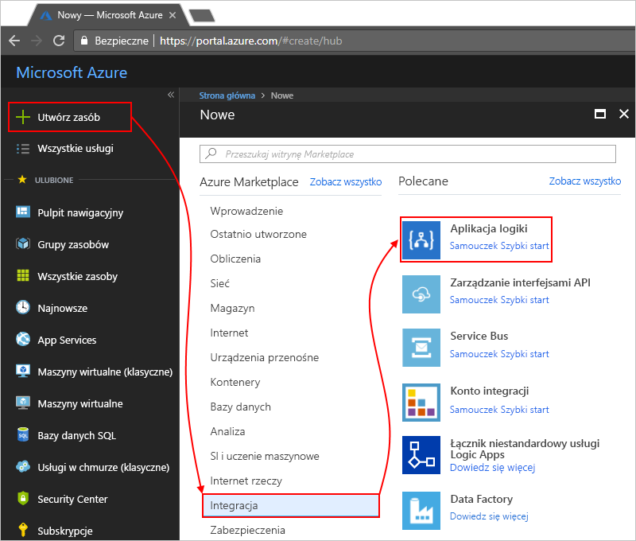
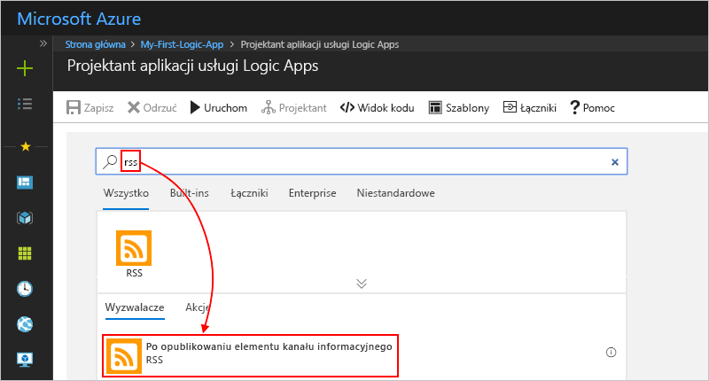
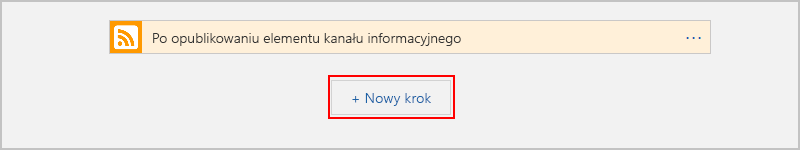

# <a name="quickstart-create-your-first-automated-workflow-with-azure-logic-apps---azure-portal"></a>Szybki start: Tworzenie pierwszego zautomatyzowanego przepływu pracy za pomocą usługi Azure Logic Apps — witryna Azure Portal

W tym przewodniku Szybki start wyjaśniono, jak utworzyć pierwszy zautomatyzowany przepływ pracy za pomocą usługi [Azure Logic Apps](../logic-apps/logic-apps-overview.md). W tym artykule opisano, jak utworzyć aplikację logiki regularnie sprawdzającą kanał informacyjny RSS witryny internetowej pod kątem nowych elementów. Jeśli istnieją nowe elementy, aplikacja logiki wysyła wiadomość e-mail dotyczącą każdego elementu. Po ukończeniu aplikacja logiki będzie ogólnie wyglądać jak ten przepływ pracy:


Aby użyć tego przewodnika Szybki start, potrzebne jest konto e-mail od dostawcy, który jest obsługiwany przez usługę Logic Apps, na przykład Office 365 Outlook, Outlook.com lub Gmail. W przypadku innych dostawców [przejrzyj tę listę łączników](https://docs.microsoft.com/connectors/). Ta aplikacja logiki korzysta z konta Office 365 Outlook. Jeśli korzystasz z innego konta e-mail, ogólne kroki będą takie same, ale interfejs użytkownika może się trochę różnić. 

Jeśli nie masz subskrypcji platformy Azure, [zarejestruj się w celu założenia bezpłatnego konta platformy Azure](https://azure.microsoft.com/free/).

## <a name="sign-in-to-the-azure-portal"></a>Logowanie się do witryny Azure Portal

Zaloguj się do [witryny Azure Portal](https://portal.azure.com) przy użyciu poświadczeń konta Azure.

## <a name="create-your-logic-app"></a>Tworzenie aplikacji logiki 

1. Z menu głównego platformy Azure wybierz pozycję **Utwórz zasób** > **Integracja** > **Aplikacja logiki**.

   

1. W obszarze **Tworzenie aplikacji logiki** podaj szczegółowe informacje o aplikacji logiki, jak pokazano poniżej. Gdy wszystko będzie gotowe, wybierz pozycję **Utwórz**.

   

   | Właściwość | Wartość | Opis | 
   |----------|-------|-------------| 
   | **Nazwa** | MyFirstLogicApp | Nazwa aplikacji logiki | 
   | **Subskrypcja** | <*your-Azure-subscription-name*> | Nazwa subskrypcji platformy Azure | 
   | **Grupa zasobów** | My-First-LA-RG | Nazwa [grupy zasobów platformy Azure](../azure-resource-manager/resource-group-overview.md) używanej do organizowania powiązanych zasobów | 
   | **Lokalizacja** | Zachodnie stany USA | Region, w którym będą przechowywane informacje o aplikacji logiki | 
   | **Log Analytics** | Wyłączone | Ustawienie **Wyłączone** umożliwia rejestrowanie w celach diagnostycznych. | 
   |||| 

1. Gdy platforma Azure wdroży aplikację, zostanie otwarty Projektant aplikacji usługi Logic Apps wyświetlający stronę z wprowadzającym wideo i najczęściej używanymi wyzwalaczami. W obszarze **Szablony** wybierz pozycję **Pusta aplikacja logiki**.

   

Następnie dodaj [wyzwalacz](../logic-apps/logic-apps-overview.md#logic-app-concepts), który będzie aktywowany po pojawieniu się nowego elementu w kanale informacyjnym RSS. Każda aplikacja logiki musi rozpoczynać się od wyzwalacza, który jest aktywowany w momencie wystąpienia konkretnego zdarzenia lub spełnienia określonego warunku. Po każdym aktywowaniu wyzwalacza aparat usługi Logic Apps tworzy wystąpienie aplikacji logiki uruchamiającej i wykonującej przepływ pracy.

<a name="add-rss-trigger"></a>

## <a name="check-rss-feed-with-a-trigger"></a>Sprawdzanie kanału informacyjnego RSS za pomocą wyzwalacza

1. W Projektancie aplikacji logiki, w polu wyszukiwania, wybierz **wszystkich**.

1. W polu wyszukiwania wprowadź "ciąg rss". Z listy wyzwalaczy wybierz następujący wyzwalacz: **Po opublikowaniu elementu kanału informacyjnego - RSS**

   

1. Podaj następujące informacje dotyczące wyzwalacza, jak pokazano i opisano:

   

   | Właściwość | Wartość | Opis | 
   |----------|-------|-------------| 
   | **Adres URL źródła danych RSS** | ```http://feeds.reuters.com/reuters/topNews``` | Link do źródła danych RSS, które chcesz monitorować | 
   | **Interwał** | 1 | Liczba interwałów do odczekania między sprawdzaniami | 
   | **Częstotliwość** | Minuta | Jednostka czasu dla każdego interwału między sprawdzaniami  | 
   |||| 

   Interwał i częstotliwość określają harmonogram wyzwalacza aplikacji logiki. 
   Ta aplikacja logiki sprawdza kanał informacyjny co minutę.

1. Aby na razie ukryć szczegóły wyzwalacza, kliknij wewnątrz jego paska tytułu.

   

1. Zapisz aplikację logiki. Na pasku narzędzi projektanta wybierz pozycję **Zapisz**.

Twoja aplikacja logiki jest już aktywna, ale nie robi niczego poza sprawdzaniem źródła danych RSS. Dodaj więc akcję reagującą na aktywowanie wyzwalacza.

## <a name="send-email-with-an-action"></a>Wysyłanie wiadomości e-mail za pomocą akcji

Teraz dodaj [akcję](../logic-apps/logic-apps-overview.md#logic-app-concepts), która wysyła wiadomość e-mail, gdy pojawi się nowy element w kanale informacyjnym RSS.

1. W obszarze wyzwalacza **Gdy element kanału informacyjnego jest publikowany** wybierz pozycję **Nowy krok**.

   

1. W obszarze **wybierz akcję** i wyszukiwania, wybierz **wszystkich**.

1. W polu wyszukiwania wprowadź "Wyślij wiadomość e-mail". Z listy akcji wybierz akcję „wyślij wiadomość e-mail” dla odpowiedniego dostawcy poczty e-mail.

   

   Aby na liście akcji wyświetlić akcje tylko dla konkretnej aplikacji lub usługi, możesz najpierw wybrać tę aplikację lub usługę:

   * Dla kont służbowych platformy Azure wybierz pozycję Office 365 Outlook. 
   * Dla osobistych kont Microsoft wybierz pozycję Outlook.com.

1. Jeśli pojawi się prośba o podanie poświadczeń, zaloguj się do swojego konta e-mail, aby usługa Logic Apps utworzyła połączenie z tym kontem e-mail.

1. W obszarze akcji **Wyślij wiadomość e-mail** podaj dane, które powinny znaleźć się w wiadomości e-mail.

   1. W polu **Do** wprowadź adres e-mail adresata. 
   Do celów testowych możesz użyć własnego adresu e-mail.

      Na razie zignoruj wyświetloną listę **Dodaj zawartość dynamiczną**. 
      Ta lista pojawia się po kliknięciu wewnątrz niektórych pól edycji. Znajdują się na niej wszelkie dostępne parametry z poprzedniego kroku, które można dołączyć jako dane wejściowe w przepływie pracy. 

   1. W polu **Temat** wprowadź następujący tekst ze spacją na końcu: ```New RSS item:```

      

   1. Z listy **Dodaj zawartość dynamiczną** wybierz pozycję **Tytuł źródła danych**, aby uwzględnić tytuł elementu kanału RSS.

      

      Gdy wszystko będzie gotowe, temat wiadomości e-mail będzie wyglądać następująco:

      

      Jeśli w projektancie pojawi się pętla „For each”, oznacza to, że wybrano token dla tablicy, na przykład token **categories-Item**. 
      W przypadku takiego typu tokenów projektant automatycznie dodaje pętlę do akcji, która odwołuje się do tego tokenu. 
      W ten sposób Twoja aplikacja logiki wykonuje tę samą akcję dla każdego elementu tablicy. 
      Aby usunąć pętlę, wybierz **wielokropek** (**...**) na pasku tytułu pętli, a następnie wybierz pozycję **Usuń**.

   1. W polu **Treść** wprowadź następujący tekst i wybierz widoczne tokeny dla treści wiadomości e-mail. 
   Aby dodać puste wiersze w polu edycji, naciśnij klawisze Shift + Enter. 

      

      | Właściwość | Opis | 
      |----------|-------------| 
      | **Tytuł źródła danych** | Tytuł elementu | 
      | **Data opublikowania kanału informacyjnego** | Data i godzina opublikowania elementu | 
      | **Link podstawowego źródła danych** | Adres URL elementu | 
      |||

1. Zapisz aplikację logiki.

Następnie przeprowadź testowanie aplikacji logiki.

## <a name="run-your-logic-app"></a>Uruchamianie aplikacji logiki

Aby ręcznie uruchomić swoją aplikację logiki, na pasku narzędzi projektanta wybierz pozycję **Uruchom**. Możesz też zaczekać, aż aplikacja logiki sprawdzi źródło danych RSS zgodnie z określonym harmonogramem (co minutę). Jeśli źródło danych RSS będzie zawierać nowe elementy, aplikacja logiki wyśle wiadomość e-mail dla każdego nowego elementu. W przeciwnym razie aplikacja logiki będzie czekać z ponownym sprawdzeniem do następnego interwału. 

Oto przykładowa wiadomość e-mail wysyłana przez tę aplikację logiki. Jeśli nie dostaniesz żadnych wiadomości e-mail, sprawdź folder wiadomości-śmieci.


Z technicznego punktu widzenia, gdy wyzwalacz sprawdza źródło danych RSS i znajduje nowe elementy, jest on wyzwalany, a aparat usługi Logic Apps tworzy wystąpienie przepływu pracy aplikacji logiki, które uruchamia akcje w ramach przepływu pracy.
Jeśli wyzwalacz nie znajdzie nowych elementów, to nie zostanie wyzwolony i pominie tworzenie wystąpienia przepływu pracy.

Gratulacje, Twoja pierwsza aplikacja logiki została już pomyślnie skompilowana i uruchomiona za pomocą witryny Azure Portal!

## <a name="clean-up-resources"></a>Oczyszczanie zasobów

Gdy ten przykład nie będzie już potrzebny, usuń grupę zasobów zawierającą aplikację logiki i powiązane zasoby. 

1. W menu głównym platformy Azure wybierz pozycję **Grupy zasobów** i wybierz grupę zasobów aplikacji logiki. Na stronie **Przegląd** wybierz pozycję **Usuń grupę zasobów**. 

   

1. Aby potwierdzić, wprowadź nazwę grupy zasobów, a następnie wybierz pozycję **Usuń**.

   

> [!NOTE]
> Po usunięciu aplikacji logiki nie są tworzone wystąpienia nowych przebiegów. Wszystkie trwające i oczekujące przebiegi zostają anulowane. Anulowanie kilku tysięcy przebiegów może zająć dużo czasu.

## <a name="get-support"></a>Uzyskiwanie pomocy technicznej

Jeśli masz pytania, odwiedź [forum usługi Azure Logic Apps](https://social.msdn.microsoft.com/Forums/home?forum=azurelogicapps).

## <a name="next-steps"></a>Kolejne kroki

W tym przewodniku Szybki start utworzono pierwszą aplikację logiki, która sprawdza aktualizacje kanału informacyjnego RSS według określonego harmonogramu (co minutę) i jeśli istnieją aktualizacje, wykonuje akcję (wysyła wiadomość e-mail). Aby dowiedzieć się więcej, kontynuuj pracę z tym samouczkiem nad tworzeniem bardziej zaawansowanych przepływów pracy opartych na harmonogramie:

> [!div class="nextstepaction"]
> [Sprawdzanie ruchu za pomocą aplikacji logiki opartej na harmonogramie](../logic-apps/tutorial-build-schedule-recurring-logic-app-workflow.md)
