# Szybki Start: Tworzenie zautomatyzowanych zadań, procesów i przepływów pracy przy użyciu Azure Logic Apps — Visual Studio

Za pomocą usługi [Azure Logic Apps](../logic-apps/logic-apps-overview.md) i programu Visual Studio można utworzyć przepływy pracy do automatyzacji zadań i procesów, które integrują aplikacje, dane, systemy i usługi w przedsiębiorstwach i organizacjach. W tym przewodniku szybki start przedstawiono, jak projektować i kompilować te przepływy pracy, tworząc Aplikacje logiki w programie Visual Studio i wdrażając te aplikacje na platformie Azure. Chociaż można wykonać te zadania w Azure Portal, program Visual Studio umożliwia dodawanie aplikacji logiki do kontroli źródła, publikowanie różnych wersji i tworzenie Azure Resource Manager szablonów dla różnych środowisk wdrażania.

Jeśli dopiero zaczynasz Azure Logic Apps i chcesz tylko uzyskać podstawowe koncepcje, wypróbuj [Przewodnik Szybki Start dotyczący tworzenia aplikacji logiki w Azure Portal](../logic-apps/quickstart-create-first-logic-app-workflow.md). Projektant aplikacji logiki działa podobnie do Azure Portal i programu Visual Studio.

W tym przewodniku szybki start utworzysz tę samą aplikację logiki przy użyciu programu Visual Studio, co Azure Portal przewodniku Szybki Start. Ta aplikacja logiki monitoruje kanał informacyjny RSS witryny sieci Web i wysyła wiadomość e-mail dla każdego nowego elementu w tym źródle danych. Gotowa aplikacja logiki wygląda jak ten przepływ pracy wysokiego poziomu:

## Wymagania wstępne

* Subskrypcja platformy Azure. Jeśli nie masz subskrypcji, [zarejestruj się w celu założenia bezpłatnego konta platformy Azure](https://azure.microsoft.com/free/).

* Pobierz i zainstaluj te narzędzia, jeśli jeszcze ich nie masz:

  * [Visual Studio 2019, 2017 lub 2015 — wersja Community lub nowsza](https://aka.ms/download-visual-studio). Ten przewodnik Szybki Start używa programu Visual Studio Community 2017.

    > [!IMPORTANT]
    > Po zainstalowaniu programu Visual Studio 2019 lub 2017 upewnij się, że wybrano obciążenie **Programowanie na platformie Azure** .

  * [Zestaw Microsoft Azure SDK dla platformy .NET (2.9.1 lub nowszy)](https://azure.microsoft.com/downloads/). Dowiedz się więcej na temat [zestawu Azure SDK dla platformy .NET](https://docs.microsoft.com/dotnet/azure/dotnet-tools?view=azure-dotnet).

  * [Azure PowerShell](https://github.com/Azure/azure-powershell#installation)

  * Najnowsze Azure Logic Apps narzędzia dla rozszerzenia programu Visual Studio dla używanej wersji:

    * [Program Visual Studio 2019](https://aka.ms/download-azure-logic-apps-tools-visual-studio-2019)

    * [Visual Studio 2017](https://aka.ms/download-azure-logic-apps-tools-visual-studio-2017)

    * [Program Visual Studio 2015](https://aka.ms/download-azure-logic-apps-tools-visual-studio-2015)
  
    Możesz pobrać i zainstalować narzędzia Azure Logic Apps Tools bezpośrednio z witryny Visual Studio Marketplace lub dowiedzieć się, [jak zainstalować to rozszerzenie z poziomu programu Visual Studio](https://docs.microsoft.com/visualstudio/ide/finding-and-using-visual-studio-extensions). Upewnij się, że po zakończeniu instalacji program Visual Studio zostanie ponownie uruchomiony.

* Dostęp do Internetu podczas korzystania z osadzonego Projektanta aplikacji logiki

  Projektant wymaga połączenia internetowego do tworzenia zasobów na platformie Azure i odczytywania właściwości i danych z łączników w aplikacji logiki. Na przykład dla połączeń usługi Dynamics CRM Online Projektant sprawdza wystąpienie programu CRM pod kątem domyślnych i niestandardowych właściwości.

* Konto e-mail obsługiwane przez usługę Logic Apps, na przykład Office 365 Outlook, Outlook.com lub Gmail. W przypadku innych dostawców zapoznaj się z [listą łączników tutaj](https://docs.microsoft.com/connectors/). W tym przykładzie zastosowano pakiet Office 365 Outlook. Jeśli używasz innego dostawcy, ogólne kroki będą takie same, ale interfejs użytkownika może się trochę różnić.

## Tworzenie projektu grupy zasobów platformy Azure

Aby rozpocząć, utwórz [projekt grupy zasobów platformy Azure](../azure-resource-manager/templates/create-visual-studio-deployment-project.md). Dowiedz się więcej o [zasobach i grupach zasobów platformy Azure](../azure-resource-manager/management/overview.md).

1. Uruchom program Visual Studio. Zaloguj się przy użyciu konta platformy Azure.

1. W menu **Plik** wybierz pozycję **Nowy** > **Projekt**. (Klawiatura: Ctrl + Shift + N)

   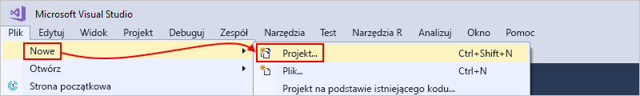

1. W obszarze **Zainstalowane** wybierz pozycję **Visual C#** lub **Visual Basic**. Wybierz pozycję **Chmura** > **Grupa zasobów platformy Azure**. Nazwij projekt, na przykład:

   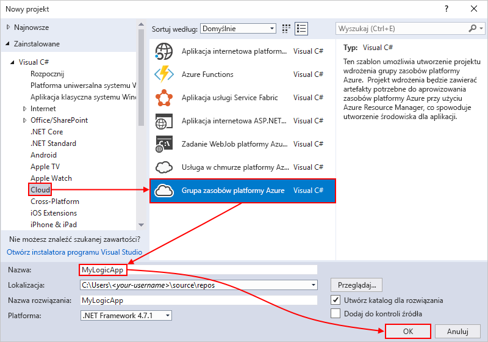

   > [!NOTE]
   > Nazwy grup zasobów mogą zawierać tylko litery, cyfry, kropki (`.`), podkreślenia (`_`), łączniki (`-`) i nawiasy (`(`, `)`), ale nie mogą *kończyć* się kropką (`.`).
   >
   > Jeśli nie zostanie wyświetlona usługa **Cloud** lub **Grupa zasobów platformy Azure** , upewnij się, że zainstalowano zestaw Azure SDK dla programu Visual Studio.

   Jeśli używasz programu Visual Studio 2019, wykonaj następujące kroki:

   1. W polu **Utwórz nowy projekt** wybierz projekt **Grupa zasobów platformy Azure** dla wizualizacji C# lub Visual Basic. Wybierz opcję **Dalej**.

   1. Podaj nazwę grupy zasobów platformy Azure, której chcesz użyć, i inne informacje o projekcie. Wybierz pozycję **Utwórz**.

1. Z listy szablon wybierz szablon **aplikacji logiki** . Kliknij przycisk **OK**.

   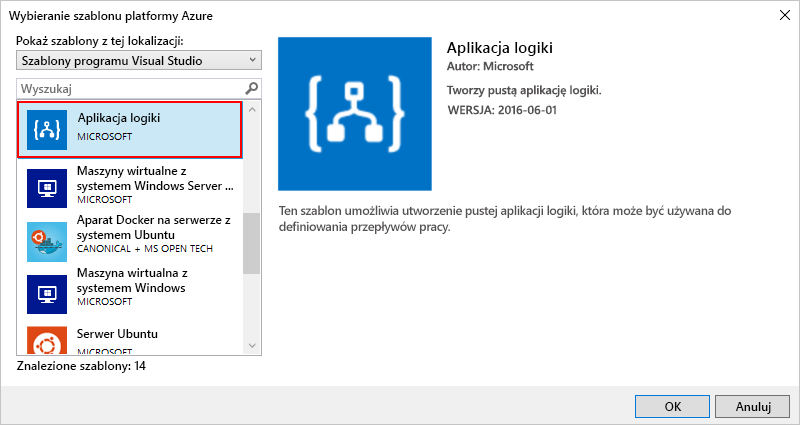

   Po utworzeniu projektu w programie Visual Studio Eksplorator rozwiązań otwiera i pokazuje rozwiązanie. W rozwiązaniu plik **LogicApp. JSON** nie tylko przechowuje definicję aplikacji logiki, ale jest również szablonem Azure Resource Manager, którego można użyć do wdrożenia.

   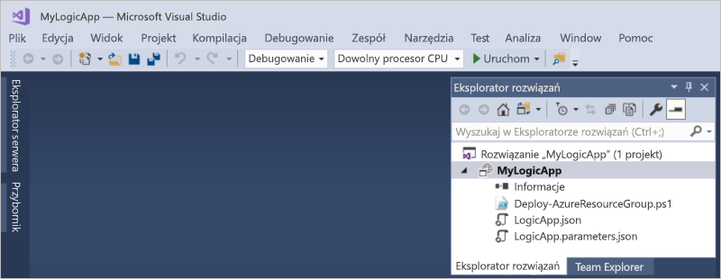

## Tworzenie pustej aplikacji logiki

Jeśli masz projekt grupy zasobów platformy Azure, Utwórz aplikację logiki przy użyciu szablonu **pustej aplikacji logiki** .

1. W Eksplorator rozwiązań otwórz menu skrótów pliku **LogicApp. JSON** . Wybierz pozycję **Otwórz przy użyciu Projektanta aplikacji logiki**. (Klawiatura: Ctrl + L)

   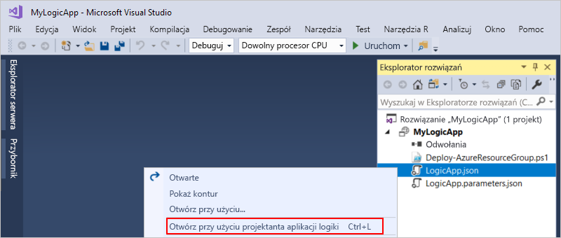

   > [!TIP]
   > Jeśli nie masz tego polecenia w programie Visual Studio 2019, sprawdź, czy masz najnowsze aktualizacje programu Visual Studio.

   Program Visual Studio poprosi o subskrypcję platformy Azure i grupę zasobów platformy Azure na potrzeby tworzenia i wdrażania zasobów dla aplikacji logiki i połączeń.

1. W obszarze **subskrypcja**wybierz subskrypcję platformy Azure. W obszarze **Grupa zasobów**wybierz pozycję **Utwórz nową** , aby utworzyć kolejną grupę zasobów platformy Azure.

   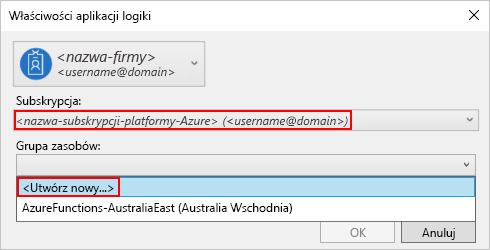

   | Ustawienie | Przykładowa wartość | Opis |
   | ------- | ------------- | ----------- |
   | Konto użytkownika | Firma   sophia-owen@fabrikam.com | Konto używane podczas logowania do programu Visual Studio |
   | **Subskrypcja** | Płatność zgodnie z rzeczywistym użyciem   (sophia-owen@fabrikam.com) | Nazwa Twojej subskrypcji platformy Azure i skojarzone konto |
   | **Grupa zasobów** | MyLogicApp-RG   (Zachodnie stany USA) | Grupa zasobów platformy Azure i lokalizacja służąca do przechowywania i wdrażania zasobów aplikacji logiki |
   | **Lokalizacja** | **Taka sama jak grupa zasobów** | Typ lokalizacji i określona lokalizacja wdrażania aplikacji logiki. Typ lokalizacji to region platformy Azure lub istniejące [środowisko usługi integracji (ISE)](connect-virtual-network-vnet-isolated-environment.md). 
W tym przewodniku szybki start Zachowaj typ lokalizacji ustawiony na **region** i lokalizację ustawioną na **taką samą jak grupa zasobów**. 
**Uwaga**: po utworzeniu projektu grupy zasobów można [zmienić typ lokalizacji i lokalizację](manage-logic-apps-with-visual-studio.md#change-location), ale różne typy lokalizacji mają wpływ na aplikację logiki na różne sposoby. |
   ||||

1. W projektancie Logic Apps zostanie otwarta strona z wprowadzeniem wideo i często używanymi wyzwalaczami. Przewiń w dół wideo i wyzwalacze do **szablonów**, a następnie wybierz pozycję **pusta aplikacja logiki**.

   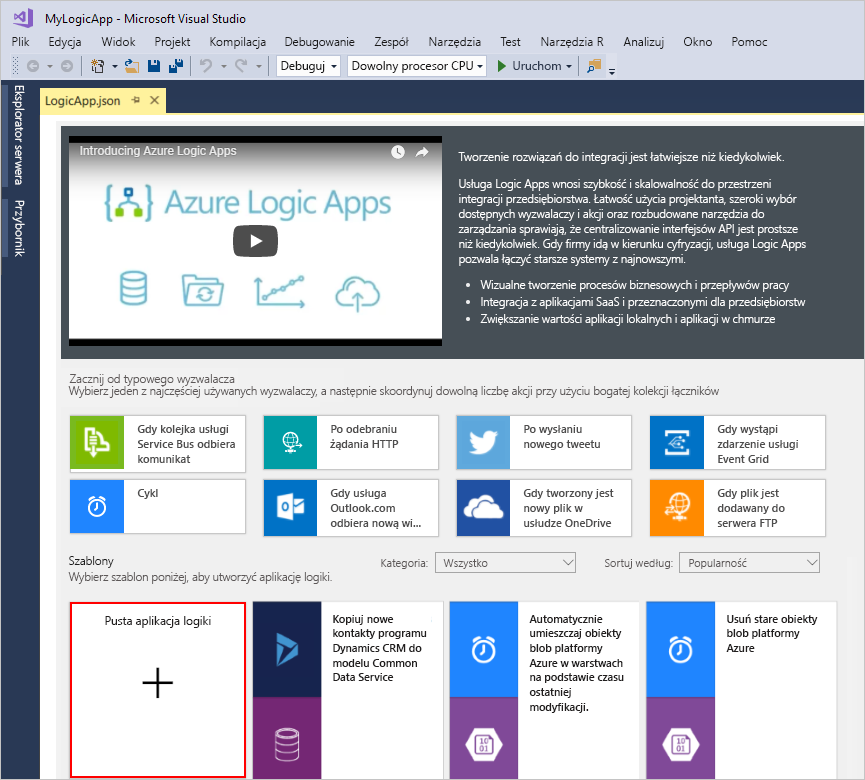

## Kompilowanie przepływu pracy aplikacji logiki

Następnie Dodaj [wyzwalacz](../logic-apps/logic-apps-overview.md#logic-app-concepts) RSS, który jest uruchamiany, gdy pojawi się nowy element źródła danych. Każda aplikacja logiki rozpoczyna się od wyzwalacza, który jest uruchamiany po spełnieniu określonych kryteriów. Po każdym aktywowaniu wyzwalacza aparat usługi Logic Apps tworzy wystąpienie aplikacji logiki uruchamiającej przepływ pracy.

1. W Projektancie aplikacji logiki, w polu wyszukiwania zaznacz **wszystko**. W polu wyszukiwania wprowadź ciąg "RSS". Z listy Wyzwalacze wybierz ten wyzwalacz: **po opublikowaniu elementu kanału informacyjnego**

   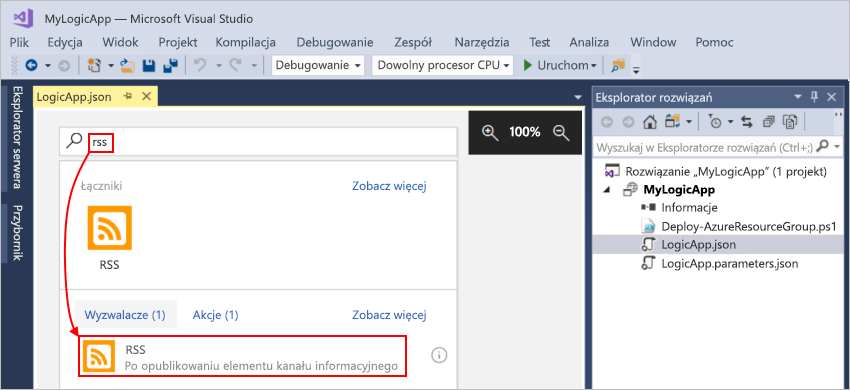

1. Po wyświetleniu wyzwalacza w projektancie Zakończ tworzenie aplikacji logiki, wykonując kroki przepływu pracy w [Azure Portal szybki start](../logic-apps/quickstart-create-first-logic-app-workflow.md#add-rss-trigger), a następnie wróć do tego artykułu. Gdy wszystko będzie gotowe, aplikacja logiki będzie wyglądać następująco:

   

1. Zapisz rozwiązanie programu Visual Studio. (Klawiatura: Ctrl+S)

## Wdrażanie aplikacji logiki na platformie Azure

Aby można było uruchomić i przetestować aplikację logiki, należy wdrożyć aplikację na platformie Azure z poziomu programu Visual Studio.

1. W Eksploratorze rozwiązań w menu skrótów projektu wybierz pozycję **Wdróż** > **Nowy**. Po wyświetleniu monitu zaloguj się przy użyciu konta platformy Azure.

   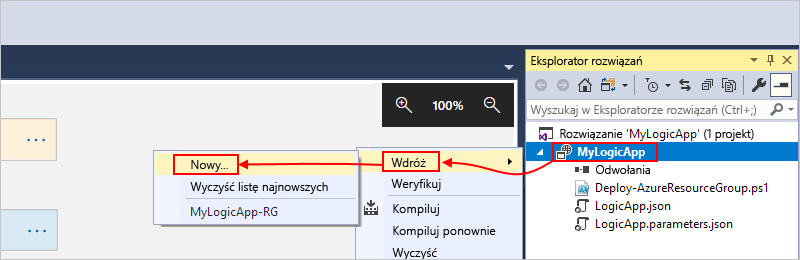

1. W przypadku tego wdrożenia Zachowaj domyślną subskrypcję platformy Azure, grupę zasobów i inne ustawienia. Wybierz pozycję **Wdróż**.

   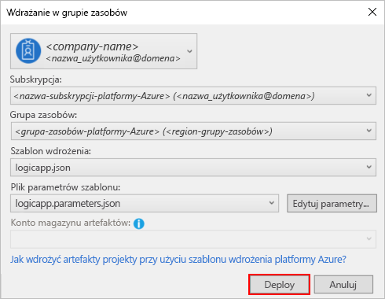

1. Jeśli zostanie wyświetlone okno **Edytuj parametry** , podaj nazwę zasobu dla aplikacji logiki. Zapisz ustawienia.

   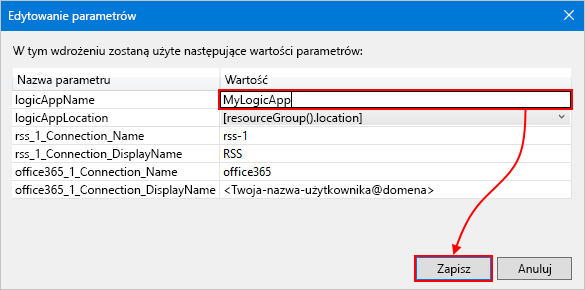

   Po rozpoczęciu wdrażania stan wdrożenia aplikacji zostanie wyświetlony w oknie **Dane wyjściowe** programu Visual Studio. Jeśli stan się nie pojawi, otwórz listę **Pokaż dane wyjściowe z** i wybierz grupę zasobów platformy Azure.

   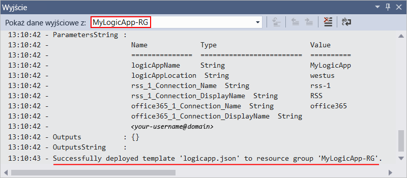

   Jeśli wybrane łączniki wymagają wprowadzenia danych, zostanie otwarte okno programu PowerShell w tle i zostanie wyświetlony monit o podanie wszelkich niezbędnych haseł lub kluczy tajnych. Po wprowadzeniu tych informacji wdrażanie będzie kontynuowane.

   

   Po zakończeniu wdrażania aplikacja logiki będzie aktywna w Azure Portal i będzie działać zgodnie z określonym harmonogramem (co minutę). Jeśli wyzwalacz znajdzie nowe elementy kanału informacyjnego, wyzwala wyzwalacz, który tworzy wystąpienie przepływu pracy, które uruchamia akcje aplikacji logiki. Aplikacja logiki wysyła wiadomość e-mail dla każdego nowego elementu. W przeciwnym razie, jeśli wyzwalacz nie znajdzie nowych elementów, wyzwalacz nie uruchomi się i "pomija" Tworzenie wystąpienia przepływu pracy. Aplikacja logiki czeka do następnego interwału przed sprawdzeniem.

   Poniżej przedstawiono przykładowe wiadomości e-mail wysyłane przez tę aplikację logiki. Jeśli nie dostaniesz żadnych wiadomości e-mail, sprawdź folder wiadomości-śmieci.

   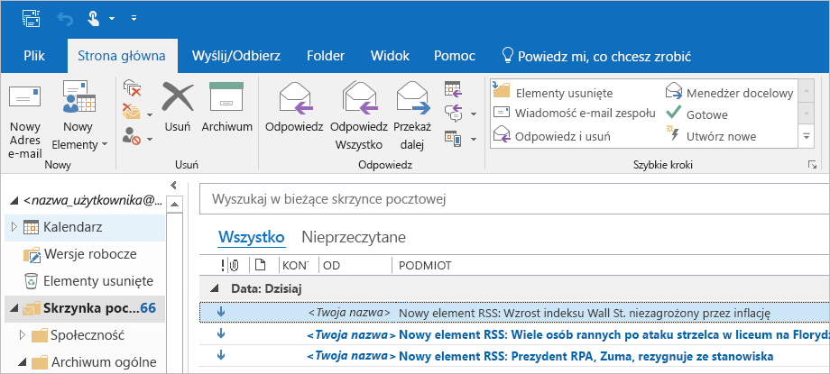

Gratulacje, Twoja aplikacja logiki została pomyślnie skompilowana i wdrożona za pomocą programu Visual Studio. Aby zarządzać aplikacją logiki i przeglądać historię jej uruchomień, zobacz [Zarządzanie aplikacjami logiki w programie Visual Studio](../logic-apps/manage-logic-apps-with-visual-studio.md).

## Dodaj nową aplikację logiki

Jeśli masz istniejący projekt grupy zasobów platformy Azure, możesz dodać nową pustą aplikację logiki do tego projektu przy użyciu okna konspektu JSON.

1. W Eksplorator rozwiązań otwórz plik `<logic-app-name>.json`.

1. Z menu **Widok** wybierz inne **konspekty**w formacie JSON **systemu Windows** > .

1. Aby dodać zasób do pliku szablonu, wybierz pozycję **Dodaj zasób** u góry okna konspektu JSON. Lub w oknie konspektu JSON Otwórz menu skrótów **zasoby** , a następnie wybierz pozycję **Dodaj nowy zasób**.

   

1. W oknie dialogowym **Dodawanie zasobu** w polu wyszukiwania Znajdź `logic app`i wybierz pozycję **aplikacja logiki**. Nadaj nazwę aplikacji logiki, a następnie wybierz pozycję **Dodaj**.

   

## Oczyszczanie zasobów

Po zakończeniu pracy z aplikacją logiki Usuń grupę zasobów zawierającą aplikację logiki i powiązane zasoby.

1. Zaloguj się do witryny [Azure Portal](https://portal.azure.com) za pomocą konta używanego do tworzenia aplikacji logiki.

1. W menu Azure Portal wybierz pozycję **grupy zasobów**lub Wyszukaj i wybierz pozycję **grupy zasobów** z dowolnej strony. Wybierz grupę zasobów aplikacji logiki.

1. Na stronie **Przegląd** wybierz pozycję **Usuń grupę zasobów**. Wprowadź nazwę grupy zasobów jako potwierdzenie, a następnie wybierz pozycję **Usuń**.

   

1. Usuń rozwiązanie programu Visual Studio z komputera lokalnego.

## Następne kroki

W tym artykule kompilowano, wdrożono i uruchomiono aplikację logiki przy użyciu programu Visual Studio. Aby dowiedzieć się więcej o zarządzaniu i wykonywaniu zaawansowanego wdrażania aplikacji logiki za pomocą programu Visual Studio, zobacz następujące artykuły:

> [!div class="nextstepaction"]
> [Zarządzanie aplikacjami logiki w programie Visual Studio](../logic-apps/manage-logic-apps-with-visual-studio.md)
