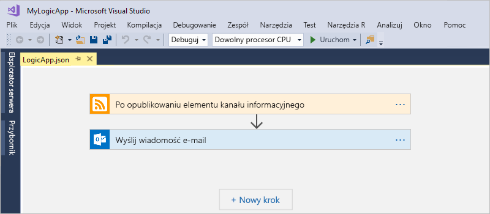
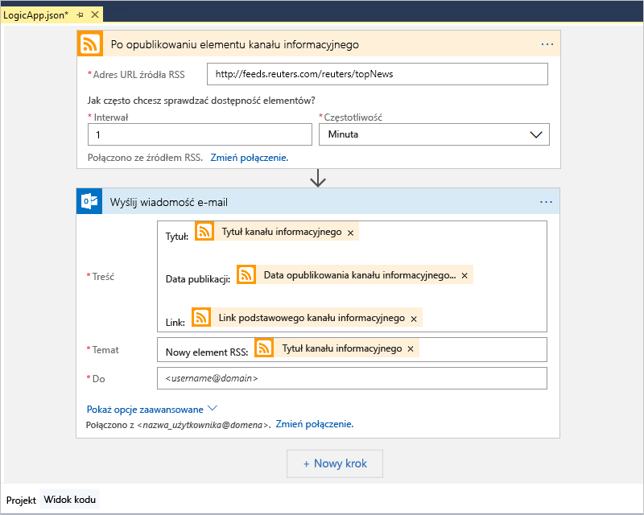
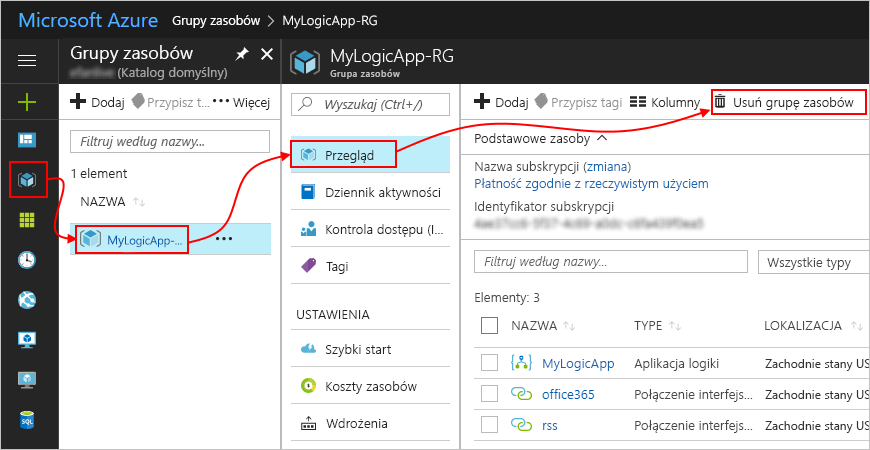

# Szybki start: Tworzenie zautomatyzowanych zadań, procesów i przepływów pracy z usługą Azure Logic Apps — Visual Studio

Za pomocą usługi [Azure Logic Apps](../logic-apps/logic-apps-overview.md) i programu Visual Studio można utworzyć przepływy pracy do automatyzacji zadań i procesów, które integrują aplikacje, dane, systemy i usługi w przedsiębiorstwach i organizacjach. Ten przewodnik Szybki Start przedstawia sposób projektowania i kompilowania tych przepływów pracy przez tworzenie aplikacji logiki w programie Visual Studio i wdrażanie ich na platformę Azure. Mimo że te czynności można wykonać w witrynie Azure portal, programu Visual Studio umożliwia dodawanie aplikacji logiki do kontroli źródła, publikowanie różnych wersji i tworzenie szablonów usługi Azure Resource Manager dla różnych środowisk wdrożeń.

Jeśli jesteś nowym użytkownikiem usługi Azure Logic Apps i potrzebujesz jedynie podstawowych pojęć, wypróbuj [Szybki Start: tworzenie aplikacji logiki w witrynie Azure portal](../logic-apps/quickstart-create-first-logic-app-workflow.md). Projektant aplikacji logiki działa podobnie w witrynie Azure portal i programu Visual Studio.

W tym przewodniku Szybki Start utworzysz sama aplikacja logiki za pomocą programu Visual Studio jako portal szybkiego startu platformy Azure. Ta aplikacja logiki monitoruje kanału informacyjnego RSS witryny sieci Web i wysyła wiadomość e-mail dla każdego nowego elementu w tym źródła danych. Twoja aplikacja logiki Zakończono wygląda jak ten ogólny przepływ pracy:

## Wymagania wstępne

* Subskrypcja platformy Azure. Jeśli nie masz subskrypcji platformy Azure, [zarejestruj się w celu założenia bezpłatnego konta platformy Azure](https://azure.microsoft.com/free/).

* Pobierz i zainstaluj te narzędzia, jeśli jeszcze ich nie masz:

  * [Program Visual Studio 2019 r, 2017 lub 2015 — Community edition lub nowszej](https://aka.ms/download-visual-studio). 
  This quickstart uses Visual Studio Community 2017.

    > [!IMPORTANT]
    > Po zainstalowaniu programu Visual Studio 2019 lub 2017, upewnij się, że wybrano **programowanie na platformie Azure** obciążenia.

  * [Zestaw Microsoft Azure SDK dla platformy .NET (2.9.1 lub nowszy)](https://azure.microsoft.com/downloads/). 
  Dowiedz się więcej na temat [zestawu Azure SDK dla platformy .NET](https://docs.microsoft.com/dotnet/azure/dotnet-tools?view=azure-dotnet).

  * [Azure PowerShell](https://github.com/Azure/azure-powershell#installation)

  * Narzędzia systemu Azure aplikacje logiki dla wersji programu Visual Studio, które mają:

    * [Visual Studio 2019](https://aka.ms/download-azure-logic-apps-tools-visual-studio-2019)

    * [Visual Studio 2017](https://aka.ms/download-azure-logic-apps-tools-visual-studio-2017)

    * [Visual Studio 2015](https://aka.ms/download-azure-logic-apps-tools-visual-studio-2015)
  
    Możesz pobrać i zainstalować narzędzia Azure Logic Apps Tools bezpośrednio z witryny Visual Studio Marketplace lub dowiedzieć się, [jak zainstalować to rozszerzenie z poziomu programu Visual Studio](https://docs.microsoft.com/visualstudio/ide/finding-and-using-visual-studio-extensions). 
    Upewnij się, że po zakończeniu instalacji program Visual Studio zostanie ponownie uruchomiony.

* Dostęp do Internetu podczas korzystania z osadzonego Projektanta aplikacji logiki

  Projektant wymaga połączenia internetowego do tworzenia zasobów na platformie Azure i odczytywanie właściwości oraz danych z łączników w aplikacji logiki. 
  Na przykład w przypadku połączeń usługi Dynamics CRM Online, Projektant wyszukuje właściwości domyślne i niestandardowe w wystąpieniu CRM.

* Konto e-mail obsługiwane przez usługę Logic Apps, na przykład Office 365 Outlook, Outlook.com lub Gmail. W przypadku innych dostawców [przejrzyj tę listę łączników](https://docs.microsoft.com/connectors/). W tym przykładzie użyto usługi Office 365 Outlook. Jeśli używasz innego dostawcy, ogólne kroki będą takie same, ale interfejs użytkownika może się trochę różnić.

## Tworzenie projektu grupy zasobów platformy Azure

Aby rozpocząć, utwórz [projekt grupy zasobów platformy Azure](../azure-resource-manager/vs-azure-tools-resource-groups-deployment-projects-create-deploy.md). Dowiedz się więcej o [zasobach i grupach zasobów platformy Azure](../azure-resource-manager/resource-group-overview.md).

1. Uruchom program Visual Studio. Zaloguj się przy użyciu konta platformy Azure.

1. W menu **Plik** wybierz pozycję **Nowy** > **Projekt**. (Klawiatura: Ctrl+Shift+N)

   

1. W obszarze **Zainstalowane** wybierz pozycję **Visual C#** lub **Visual Basic**. Wybierz pozycję **Chmura** > **Grupa zasobów platformy Azure**. Nazwij projekt, na przykład:

   

   > [!NOTE]
   > Jeśli **chmury** lub **grupy zasobów platformy Azure** nie są wyświetlane, upewnij się, zainstaluj zestaw Azure SDK dla programu Visual Studio.

   Jeśli używasz programu Visual Studio 2019 r, wykonaj następujące czynności:

   1. W **Utwórz nowy projekt** wybierz opcję **grupy zasobów platformy Azure** projektu wizualizacji C# lub Visual Basic. Wybierz **dalej**.

   1. Podaj nazwę grupy zasobów platformy Azure, którego chcesz użyć i innych informacji o projekcie. Wybierz pozycję **Utwórz**.

1. Z listy szablonów wybierz **aplikacji logiki** szablonu. Wybierz **OK**.

   

   Po utworzeniu projektu w programie Visual Studio Eksplorator rozwiązań otwiera i pokazuje rozwiązanie. 
   W swoim rozwiązaniu **LogicApp.json** pliku nie tylko przechowuje definicji aplikacji logiki, ale jest również szablonem usługi Azure Resource Manager, używanego do wdrożenia.

   

## Tworzenie pustej aplikacji logiki

Jeśli masz grupę zasobów platformy Azure projektu, utworzyć aplikację logiki z **pusta aplikacja logiki** szablonu.

1. W Eksploratorze rozwiązań Otwórz **LogicApp.json** menu skrótów pliku. Wybierz pozycję **Otwórz przy użyciu Projektanta aplikacji logiki**. (Klawiatura: Ctrl+L)

   

   > [!TIP]
   > Jeśli nie masz tego polecenia w programie Visual Studio 2019 r, sprawdź, czy najnowsze aktualizacje dla programu Visual Studio.

   Program Visual Studio wyświetli monit o podanie Twojej subskrypcji platformy Azure i grupę zasobów platformy Azure do tworzenia i wdrażania zasobów aplikacji logiki i połączeniami.

1. Aby uzyskać **subskrypcji**, wybierz swoją subskrypcję platformy Azure. Dla **grupy zasobów**, wybierz opcję **Utwórz nowy** do tworzenia nowej grupy zasobów platformy Azure.

   

   | Ustawienie | Przykładowa wartość | Opis |
   | ------- | ------------- | ----------- |
   | Lista profilów użytkowników | Contoso   jamalhartnett@contoso.com | Domyślnie konto używane do logowania |
   | **Subskrypcja** | Płatność zgodnie z rzeczywistym użyciem   (jamalhartnett@contoso.com) | Nazwa Twojej subskrypcji platformy Azure i skojarzone konto |
   | **Grupa zasobów** | MyLogicApp-RG   (Zachodnie stany USA) | Grupa zasobów platformy Azure i lokalizacja do przechowywania i wdrażania zasobów aplikacji logiki |
   | **Location** | MyLogicApp-RG2   (Zachodnie stany USA) | Inna lokalizacja, jeśli nie chcesz używać lokalizacji grupy zasobów |
   ||||

1. Projektant aplikacji logiki zostanie otwarta strona, która przedstawia wprowadzenie wideo i najczęściej używanymi wyzwalaczami. Przewiń w dół poza wideo i wyzwalacze **szablony**i wybierz **pusta aplikacja logiki**.

   

## Kompilowanie przepływu pracy aplikacji logiki

Następnie Dodaj źródło danych RSS [wyzwalacza](../logic-apps/logic-apps-overview.md#logic-app-concepts) generowane, gdy pojawi się nowy element kanału informacyjnego. Każda aplikacja logiki rozpoczyna się od wyzwalacza uruchamianego po określone kryteria są spełnione. Po każdym aktywowaniu wyzwalacza aparat usługi Logic Apps tworzy wystąpienie aplikacji logiki uruchamiającej przepływ pracy.

1. W Projektancie aplikacji logiki, w polu wyszukiwania, wybierz **wszystkich**.
W polu wyszukiwania wprowadź "ciąg rss". Z listy wyzwalaczy wybierz następujący wyzwalacz: **Po opublikowaniu elementu kanału informacyjnego - RSS**

   

1. Gdy wyzwalacz zostanie wyświetlony w projektancie, Zakończ tworzenie aplikacji logiki, postępując zgodnie z przepływem pracy kroki [szybkiego startu portalu platformy Azure](../logic-apps/quickstart-create-first-logic-app-workflow.md#add-rss-trigger), a następnie wróć do tego artykułu. Gdy wszystko będzie gotowe, aplikacja logiki będzie wyglądać następująco:

   

1. Zapisz swoje rozwiązanie programu Visual Studio. (Klawiatura: Ctrl + S)

## Wdrażanie aplikacji logiki na platformie Azure

Aby można było uruchomić i przetestuj aplikację logiki, Wdróż aplikację na platformie Azure z programu Visual Studio.

1. W Eksploratorze rozwiązań w menu skrótów projektu wybierz pozycję **Wdróż** > **Nowy**. Po wyświetleniu monitu zaloguj się przy użyciu konta platformy Azure.

   

1. Dla tego wdrożenia Zachowaj wartość domyślną subskrypcję platformy Azure, zasób grupy i inne ustawienia. Wybierz **wdrażanie**.

   

1. Jeśli **Edytuj parametry** pojawi się okno, podaj nazwę zasobu aplikacji logiki. Zapisz ustawienia.

   

   Po rozpoczęciu wdrażania stan wdrożenia aplikacji zostanie wyświetlony w oknie **Dane wyjściowe** programu Visual Studio. Jeśli stan się nie pojawi, otwórz listę **Pokaż dane wyjściowe z** i wybierz grupę zasobów platformy Azure.

   

   Jeśli wybrany łączników wymagane dane wejściowe od użytkownika, okno programu PowerShell zostanie otwarta w tle i wyświetla monit dotyczący wszelkie niezbędne hasła lub kluczy tajnych. Po wprowadzeniu tych informacji wdrażanie będzie kontynuowane.

   

   Po zakończeniu wdrożenia aplikacja logiki jest aktywna w witrynie Azure portal i działa zgodnie z określonym harmonogramem (co minutę). Jeśli wyzwalacz wykryje nowe elementy kanału informacyjnego, wyzwalacza, która tworzy wystąpienie przepływu pracy, który uruchamia logikę działania aplikacji. Twoja aplikacja logiki wysyła wiadomość e-mail dla każdego nowego elementu. W przeciwnym razie jeśli wyzwalacz nie znajdzie nowe elementy, wyzwalacz nie zostanie wyzwolony i "pomija" wystąpienia przepływu pracy. Twoja aplikacja logiki będzie czekać na kolejny odstęp czasu przed zaewidencjonowaniem.

   Oto przykładowe wiadomości e-mail, które tę aplikację logiki. 
   Jeśli nie dostaniesz żadnych wiadomości e-mail, sprawdź folder wiadomości-śmieci.

   

Gratulacje, po pomyślnym utworzeniu i wdrożeniu aplikacji logiki za pomocą programu Visual Studio. Aby zarządzać aplikacją logiki i przeglądać historię jej uruchomień, zobacz [Zarządzanie aplikacjami logiki w programie Visual Studio](../logic-apps/manage-logic-apps-with-visual-studio.md).

## Oczyszczanie zasobów

Po zakończeniu korzystania z aplikacji logiki, Usuń grupę zasobów, która zawiera aplikację logiki i powiązanych zasobów.

1. Zaloguj się do witryny [Azure Portal](https://portal.azure.com) za pomocą konta używanego do tworzenia aplikacji logiki.

1. Z głównego menu platformy Azure wybierz pozycję **Grupy zasobów**.
Wybierz grupę zasobów aplikacji logiki, a następnie wybierz pozycję **Przegląd**.

1. Na stronie **Przegląd** wybierz pozycję **Usuń grupę zasobów**. Aby potwierdzić, wprowadź nazwę grupy zasobów, a następnie wybierz pozycję **Usuń**.

   

1. Usuń rozwiązanie programu Visual Studio z komputera lokalnego.

## Kolejne kroki

W tym artykule kompilowano, wdrożono i uruchomiono aplikację logiki przy użyciu programu Visual Studio. Aby dowiedzieć się więcej na temat wykonywania zaawansowanego wdrażania aplikacji logiki za pomocą programu Visual Studio i zarządzanie nimi, zobacz następujące artykuły:

> [!div class="nextstepaction"]
> * [Zarządzanie aplikacjami logiki w programie Visual Studio](../logic-apps/manage-logic-apps-with-visual-studio.md)