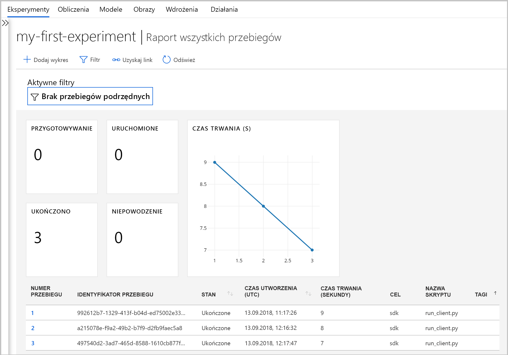
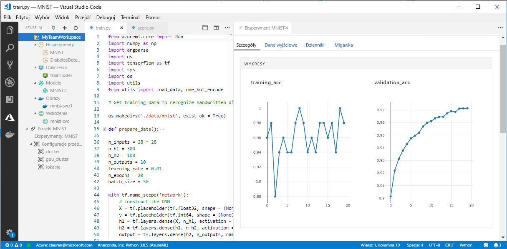

# <a name="what-happened-to-azure-machine-learning-workbench"></a>Co się stało z aplikacją Azure Machine Learning Workbench?

Aplikacja Azure Machine Learning Workbench i niektóre inne wczesne funkcje zostały wycofane i zastąpione w wersji z września 2018 r., aby zwolnić miejsce na ulepszoną [architekturę](concept-azure-machine-learning-architecture.md). 

Wersja zawiera wiele znaczących aktualizacji wprowadzonych w oparciu o opinie klientów, które mają na celu udoskonalenie środowiska użytkownika. Podstawowe funkcje z przebiegów eksperymentu w zakresie wdrażania modelu nie uległy zmianie. Jednak teraz można używać zaawansowanego zestawu <a href="https://aka.ms/aml-sdk" target="_blank">SDK</a> i [interfejsu wiersza polecenia platformy Azure](reference-azure-machine-learning-cli.md) do wykonywania zadań i potoków uczenia maszynowego.  

Większość artefaktów utworzonych w starszej wersji usługi Azure Machine Learning jest przechowywanych we własnym magazynie lokalnym lub w chmurze. Te artefakty nigdy nie zostaną usunięte.

Z tego artykułu dowiesz się, co się zmieniło i jak zmiany wpłynęły na zadania wykonywane obecnie przy użyciu aplikacji Azure Machine Learning Workbench i jej interfejsów API.

>[!Warning]
>Ten artykuł nie jest przeznaczony dla użytkowników środowiska Azure Machine Learning Studio. Jego odbiorcami są klienci usługi Azure Machine Learning, którzy zainstalowali aplikację Workbench (wersja zapoznawcza) i/lub mają konta zarządzania eksperymentami i modelami w wersji zapoznawczej.


## <a name="what-changed"></a>Co się zmieniło?

Najnowsza wersja usługi Azure Machine Learning Service obejmuje następujące funkcje:
+ [Uproszczony model zasobów platformy Azure](concept-azure-machine-learning-architecture.md).
+ [Nowy interfejs użytkownika portalu](how-to-track-experiments.md) służący do zarządzania eksperymentami i celami obliczeniowymi.
+ Nowy, bardziej kompleksowy <a href="https://aka.ms/aml-sdk" target="_blank">zestaw SDK</a> języka Python.
+ Nowe, rozbudowane [rozszerzenie interfejsu wiersza polecenia platformy Azure](reference-azure-machine-learning-cli.md) na potrzeby uczenia maszynowego.

[Architektura](concept-azure-machine-learning-architecture.md) została zaprojektowana od nowa, aby ułatwić obsługę. Zamiast wielu zasobów i kont platformy Azure, będziesz potrzebować tylko aplikacji [Azure Machine Learning Service Workspace](concept-workspace.md). Obszary robocze można szybko tworzyć w witrynie [Azure Portal](how-to-manage-workspace.md). Dzięki użyciu obszaru roboczego wielu użytkowników może przechowywać cele obliczeniowe szkoleń i wdrożeń, eksperymenty dotyczące modeli, obrazy platformy Docker, wdrożone modele itd.

Bieżąca wersja udostępnia nowe, ulepszone klienty interfejsu wiersza polecenia i zestawu SDK, ale sama klasyczna aplikacja Workbench została wycofana z użytku. Eksperymentami można zarządzać na [pulpicie nawigacyjnym obszaru roboczego w witrynie Azure Portal](how-to-track-experiments.md#view-the-experiment-in-the-azure-portal). Pulpit nawigacyjny umożliwia pobieranie historii, zarządzanie celami obliczeniowymi dołączonymi do obszaru roboczego, zarządzanie modelami i obrazami platformy Docker, a nawet wdrażanie usług internetowych.

<a name="timeline"></a>

## <a name="support-timeline"></a>Oś czasu pomocy technicznej

9 stycznia 2019 r. zakończyła się obsługa kont aplikacji Machine Learning Workbench, Eksperymentowania w usłudze Azure Machine Learning i Zarządzania modelami oraz skojarzonego z nimi zestawu SDK i interfejsu wiersza polecenia. 

Wszystkie najnowsze możliwości są dostępne za pomocą tego <a href="https://aka.ms/aml-sdk" target="_blank">zestawu SDK</a>, [interfejsu wiersza polecenia](reference-azure-machine-learning-cli.md) i [portalu](how-to-manage-workspace.md).

## <a name="what-about-run-histories"></a>A co z historią uruchamiania?

Starsze historie uruchamiania nie są już dostępne, ale nadal można wyświetlać uruchomienia w najnowszej wersji. 

Historie uruchamiania są teraz nazywane **eksperymentami**. Eksperymenty modelu można gromadzić i zapoznawać się z nimi przy użyciu zestawu SDK, interfejsu wiersza polecenia lub witryny Azure Portal.

Pulpit nawigacyjny obszaru roboczego w portalu jest obsługiwany tylko w przeglądarkach Microsoft Edge, Chrome i Firefox:

[](./media/overview-what-happened-to-workbench/image001.png#lightbox)

Rozpocznij szkolenie modeli i śledzenie uruchomień przy użyciu nowego interfejsu wiersza polecenia i zestawu SDK. Informacje na temat sposobu wykonywania tych czynności można znaleźć w temacie [Samouczek: uczenie modeli za pomocą usługi Azure Machine Learning](tutorial-train-models-with-aml.md).

## <a name="can-i-still-prep-data"></a>Czy nadal można przygotowywać dane?

Istniejących plików przygotowywania danych nie można przenosić do najnowszej wersji, ponieważ nie ma już aplikacji Machine Learning Workbench. Można jednak nadal przygotowywać zestaw danych dowolnego rozmiaru do modelowania.   

W przypadku zestawów danych o dowolnym rozmiarze można użyć [pakietu przygotowywania danych dla Azure Machine Learning](https://aka.ms/data-prep-sdk) , aby szybko przygotować dane przed modelem, pisząc kod języka Python. 

W [tym samouczku](tutorial-data-prep.md) dowiesz się więcej na temat używania zestawu Data Prep SDK usługi Azure Machine Learning.

## <a name="will-projects-persist"></a>Czy projekty będą utrwalane?

Nie stracisz żadnego kodu ani wykonanej pracy. W starszej wersji projekty są jednostkami chmury z katalogiem lokalnym. W najnowszej wersji można dołączać katalogi lokalne do aplikacji Azure Machine Learning Service Workspace przy użyciu lokalnego pliku konfiguracji. Zobacz [diagram przedstawiający najnowszą architekturę](concept-azure-machine-learning-architecture.md).

Większa część zawartości projektu znajduje się już na komputerze lokalnym. Wystarczy utworzyć w odpowiednim katalogu plik konfiguracji i odwołać się do niego w kodzie, aby nawiązać połączenie z obszarem roboczym. Aby nadal korzystać z lokalnego katalogu zawierającego pliki i skrypty, należy określić nazwę katalogu w poleceniu ["eksperyment. Submit"](https://docs.microsoft.com/python/api/azureml-core/azureml.core.experiment.experiment?view=azure-ml-py) języka Python lub przy użyciu `az ml project attach` interfejsu wiersza polecenia.  Przykład:
```python
run = exp.submit(source_directory=script_folder,
                 script='train.py', run_config=run_config_system_managed)
```

[Utwórz obszar roboczy](how-to-manage-workspace.md) , aby rozpocząć.

## <a name="what-about-my-registered-models-and-images"></a>Co się stanie z moimi zarejestrowanymi modelami i obrazami?

Modele zarejestrowane w starym rejestrze modeli trzeba migrować do nowego obszaru roboczego, aby nadal z nich korzystać. Aby przeprowadzić migrację modeli, pobierz modele i ponownie zarejestruj je w nowym obszarze roboczym. 

Obrazów utworzonych w starym rejestrze obrazu nie można bezpośrednio migrować do nowego obszaru roboczego. W większości przypadków model można wdrożyć bez konieczności tworzenia obrazu. W razie potrzeby można utworzyć obraz dla modelu w nowym obszarze roboczym. Aby uzyskać więcej informacji, zobacz artykuł [Zarządzanie, rejestrowanie, wdrażanie i monitorowanie modeli uczenia maszynowego](concept-model-management-and-deployment.md).

## <a name="what-about-deployed-web-services"></a>Co się stanie z wdrożonymi usługami internetowymi?

Teraz, gdy obsługa starego interfejsu wiersza polecenia została zakończona, nie możesz już ponownie wdrażać modeli ani zarządzać usługami internetowymi, które pierwotnie wdrożono za pomocą konta Zarządzania modelami. Jednak te usługi internetowe będą dalej działać tak długo, jak będzie obsługiwana usługa Azure Container Service (ACS).

W najnowszej wersji modele są wdrażane jako usługi internetowe w klastrach usługi Azure Container Instances (ACI) lub Azure Kubernetes Service (AKS). Można je również wdrażać w układach FPGA oraz w usłudze Azure IoT Edge. 

Aby dowiedzieć się więcej, zobacz następujące artykuły:
+ [Where and how to deploy models (Gdzie i jak wdrażać modele)](how-to-deploy-and-where.md)
+ [Samouczek: Deploy models with Azure Machine Learning service (Samouczek: wdrażanie modeli za pomocą usługi Azure Machine Learning)](tutorial-deploy-models-with-aml.md)

## <a name="what-about-the-old-sdk-and-cli"></a>Co stanie się ze starym zestawem SDK i interfejsem wiersza polecenia?

Tak, będą one nadal działały do stycznia. Zobacz powyższą [oś czasu](#timeline). Zalecamy rozpoczęcie tworzenia nowych eksperymentów i modeli przy użyciu najnowszego zestawu SDK lub interfejsu wiersza polecenia.

W najnowszej wersji nowy zestaw SDK języka Python umożliwia interakcję z usługą Azure Machine Learning w dowolnym środowisku języka Python. Dowiedz się, jak zainstalować najnowszy <a href="https://aka.ms/aml-sdk" target="_blank">zestaw SDK</a>. Można również użyć [zaktualizowanego rozszerzenia interfejsu wiersza polecenia usługi Azure Machine Learning](reference-azure-machine-learning-cli.md) z bogatym zestawem poleceń `az ml`, aby pracować z usługą w dowolnym środowisku wiersza polecenia, w tym w usłudze Azure Cloud Shell.

## <a name="what-about-visual-studio-code-tools-for-ai"></a>A co z narzędziami Visual Studio Code Tools for AI?

W najnowszej wersji nazwa rozszerzenia została zmieniona na Azure Machine Learning dla programu Visual Studio Code, a rozszerzenie zostało rozbudowane i ulepszone w celu umożliwienia współpracy ze wspomnianymi powyżej nowymi funkcjami.

[](./media/overview-what-happened-to-workbench/vscode-big.png#lightbox)

## <a name="what-about-domain-packages"></a>Co się stanie z pakietami domen?

Pakietów domen funkcji przetwarzania obrazów, analizy tekstu i prognozowania nie można używać z najnowszą wersją usługi Azure Machine Learning. Można jednak nadal kompilować i uczyć modele przetwarzania obrazów, analizy tekstu oraz prognozowania przy użyciu najnowszego zestawu <a href="https://aka.ms/aml-sdk" target="_blank">SDK</a> języka Python dla usługi Azure Machine Learning. Aby dowiedzieć się, jak przeprowadzić migrację istniejących wcześniej modeli utworzonych przy użyciu pakietów przetwarzania obrazów, analizy tekstu i prognozowania, skontaktuj się z nami pod adresem [AML-Packages@microsoft.com](mailto:AML-Packages@microsoft.com).

## <a name="next-steps"></a>Następne kroki

Dowiedz się więcej o [najnowszej architekturze usługi Azure Machine Learning](concept-azure-machine-learning-architecture.md). 

Aby zapoznać się z omówieniem usługi, przeczytaj artykuł [co to jest usługa Azure Machine Learning?](overview-what-is-azure-ml.md).

Utwórz pierwszy eksperyment z dwuczęściowym samouczkiem, aby [skonfigurować środowisko i obszar roboczy](tutorial-1st-experiment-sdk-setup.md) oraz [szkolić swój pierwszy model](tutorial-1st-experiment-sdk-train.md)

Aby uzyskać więcej informacji na temat środowiska tego przepływu pracy, wykonaj czynności opisane w [kompleksowym samouczku](tutorial-train-models-with-aml.md), który zawiera szczegółowy opis kroków uczenia i wdrażania modeli przy użyciu usługi Azure Machine Learning. 
