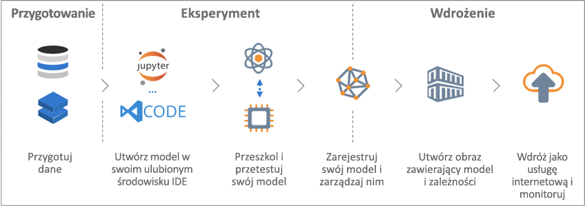

# Co to jest usługa Azure Machine Learning?

Usługa Azure Machine Learning to usługa w chmurze, która pozwala trenować, wdrażać i automatyzować modele uczenia maszynowego oraz zarządzać nimi. Wszystko to jest możliwe na dużą skalę zapewnianą przez chmurę.

## Co to jest uczenie maszynowe?

Uczenie maszynowe to technika przetwarzania danych, która umożliwia wykorzystanie przez komputery istniejących danych w celu przewidywania przyszłych zachowań, rezultatów i trendów. Przy użyciu techniki uczenia maszynowego komputery uczą się bez ich jawnego programowania.

Dzięki prognozom lub przewidywaniom uzyskiwanym za pomocą uczenia maszynowego aplikacje i urządzenia są bardziej inteligentne. Na przykład podczas zakupów w Internecie uczenie maszynowe wspomaga proces rekomendowania innych produktów, którymi kupujący może być zainteresowany, na podstawie jego dotychczasowych zakupów. W przypadku płacenia kartą kredytową uczenie maszynowe porównuje transakcję z bazą danych transakcji i ułatwia wykrycie oszustwa. Gdy robot odkurzający sprząta pomieszczenie, uczenie maszynowe pomaga mu zdecydować, czy praca została wykonana.

## Co to jest usługa Azure Machine Learning?

Usługa Azure Machine Learning zapewnia środowisko oparte na chmurze, które służy do przygotowywania danych, trenowania, testowania, wdrażania i śledzenia modeli uczenia maszynowego oraz zarządzania nimi.

Usługa Azure Machine Learning w pełni obsługuje technologie typu open source. Dlatego można korzystać z dziesiątków tysięcy pakietów open source języka Python, wyposażonych w składniki uczenia maszynowego. Należą do nich na przykład PyTorch, TensorFlow i scikit-learn.
Obsługa zaawansowanych narzędzi znacząco ułatwia interaktywne eksplorowanie i przygotowywanie danych, a następnie opracowywanie i testowanie modeli. Należą do nich [notesy programu Jupyter](https://jupyter.org) i rozszerzenie [Azure Machine Learning dla programu Visual Studio Code](https://marketplace.visualstudio.com/items?itemName=ms-toolsai.vscode-ai#overview).
Usługa Azure Machine Learning obejmuje również funkcje, które [automatyzują generowanie i dostrajanie modeli](tutorial-auto-train-models.md), co ułatwia tworzenie modeli w sposób prosty, wydajny i prawidłowy.

Dzięki usłudze Azure Machine Learning można rozpocząć szkolenie na komputerze lokalnym, a następnie skalować działania do chmury. Dzięki wielu dostępnym [docelowym obiektom obliczeniowym](how-to-set-up-training-targets.md), takim jak środowisko obliczeniowe usługi Azure Machine Learning i [usługa Azure Databricks](/azure/azure-databricks/what-is-azure-databricks), oraz [zaawansowanym usługom dostrajania hiperparametrów](how-to-tune-hyperparameters.md), można tworzyć lepsze modele szybciej, wykorzystując możliwości chmury.

Jeśli masz odpowiedni model, możesz go łatwo wdrożyć w kontenerze, takim jak Docker. W związku z tym łatwe jest wdrażanie w usłudze Azure Container Instances lub usłudze Azure Kubernetes Service. Można również użyć kontenera we własnych wdrożeniach, lokalnie lub w chmurze. Aby uzyskać więcej informacji, zobacz artykuł opisujący, [jak i gdzie wdrażać](how-to-deploy-and-where.md).

Można zarządzać wdrożonymi modelami i śledzić wiele przebiegów, eksperymentując w celu znalezienia najlepszego rozwiązania.
Po wdrożeniu Twój model może zwracać przewidywania dla dużych ilości danych w [czasie rzeczywistym](how-to-consume-web-service.md) lub [asynchronicznie](how-to-run-batch-predictions.md).

Natomiast zaawansowane [potoki uczenia maszynowego](concept-ml-pipelines.md) pozwalają współpracować z innymi nad wszystkimi krokami przygotowywania danych, trenowania i oceniania modelu oraz jego wdrażania.

## Jakie czynności można wykonać za pomocą usługi Azure Machine Learning?

Używając <a href="https://aka.ms/aml-sdk" target="_blank">głównego zestawu SDK języka Python</a> i <a href="https://aka.ms/data-prep-sdk" target="_blank">zestawu SDK do przygotowywania danych</a> dla usługi Azure Machine Learning, jak również pakietów języka Python typu „open source”, możesz samodzielnie tworzyć i trenować bardzo precyzyjne modele uczenia maszynowego i uczenia głębokiego w obszarze roboczym usługi Azure Machine Learning.
Możesz korzystać z wielu składników uczenia maszynowego dostępnych w pakietach języka Python typu „open source”, np. z następujących:

- <a href="https://scikit-learn.org/stable/" target="_blank">Scikit-learn</a>
- <a href="https://www.tensorflow.org" target="_blank">Tensorflow</a>
- <a href="https://pytorch.org" target="_blank">PyTorch</a>
- <a href="https://mxnet.io" target="_blank">MXNet</a>

Usługa Azure Machine Learning może także automatycznie wytrenować model i automatycznie go dla Ciebie dostroić.
Przykład można znaleźć w temacie [Trenowanie modelu regresji za pomocą zautomatyzowanego uczenia maszynowego](tutorial-auto-train-models.md).

Po utworzeniu modelu użyj go do utworzenia kontenera, takiego jak Docker, który można wdrożyć lokalnie do testowania. Po zakończeniu testowania możesz wdrożyć model jako produkcyjną usługę sieci Web w usłudze Azure Container Instances lub usłudze Azure Kubernetes Service. Aby uzyskać więcej informacji, zobacz artykuł opisujący, [jak i gdzie wdrażać](how-to-deploy-and-where.md).

Następnie możesz zarządzać wdrożonymi modelami przy użyciu [zestawu SDK usługi Azure Machine Learning dla języka Python](https://aka.ms/aml-sdk) lub [witryny Azure Portal](https://portal.azure.com/).
Można ocenić metryki modelu, ponownie szkolić i ponownie wdrażać nowe wersje modelu, a wszystko to w trakcie śledzenia eksperymentów związanych z modelem.

Aby rozpocząć pracę przy użyciu usługi Azure Machine Learning, zobacz [Następne kroki](#next-steps).

## Czym różni się usługa Azure Machine Learning od usługi Machine Learning Studio?

Usługa [Azure Machine Learning Studio](../studio/what-is-ml-studio.md) jest wizualnym obszarem roboczym do współpracy typu przeciągnij i upuść, w którym można tworzyć, testować i wdrażać rozwiązania uczenia maszynowego bez potrzeby pisania kodu. Używa ona wstępnie utworzonych i wstępnie skonfigurowanych algorytmów uczenia maszynowego i modułów obsługi danych.

Używaj usługi Machine Learning Studio, gdy chcesz w szybki i prosty sposób poeksperymentować z modelami uczenia maszynowego, a wbudowane algorytmy uczenia maszynowego są wystarczające dla Twoich rozwiązań.

Używaj usługi uczenia maszynowego, jeśli pracujesz w środowisku języka Python, chcesz mieć większą kontrolę nad algorytmami uczenia maszynowego lub chcesz użyć bibliotek uczenia maszynowego typu „open source”.

> [!NOTE]
> Modele utworzone w usłudze Azure Machine Learning Studio nie mogą być wdrażane ani zarządzane przez usługę Azure Machine Learning.

## Bezpłatna wersja próbna

Jeśli nie masz subskrypcji na platformie Azure, przed rozpoczęciem utwórz bezpłatne konto. Wypróbuj [bezpłatną lub płatną wersję usługi Azure Machine Learning](https://aka.ms/AMLFree) już dziś.

Możesz uzyskać środki do wydania na usługi platformy Azure. Nawet po ich wyczerpaniu możesz zachować konto i korzystać z [bezpłatnych usług platformy Azure](https://azure.microsoft.com/free/). Karta kredytowa nie zostanie obciążona, chyba że jawnie zmienisz ustawienia i poprosisz o jej obciążenie. Możesz też [aktywować korzyści subskrybenta MSDN](https://azure.microsoft.com/pricing/member-offers/msdn-benefits-details/?WT.mc_id=A261C142F), dzięki którym co miesiąc otrzymasz środki do wykorzystania na płatne usługi platformy Azure.

## Kolejne kroki

- [Tworzenie obszaru roboczego usługi Machine Learning](setup-create-workspace.md) na rozpoczęcie pracy.

- Wykonaj kompleksowe samouczki: 
  + [Uczenie modelu klasyfikacji obrazów za pomocą usługi Azure Machine Learning](tutorial-train-models-with-aml.md) 
  + [Prepare data and use automated machine learning to auto-train a regression model (Przygotowywanie danych i używanie zautomatyzowanego uczenia maszynowego do automatycznego trenowania modelu regresji)](tutorial-data-prep.md)

- Użyj zestawu [Azure Machine Learning Data Prep SDK](https://aka.ms/data-prep-sdk), aby przygotować swoje dane.

- Dowiedz się więcej o [potokach uczenia maszynowego](/azure/machine-learning/service/concept-ml-pipelines) w celu tworzenia i optymalizowania scenariuszy uczenia maszynowego oraz zarządzania nimi.

- Przeczytaj uważnie artykuł poświęcony [architekturze usługi Azure Machine Learning i powiązanym pojęciom](concept-azure-machine-learning-architecture.md).

- Aby uzyskać więcej informacji, zobacz [inne produkty firmy Microsoft do uczenia maszynowego](/azure/architecture/data-guide/technology-choices/data-science-and-machine-learning).
