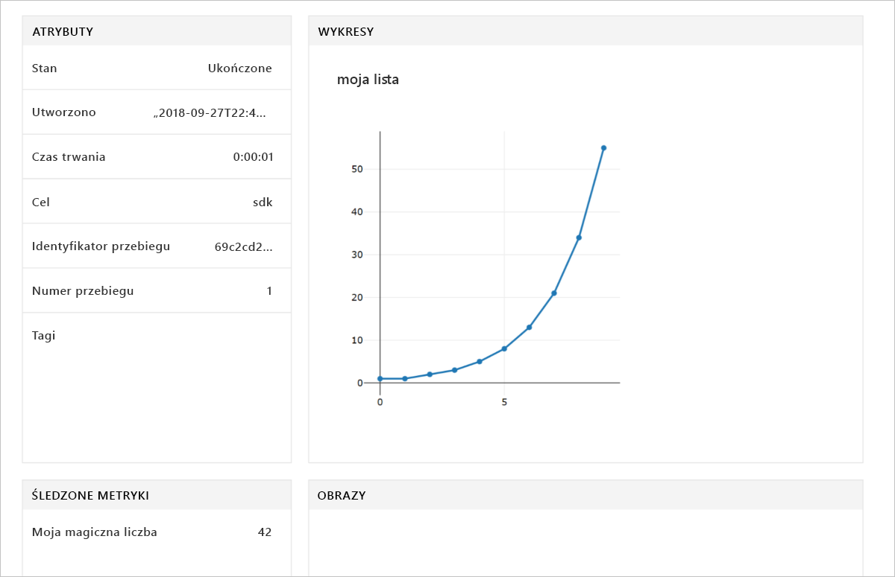

# <a name="quickstart-use-the-python-sdk-to-get-started-with-azure-machine-learning"></a>Szybki start: Rozpoczynanie pracy z usługą Azure Machine Learning przy użyciu zestawu SDK języka Python

W tym artykule użyjesz zestawu SDK Azure Machine Learning dla języka Python 3, aby utworzyć [obszar roboczy](concept-azure-machine-learning-architecture.md) usługi Azure Machine Learning i go używać. Ten obszar roboczy to podstawowy blok w chmurze umożliwiający eksperymentowanie z modelami uczenia maszynowego, ich trenowanie oraz wdrażanie za pomocą usługi Machine Learning.

Rozpoczynasz pracę od skonfigurowania własnego środowiska języka Python i serwera Jupyter Notebook. Aby uruchomić je bez instalacji, zobacz [Szybki start: Rozpoczynanie pracy z usługą Azure Machine Learning w witrynie Azure Portal](quickstart-get-started.md). 

Zobacz wersję wideo tego przewodnika Szybki start:

> [!VIDEO https://www.microsoft.com/en-us/videoplayer/embed/RE2G9N6]

W ramach tego przewodnika Szybki start wykonasz następujące czynności:

* Instalacja zestawu SDK dla języka Python.
* Tworzenie obszaru roboczego w subskrypcji platformy Azure.
* Tworzenie pliku konfiguracji dla obszaru roboczego do późniejszego użycia w innych notesach i skryptach.
* Pisanie kodu, który rejestruje wartości w obszarze roboczym.
* Wyświetlanie zarejestrowanych wartości w obszarze roboczym.

Tworzysz obszar roboczy i plik konfiguracji, których będzie można użyć jako elementów wymaganych wstępnie w innych samouczkach usługi Machine Learning i artykułach zawierających instrukcje. Podobnie jak w przypadku innych usług platformy Azure korzystanie z usługi Machine Learning jest ograniczone pewnymi limitami i przydziałami. [Learn about quotas and how to request more (Więcej informacji o limitach przydziału i zwiększaniu limitów)](how-to-manage-quotas.md).

Do obszaru roboczego zostaną automatycznie dodane następujące zasoby platformy Azure, gdy będą dostępne w regionie:
 
- [Azure Container Registry](https://azure.microsoft.com/services/container-registry/)
- [Azure Storage](https://azure.microsoft.com/services/storage/)
- [Azure Application Insights](https://azure.microsoft.com/services/application-insights/) 
- [Usługa Azure Key Vault](https://azure.microsoft.com/services/key-vault/)

>[!NOTE]
> Kod w tym artykule wymaga zestawu Azure Machine Learning SDK w wersji 1.0.2 lub nowszej i został przetestowany z wersją 1.0.8.


Jeśli nie masz subskrypcji Azure, przed rozpoczęciem utwórz bezpłatne konto. Wypróbuj [bezpłatną lub płatną wersję usługi Azure Machine Learning](https://aka.ms/AMLFree) już dziś.

## <a name="install-the-sdk"></a>Instalacja zestawu SDK

> [!IMPORTANT]
> Pomiń tę sekcję, jeśli używasz maszyny wirtualnej do analizy danych na platformie Azure lub Azure Databricks.
> * Maszyny wirtualne do analizy danych na platformie Azure utworzone po 27 września 2018 r. mają preinstalowany zestaw SDK języka Python.
> * W środowisku usługi Azure Databricks wykonaj w zamian [kroki instalacji usługi Databricks](how-to-configure-environment.md#azure-databricks).

>[!NOTE]
> Użyj tych instrukcji, aby zainstalować i korzystać z zestawu SDK w aplikacji Jupyter Notebook na komputerze lokalnym. Służące Jupyter na zdalnej maszynie wirtualnej, należy skonfigurować zdalnej, pulpitu lub X sesji terminalowej. 

Przed zainstalowaniem zestawu SDK zalecamy utworzenie izolowanego środowiska języka Python. W tym artykule używane jest narzędzie [Miniconda](https://docs.conda.io/en/latest/miniconda.html), ale możesz również użyć pełnego zainstalowanego narzędzia [Anaconda](https://www.anaconda.com/) lub [Python virtualenv](https://virtualenv.pypa.io/en/stable/).

Instrukcje w tym przewodniku Szybki start spowodują zainstalowanie pakietów potrzebnych do uruchomienia notesów szybkiego startu i samouczków.  Inne przykładowe notesy mogą wymagać zainstalowania dodatkowych składników.  Aby uzyskać więcej informacji dotyczących tych składników, zobacz [Instalowanie zestawu SDK usługi Azure Machine Learning dla języka Python](https://docs.microsoft.com/python/api/overview/azure/ml/install).

### <a name="install-miniconda"></a>Instalowanie narzędzia Miniconda

[Pobierz i zainstaluj narzędzie Miniconda](https://docs.conda.io/en/latest/miniconda.html). Wybierz do zainstalowania wersję języka Python 3.7. Nie wybieraj wersji 2.x języka Python.  

### <a name="create-an-isolated-python-environment"></a>Tworzenia izolowanego środowiska języka Python

1. Otwórz okno wiersza polecenia, utwórz nowe środowisko conda o nazwie *myenv* i zainstaluj język Python 3.6.5. Zestaw SDK usługi Azure Machine Learning będzie działał z językiem Python w wersji 3.5.2 lub nowszym, ale zautomatyzowane składniki uczenia maszynowego nie są w pełni funkcjonalne w wersji języka Python 3.7.  Utworzenie środowiska, podczas gdy składniki i pakiety będą pobierane, potrwa kilka minut.

    ```shell
    conda create -n myenv python=3.6.5
    ```

1. Aktywuj środowisko.

    ```shell
    conda activate myenv
    ```

1. Włącz jądra ipython specyficzne dla środowiska:

    ```shell
    conda install notebook ipykernel
    ```

    Następnie utwórz jądro:

    ```shell
    ipython kernel install --user
    ```

### <a name="install-the-sdk"></a>Instalacja zestawu SDK

1. W aktywowanym środowisku conda zainstaluj podstawowe składniki zestawu SDK uczenia maszynowego z funkcjami aplikacji Jupyter Notebook. Instalacja trwa kilka minut; czas jej trwania zależy od konfiguracji maszyny.

    ```shell
    pip install --upgrade azureml-sdk[notebooks]
    ```

1. Aby użyć tego środowiska do celów samouczków dotyczących usługi Azure Machine Learning, zainstaluj te pakiety.

    ```shell
    conda install -y cython matplotlib pandas
    ```

1. Aby użyć tego środowiska do celów samouczków dotyczących usługi Azure Machine Learning, zainstaluj zautomatyzowane składniki uczenia maszynowego.

    ```shell
    pip install --upgrade azureml-sdk[automl]
    ```

> [!IMPORTANT]
> W niektórych narzędzi wiersza polecenia może być konieczne dodania znaków cudzysłowu w następujący sposób:
> *  'azureml-sdk[notebooks]'
> * 'azureml-sdk[automl]'
>


## <a name="create-a-workspace"></a>Tworzenie obszaru roboczego

Utwórz obszar roboczy w aplikacji Jupyter Notebook przy użyciu zestawu SDK języka Python.

1. Utwórz lub przeprowadź ciągłe wdrażanie do katalogu, którego chcesz używać do celów przewodników Szybki start oraz samouczków.

1. Aby uruchomić aplikację Jupyter Notebook, wpisz to polecenie:

    ```shell
    jupyter notebook
    ```

1. W oknie przeglądarki utwórz nowy notes przy użyciu domyślnego jądra `Python 3`. 

1. Aby wyświetlić wersję zestawu SDK, wprowadź poniższy kod języka Python w komórce notesu, a następnie wykonaj go:

   [!code-python[](~/aml-sdk-samples/ignore/doc-qa/quickstart-create-workspace-with-python/quickstart.py?name=import)]

1. Znajdź wartość parametru `<azure-subscription-id>` na [liście subskrypcji w witrynie Azure Portal](https://ms.portal.azure.com/#blade/Microsoft_Azure_Billing/SubscriptionsBlade). Użyj dowolnej subskrypcji, w której masz rolę właściciela lub współautora.

   ```python
   from azureml.core import Workspace
   ws = Workspace.create(name='myworkspace',
                         subscription_id='<azure-subscription-id>', 
                         resource_group='myresourcegroup',
                         create_resource_group=True,
                         location='eastus2' 
                        )
   ```

   Podczas wykonywania kodu może zostać wyświetlony monit o zalogowanie się do konta platformy Azure. Po zalogowaniu token uwierzytelniania będzie buforowany lokalnie.

1. Aby wyświetlić szczegóły obszaru roboczego, takie jak skojarzony magazyn, rejestr kontenerów oraz magazyn kluczy, wprowadź poniższy kod:

    [!code-python[](~/aml-sdk-samples/ignore/doc-qa/quickstart-create-workspace-with-python/quickstart.py?name=getDetails)]


## <a name="write-a-configuration-file"></a>Zapisywanie pliku konfiguracji

Zapisz szczegóły obszaru roboczego w pliku konfiguracji do bieżącego katalogu. Ten plik ma nazwę *aml_config\config.json*.  

Plik konfiguracji obszaru roboczego ułatwia późniejsze załadowanie tego samego obszaru roboczego. Możesz załadować go z innymi notesami i skryptami w tym samym katalogu lub podkatalogu.  

[!code-python[](~/aml-sdk-samples/ignore/doc-qa/quickstart-create-workspace-with-python/quickstart.py?name=writeConfig)]

To wywołanie interfejsu API `write_config()` utworzy plik konfiguracyjny w bieżącym katalogu. Plik *config.json* zawiera następujący kod:

```json
{
    "subscription_id": "<azure-subscription-id>",
    "resource_group": "myresourcegroup",
    "workspace_name": "myworkspace"
}
```

## <a name="use-the-workspace"></a>Korzystanie z obszaru roboczego

Uruchom kod korzystający z podstawowych interfejsów API zestawu SDK w celu śledzenia przebiegu eksperymentu:

1. Utwórz eksperyment w obszarze roboczym.
1. Zarejestruj pojedynczą wartość w eksperymencie.
1. Zarejestruj listę wartości w eksperymencie.

[!code-python[](~/aml-sdk-samples/ignore/doc-qa/quickstart-create-workspace-with-python/quickstart.py?name=useWs)]

## <a name="view-logged-results"></a>Wyświetlanie zarejestrowanych wyników
Po zakończeniu przebiegu możesz wyświetlić przebieg eksperymentu w witrynie Azure Portal. Aby wyświetlić adres URL prowadzący do wyników dla ostatniego przebiegu, użyj następującego kodu:

```python
print(run.get_portal_url())
```

Użyj linku, aby wyświetlić zarejestrowane wartości w witrynie Azure Portal w przeglądarce.



## <a name="clean-up-resources"></a>Oczyszczanie zasobów 
>[!IMPORTANT]
>Utworzonych tutaj zasobów możesz użyć jako wstępnie wymaganych składników w innych samouczkach usługi Machine Learning i artykułach z instrukcjami.

Jeśli nie planujesz korzystać z zasobów, które zostały utworzone w tym artykule, usuń je, aby uniknąć ponoszenia opłat.

[!code-python[](~/aml-sdk-samples/ignore/doc-qa/quickstart-create-workspace-with-python/quickstart.py?name=delete)]

## <a name="next-steps"></a>Kolejne kroki

W tym artykule utworzono zasoby niezbędne do eksperymentowania i wdrażania modeli. Uruchomiono kod w notesie i zbadano historię uruchamiania tego kodu w obszarze roboczym w chmurze.

> [!div class="nextstepaction"]
> [Samouczek: trenowanie modelu klasyfikacji obrazów](tutorial-train-models-with-aml.md)

Możesz też zapoznać się z [bardziej zaawansowanymi przykładami w witrynie GitHub](https://aka.ms/aml-notebooks).
