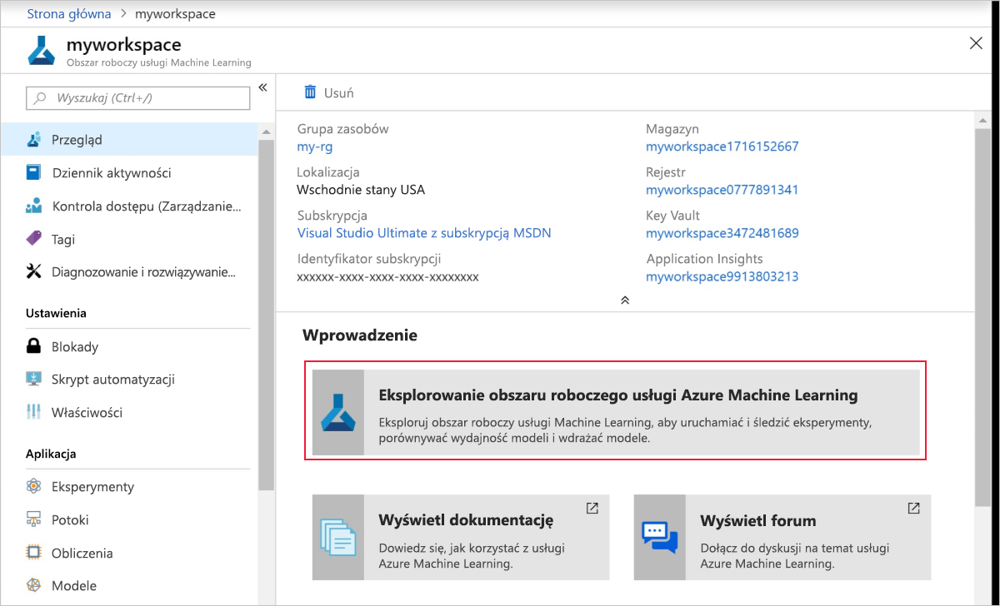
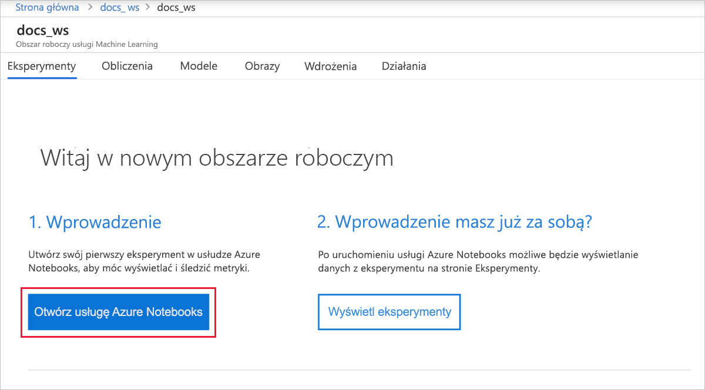
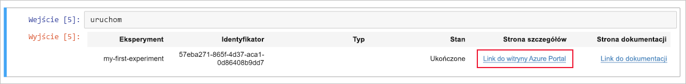
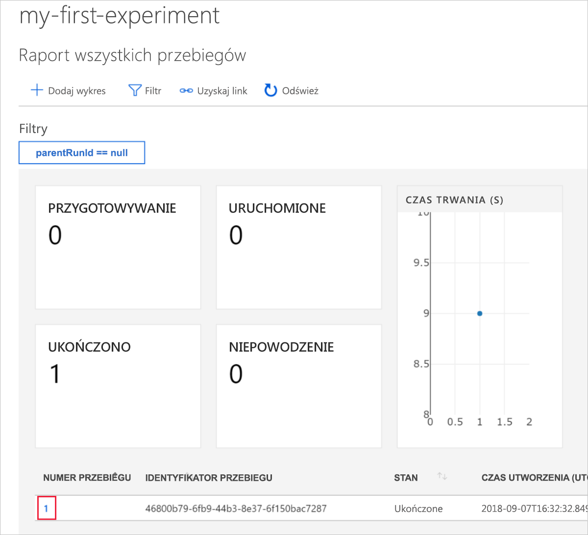
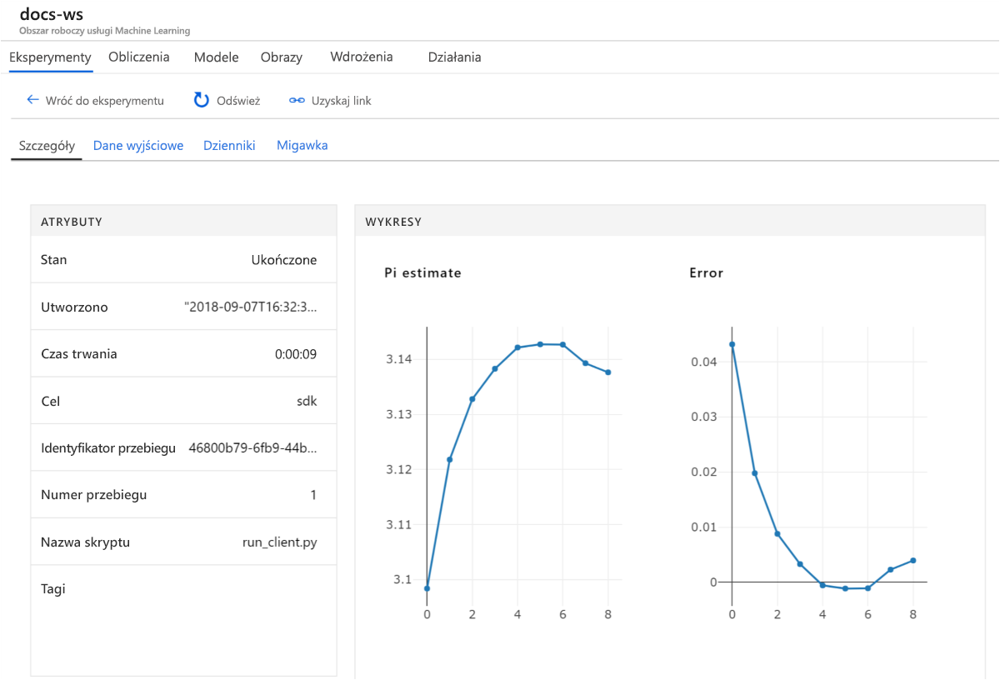

# <a name="quickstart-use-the-azure-portal-to-get-started-with-azure-machine-learning"></a>Szybki start: rozpoczynanie pracy z usługą Azure Machine Learning w witrynie Azure Portal

W tym przewodniku Szybki start utworzysz obszar roboczy usługi Azure Machine Learning przy użyciu witryny Azure Portal. Ten obszar roboczy to podstawowy blok w chmurze umożliwiający eksperymentowanie z modelami uczenia maszynowego, ich uczenie oraz wdrażanie za pomocą usługi Machine Learning. 

W tym samouczku zostaną wykonane następujące czynności:

* Tworzenie obszaru roboczego w subskrypcji platformy Azure.
* Wypróbowanie jego działania za pomocą języka Python w notesie platformy Azure i rejestrowanie wartości z wielu iteracji.
* Wyświetlanie zarejestrowanych wartości w obszarze roboczym.

Do obszaru roboczego zostaną automatycznie dodane następujące zasoby platformy Azure, gdy będą dostępne w regionie:

  - [Azure Container Registry](https://azure.microsoft.com/services/container-registry/)
  - [Azure Storage](https://azure.microsoft.com/services/storage/)
  - [Azure Application Insights](https://azure.microsoft.com/services/application-insights/) 
  - [Usługa Azure Key Vault](https://azure.microsoft.com/services/key-vault/)

Utworzone zasoby mogą być używane jako wstępnie wymagane składniki w innych samouczkach usługi Machine Learning i artykułach z instrukcjami. Podobnie jak w przypadku innych usług platformy Azure korzystanie z pewnych zasobów skojarzonych z usługą Machine Learning jest ograniczone określonymi limitami. Przykładem jest rozmiar klastra usługi Azure Batch AI. Informacje na temat domyślnych limitów i zwiększania limitu przydziału można znaleźć w [tym artykule](how-to-manage-quotas.md).

Jeśli nie masz subskrypcji platformy Azure, przed rozpoczęciem utwórz [bezpłatne konto](https://azure.microsoft.com/free/?WT.mc_id=A261C142F).


## <a name="create-a-workspace"></a>Tworzenie obszaru roboczego 

[!INCLUDE [aml-create-portal](../../../includes/aml-create-in-portal.md)]

Na stronie obszaru roboczego wybierz pozycję `Explore your Azure Machine Learning service workspace`.

 


## <a name="use-the-workspace"></a>Korzystanie z obszaru roboczego

Teraz zobaczysz, jak obszar roboczy ułatwia zarządzanie skryptami uczenia maszynowego. W tej sekcji omówiono następujące zagadnienia:

* Otwieranie notesu w usłudze Azure Notebooks.
* Uruchamianie kodu, który tworzy niektóre rejestrowane wartości.
* Wyświetlanie zarejestrowanych wartości w obszarze roboczym.

W tym przykładzie pokazano, jak obszar roboczy może pomóc w śledzeniu informacji wygenerowanych przez skrypt. 

### <a name="open-a-notebook"></a>Otwieranie notesu 

Usługa Azure Notebooks udostępnia bezpłatną platformę w chmurze do przechowywania notesów Jupyter, które są wstępnie skonfigurowane do obsługi wszystkich elementów potrzebnych, aby uruchomić usługę Machine Learning.  

Wybierz pozycję `Open Azure Notebooks`, aby wypróbować pierwszy eksperyment.

 

Organizacja może wymagać [zgody administratora](https://notebooks.azure.com/help/signing-up/work-or-school-account/admin-consent) przed zalogowaniem się.

Po zalogowaniu zostanie otwarta nowa karta z wyświetlonym monitem `Clone Library`. Wybierz pozycję `Clone`


### <a name="run-the-notebook"></a>Uruchamianie notesu

Oprócz dwóch notesów zobaczysz jeszcze plik `config.json`. Ten plik konfiguracji zawiera informacje o utworzonym obszarze roboczym.  

Wybierz pozycję `01.run-experiment.ipynb`, aby otworzyć notes.

Aby uruchamiać komórki pojedynczo, użyj klawiszy `Shift`+`Enter`. Możesz też uruchomić cały notes, wybierając pozycje `Cells`  >  `Run All`. Gdy obok komórki jest wyświetlana gwiazdka [*], oznacza to, że komórka jest uruchomiona. Po zakończeniu działania kodu tej komórki pojawi się liczba.

Może zostać wyświetlony monit o zalogowanie się. Skopiuj kod z komunikatu. Następnie wybierz link i wklej kod w nowym oknie. Pamiętaj, aby nie kopiować spacji znajdującej się przed ani za kodem. Zaloguj się przy użyciu konta użytego w witrynie Azure Portal.

 

W notesie kod w drugim wierszu odczytuje dane z pliku `config.json` w celu nawiązania połączenia z obszarem roboczym.
```
ws = Workspace.from_config()
```

Trzecia komórka kodu uruchamia eksperyment o nazwie „my-first-experiment”. Użyj tej nazwy do wyszukiwania informacji o przebiegu w obszarze roboczym.

```
experiment = Experiment(workspace_object=ws, name = "my-first-experiment")
```

W ostatniej komórce notesu znajdują się wartości zapisywane w pliku dziennika.

```
# Log final results
run.log("Final estimate: ",pi_estimate)
run.log("Final error: ",math.pi-pi_estimate)
```

Te wartości można wyświetlić w obszarze roboczym po zakończeniu działania kodu.

## <a name="view-logged-values"></a>Wyświetlanie zarejestrowanych wartości

Po uruchomieniu wszystkich komórek notesu wróć do strony portalu.  

Wybierz pozycję `View Experiments`.



Zamknij wyskakujące okienko `Reports`.

Wybierz pozycję `my-first-experiment`.

Przejrzyj informacje o wykonanym właśnie przebiegu. Przewiń stronę w dół do tabeli przebiegów. Wybierz link liczby przebiegów.

 

Zostaną wyświetlone wykresy utworzone automatycznie na podstawie zarejestrowanych wartości.  

   

Kod obliczania przybliżonej liczby pi używa wartości losowych, dlatego wykresy będą przedstawiać różne wartości.

## <a name="clean-up-resources"></a>Oczyszczanie zasobów 

[!INCLUDE [aml-delete-resource-group](../../../includes/aml-delete-resource-group.md)]

Możesz też zachować grupę zasobów i usunąć jeden obszar roboczy. Wyświetl właściwości obszaru roboczego i wybierz pozycję **Usuń**.

## <a name="next-steps"></a>Następne kroki

Utworzono zasoby umożliwiające eksperymentowanie i wdrażanie modeli. Uruchomiono też kod w notesie. Zbadano historię przebiegów dotyczącą tego kodu w obszarze roboczym w chmurze.

Aby poznać szczegółowo środowisko przepływu pracy, wykonaj czynności opisane w samouczku dotyczącym uczenia i wdrażania modelu w usłudze Machine Learning.  

> [!div class="nextstepaction"]
> [Samouczek: uczenie modelu klasyfikacji obrazów](tutorial-train-models-with-aml.md)
