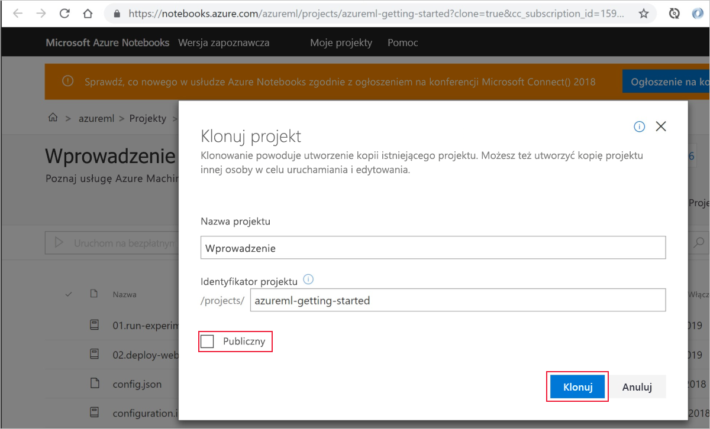
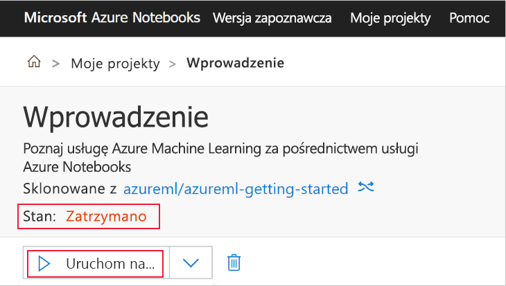
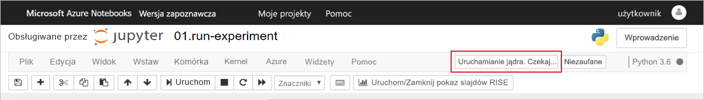
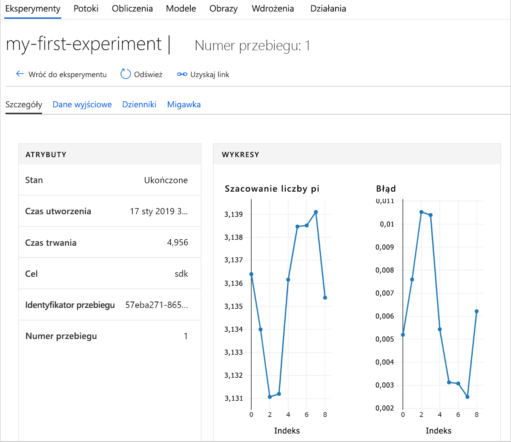

# Szybki start: Rozpoczynanie pracy z usługą Azure Machine Learning w witrynie Azure Portal

Obszar roboczy usługi Azure Machine Learning można utworzyć w witrynie Azure Portal. Ten obszar roboczy to podstawowy blok w chmurze umożliwiający eksperymentowanie z modelami uczenia maszynowego, ich uczenie oraz wdrażanie za pomocą usługi Machine Learning. Ten przewodnik Szybki start korzysta z zasobów w chmurze i nie wymaga żadnej instalacji. Aby zamiast tego skonfigurować własny serwer notesów Jupyter Notebook, zobacz [Szybki start: Rozpoczynanie pracy z usługą Azure Machine Learning w języku Python](quickstart-create-workspace-with-python.md).  
 
W tym przewodniku Szybki start wykonasz następujące czynności:

* Tworzenie obszaru roboczego w subskrypcji platformy Azure.
* Wypróbowanie jego działania za pomocą języka Python w notesie Jupyter i rejestrowanie wartości z wielu iteracji.
* Wyświetlanie zarejestrowanych wartości w obszarze roboczym.

Do obszaru roboczego zostaną automatycznie dodane następujące zasoby platformy Azure, gdy będą dostępne w regionie:

  - [Azure Container Registry](https://azure.microsoft.com/services/container-registry/)
  - [Azure Storage](https://azure.microsoft.com/services/storage/)
  - [Azure Application Insights](https://azure.microsoft.com/services/application-insights/) 
  - [Usługa Azure Key Vault](https://azure.microsoft.com/services/key-vault/)

Utworzone zasoby mogą być używane jako wstępnie wymagane składniki w innych samouczkach usługi Machine Learning i artykułach z instrukcjami. Podobnie jak w przypadku innych usług platformy Azure korzystanie z pewnych zasobów skojarzonych z usługą Machine Learning jest ograniczone określonymi limitami. Przykładem jest rozmiar klastra obliczeniowego. Dowiedz się więcej o [limitach domyślnych i sposobach zwiększania limitów przydziału](how-to-manage-quotas.md).

Jeśli nie masz subskrypcji Azure, przed rozpoczęciem utwórz bezpłatne konto. Wypróbuj [bezpłatną lub płatną wersję usługi Azure Machine Learning](http://aka.ms/AMLFree) już dziś.

## Tworzenie obszaru roboczego 

[!INCLUDE [aml-create-portal](../../../includes/aml-create-in-portal.md)]

## Korzystanie z obszaru roboczego

> [!VIDEO https://www.microsoft.com/en-us/videoplayer/embed/RE2F9Ad]

Teraz dowiesz się, jak obszar roboczy ułatwia zarządzanie skryptami uczenia maszynowego. W tej sekcji wykonasz następujące kroki:

* Otwieranie notesu w usłudze Azure Notebooks.
* Uruchamianie kodu, który tworzy niektóre rejestrowane wartości.
* Wyświetlanie zarejestrowanych wartości w obszarze roboczym.

W tym przykładzie pokazano, jak obszar roboczy może pomóc w śledzeniu informacji wygenerowanych przez skrypt. 

### Otwieranie notesu 

Usługa [Azure Notebooks](https://notebooks.azure.com) udostępnia bezpłatną platformę w chmurze do przechowywania notesów Jupyter, które są wstępnie skonfigurowane do obsługi wszystkich elementów potrzebnych, aby uruchomić usługę Machine Learning. Tę platformę można uruchomić z poziomu obszaru roboczego, aby rozpocząć korzystanie z obszaru roboczego usługi Azure Machine Learning.

1. Na stronie obszaru roboczego wybierz pozycję **Eksplorowanie obszaru roboczego usługi Azure Machine Learning**.

 

1. Wybierz pozycję **Otwórz usługę Azure Notebooks**, aby spróbować przeprowadzić swój pierwszy eksperyment w usłudze Azure Notebooks.  Azure Notebooks to oddzielna usługa, która umożliwia bezpłatne uruchamianie notesów programu Jupyter w chmurze.  Jeśli użyjesz tego linku do usługi, informacje o sposobie łączenia się z obszarem roboczym zostaną dodane do biblioteki tworzonej w usłudze Azure Notebooks.

 

1. Zaloguj się do usługi Azure Notebooks.  Upewnij się, że logujesz się przy użyciu tego samego konta, którego używasz do logowania się do witryny Azure Portal. Organizacja może wymagać [zgody administratora](https://notebooks.azure.com/help/signing-up/work-or-school-account/admin-consent) przed zalogowaniem się.

1. Po zalogowaniu zostanie otwarta nowa karta z wyświetlonym monitem `Clone Library`. Sklonowanie tej biblioteki spowoduje załadowanie zestawu notesów i innych plików na konto usługi Azure Notebooks.  Te pliki pomogą Ci w eksplorowaniu możliwości usługi Azure Machine Learning.

1. Usuń zaznaczenie pola wyboru **Publiczne**, aby nie udostępniać informacji o obszarze roboczym innym osobom.

1. Wybierz pozycję **Klonuj**.

 

1. Jeśli zobaczysz, że projekt jest w stanie Zatrzymano, kliknij pozycję **Uruchom w ramach bezpłatnych obliczeń**, aby korzystać z bezpłatnego serwera notesu.

    

### Uruchamianie notesu

Na liście plików tego projektu zobaczysz plik `config.json`. Ten plik konfiguracji zawiera informacje o obszarze roboczym utworzonym w witrynie Azure Portal.  Ten plik umożliwia kodowi nawiązywanie połączenia i dodawanie informacji do obszaru roboczego.

1. Wybierz plik **01.run experiment.ipynb**, aby otworzyć notes.

1. W obszarze stanu jest widoczna informacja o tym, że musisz zaczekać na uruchomienie jądra.  Komunikat zniknie, gdy jądro będzie gotowe.

    

1. Gdy jądro zacznie działać, przy użyciu kombinacji klawiszy **Shift + Enter** uruchom kolejno poszczególne komórki. Możesz też wybrać kolejno pozycje **Komórki** > **Uruchom wszystkie** w celu uruchomienia całego notesu. Gdy obok komórki pojawi się znak gwiazdki, __*__, oznacza to, że komórka jest nadal uruchomiona. Po zakończeniu działania kodu tej komórki pojawi się liczba. 

1. Postępuj zgodnie z instrukcjami w notesie w celu uwierzytelnienia subskrypcji platformy Azure.

Po zakończeniu uruchamiania wszystkich komórek w notesie możesz wyświetlić zarejestrowane wartości w swoim obszarze roboczym.

## Wyświetlanie zarejestrowanych wartości

1. Dane wyjściowe z komórki `run` zawierają link do witryny Azure Portal, dzięki któremu można wyświetlić wyniki eksperymentu w obszarze roboczym. 

    

1. Kliknij pozycję **Link do witryny Azure Portal**, aby wyświetlić informacje o uruchomieniu w obszarze roboczym.  Ten link powoduje otwarcie obszaru roboczego w witrynie Azure Portal.

1. Wykresy zarejestrowanych wartości, które zobaczysz, zostały automatycznie utworzone w obszarze roboczym. Zawsze w przypadku zarejestrowania wielu wartości z tym samym parametrem nazwa wykres jest generowany automatycznie.

   

Kod obliczania przybliżonej liczby pi używa wartości losowych, dlatego wykresy będą przedstawiać różne wartości.  

## Oczyszczanie zasobów 

[!INCLUDE [aml-delete-resource-group](../../../includes/aml-delete-resource-group.md)]

Możesz też zachować grupę zasobów i usunąć jeden obszar roboczy. Wyświetl właściwości obszaru roboczego i wybierz pozycję **Usuń**.

## Następne kroki

Utworzono zasoby umożliwiające eksperymentowanie i wdrażanie modeli. Uruchomiono też kod w notesie. Zbadano historię przebiegów dotyczącą tego kodu w obszarze roboczym w chmurze.

Aby poznać szczegółowo środowisko przepływu pracy, wykonaj czynności opisane w samouczku dotyczącym trenowania i wdrażania modelu w usłudze Machine Learning:  

> [!div class="nextstepaction"]
> [Samouczek: trenowanie modelu klasyfikacji obrazów](tutorial-train-models-with-aml.md)
