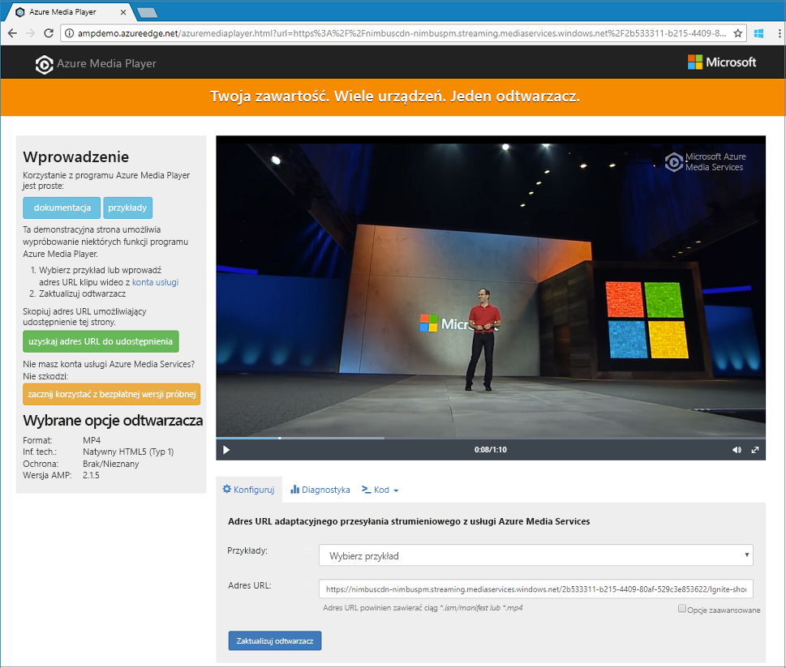

# <a name="tutorial-encode-a-remote-file-based-on-url-and-stream-the-video---cli"></a>Samouczek: Kodowanie pliku zdalnego na podstawie adresu URL i strumieniowego wideo — interfejs wiersza polecenia

W tym samouczku przedstawiono sposób łatwego kodowania i strumieniowego przesyłania filmów wideo w różnych przeglądarkach i urządzeniach przy użyciu Azure Media Services i interfejsu wiersza polecenia platformy Azure. Możesz określić zawartość wejściową, używając adresów URL lub ścieżek protokołu HTTPS lub SAS do plików w usłudze Azure Blob Storage.

W przykładzie w tym artykule zakodowana jest zawartość, którą można uzyskać za pośrednictwem adresu URL HTTPS. Media Services V3 nie obsługuje obecnie kodowania transferu fragmentarycznego za pośrednictwem adresów URL protokołu HTTPS.

Po zakończeniu tego samouczka będziesz mieć możliwość przesyłania strumieniowego wideo.  



[!INCLUDE [quickstarts-free-trial-note](../../../includes/quickstarts-free-trial-note.md)]

## <a name="create-a-media-services-account"></a>Tworzenie konta usługi Media Services

Aby można było szyfrować, kodować, analizować, zarządzać i przesyłać strumieniowo zawartość multimedialną na platformie Azure, należy utworzyć konto Media Services. To konto musi być skojarzone z co najmniej jednym kontem magazynu.

Twoje konto Media Services i wszystkie powiązane konta magazynu muszą znajdować się w tej samej subskrypcji platformy Azure. Zalecamy używanie kont magazynu, które są w tym samym miejscu co konto Media Services, aby ograniczyć opóźnienia i koszty danych wyjściowych.

### <a name="create-a-resource-group"></a>Tworzenie grupy zasobów

```azurecli
az group create -n amsResourceGroup -l westus2
```

### <a name="create-an-azure-storage-account"></a>Tworzenie konta usługi Azure storage

W tym przykładzie utworzymy standardowe konto LRS w wersji 2.

Jeśli chcesz poeksperymentować z kontami magazynu, użyj parametru `--sku Standard_LRS`. W przypadku wybrania jednostki SKU do produkcji należy rozważyć użycie `--sku Standard_RAGRS`, która zapewnia replikację geograficzną dla ciągłości działania. Aby uzyskać więcej informacji, zobacz temat [Konta magazynu](https://docs.microsoft.com/cli/azure/storage/account?view=azure-cli-latest).
 
```azurecli
az storage account create -n amsstorageaccount --kind StorageV2 --sku Standard_LRS -l westus2 -g amsResourceGroup
```

### <a name="create-an-azure-media-services-account"></a>Tworzenie konta usługi Azure Media Services

```azurecli
az ams account create --n amsaccount -g amsResourceGroup --storage-account amsstorageaccount -l westus2
```

Otrzymujesz odpowiedź w następujący sposób:

```
{
  "id": "/subscriptions/<id>/resourceGroups/amsResourceGroup/providers/Microsoft.Media/mediaservices/amsaccount",
  "location": "West US 2",
  "mediaServiceId": "8b569c2e-d648-4fcb-9035-c7fcc3aa7ddf",
  "name": "amsaccount",
  "resourceGroup": "amsResourceGroupTest",
  "storageAccounts": [
    {
      "id": "/subscriptions/<id>/resourceGroups/amsResourceGroup/providers/Microsoft.Storage/storageAccounts/amsstorageaccount",
      "resourceGroup": "amsResourceGroupTest",
      "type": "Primary"
    }
  ],
  "tags": null,
  "type": "Microsoft.Media/mediaservices"
}
```

## <a name="start-the-streaming-endpoint"></a>Uruchamianie punktu końcowego przesyłania strumieniowego

Następujące polecenie interfejsu wiersza polecenia platformy Azure uruchamia domyślny **punkt końcowy przesyłania strumieniowego**.

```azurecli
az ams streaming-endpoint start  -n default -a amsaccount -g amsResourceGroup
```

Otrzymujesz odpowiedź w następujący sposób:

```
az ams streaming-endpoint start  -n default -a amsaccount -g amsResourceGroup
{
  "accessControl": null,
  "availabilitySetName": null,
  "cdnEnabled": true,
  "cdnProfile": "AzureMediaStreamingPlatformCdnProfile-StandardVerizon",
  "cdnProvider": "StandardVerizon",
  "created": "2019-02-06T21:58:03.604954+00:00",
  "crossSiteAccessPolicies": null,
  "customHostNames": [],
  "description": "",
  "freeTrialEndTime": "2019-02-21T22:05:31.277936+00:00",
  "hostName": "amsaccount-usw22.streaming.media.azure.net",
  "id": "/subscriptions/<id>/resourceGroups/amsResourceGroup/providers/Microsoft.Media/mediaservices/amsaccount/streamingendpoints/default",
  "lastModified": "2019-02-06T21:58:03.604954+00:00",
  "location": "West US 2",
  "maxCacheAge": null,
  "name": "default",
  "provisioningState": "Succeeded",
  "resourceGroup": "amsResourceGroup",
  "resourceState": "Running",
  "scaleUnits": 0,
  "tags": {},
  "type": "Microsoft.Media/mediaservices/streamingEndpoints"
}
```

Jeśli punkt końcowy przesyłania strumieniowego jest już uruchomiony, zostanie wyświetlony następujący komunikat:

```
(InvalidOperation) The server cannot execute the operation in its current state.
```

## <a name="create-a-transform-for-adaptive-bitrate-encoding"></a>Utwórz transformację dla kodowania z adaptacyjną szybkością transmisji bitów

Utwórz **transformację** w celu skonfigurowania typowych zadań związanych z kodowaniem lub analizowaniem wideo. W tym przykładzie stosujemy kodowanie z adaptacyjną szybkością transmisji bitów. Następnie prześlemy zadanie w ramach utworzonego przekształcenia. Zadanie to żądanie Media Services, aby zastosować transformację do danych wejściowych zawartości wideo lub audio.

```azurecli
az ams transform create --name testEncodingTransform --preset AdaptiveStreaming --description 'a simple Transform for Adaptive Bitrate Encoding' -g amsResourceGroup -a amsaccount
```

Otrzymujesz odpowiedź w następujący sposób:

```
{
  "created": "2019-02-15T00:11:18.506019+00:00",
  "description": "a simple Transform for Adaptive Bitrate Encoding",
  "id": "/subscriptions/<id>/resourceGroups/amsResourceGroup/providers/Microsoft.Media/mediaservices/amsaccount/transforms/testEncodingTransform",
  "lastModified": "2019-02-15T00:11:18.506019+00:00",
  "name": "testEncodingTransform",
  "outputs": [
    {
      "onError": "StopProcessingJob",
      "preset": {
        "odatatype": "#Microsoft.Media.BuiltInStandardEncoderPreset",
        "presetName": "AdaptiveStreaming"
      },
      "relativePriority": "Normal"
    }
  ],
  "resourceGroup": "amsResourceGroup",
  "type": "Microsoft.Media/mediaservices/transforms"
}
```

## <a name="create-an-output-asset"></a>Tworzenie zasobu wyjściowego

Utwórz **zasób** wyjściowy, który ma być używany jako dane wyjściowe zadania kodowania.

```azurecli
az ams asset create -n testOutputAssetName -a amsaccount -g amsResourceGroup
```

Otrzymujesz odpowiedź w następujący sposób:

```
{
  "alternateId": null,
  "assetId": "96427438-bbce-4a74-ba91-e38179b72f36",
  "container": null,
  "created": "2019-02-14T23:58:19.127000+00:00",
  "description": null,
  "id": "/subscriptions/<id>/resourceGroups/amsResourceGroup/providers/Microsoft.Media/mediaservices/amsaccount/assets/testOutputAssetName",
  "lastModified": "2019-02-14T23:58:19.127000+00:00",
  "name": "testOutputAssetName",
  "resourceGroup": "amsResourceGroup",
  "storageAccountName": "amsstorageaccount",
  "storageEncryptionFormat": "None",
  "type": "Microsoft.Media/mediaservices/assets"
}
```

## <a name="start-a-job-by-using-https-input"></a>Rozpocznij zadanie przy użyciu danych wejściowych protokołu HTTPS

Gdy przesyłane są zadania w celu przetworzenia filmów wideo, należy powiedzieć, Media Services gdzie znaleźć wejściowy film wideo. Jedną z opcji jest określenie adresu URL protokołu HTTPS jako danych wejściowych zadania, jak pokazano w tym przykładzie.

Po uruchomieniu polecenia `az ams job start` można ustawić etykietę dla danych wyjściowych zadania. Następnie możesz użyć etykiety, aby określić, do czego ma wynikowy element zawartości.

- W przypadku przypisywania wartości do etykiety ustaw wartość "--Output-Assets" na "assetname = Label".
- Jeśli nie przypiszesz wartości do etykiety, ustaw wartość "--Output-Assets" na "assetname =".

  Zwróć uwagę, że dodajemy "=" `output-assets`do.

```azurecli
az ams job start --name testJob001 --transform-name testEncodingTransform --base-uri 'https://nimbuscdn-nimbuspm.streaming.mediaservices.windows.net/2b533311-b215-4409-80af-529c3e853622/' --files 'Ignite-short.mp4' --output-assets testOutputAssetName= -a amsaccount -g amsResourceGroup 
```

Otrzymujesz odpowiedź w następujący sposób:

```
{
  "correlationData": {},
  "created": "2019-02-15T05:08:26.266104+00:00",
  "description": null,
  "id": "/subscriptions/<id>/resourceGroups/amsResourceGroup/providers/Microsoft.Media/mediaservices/amsaccount/transforms/testEncodingTransform/jobs/testJob001",
  "input": {
    "baseUri": "https://nimbuscdn-nimbuspm.streaming.mediaservices.windows.net/2b533311-b215-4409-80af-529c3e853622/",
    "files": [
      "Ignite-short.mp4"
    ],
    "label": null,
    "odatatype": "#Microsoft.Media.JobInputHttp"
  },
  "lastModified": "2019-02-15T05:08:26.266104+00:00",
  "name": "testJob001",
  "outputs": [
    {
      "assetName": "testOutputAssetName",
      "error": null,
      "label": "",
      "odatatype": "#Microsoft.Media.JobOutputAsset",
      "progress": 0,
      "state": "Queued"
    }
  ],
  "priority": "Normal",
  "resourceGroup": "amsResourceGroup",
  "state": "Queued",
  "type": "Microsoft.Media/mediaservices/transforms/jobs"
}
```

### <a name="check-status"></a>Sprawdzanie stanu

W ciągu pięciu minut Sprawdź stan zadania. Powinien być "zakończony". Nie zostało zakończone, sprawdź ponownie za kilka minut. Po zakończeniu przejdź do następnego kroku i Utwórz **lokalizator przesyłania strumieniowego**.

```azurecli
az ams job show -a amsaccount -g amsResourceGroup -t testEncodingTransform -n testJob001
```

## <a name="create-a-streaming-locator-and-get-a-path"></a>Tworzenie lokalizatora przesyłania strumieniowego i pobieranie ścieżki

Po zakończeniu kodowania następnym krokiem jest udostępnienie klientom w wyjściowym elemencie zawartości wideo, które można odtwarzać. Aby to zrobić, najpierw utwórz lokalizator przesyłania strumieniowego. Następnie utwórz adresy URL przesyłania strumieniowego, których klienci mogą używać.

### <a name="create-a-streaming-locator"></a>Tworzenie lokalizatora przesyłania strumieniowego

```azurecli
az ams streaming-locator create -n testStreamingLocator --asset-name testOutputAssetName --streaming-policy-name Predefined_ClearStreamingOnly  -g amsResourceGroup -a amsaccount 
```

Otrzymujesz odpowiedź w następujący sposób:

```
{
  "alternativeMediaId": null,
  "assetName": "output-3b6d7b1dffe9419fa104b952f7f6ab76",
  "contentKeys": [],
  "created": "2019-02-15T04:35:46.270750+00:00",
  "defaultContentKeyPolicyName": null,
  "endTime": "9999-12-31T23:59:59.999999+00:00",
  "id": "/subscriptions/<id>/resourceGroups/amsResourceGroup/providers/Microsoft.Media/mediaservices/amsaccount/streamingLocators/testStreamingLocator",
  "name": "testStreamingLocator",
  "resourceGroup": "amsResourceGroup",
  "startTime": null,
  "streamingLocatorId": "e01b2be1-5ea4-42ca-ae5d-7fe704a5962f",
  "streamingPolicyName": "Predefined_ClearStreamingOnly",
  "type": "Microsoft.Media/mediaservices/streamingLocators"
}
```

### <a name="get-streaming-locator-paths"></a>Pobierz ścieżki lokalizatora przesyłania strumieniowego

```azurecli
az ams streaming-locator get-paths -a amsaccount -g amsResourceGroup -n testStreamingLocator
```

Otrzymujesz odpowiedź w następujący sposób:

```
{
  "downloadPaths": [],
  "streamingPaths": [
    {
      "encryptionScheme": "NoEncryption",
      "paths": [
        "/e01b2be1-5ea4-42ca-ae5d-7fe704a5962f/ignite.ism/manifest(format=m3u8-aapl)"
      ],
      "streamingProtocol": "Hls"
    },
    {
      "encryptionScheme": "NoEncryption",
      "paths": [
        "/e01b2be1-5ea4-42ca-ae5d-7fe704a5962f/ignite.ism/manifest(format=mpd-time-csf)"
      ],
      "streamingProtocol": "Dash"
    },
    {
      "encryptionScheme": "NoEncryption",
      "paths": [
        "/e01b2be1-5ea4-42ca-ae5d-7fe704a5962f/ignite.ism/manifest"
      ],
      "streamingProtocol": "SmoothStreaming"
    }
  ]
}
```

Skopiuj ścieżkę HTTP Live Streaming (HLS). W tym przypadku jest `/e01b2be1-5ea4-42ca-ae5d-7fe704a5962f/ignite.ism/manifest(format=m3u8-aapl)`to.

## <a name="build-the-url"></a>Tworzenie adresu URL 

### <a name="get-the-streaming-endpoint-host-name"></a>Pobierz nazwę hosta punktu końcowego przesyłania strumieniowego

```azurecli
az ams streaming-endpoint list -a amsaccount -g amsResourceGroup -n default
```
Skopiuj wartość `hostName`. W tym przypadku jest `amsaccount-usw22.streaming.media.azure.net`to.

### <a name="assemble-the-url"></a>Złóż adres URL

„https://” + &lt;wartość hostName&gt; + &lt;wartość ścieżki Hls&gt;

Oto przykład:

`https://amsaccount-usw22.streaming.media.azure.net/7f19e783-927b-4e0a-a1c0-8a140c49856c/ignite.ism/manifest(format=m3u8-aapl)`

## <a name="test-playback-by-using-azure-media-player"></a>Testowanie odtwarzania przy użyciu Azure Media Player

> [!NOTE]
> Jeśli odtwarzacz jest hostowany w witrynie HTTPS, upewnij się, że adres URL został uruchomiony przy użyciu protokołu HTTPS.

1. Otwórz przeglądarkę internetową i przejdź do [https://aka.ms/azuremediaplayer/](https://aka.ms/azuremediaplayer/).
2. W polu **adres URL** Wklej adres URL skompilowany w poprzedniej sekcji. Możesz wkleić adres URL w HLS, myślniku lub gładkim formacie. Azure Media Player automatycznie użyje odpowiedniego protokołu przesyłania strumieniowego do odtwarzania na urządzeniu.
3. Wybierz pozycję **Aktualizuj odtwarzacz**.

>[!NOTE]
>Usługi Azure Media Player można użyć do testowania, ale nie należy jej używać w środowisku produkcyjnym.

## <a name="clean-up-resources"></a>Oczyszczanie zasobów

Jeśli nie potrzebujesz już żadnych zasobów w grupie zasobów, w tym Media Services i kont magazynu utworzonych dla tego samouczka, Usuń grupę zasobów.

Uruchom to polecenie interfejsu wiersza polecenia:

```azurecli
az group delete --name amsResourceGroup
```

## <a name="next-steps"></a>Następne kroki

[Przegląd Media Services](media-services-overview.md)

