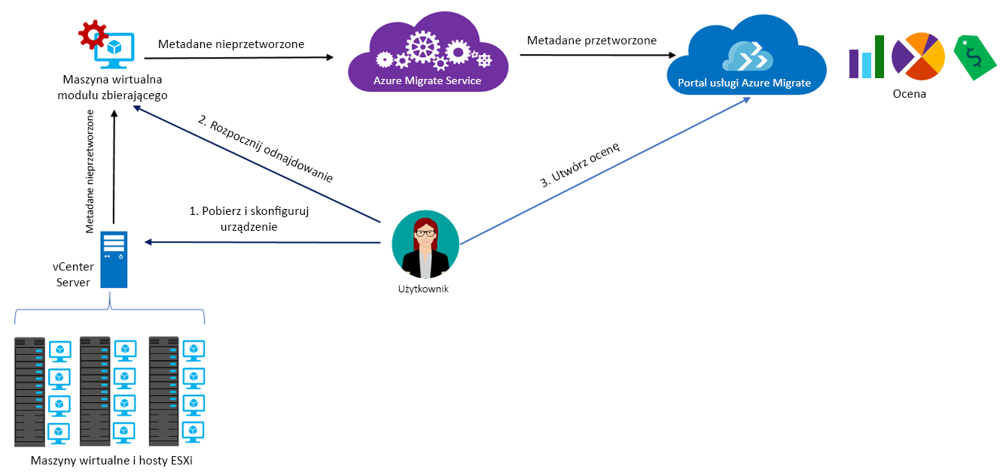

# Informacje o usłudze Azure Migrate

Usługa Azure Migrate ocenia obciążenia lokalne pod kątem migracji na platformę Azure. Obejmuje to ocenę gotowości maszyn lokalnych do migracji, określenie rozmiaru odpowiedniego do wydajności oraz oszacowanie kosztów działania maszyn lokalnych na platformie Azure. Usługa ta jest przeznaczona dla osób, które zamierzają przeprowadzić migrację metodą „lift-and-shift” lub dopiero zaczęły oceniać możliwość migracji. Po dokonaniu oceny można przeprowadzić migrację maszyn na platformę Azure, korzystając z usług takich jak [Azure Site Recovery](https://docs.microsoft.com/azure/site-recovery/site-recovery-overview) i [Azure Database Migration Service](https://docs.microsoft.com/azure/dms/dms-overview).

## Dlaczego warto używać usługi Azure Migrate?

Usługa Azure Migrate ułatwia wykonywanie następujących działań:

- **Ocena gotowości na platformę Azure**: czy maszyny lokalne mogą działać na platformie Azure.
- **Uzyskiwanie zaleceń dotyczących rozmiarów**: uzyskaj zalecenia dotyczące rozmiarów maszyn wirtualnych platformy Azure na podstawie historii wydajności lokalnych maszyn wirtualnych.
- **Szacowanie miesięcznych kosztów**: oblicz szacowane koszty uruchamiania maszyn lokalnych na platformie Azure.  
- **Migracja z poczuciem pewności**: wizualizuj zależności maszyn lokalnych, aby tworzyć grupy maszyn, które będą oceniane i migrowane wspólnie.

## Bieżące ograniczenia

- Gotowość do migracji na maszyny wirtualne platformy Azure można ocenić tylko dla lokalnych maszyn wirtualnych VMware. Maszyny wirtualne VMware muszą być zarządzane przez program vCenter Server (w wersji 5.5, 6.0, 6.5 lub 6.7).
- Obsługa dla funkcji Hyper-V jest obecnie w wersji zapoznawczej w pomocy technicznej w środowisku produkcyjnym, jeśli chcesz ją wypróbować, zarejestruj się [tutaj.](https://aka.ms/migratefuture)
- Dla oceny serwerów fizycznych, można korzystać z naszych [partnera narzędzia](https://azure.microsoft.com/migration/partners/).
- Można odnajdywać maksymalnie 1500 maszyn wirtualnych w jednym odnajdywaniu i w jednym projekcie. Mamy wersji zapoznawczej dostępne umożliwiająca odnajdywanie maksymalnie 10 000 maszyn wirtualnych VMware w jednym projekcie przy użyciu pojedynczego urządzenia, jeśli interesują Cię ją wypróbowujesz, zarejestruj się [tutaj.](https://aka.ms/migratefuture)
- Jeśli chcesz odnaleźć większe środowisko możesz podzielić operację odnajdywania i utworzyć wielu projektów. [Dowiedz się więcej](how-to-scale-assessment.md). Usługa Azure Migrate obsługuje maksymalnie 20 projektów na subskrypcję.
- Usługa Azure Migrate obsługuje tylko dyski zarządzane na potrzeby oceny migracji.
-  Projekt usługi Azure Migrate można utworzyć tylko w następujących lokalizacjach geograficznych. Jednak nie ogranicza to możliwości tworzenia przypisań dla innych lokalizacji docelowych platformy Azure.

    **Lokalizacja geograficzna** | **Lokalizacja usługi Storage**
    --- | ---
    Azure Government | Administracja USA — Wirginia
    Azja | Azja południowo-wschodnia i Azja Wschodnia
    Europa | Europa Północna lub Europa Zachodnia
    Stany Zjednoczone | Wschodnie stany USA lub Zachodnio-środkowe stany USA

    Lokalizacja geograficzna powiązana z projektem migracji służy do przechowywania metadanych wykrytych w środowisku lokalnym. Metadane są przechowywane w jednym z regionów w oparciu o lokalizację geograficzną określoną dla projektu migracji. Jeśli używasz wizualizacji zależności przez utworzenie nowego obszaru roboczego usługi Log Analytics, obszar roboczy zostanie utworzony w tym samym regionie co projekt.
- Funkcja wizualizacji zależności nie jest dostępna na platformie Azure Government.

## Za co są pobierane opłaty?

[Uzyskaj więcej informacji](https://azure.microsoft.com/pricing/details/azure-migrate/) o cenach usługi Azure Migrate.

## Co obejmuje ocena?

Ustawienia oceny można dostosować zgodnie z potrzebami. Właściwości oceny są podsumowane w poniższej tabeli.

**Właściwość** | **Szczegóły**
--- | ---
**Lokalizacja docelowa** | Lokalizacja platformy Azure, do której chcesz przeprowadzić migrację.  Usługa Azure Migrate obecnie obsługuje 33 regiony jako lokalizacje docelowe migracji. [Sprawdź regiony](https://azure.microsoft.com/global-infrastructure/services/). Domyślny region docelowy to Wschodnie stany USA.
**Typ magazynu** | Typ dysków zarządzanych, które chcesz przydzielić dla wszystkich maszyn wirtualnych będących częścią oceny. Jeśli kryterium ustalania rozmiaru to *ustalanie rozmiaru zgodnie ze środowiskiem lokalnym*, jako typ dysku docelowego możesz określić dyski w warstwie Premium (ustawienie domyślne), dyski SSD w warstwie Standardowa lub dyski HDD w warstwie Standardowa. W przypadku *ustalania rozmiaru na podstawie wydajności* oprócz powyższych opcji jest dostępna również opcja Automatycznie, która zapewnia, że zalecenie dotyczące rozmiaru dysku jest określane automatycznie na podstawie danych wydajności maszyn wirtualnych. Jeśli na przykład chcesz uzyskać [czas pracy zgodnie z umową SLA na poziomie 99,9% dla maszyny wirtualnej z pojedynczym wystąpieniem](https://azure.microsoft.com/support/legal/sla/virtual-machines/v1_8/), warto określić dyski zarządzane w warstwie Premium jako typ magazynu. Da to pewność, że dla wszystkich dysków w ocenie będą zalecane dyski zarządzane w warstwie Premium. Usługa Azure Migrate obsługuje dyski zarządzane tylko na potrzeby oceny migracji.
**Wystąpienia zarezerwowane** |  Określ, czy masz [wystąpienia zarezerwowane](https://azure.microsoft.com/pricing/reserved-vm-instances/) na platformie Azure. Zgodnie z tym usługa Azure Migrate odpowiednio szacuje koszty.
**Kryterium rozmiaru** | Ustalanie rozmiaru może być przeprowadzane na podstawie **historii wydajności** lokalnych maszyn wirtualnych (ustawienie domyślne) lub **zgodnie ze środowiskiem lokalnym** bez uwzględniania historii wydajności.
**Historia wydajności** | Domyślnie usługa Azure Migrate ocenia wydajność maszyn lokalnych na podstawie historii wydajności obejmującej ostatni dzień, przy wartości percentyla równej 95%.
**Współczynnik komfortu** | Podczas oceny usługa Azure Migrate uwzględnia bufor (współczynnik komfortu). Jest on stosowany do wszystkich danych użycia maszyn wirtualnych (procesora, pamięci, dysku i sieci). Współczynnik komfortu uwzględnia kwestie, takie jak okresowe użycie, krótka historia wydajności i prawdopodobne zwiększenie użycia w przyszłości.   Na przykład 10-rdzeniowa maszyna wirtualna o użyciu na poziomie 20% jest w normalnych warunkach równoważna 2-rdzeniowej maszynie wirtualnej. Jednak wynik zastosowania współczynnika komfortu o wartości 2 daje 4-rdzeniową maszynę wirtualną. Domyślne ustawienie komfortu to 1,3.
**Serie maszyn wirtualnych** | Serie maszyn wirtualnych używane do szacowania rozmiaru. Jeśli na przykład masz środowisko produkcyjne, którego nie zamierzasz migrować do maszyn wirtualnych serii A na platformie Azure, możesz wykluczyć serię A z listy serii. Ustalanie właściwego rozmiaru zostanie wykonane tylko przy użyciu wybranych serii.   
**Waluta** | Twoja waluta rozliczeniowa. Wartość domyślna to USD.
**Rabat (%)** | Dowolny rabat skojarzony z daną subskrypcją, stosowany do całej oferty platformy Azure. Ustawienie domyślne to 0%.
**Czas pracy maszyny wirtualnej** | Jeśli Twoje maszyny wirtualne nie będą działać całą dobę na platformie Azure, możesz określić czas trwania ich działania (liczbę dni w miesiącu i liczbę godzin dziennie), co spowoduje wykonanie odpowiednich szacunków kosztów. Wartość domyślna to 31 dni w miesiącu i 24 godziny dziennie.
**Oferta platformy Azure** | [Oferta platformy Azure](https://azure.microsoft.com/support/legal/offer-details/), w której dokonano rejestracji. Zgodnie z tym usługa Azure Migrate odpowiednio szacuje koszty.
**Korzyść użycia hybrydowego platformy Azure** | Określ, czy masz pakiet Software Assurance i kwalifikujesz się do [Korzyści użycia hybrydowego platformy Azure](https://azure.microsoft.com/pricing/hybrid-use-benefit/), z kosztami podlegającymi rabatom.

## Jak działa usługa Azure Migrate?

1. Musisz utworzyć projekt usługi Azure Migrate.
2. Za pomocą lokalnej maszyny wirtualnej, nazywanej urządzeniem modułu zbierającego, usługa Azure Migrate wyszukuje informacje o maszynach lokalnych. Aby utworzyć to urządzenie, pobierz plik instalacyjny w formacie Open Virtualization Appliance (ova) i zaimportuj go jako maszynę wirtualną w lokalnym programie vCenter Server.
3. Łączysz się z maszyną wirtualną z poziomu programu vCenter Server i określasz dla niej nowe hasło podczas nawiązywania połączenia.
4. Uruchamiasz moduł zbierający na maszynie wirtualnej, aby zainicjować odnajdywanie.
5. Moduł zbierający zbiera metadane maszyny wirtualnej przy użyciu poleceń cmdlet programu VMware PowerCLI. Odnajdywanie odbywa się bez użycia agenta ani instalowania żadnych narzędzi na hostach VMware lub maszynach wirtualnych. Zebrane metadane zawierają informacje o maszynach wirtualnych (rdzenie, pamięć, dyski, rozmiary dysków i karty sieciowe). Gromadzone są również dane dotyczące wydajności maszyn wirtualnych, w tym użycia procesora i pamięci, liczby operacji we/wy na sekundę na dysku, przepływności dysku (MB/s) i przepustowości sieci (MB/s).
5. Metadane te są wypychane do projektu usługi Azure Migrate. Można je wyświetlić w witrynie Azure Portal.
6. Na potrzeby oceny odnalezione maszyny wirtualne należy umieścić w grupach. Na przykład możesz pogrupować maszyny wirtualne, na których jest uruchamiana ta sama aplikacja. Na potrzeby bardziej precyzyjnego grupowania możesz użyć wizualizacji zależności, aby wyświetlić zależności określonej maszyny lub wszystkich maszyn w grupie i ulepszyć grupę.
7. Po zdefiniowaniu grupy możesz utworzyć dla niej ocenę.
8. Utworzoną ocenę możesz wyświetlić w portalu lub pobrać w formacie programu Excel.

   

## Jakie są wymagania dotyczące portów?

Poniższa tabela zawiera podsumowanie portów wymaganych do komunikacji usługi Azure Migrate.

| Składnik | Komunikuje się z |  Szczegóły |
| --- | --- |--- |
|Moduł zbierający  | Usługa Azure Migrate | Moduł zbierający łączy się z usługą za pośrednictwem protokołu SSL przez port 443.|
|Moduł zbierający | Program vCenter Server | Domyślnie moduł zbierający łączy się z programem vCenter Server przez port 443. Jeśli serwer nasłuchuje na innym porcie, skonfiguruj ten port jako port wychodzący na maszynie wirtualnej modułu zbierającego.|
|Lokalna maszyna wirtualna | Obszar roboczy usługi Log Analytics | [Program Microsoft Monitoring Agent (MMA)](../log-analytics/log-analytics-windows-agent.md) używa portu TCP 443 do łączenia z dzienników usługi Azure Monitor. Ten port jest potrzebny tylko w przypadku korzystania z wizualizacji zależności, która wymaga agenta MMA.|

## Co należy zrobić po dokonaniu oceny?

Po dokonaniu oceny maszyn lokalnych można przeprowadzić migrację za pomocą wybranego narzędzia:

- **Azure Site Recovery**: migrację na platformę Azure można przeprowadzić za pomocą usługi Azure Site Recovery. W tym celu musisz [przygotować składniki platformy Azure](../site-recovery/tutorial-prepare-azure.md), których potrzebujesz, w tym konto magazynu i sieć wirtualną. W środowisku lokalnym możesz [przygotować środowisko VMware](../site-recovery/vmware-azure-tutorial-prepare-on-premises.md). Gdy wszystko jest przygotowane, skonfiguruj i włącz replikację na platformę Azure i przeprowadź migrację maszyn wirtualnych. [Dowiedz się więcej](../site-recovery/vmware-azure-tutorial.md).
- **Azure Database Migration**: jeśli na maszynach lokalnych jest uruchomiona baza danych taka jak SQL Server, MySQL lub Oracle, możesz migrować je na platformę Azure przy użyciu usługi [Azure Database Migration Service](../dms/dms-overview.md).

## Chcesz dowiedzieć się więcej z ekspertami ze społeczności?
Odwiedź stronę [forum MSDN usługi Azure migracji](https://social.msdn.microsoft.com/Forums/home?forum=AzureMigrate&filter=alltypes&sort=lastpostdesc) lub [Stack Overflow](https://stackoverflow.com/search?q=azure+migrate)

## Potrzebujesz pomocy? Skontaktuj się z nami.  
Jeśli masz pytania lub potrzebujesz pomocy, Utwórz [żądania pomocy technicznej](https://ms.portal.azure.com/#blade/Microsoft_Azure_Support/HelpAndSupportBlade/newsupportrequest). Jeśli żądanie pomocy technicznej, wymaga dogłębnej pomocy technicznej, odwiedź stronę [planów pomocy technicznej platformy Azure](https://azure.microsoft.com/support/plans/)     

## Następne kroki

- [Wykonaj czynności opisane w samouczku](tutorial-assessment-vmware.md) dotyczącym tworzenia oceny lokalnej maszyny wirtualnej VMware.
- [Przejrzyj często zadawane pytania](resources-faq.md) dotyczące usługi Azure Migrate.