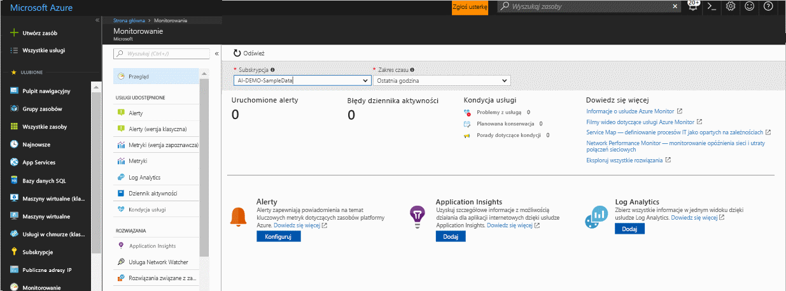
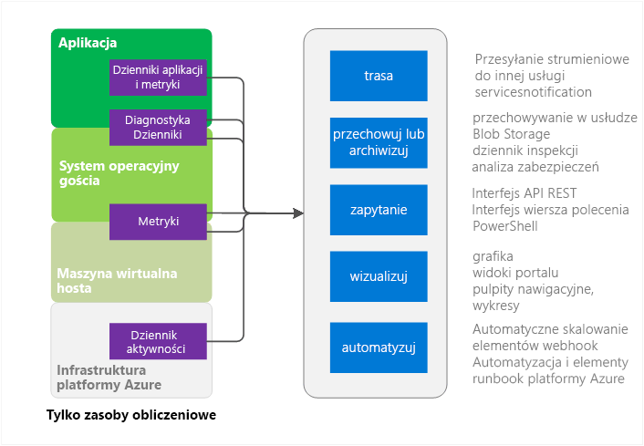
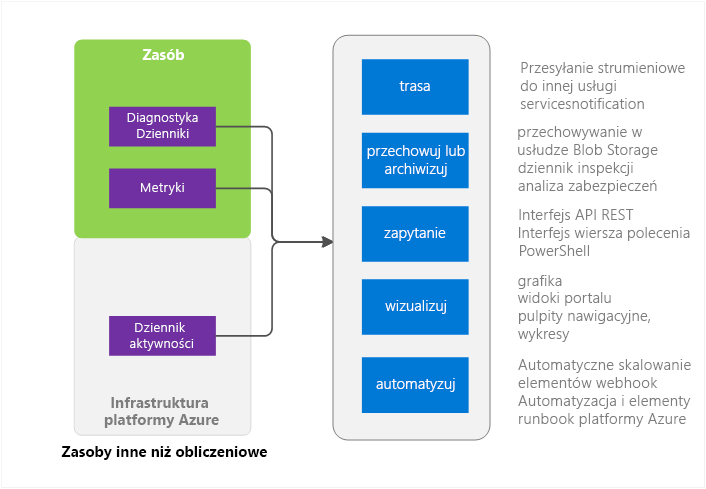

# Omówienie usługi Azure Monitor
Ten artykuł zawiera omówienie usługi Azure Monitor na platformie Microsoft Azure. Znajdują się tu informacje na temat funkcjonalności usługi Azure Monitor oraz odwołania do dodatkowych informacji dotyczących korzystania z usługi Azure Monitor.  Jeśli wolisz wprowadzenie wideo, zobacz łącza Następne kroki w końcowej części tego artykułu. 

## Usługa Azure Monitor i inne produkty do monitorowania firmy Microsoft
Usługa Azure Monitor oferuje metryki infrastruktury na poziomie podstawowym oraz dzienniki dla większości usług platformy Microsoft Azure. Dane usług platformy Azure, które nie znalazły się jeszcze w usłudze Azure Monitor, zostaną w niej umieszczone w przyszłości.

Firma Microsoft dostarcza dodatkowe produkty i usługi, które oferują deweloperom również inne możliwości monitorowania, DevOps lub IT Ops, które mają również instalacje lokalne. Aby uzyskać ogólne informacje i zrozumieć, jak te różne produkty i usługi współpracują ze sobą, zobacz temat [Monitorowanie na platformie Microsoft Azure](monitoring-overview.md).

## Strona omówienia w portalu

Usługa Azure Monitor ma stronę docelową, która ułatwia użytkownikom: 
- Zrozumienie możliwości monitorowania oferowanych przez platformę Azure.
- Odnajdowanie, konfigurowanie i wdrażanie platformy Azure i jej specjalnych możliwości monitorowania.

Strona stanowi punkt wyjścia do nawigacji, w tym wdrażania. Przedstawia wyselekcjonowane godne uwagi problemy dotyczące różnych usług i umożliwia użytkownikowi nawigowanie do nich w kontekście.
 

Po otwarciu strony możesz wybrać spośród subskrypcji, do których masz uprawnienia do odczytu. Dla wybranych subskrypcji można wyświetlić następujące informacje:

- **Wyzwolone alerty i źródła alertów** — w tej tabeli znajdują się podsumowania liczbowe, źródła alertów oraz liczba wygenerowanych alertów dla wybranego okresu czasu. Dotyczy to zarówno starszych, jak i nowszych alertów. Przeczytaj więcej na temat [nowszych alertów platformy Azure](monitoring-overview-unified-alerts.md). 
- **Błędy dziennika aktywności** — jeśli jakieś zasoby platformy Azure rejestrują zdarzenia z ważnością na poziomie błędu, możesz wyświetlić liczbę błędów wysokiego poziomu i kliknąć kolejne pozycje, aby przejść do strony dziennika aktywności w celu zbadania każdego zdarzenia.
- **Usługa Azure Service Health** — można zobaczyć liczbę problemów z usługą Service Health, zdarzenia planowanej konserwacji oraz porady dotyczące kondycji. Usługa Azure Service Health zapewnia spersonalizowane informacje, gdy problemy z infrastrukturą platformy Azure mają wpływ na Twoje usługi.  Aby uzyskać więcej informacji, zobacz temat [Azure Service Health](../service-health/service-health-overview.md).  
- **Usługa Application Insights** — zobacz kluczowe wskaźniki wydajności dla poszczególnych zasobów AppInsights w bieżącej subskrypcji. Kluczowe wskaźniki wydajności są zoptymalizowane pod kątem monitorowania aplikacji po stronie serwera w aplikacjach internetowych ASP.NET, w języku Java, na platformie Node oraz w ogólnych typach aplikacji. Kluczowe wskaźniki wydajności obejmują wyrażone w % metryki dla współczynnika żądań, czasu trwania odpowiedzi, współczynnika błędów i dostępności. 

Jeśli użytkownik nie dołączył do usługi Log Analytics lub Application Insights lub jeśli nie skonfigurował żadnych alertów Azure w bieżącej subskrypcji, strona zawiera łącza do rozpoczęcia procesu dołączania.

## Źródła usługi Azure Monitor — podzestaw obliczeniowy

Te usługi obliczeniowe obejmują 
- Cloud Services 
- Maszyny wirtualne 
- Zestawy skalowania maszyn wirtualnych 
- Service Fabric

### Aplikacja — dzienniki diagnostyczne, dzienniki aplikacji i metryki
W modelu obliczeniowym aplikacje mogą działać nad systemem operacyjnym gościa. Wysyłają własny zestaw dzienników i metryk. Usługa Azure Monitor zbiera większość metryk i dzienników na poziomie aplikacji w oparciu o rozszerzenie diagnostyki platformy Azure (Windows lub Linux). Typy obejmują

* Liczniki wydajności
* Dzienniki aplikacji
* Dzienniki zdarzeń systemu Windows
* Źródło zdarzeń .NET
* Dzienniki usług IIS
* Śledzenie zdarzeń systemu Windows w oparciu o manifest
* Zrzuty awaryjne
* Dzienniki błędów klienta

Bez rozszerzenia diagnostyki dostępnych jest tylko kilka metryk, takich jak użycie procesora CPU. 

### Metryki hosta i maszyny wirtualnej gościa
Wymienione wcześniej zasoby obliczeniowe mają dedykowaną maszynę wirtualną hosta oraz system operacyjny gościa, z którymi wchodzą w interakcję. Maszyna wirtualna hosta oraz system operacyjny gościa są równoważne z główną maszyną wirtualną oraz maszyną wirtualną gościa w modelu funkcji Hypervisor Hyper-V. Metryki można zbierać na obu. Można również zbierać dzienniki diagnostyczne w systemie operacyjnym gościa.   

### Dziennik aktywności
Można przeszukiwać dziennik aktywności (wcześniej nazywany dziennikiem operacyjnym lub dziennikiem inspekcji) pod kątem informacji na temat swojego zasobu z punktu widzenia infrastruktury platformy Azure. Dziennik zawiera takie informacje, jak czas utworzenia lub zniszczenia zasobów.  Aby uzyskać więcej informacji, zobacz [Omówienie dziennika aktywności](monitoring-overview-activity-logs.md). 

## Źródła usługi Azure Monitor — pozostałe elementy

### Zasób — metryki i dzienniki diagnostyczne
Metryki i dzienniki diagnostyczne, które można zbierać, różnią się w zależności od typu zasobu. Na przykład funkcja Web Apps zapewnia statystyki dotyczące dyskowych operacji we/wy oraz procentu wykorzystania procesora CPU. Te metryki nie istnieją dla kolejki usługi Service Bus, która przekazuje takie metryki, jak rozmiar kolejki i przepływność komunikatów. Lista metryk do zbierania dla poszczególnych zasobów jest dostępna w [obsługiwanych metrykach](monitoring-supported-metrics.md). 

### Metryki hosta i maszyny wirtualnej gościa
Nie musi istnieć mapowanie 1:1 między zasobem i określonym hostem lub maszyną wirtualną gościa, dlatego metryki są niedostępne.

### Dziennik aktywności
Dziennik aktywności jest taki sam jak dla zasobów obliczeniowych.  

## Użycie danych monitorowania
Po zebraniu danych można w usłudze Azure Monitor wykonać dla nich następujące działania.

### Trasa
Można przesyłać strumieniowo dane monitorowania do innych lokalizacji. 

Przykłady:

- Wysłanie do usługi Application Insights, dzięki czemu będzie można używać bardziej zaawansowanej wizualizacji oraz narzędzi do analizy.
- Wysłanie do usługi Event Hubs, aby można było je kierować do narzędzi innych firm. 

### Przechowywanie i archiwizowanie
Niektóre dane monitorowania są już przechowywane i dostępne w usłudze Azure Monitor przez określony okres czasu. 
- Metryki są przechowywane przez 90 dni. 
- Wpisy dziennika aktywności są przechowywane przez 90 dni. 
- Dzienniki diagnostyczne nie są przechowywane w ogóle. 

Jeśli chcesz przechowywać dane dłużej niż przez okresy czasu podane powyżej, możesz użyć magazynu platformy Azure. Dane monitorowania są przechowywane na koncie magazynu zgodnie z ustalonymi zasadami przechowywania. Trzeba jednak płacić za przestrzeń, którą zajmują dane w magazynie Azure. 

Kilka sposobów użycia tych danych:

- Po zapisaniu mogą być odczytywane i przetwarzane przez inne narzędzia na platformie Azure lub poza nią.
- Pobierz dane lokalnie do archiwum lokalnego lub zmień zasady przechowywania w chmurze, aby przechowywać dane przez dłuższy czas.  
- Dane w magazynie Azure można pozostawić bezterminowo w celach archiwizacji. 

### Zapytanie
Aby uzyskać dostęp do danych w systemie lub magazynie Azure, można użyć interfejsu API REST usługi Azure Monitor, poleceń międzyplatformowego interfejsu wiersza polecenia (CLI), poleceń cmdlet programu PowerShell lub zestawu SDK platformy .NET

Przykłady:

* Pobieranie danych dla zapisanej aplikacji monitorowania niestandardowego.
* Tworzenie niestandardowych zapytań i wysyłanie danych do aplikacji innych firm.

### Wizualizacja
Wizualizacja danych monitorowania w postaci graficznej i na wykresach umożliwia szybsze znajdowanie trendów niż w przypadku przeglądania danych.  

Kilka metod wizualizacji obejmuje:

* Korzystanie z witryny Azure Portal
* Kierowanie danych do usługi Azure Application Insights
* Kierowanie danych do usługi Microsoft PowerBI
* Kierowanie danych do narzędzia wizualizacji innej firmy przy użyciu transmisji strumieniowej na żywo lub przez włączenie w narzędziu funkcji odczytywania z archiwum w magazynie Azure

### Automatyzacja
> [!NOTE]
> W ramach bieżących zmian alertów w systemie Microsoft Azure dostępne jest teraz ujednolicone środowisko do wysyłania alertów. Więcej szczegółowych informacji na temat [nowych alertów Azure](monitoring-overview-unified-alerts.md)

W ramach alertów Azure można używać danych monitorowania do wyzwalania alertów, a nawet całych procesów. Przykłady:

* Użyj danych do automatycznego skalowania wystąpień obliczeniowych w górę lub w dół w oparciu o obciążenie aplikacji.
* Wysyłaj wiadomości e-mail na podstawie warunków metryk lub dziennika. 
* Wywołaj adres URL sieci Web (webhook), aby wykonać akcję w systemie poza platformą Azure.
* Uruchom element runbook w automatyzacji Azure, aby wykonać dowolne zadania.

## Metody dostępu do usługi Azure Monitor
Ogólnie rzecz biorąc, można manipulować śledzeniem, kierowaniem i pobieraniem danych przy użyciu jednej z poniższych metod. Nie wszystkie metody są dostępne dla wszystkich akcji lub typów danych.

* [Azure Portal](https://portal.azure.com)
* [Program PowerShell](insights-powershell-samples.md)  
* [Międzyplatformowy interfejs wiersza polecenia (CLI)](insights-cli-samples.md)
* [Interfejs API REST](https://docs.microsoft.com/rest/api/monitor/)
* [Zestaw SDK platformy .NET](http://www.nuget.org/packages/Microsoft.Azure.Management.Monitor)

## Następne kroki
Dowiedz się więcej o
- Przewodnik wideo dotyczący tylko usługi Azure Monitor jest dostępny po wybraniu łącza  
[Rozpoczynanie pracy z usługą Azure Monitor](https://channel9.msdn.com/Blogs/Azure-Monitoring/Get-Started-with-Azure-Monitor). 
- Wideo wyjaśniające scenariusz, w którym można użyć usługi Azure Monitor, jest dostępne pod adresami [Explore Microsoft Azure monitoring and diagnostics](https://channel9.msdn.com/events/Ignite/2016/BRK2234) (Zapoznaj się z monitorowaniem i diagnostyką na platformie Microsoft Azure) oraz [Azure Monitor in a video from Ignite 2016](https://myignite.microsoft.com/videos/4977) (Usługa Azure Monitor w wideo z konferencji Ignite 2016).
- Przejrzyj informacje na temat interfejsu usługi Azure Monitor w temacie [Getting Started with Azure Monitor](monitoring-get-started.md) (Wprowadzenie do usługi Azure Monitor)
- Skonfiguruj [rozszerzenia usługi Azure Diagnostics](../azure-diagnostics.md), jeśli próbujesz zdiagnozować problemy w usłudze w chmurze, maszynie wirtualnej, zestawach skalowania maszyn wirtualnych lub aplikacji Service Fabric.
- [Application Insights](https://azure.microsoft.com/documentation/services/application-insights/), jeśli próbujesz zdiagnozować problemy w aplikacji sieci Web usługi App Service.
- [Rozwiązywanie problemów z usługą Azure Storage](../storage/common/storage-e2e-troubleshooting.md) przy użyciu obiektów blob magazynu, tabel lub kolejek
- [Log Analytics](https://azure.microsoft.com/documentation/services/log-analytics/)
