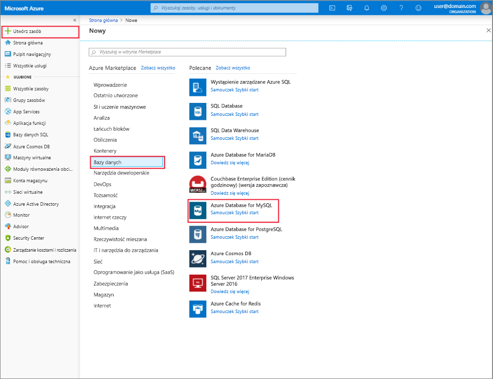

# Tworzenie serwera Azure Database for MySQL i zarządzanie nim przy użyciu Azure Portal
W tym temacie opisano, jak można szybko utworzyć nowy serwer Azure Database for MySQL. Zawiera również informacje dotyczące sposobu zarządzania serwerem za pomocą Azure Portal. Zarządzanie serwerem obejmuje wyświetlanie szczegółów i baz danych serwera, Resetowanie hasła, skalowanie zasobów i usuwanie serwera.

## Logowanie do witryny Azure Portal
Zaloguj się do witryny [Azure Portal](https://portal.azure.com).

## Tworzenie serwera usługi Azure Database for MySQL
Wykonaj następujące kroki, aby utworzyć serwer Azure Database for MySQL o nazwie "mydemoserver".

1. Kliknij przycisk **Utwórz zasób** znajdujący się w lewym górnym rogu Azure Portal.

2. Na stronie nowy wybierz pozycję **bazy danych**, a następnie na stronie bazy danych wybierz pozycję **Azure Database for MySQL**.

    > Serwer Azure Database for MySQL jest tworzony ze zdefiniowanym zestawem zasobów [obliczeniowych i magazynu](./concepts-pricing-tiers.md) . Baza danych jest tworzona w grupie zasobów platformy Azure i na serwerze Azure Database for MySQL.

   

3. Wypełnij formularz Azure Database for MySQL przy użyciu następujących informacji:

    | **Pole formularza** | **Opis pola** |
    |----------------|-----------------------|
    | *Nazwa serwera* | mydemoserver (nazwa serwera jest globalnie unikatowa) |
    | *Subskrypcja* | Moja subskrypcja (wybierz z menu rozwijanego) |
    | *Grupa zasobów* | Grupa zasobów (Utwórz nową grupę zasobów lub Użyj istniejącej) |
    | *Wybierz źródło* | Puste (Utwórz pusty serwer MySQL) |
    | *Identyfikator logowania administratora serwera* | myadmin (skonfiguruj nazwę konta administratora) |
    | *Hasło* | Ustawianie hasła konta administratora |
    | *Potwierdź hasło* | potwierdź hasło konta administratora |
    | *Location* | Azja Południowo-Wschodnia (Wybierz między Europą Północna i zachodnie stany USA) |
    | *Wersja* | 5,7 (Wybierz wersję serwera Azure Database for MySQL) |

   

4. Kliknij pozycję **warstwa cenowa** , aby określić warstwę usługi i poziom wydajności dla nowego serwera. Wybierz kartę **ogólnego przeznaczenia** . *Generacja 5*, *2 rdzenie wirtualne*, *5 GB* oraz *7 dni* to wartości domyślne opcji **Generacja obliczeń**, **Rdzeń wirtualny**, **Magazyn** oraz **Okres przechowywania kopii zapasowej**. Te suwaki możesz zostawić bez zmian. Aby włączyć kopie zapasowe serwera w magazynie geograficznie nadmiarowym, wybierz opcję **Geograficznie nadmiarowy** w pozycji **Opcje nadmiarowości kopii zapasowej**.

   

5. Kliknij przycisk **Utwórz**, aby aprowizować serwer. Aprowizacja zajmuje kilka minut.

    > Wybierz opcję **Przypnij do pulpitu nawigacyjnego** , aby łatwo śledzić wdrożenia.

## Aktualizowanie serwera Azure Database for MySQL
Po aprowizacji nowego serwera użytkownik ma kilka opcji konfigurowania istniejącego serwera, w tym resetowania hasła administratora, zmiany warstwy cenowej i skalowania serwera w górę lub w dół przez zmianę rdzeń wirtualny lub magazynu

### Zmiana hasła użytkownika administratora
1. Na stronie **Przegląd**serwera kliknij pozycję **zresetuj hasło** , aby wyświetlić okno resetowania hasła.

   

2. Wprowadź nowe hasło i Potwierdź hasło w oknie, jak pokazano poniżej:

   

3. Kliknij przycisk **OK** , aby zapisać nowe hasło.

### Zmiana warstwy cenowej
> [!NOTE]
> Skalowanie jest obsługiwane tylko z Ogólnego przeznaczenia do warstw usług zoptymalizowanych pod kątem pamięci i na odwrót. Należy pamiętać, że zmiana na i z warstwy cenowej podstawowa po utworzeniu serwera nie jest obsługiwana w Azure Database for MySQL.
> 
1. Kliknij **warstwę cenową**znajdującą się w obszarze **Ustawienia**.
2. Wybierz **warstwę cenową** , do której chcesz zmienić.

    

4. Kliknij przycisk **OK**, aby zapisać zmiany. 

### Skalowanie rdzeni wirtualnych w górę/w dół

1. Kliknij **warstwę cenową**znajdującą się w obszarze **Ustawienia**.

2. Zmień ustawienie **rdzeń wirtualny** , przesuwając suwak do żądanej wartości.

    

3. Kliknij przycisk **OK**, aby zapisać zmiany.

### Skalowanie w górę

1. Kliknij **warstwę cenową**znajdującą się w obszarze **Ustawienia**.

2. Zmień ustawienie **magazynu** , przesuwając suwak do żądanej wartości.

    

3. Kliknij przycisk **OK**, aby zapisać zmiany.

## Usuń serwer Azure Database for MySQL

1. Na serwerze programukliknij przycisk **Usuń** , aby otworzyć monit o potwierdzenie usunięcia.

    

2. Wpisz nazwę serwera w polu wejściowym dla podwójnego potwierdzenia.

    

3. Kliknij przycisk **Usuń** , aby potwierdzić usunięcie serwera. Poczekaj na wyświetlenie okna wyskakującego pomyślnie usuniętego serwera MySQL na pasku powiadomień.

## Wyświetlanie listy baz danych Azure Database for MySQL
Na stronie **Przegląd**serwera przewiń w dół do momentu wyświetlenia kafelka bazy danych w dolnej części. Wszystkie bazy danych na serwerze są wymienione w tabeli.

   

## Pokaż szczegóły serwera Azure Database for MySQL
Kliknij pozycję **Właściwości**znajdującą się w obszarze **Ustawienia** , aby wyświetlić szczegółowe informacje o serwerze.

## Następne kroki

[Szybki start: Utwórz serwer Azure Database for MySQL przy użyciu Azure Portal](./quickstart-create-mysql-server-database-using-azure-portal.md)