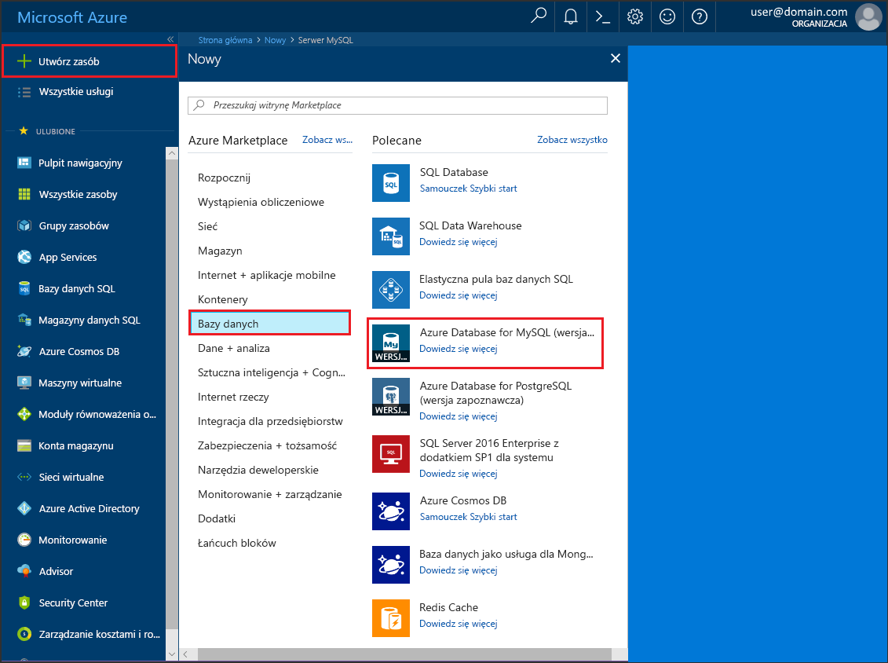
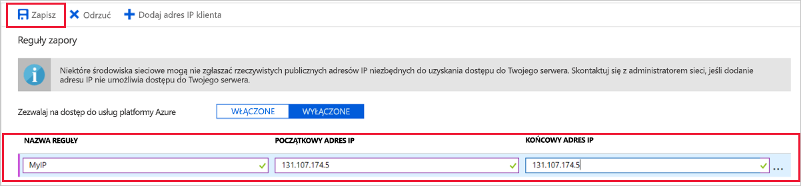

# <a name="create-an-azure-database-for-mysql-server-by-using-the-azure-portal"></a>Tworzenie serwera usługi Azure Database for MySQL za pomocą witryny Azure Portal

Azure Database for MySQL to usługa zarządzana, która umożliwia uruchamianie i skalowanie w chmurze baz danych MySQL o wysokiej dostępności, a także zarządzanie nimi. W tym przewodniku Szybki start przedstawiono, jak utworzyć serwer usługi Azure Database for MySQL za pomocą witryny Azure Portal w ciągu okołu pięciu minut.  

Jeśli nie masz subskrypcji platformy Azure, przed rozpoczęciem utwórz [bezpłatne konto platformy Azure](https://azure.microsoft.com/free/).

## <a name="sign-in-to-the-azure-portal"></a>Logowanie się do witryny Azure Portal
Otwórz przeglądarkę internetową, a następnie przejdź do witryny [Azure Portal](https://portal.azure.com/). Wprowadź swoje poświadczenia, aby zalogować się do portalu. Widok domyślny to pulpit nawigacyjny usług.

## <a name="create-an-azure-database-for-mysql-server"></a>Tworzenie serwera usługi Azure Database for MySQL
Serwer usługi Azure Database for MySQL jest tworzony za pomocą zdefiniowanego zestawu [zasobów obliczeniowych i przestrzeni dyskowej](./concepts-compute-unit-and-storage.md). Serwer jest tworzony w ramach [grupy zasobów Azure](../azure-resource-manager/management/overview.md).

Wykonaj następujące kroki, aby utworzyć serwer usługi Azure Database for MySQL:

1. Wybierz pozycję **Utwórz zasób** (+) w lewym górnym rogu portalu.

2. Wybierz pozycję **Bazy danych** > **Azure Database for MySQL**. Możesz również wprowadzić **MySQL** w polu wyszukiwania, aby znaleźć usługę.

   

3. Wypełnij formularz szczegółów nowego serwera, używając następujących informacji:
   
   

    **Ustawienie** | **Sugerowana wartość** | **Opis pola** 
    ---|---|---
    Nazwa serwera | Unikatowa nazwa serwera | Wprowadź unikatową nazwę identyfikującą serwer Azure Database for MySQL. Na przykład mydemoserver. Nazwa domeny *.mysql.database.azure.com* jest dołączana do podawanej nazwy serwera. Nazwa serwera może zawierać tylko małe litery, cyfry i znaki łącznika (-). Musi zawierać od 3 do 63 znaków.
    Subskrypcja | Twoja subskrypcja | Wybierz subskrypcję platformy Azure, która ma być używana dla serwera. Jeśli masz wiele subskrypcji, wybierz tę, w ramach której są naliczane opłaty za ten zasób.
    Grupa zasobów | *myresourcegroup* | Podaj nazwę nowej lub istniejącej grupy zasobów.
    Wybierz źródło | *Puste* | Wybierz opcję *Puste*, aby utworzyć nowy serwer od początku. (Opcję *Kopia zapasowa* należy wybrać w przypadku tworzenia serwera z geograficznej kopii zapasowej istniejącego serwera usługi Azure Database for MySQL).
    Identyfikator logowania administratora serwera | myadmin | Konto logowania do użycia podczas łączenia z serwerem. Nazwą logowania administratora nie może być **azure_superuser**, **admin**, **administrator**, **root**, **guest** ani **public**.
    Hasło | *Wartość wybrana przez użytkownika* | Podaj nowe hasło dla konta administratora serwera. Musi zawierać od 8 do 128 znaków. Hasło musi zawierać znaki z trzech z następujących kategorii: wielkie litery angielskie, małe litery angielskie, cyfry (0–9) i znaki inne niż alfanumeryczne (!, $, #, % itp.).
    Potwierdź hasło | *Wartość wybrana przez użytkownika*| Potwierdź hasło do konta administratora.
    Lokalizacja | *Region najbliżej Twoich użytkowników*| Wybierz lokalizację najbliżej użytkowników lub innych aplikacji Azure.
    Wersja | *Najnowsza wersja główna*| Najnowsza wersja główna, chyba że z konkretnych powodów wymagana jest inna wersja.
    Warstwa cenowa | **Ogólnego przeznaczenia**, **Generacja 5**, **2 rdzenie wirtualne**, **5 GB**, **7 dni**, **Geograficznie nadmiarowy** | Konfiguracje obliczania, magazynu i kopii zapasowej dla nowego serwera. Wybierz **warstwę cenową**. Następnie wybierz kartę **ogólnego przeznaczenia** . generacji *5*, *4 rdzeni wirtualnych*, *100 GB*i *7 dni* są wartościami domyślnymi dla okresu przechowywania **obliczeń**, **rdzeń wirtualny**, **magazynu**i **przetrzymywania kopii zapasowych**. Te suwaki możesz zostawić bez zmian. Aby włączyć kopie zapasowe serwera w magazynie geograficznie nadmiarowym, wybierz opcję **Geograficznie nadmiarowy** w pozycji **Opcje nadmiarowości kopii zapasowej**. Aby zapisać tę wybraną warstwę cenową, wybierz przycisk **OK**. Następny zrzut ekranu przedstawia te wybory.
  
   > [!NOTE]
   > Jeśli niewielkie zasoby obliczeniowe i we/wy są wystarczające dla Twojego obciążenia, warto rozważyć użycie warstwy cenowej Podstawowa. Pamiętaj, że serwerów utworzonych w warstwie cenowej Podstawowa nie można później przeskalować do warstwy Ogólnego przeznaczenia lub Zoptymalizowana pod kątem pamięci. Przejdź na [stronę cennika](https://azure.microsoft.com/pricing/details/mysql/), aby uzyskać więcej informacji.
   > 

   

4. Wybierz pozycję **Utwórz**, aby aprowizować serwer. Aprowizowanie może zająć do 20 minut.
   
5. Wybierz pozycję **Powiadomienia** (ikonę dzwonka) na pasku narzędzi, aby monitorować proces wdrażania.
   
   Domyślnie na serwerze są tworzone następujące bazy danych: **information_schema**, **mysql**, **performance_schema** i **sys**.

## <a name="configure-a-server-level-firewall-rule"></a>Konfigurowanie reguły zapory na poziomie serwera

Usługa Azure Database for MySQL tworzy zaporę na poziomie serwera. Uniemożliwia ona zewnętrznym aplikacjom i narzędziom łączenie się z serwerem i wszelkimi bazami danych na tym serwerze, chyba że zostanie utworzona reguła zapory otwierająca zaporę dla konkretnych adresów IP. 

1. Po zakończeniu wdrażania odszukaj serwer. Jeśli to konieczne, możesz go wyszukać. Na przykład wybierz pozycję **Wszystkie zasoby** z menu po lewej stronie. Następnie wprowadź nazwę serwera, na przykład **mydemoserver**, aby wyszukać nowo utworzony serwer. Wybierz nazwę serwera z listy wyników wyszukiwania. Zostanie otwarta strona **Przegląd**, która zawiera dalsze opcje konfiguracji.

2. Na stronie serwera wybierz pozycję **Zabezpieczenia połączeń**.

3. W obszarze z nagłówkiem **Reguły zapory** wybierz puste pole tekstowe w kolumnie **Nazwa reguły**, aby rozpocząć tworzenie reguły zapory. Wprowadź dokładny zakres adresów IP klientów, którzy będą uzyskiwać dostęp do tego serwera.
   
   


4. Na górnym pasku narzędzi strony **Zabezpieczenia połączeń** wybierz pozycję **Zapisz**. Przed kontynuowaniem zaczekaj, aż pojawi się powiadomienie, że aktualizacja została zakończona pomyślnie. 

   > [!NOTE]
   > Połączenia z usługą Azure Database for MySQL korzystają z portu 3306. Jeśli próbujesz nawiązać połączenie z sieci firmowej, ruch wychodzący na porcie 3306 może być zablokowany. W takim przypadku nie będzie można nawiązać połączenia z serwerem, chyba że dział informatyczny otworzy port 3306.
   > 

## <a name="get-the-connection-information"></a>Pobieranie informacji o połączeniu
Aby można było nawiązać połączenie z serwerem bazy danych, potrzebne są pełna nazwa serwera i poświadczenia logowania administratora. Być może te wartości zostały zanotowane wcześniej podczas pracy z artykułem Szybki start. W przeciwnym razie możesz łatwo odnaleźć nazwę serwera i informacje dotyczące logowania na stronie **Przegląd** lub **Właściwości** serwera w witrynie Azure Portal.

Aby znaleźć te wartości, wykonaj następujące czynności: 

1. Otwórz stronę **Przegląd** serwera. Zanotuj wartości **Nazwa serwera** i **Identyfikator logowania administratora serwera**. 

2. Umieszczaj kursor nad poszczególnymi polami, a po prawej stronie tekstu pojawi się ikona kopiowania. Wybierz ikonę kopiowania, aby w razie potrzeby skopiować wartości.

W tym przykładzie nazwa serwera to **mydemoserver.MySQL.Database.Azure.com**, a logowanie administratora serwera ma wartość **administrator\@mydemoserver**.

## <a name="connect-to-mysql-by-using-the-mysql-command-line-tool"></a>Nawiązywanie połączenia z serwerem MySQL za pomocą narzędzia wiersza polecenia mysql
Nawiąż połączenia z serwerem za pomocą narzędzia wiersza polecenia **mysql.exe**. Program MySQL możesz pobrać [stąd](https://dev.mysql.com/downloads/) i zainstalować go na swoim komputerze. 

1. Następujący format służy do łączenia z serwerem usługi Azure Database for MySQL przy użyciu narzędzia mysql:

    ```bash
    mysql --host <fully qualified server name> --user <server admin login name>@<server name> -p
    ```

    Na przykład następujące polecenie umożliwia połączenie z przykładowym serwerem:

    ```bash
    mysql --host mydemoserver.mysql.database.azure.com --user myadmin@mydemoserver -p
    ```

    Parametr narzędzia mysql |Sugerowana wartość|Opis
    ---|---|---
    --host | *Nazwa serwera* | Wartość nazwy serwera, która została użyta wcześniej podczas tworzenia serwera usługi Azure Database for MySQL. Przykładowy serwer to **mydemoserver.mysql.database.azure.com**. Użyj w pełni kwalifikowanej nazwy domeny ( **\*.mysql.database.azure.com**), tak jak pokazano w przykładzie. Jeśli nie pamiętasz nazwy serwera, postępuj zgodnie z instrukcjami w poprzedniej sekcji, aby uzyskać informacje dotyczące połączenia. 
    --user | *Nazwa logowania administratora serwera* |Nazwa logowania administratora serwera, którą podano wcześniej podczas tworzenia serwera usługi Azure Database for MySQL. Jeśli nie pamiętasz nazwy użytkownika, postępuj zgodnie z instrukcjami w poprzedniej sekcji, aby uzyskać informacje dotyczące połączenia. Format to *Nazwa użytkownika\@ServerName*.
    -p | *Zaczekaj, aż zostanie wyświetlony monit* |Wtedy wpisz hasło podane podczas tworzenia serwera. Weź pod uwagę, że wpisywane znaki nie są wyświetlane w wierszu polecenia powłoki Bash. Po wprowadzeniu hasła wybierz klawisz **Enter**.

   Po nawiązaniu połączenia narzędzie mysql wyświetli monit `mysql>` umożliwiający wpisywanie poleceń. 

   Poniżej przedstawiono przykładowe dane wyjściowe polecenia mysql:

    ```bash
    Welcome to the MySQL monitor.  Commands end with ; or \g.
    Your MySQL connection id is 65505
    Server version: 5.6.26.0 MySQL Community Server (GPL)
    
    Copyright (c) 2000, 2017, Oracle and/or its affiliates. All rights reserved.
    
    Oracle is a registered trademark of Oracle Corporation and/or its
    affiliates. Other names may be trademarks of their respective
    owners.

    Type 'help;' or '\h' for help. Type '\c' to clear the current input statement.
    
    mysql>
    ```
    > [!TIP]
    > Jeśli konfiguracja zapory nie umożliwia dostępu do adresu IP klienta, wystąpi następujący błąd:
    >
    > BŁĄD 2003 (28000): Klient o adresie IP 123.456.789.0 nie może uzyskać dostępu do serwera.
    >
    > Aby naprawić błąd, upewnij się, że konfiguracja serwera jest zgodna z krokami opisanymi w sekcji „Konfigurowanie reguły zapory na poziomie serwera” tego artykułu.

4. Aby upewnić się, że połączenie działa, wyświetl stan serwera, wpisując polecenie `status` w wierszu polecenia mysql>.

    ```sql
    status
    ```

   > [!TIP]
   > Aby zapoznać się z dodatkowymi poleceniami, zobacz [MySQL 5.7 Reference Manual - Chapter 4.5.1 (Podręcznik programu MySQL 5.7 — rozdział 4.5.1)](https://dev.mysql.com/doc/refman/5.7/en/mysql.html).

5.  Utwórz pustą bazę danych, wpisując następujące polecenie w wierszu polecenia **mysql>** :
    ```sql
    CREATE DATABASE quickstartdb;
    ```
    Wykonanie polecenia może potrwać kilka chwil. 

    Na serwerze usługi Azure Database for MySQL można utworzyć jedną lub wiele baz danych. Można wybrać opcję utworzenia jednej bazy danych na serwer w celu wykorzystania wszystkich zasobów. Można też utworzyć wiele baz danych, współdzielących zasoby. Nie istnieje limit dotyczący maksymalnej liczby baz danych, które można utworzyć, ale w przypadku wielu baz danych są współdzielone te same zasoby serwera. 

6. Wyświetl bazy danych, wpisując następujące polecenie w wierszu polecenia **mysql>** :

    ```sql
    SHOW DATABASES;
    ```

7.  Wpisz polecenie `\q`, a następnie wybierz klawisz **Enter**, aby zamknąć narzędzie mysql. 

Nawiązano połączenie z serwerem usługi Azure Database for MySQL i utworzono pustą bazę danych użytkownika. Przejdź do następnej sekcji, w której przedstawiono podobne ćwiczenie. Następne ćwiczenie polega na nawiązaniu połączenia z tym samym serwerem przy użyciu innego popularnego narzędzia — MySQL Workbench.

## <a name="connect-to-the-server-by-using-the-mysql-workbench-gui-tool"></a>Nawiązywanie połączenia z serwerem za pomocą narzędzia z graficznym interfejsem użytkownika MySQL Workbench
Aby nawiązać połączenie z serwerem za pomocą narzędzia z graficznym interfejsem użytkownika MySQL Workbench, wykonaj następujące czynności:

1.  Otwórz aplikację MySQL Workbench na komputerze klienckim. Aplikację MySQL Workbench możesz pobrać i zainstalować [ze strony pobierania aplikacji MySQL Workbench](https://dev.mysql.com/downloads/workbench/).

2. Utwórz nowe połączenie. Wybierz ikonę plus (+) obok nagłówka **połączenia MySQL** .

3. W oknie dialogowym **Konfigurowanie nowego połączenia** wprowadź informacje o połączeniu z serwerem na karcie **Parametry** . wartości symboli zastępczych są wyświetlane jako przykład. Zamień nazwę hosta, nazwę użytkownika i hasło na własne wartości.

   

    |Ustawienie |Sugerowana wartość|Opis pola|
    |---|---|---|
     Nazwa połączenia | Połączenie demonstracyjne | Etykieta dla tego połączenia. |
    Metoda połączenia | Standardowa (TCP/IP) | Metoda Standardowa (TCP/IP) jest wystarczająca. |
    Nazwa hosta | *Nazwa serwera* | Wartość nazwy serwera, która została użyta podczas tworzenia serwera usługi Azure Database for MySQL. Przykładowy serwer to **mydemoserver.mysql.database.azure.com**. Użyj w pełni kwalifikowanej nazwy domeny ( **\*.mysql.database.azure.com**), tak jak pokazano w przykładzie. Jeśli nie pamiętasz nazwy serwera, postępuj zgodnie z instrukcjami w poprzedniej sekcji, aby uzyskać informacje dotyczące połączenia.|
     Port | 3306 | Port używany podczas łączenia z serwerem usługi Azure Database for MySQL. |
    Nazwa użytkownika |  *Nazwa logowania administratora serwera* | Informacje dotyczące logowania administratora serwera, które podano wcześniej podczas tworzenia serwera usługi Azure Database for MySQL. Nasza przykładowa nazwa użytkownika to **webadmin\@mydemoserver**. Jeśli nie pamiętasz nazwy użytkownika, postępuj zgodnie z instrukcjami w poprzedniej sekcji, aby uzyskać informacje dotyczące połączenia. Format to *Nazwa użytkownika\@ServerName*.
    Hasło | *Twoje hasło* | Wybierz pozycję **Zapisz w magazynie** , aby zapisać hasło. |

4. Wybierz pozycję **Testuj połączenie**, aby sprawdzić, czy wszystkie parametry zostały skonfigurowane poprawnie. Następnie wybierz przycisk **OK**, aby zapisać połączenie. 

    > [!NOTE]
    > Na serwerze domyślnie jest wymuszane używanie protokołu SSL. W związku z tym do pomyślnego nawiązania połączenia jest wymagana dodatkowa konfiguracja. Aby uzyskać więcej informacji, zobacz [Configure SSL connectivity in your application to securely connect to Azure Database for MySQL (Konfigurowanie łączności SSL w aplikacji w celu bezpiecznego nawiązywania połączeń z usługą Azure Database for MySQL)](./howto-configure-ssl.md). Aby wyłączyć protokół SSL na czas wykonywania instrukcji w tym przewodniku Szybki start, przejdź do witryny Azure Portal. Wybierz stronę Zabezpieczenia połączeń i kliknij przycisk przełączania **Wymuszaj połączenie SSL** w celu wyłączenia go.

## <a name="clean-up-resources"></a>Oczyszczanie zasobów
Zasoby, które zostały utworzone w ramach tego przewodnika Szybki start, możesz wyczyścić na dwa sposoby. Możesz usunąć [grupę zasobów platformy Azure](../azure-resource-manager/management/overview.md) zawierającą wszystkie zasoby w tej grupie. Jeśli chcesz zachować inne zasoby bez zmian, usuń tylko ten jeden zasób serwera.

> [!TIP]
> Inne przewodniki Szybki start w tej kolekcji bazują na tym przewodniku. Jeśli chcesz kontynuować pracę z przewodnikami Szybki start, nie usuwaj zasobów utworzonych w tym przewodniku Szybki start. Jeśli nie planujesz kontynuowania pracy, wykonaj następujące czynności, aby usunąć wszystkie zasoby utworzone w ramach tego przewodnika Szybki start.
>

Aby usunąć całą grupę zasobów łącznie z nowo utworzonym serwerem, wykonaj następujące czynności:

1.  Znajdź grupę zasobów w witrynie Azure Portal. W menu po lewej stronie wybierz pozycję **Grupy zasobów**, a następnie wybierz nazwę grupy zasobów, takiej jak przykładowa grupa **myresourcegroup**.

2.  Na stronie grupy zasobów wybierz pozycję **Usuń**. Następnie wprowadź nazwę grupy zasobów (np. nasz przykład **zasobu**) w polu, aby potwierdzić usunięcie, a następnie wybierz pozycję **Usuń**.

Aby usunąć tylko nowo utworzony serwer, wykonaj następujące czynności:

1. Znajdź serwer w witrynie Azure Portal, jeśli nie jest jeszcze otwarty. W menu po lewej stronie w witrynie Azure Portal wybierz pozycję **Wszystkie zasoby**. Następnie wyszukaj utworzony serwer.

2. Na stronie **Przegląd** wybierz pozycję **Usuń**. 

   

3. Potwierdź nazwę serwera do usunięcia i wyświetl jego bazy danych, których dotyczy ta operacja. Wprowadź nazwę serwera w polu (np. nasz przykład **mydemoserver**). Wybierz pozycję **Usuń**.

## <a name="next-steps"></a>Następne kroki

> [!div class="nextstepaction"]
> [Projektowanie pierwszej bazy danych usługi Azure Database for MySQL](./tutorial-design-database-using-portal.md)

