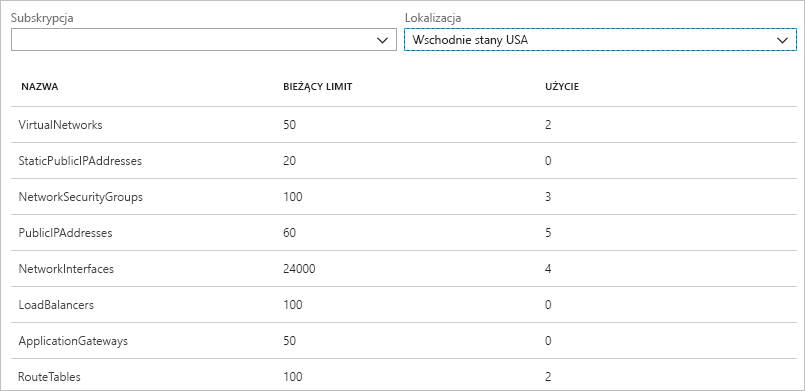
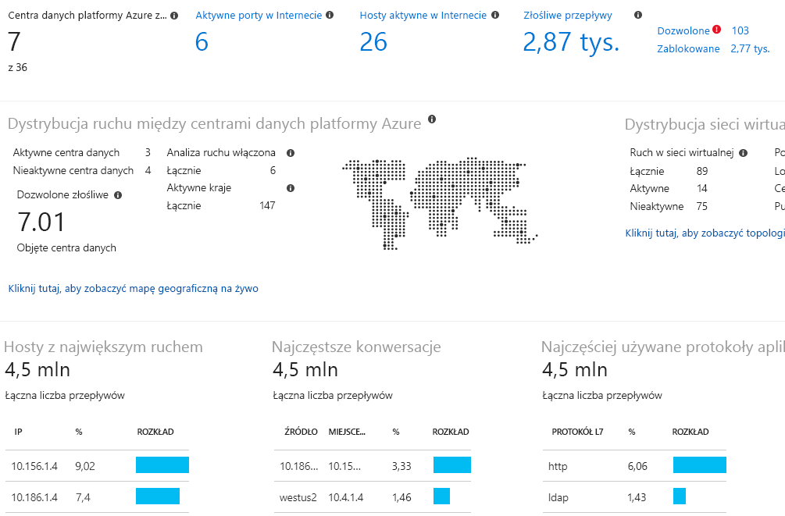

# Co to jest Azure Network Watcher?

Azure Network Watcher to usługa, która udostępnia narzędzia umożliwiające monitorowanie, diagnozowanie, wyświetlanie metryk i włączanie lub wyłączanie dzienników zasobów w sieci wirtualnej platformy Azure. Network Watcher zaprojektowano do monitorowania i naprawy kondycji sieci usług IaaS (infrastruktura jako usługa), w tym Virtual Machines, sieci wirtualnych, bram aplikacji, modułów równoważenia obciążenia itp. Uwaga: nie jest ona przeznaczona dla i nie będzie działała w przypadku monitorowania PaaS lub analizy sieci Web. 

## Monitorowanie

### Monitorowanie komunikacji między maszyną wirtualną a punktem końcowym

Punkty końcowe mogą być inną maszyną wirtualną (VM), w pełni kwalifikowaną nazwą domeny (FQDN), identyfikatorem URI (Uniform Resource Identifier) lub adresem IPv4. *Monitor połączenia* umożliwia monitorowanie komunikacji w regularnych odstępach czasu i informuje o dostępności, opóźnieniu i zmianach topologii sieci między maszyną wirtualną a punktem końcowym. Przykładem może być maszyna wirtualna serwera sieci Web, która komunikuje się z maszyną wirtualną serwera baz danych. Możesz nie wiedzieć, że pewien członek organizacji zastosował niestandardową trasę lub regułę zabezpieczeń na maszynie wirtualnej serwera sieci Web lub serwera baz danych albo też w podsieci.

Jeśli punkt końcowy staje się niedostępny, funkcja rozwiązywania problemów z połączeniem informuje o przyczynie. Potencjalne przyczyny to problem z rozpoznawaniem nazw DNS, procesorem, pamięcią lub zaporą w systemie operacyjnym maszyny wirtualnej lub typ przeskoku w trasie niestandardowej albo też reguła zabezpieczeń dla maszyny wirtualnej lub podsieci dla połączenia wychodzącego. Dowiedz się więcej o [regułach zabezpieczeń](../virtual-network/security-overview.md?toc=%2fazure%2fnetwork-watcher%2ftoc.json#security-rules) i [typach przeskoku trasy](../virtual-network/virtual-networks-udr-overview.md?toc=%2fazure%2fnetwork-watcher%2ftoc.json) na platformie Azure.

Monitor połączenia dostarcza również informacje o zmianach w czasie minimalnego, średniego i maksymalnego obserwowanego opóźnienia. Po zapoznaniu się z danymi o opóźnieniu połączenia może okazać się możliwe zmniejszenia opóźnienia dzięki przeniesieniu zasobów platformy Azure do innych regionów platformy. Dowiedz się więcej na temat określania [względnych opóźnień między regionami platformy Azure i dostawcami usług internetowych](#determine-relative-latencies-between-azure-regions-and-internet-service-providers) oraz o sposobach monitorowania komunikacji między maszyną wirtualną a punktem końcowym za pomocą [monitora połączenia](connection-monitor.md). Jeśli zamiast tego chcesz przetestować połączenie w określonym momencie, zamiast monitorować jego zachowanie w czasie za pomocą monitora połączenia, użyj funkcji [rozwiązywania problemów z połączeniem](#connection-troubleshoot).

Network Performance Monitor to oparte na chmurze hybrydowe rozwiązanie do monitorowania sieci, które pomaga monitorować wydajność sieci między różnymi punktami w jej infrastrukturze. Ułatwia ono również monitorowanie łączności sieciowej z punktami końcowymi usług i aplikacji oraz monitorowanie wydajności usługi Azure ExpressRoute. Rozwiązanie Network Performance Monitor wykrywa problemy sieciowe, takie jak czarne dziury ruchu, błędy routingu i problemy, których nie mogą wykrywać konwencjonalne metody monitorowania sieci. Rozwiązanie generuje alerty i powiadamia użytkownika, gdy nastąpi naruszenie progu związanego z połączeniem sieciowym. Ponadto gwarantuje ono szybkie wykrywanie problemów z wydajnością sieci i lokalizuje źródło problemu w określonym segmencie lub urządzeniu w sieci. Dowiedz się więcej na temat rozwiązania [Network Performance Monitor](../azure-monitor/insights/network-performance-monitor.md?toc=%2fazure%2fnetwork-watcher%2ftoc.json).

### Wyświetlanie zasobów i ich relacji w sieci wirtualnej

W miarę dodawania zasobów do sieci wirtualnej coraz trudniejsze staje się zrozumienie, jakie zasoby znajdują w sieci wirtualnej i w jakich relacjach pozostają ze sobą. Funkcja *topologii* umożliwia generowanie schematu graficznego zasobów w sieci wirtualnej oraz zachodzących między nimi relacji. Na poniższej ilustracji przedstawiono przykład diagramu topologii sieci wirtualnej, która ma trzy podsieci, dwie maszyny wirtualne, interfejsy sieciowe, publiczne adresy IP, grupy zabezpieczeń sieci, tabele tras, oraz pokazano relacje między zasobami:

Edytowalną wersję tego obrazu można pobrać w formacie SVG. Dowiedz się więcej o [widoku topologii](view-network-topology.md).

## Diagnostyka

### Diagnozowanie problemów z filtrowaniem ruchu sieciowego wychodzącego z maszyny wirtualnej i przychodzącego do niej

Podczas wdrażania maszyny wirtualnej platforma Azure stosuje wobec niej kilka domyślnych reguł zabezpieczeń, które akceptują lub odrzucają ruch do/z maszyny wirtualnej. Można zastąpić reguły domyślne platformy Azure lub utworzyć dodatkowe reguły. Ze względu na zasady zabezpieczeń maszyna wirtualna może w pewnym momencie przestać komunikować się z innymi zasobami. Funkcja *weryfikowania przepływu adresów IP* umożliwia określenie źródłowego i docelowego adresu IPv4, portu, protokołu (TCP lub UDP) i kierunku ruchu sieciowego (przychodzącego lub wychodzącego). Funkcja weryfikuje przepływ adresów IP, a następnie sprawdza komunikację i informuje o powodzeniu lub niepowodzeniu połączenia. Jeśli połączenie nie powiedzie się, funkcja weryfikacji informuje, która reguła zabezpieczeń akceptuje lub odrzuca połączenie, dzięki czemu można rozwiązać problem. Więcej informacji na temat funkcji weryfikowania przepływu adresów IP znajduje się w samouczku [Diagnozowanie problemu z filtrowaniem ruchu sieciowego maszyny wirtualnej](diagnose-vm-network-traffic-filtering-problem.md).

### Diagnozowanie problemów z routingiem sieci na maszynie wirtualnej

Po utworzeniu sieci wirtualnej platforma Azure tworzy kilka domyślnych tras wychodzącego ruchu sieciowego. Ruch wychodzący ze wszystkich zasobów, takich jak maszyny wirtualne wdrożone w sieci wirtualnej, jest kierowany w oparciu o trasy domyślne platformy Azure. Można zastąpić trasy domyślne platformy Azure lub utworzyć dodatkowe trasy. Może się okazać, że maszyna wirtualna nie może już komunikować się z innymi zasobami ze względu na określoną trasę. Funkcja *następnego przeskoku* umożliwia określenie źródłowego i docelowego adresu IPv4. Funkcja ta przeprowadza wówczas testy komunikacji i informuje o typie następnego przeskoku używanego do kierowania ruchu. Następnie w celu rozwiązania problemu z routingiem można usunąć, zmienić lub dodać trasę. Dowiedz się więcej o funkcji [następnego przeskoku](diagnose-vm-network-routing-problem.md).

### Diagnozowanie połączeń wychodzących z maszyny wirtualnej

Funkcja *rozwiązywania problemów z połączeniami* umożliwia testowanie połączenia między daną maszyną wirtualną a inną maszyną wirtualną, nazwą FQDN, identyfikatorem URI lub adresem IPv4. Test zwraca informacje podobne do zwracanych przez funkcję [monitora połączenia](#connection-monitor), ale testuje połączenie w określonym momencie, zamiast monitorować je w czasie, tak jak robi to monitor połączenia. Dowiedz się więcej na temat rozwiązywania problemów z połączeniami przy użyciu funkcji [rozwiązywania problemów z połączeniem](network-watcher-connectivity-overview.md).

### Przechwytywanie pakietów do i z maszyny wirtualnej

Bardzo przydatne są zaawansowane opcje filtrowania i dostosowywania ustawień, takie jak określanie czasu i limitów rozmiaru. Przechwycone pakiety mogą być przechowywane w usłudze Azure Storage, na dysku maszyny wirtualnej lub w obu tych miejscach. Następnie można analizować przechwycony plik przy użyciu standardowych narzędzi analizy ruchu sieciowego. Dowiedz się więcej o [przechwytywaniu pakietów](network-watcher-packet-capture-overview.md).

### Diagnozowanie problemów z bramą sieci wirtualnej i połączeniami Azure

Bramy sieci wirtualnej zapewniają łączność między zasobami lokalnymi i sieciami wirtualnymi platformy Azure. Monitorowania bram i ich połączeń jest niezbędne do zapewnienia nieprzerwanej komunikacji. Funkcja *diagnostyki sieci VPN* daje możliwość diagnozowania bram i połączeń. Funkcja diagnostyki sieci VPN umożliwia diagnozowanie kondycji lub połączenia bramy oraz informuje o dostępności bramy i jej połączeń. Jeśli brama lub połączenie nie są dostępne, funkcja diagnostyki sieci VPN informuje o przyczynie, dzięki czemu można rozwiązać problem. Więcej informacji na temat diagnostyki sieci VPN znajduje się w samouczku [Diagnozowanie problemu z komunikacją między sieciami](diagnose-communication-problem-between-networks.md).

### Określanie opóźnień względnych między regionami platformy Azure i usługodawcami internetowymi

Usługę Network Watcher można wykorzystać do uzyskania informacji o opóźnieniach między regionami platformy Azure i dostawcami usług internetowych. Wiedza o opóźnieniach między regionami platformy Azure i usługodawcami internetowymi umożliwia odpowiednie wdrożenie zasobów platformy Azure w celu zoptymalizowania czasu odpowiedzi sieci. Dowiedz się więcej o [opóźnieniach względnych](view-relative-latencies.md).

### Widok reguł zabezpieczeń dla interfejsu sieciowego

Skuteczne reguły zabezpieczeń interfejsu sieciowego są kombinację wszystkich reguł zabezpieczeń stosowanych do interfejsu sieciowego oraz podsieci, w której znajduje się interfejs sieciowy.  Funkcja *widoku grupy zabezpieczeń* pokazuje wszystkie reguły zabezpieczeń stosowane do interfejsu sieciowego, podsieci, w której znajduje się interfejs sieciowy, oraz łączny efekt obu tych ustawień. Wiedząc, które zasady są stosowane do interfejsu sieciowego, można dodawać, usuwać lub zmieniać zasady, które akceptują lub odrzucają ruch wymagający zmiany. Dowiedz się więcej o [widoku grupy zabezpieczeń](network-watcher-security-group-view-overview.md).

## Metryki

Istnieją [limity](../azure-resource-manager/management/azure-subscription-service-limits.md?toc=%2fazure%2fnetwork-watcher%2ftoc.json#azure-resource-manager-virtual-networking-limits) liczby zasobów sieciowych, które można tworzyć w ramach subskrypcji platformy Azure i regionu. Po osiągnięciu tych limitów nie można utworzyć większej liczby zasobów w ramach subskrypcji ani regionu. Funkcja *limitu subskrypcji sieci* zawiera podsumowanie liczby zasobów sieciowych wdrożonych w ramach subskrypcji i regionu oraz podaje limit dla zasobu. Na poniższej ilustracji przedstawiono częściowe dane wyjściowe dotyczące zasobów sieciowych wdrożone w regionie „Wschodnie stany USA” dla przykładowych subskrypcji:

Te informacje są przydatne podczas planowania przyszłych wdrożeń zasobów.

## Dzienniki

### Analiza ruchu do lub z sieciowych grup zabezpieczeń

Sieciowe grupy zabezpieczeń (NSG) mogą akceptować lub odrzucać ruch przychodzący i wychodzący z interfejsu sieciowego maszyny wirtualnej. Funkcja *dziennika przepływu NSG* umożliwia zapisywanie w dzienniku źródłowego i docelowego adresu IP, portu, protokołu oraz tego, czy ruch został zaakceptowany lub odrzucony przez sieciową grupę zabezpieczeń. Dzienniki można analizować przy użyciu różnych narzędzi, takich jak PowerBi i funkcja *analizy ruchu*. Funkcja analizy ruchu oferuje zaawansowane wizualizacje danych zapisanych w dziennikach przepływu NSG. Na poniższej ilustracji przedstawiono niektóre informacje i wizualizacje dostarczane przez funkcję analizy ruchu na podstawie danych dziennika przepływu NSG:

Więcej informacji na temat dzienników przepływu NSG znajduje się w samouczku [Rejestrowanie przepływu ruchu sieciowego do i z maszyny wirtualnej](network-watcher-nsg-flow-logging-portal.md) oraz w temacie dotyczącym wdrażania [analizy ruchu](traffic-analytics.md).

### Wyświetlanie dzienników diagnostycznych dla zasobów sieciowych

Funkcję rejestrowania diagnostycznego można włączyć dla zasobów sieciowych Azure takich jak sieciowe grupy zabezpieczeń, publiczne adresy IP, moduły równoważenia obciążenia, bramy sieci wirtualnych i bramy aplikacji. Funkcja *dzienników diagnostycznych* udostępnia pojedynczy interfejs służący do włączania i wyłączania dzienników diagnostycznych zasobów sieciowych dla każdego istniejącego zasobu sieci, który generuje dziennik diagnostyczny. Dzienniki diagnostyczne można wyświetlać za pomocą narzędzi, takich jak dzienniki usług Microsoft Power BI i Azure Monitor. Aby dowiedzieć się więcej na temat analizowania dzienników diagnostycznych sieci platformy Azure, zobacz [Rozwiązania dotyczące sieci platformy Azure w dziennikach usługi Azure Monitor](../azure-monitor/insights/azure-networking-analytics.md?toc=%2fazure%2fnetwork-watcher%2ftoc.json).

## Automatyczne włączanie usługi Network Watcher
Podczas tworzenia lub aktualizowania sieci wirtualnej w ramach subskrypcji usługa Network Watcher zostanie automatycznie włączona w regionie sieci wirtualnej. Automatyczne włączanie usługi Network Watcher nie wpływa na zasoby i nie wiąże się z opłatami. Aby uzyskać więcej informacji, zobacz [Tworzenie usługi Network Watcher](network-watcher-create.md).

## Następne kroki

Teraz masz już podstawowe informacje o usłudze Azure Network Watcher. Aby rozpocząć korzystanie z usługi Network Watcher, zdiagnozuj typowy problem z komunikacją do/z maszyny wirtualnej przy użyciu funkcji weryfikowania przepływu adresów IP. Aby dowiedzieć się, jak to zrobić, zobacz przewodnik Szybki start [Diagnozowanie problemu z filtrowaniem ruchu sieciowego maszyny wirtualnej](diagnose-vm-network-traffic-filtering-problem.md).
