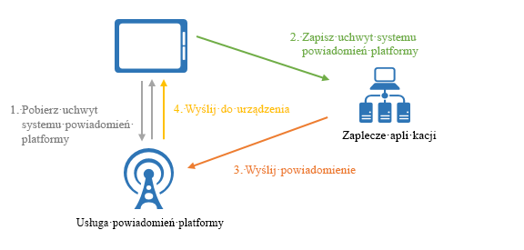
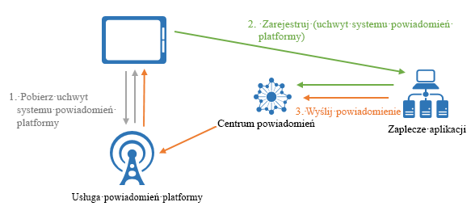

# Co to jest usługa Azure Notification Hubs?

Usługa Azure Notification Hubs zapewnia łatwy w użyciu i Skalowalny aparat wypychania, który umożliwia wysyłanie powiadomień do dowolnej platformy (iOS, Android, Windows itp.) z dowolnego zaplecza (w chmurze lub lokalnie). Usługa Notification Hubs działa świetnie w scenariuszach przeznaczonych dla firm i użytkowników. Poniżej przedstawiono kilka przykładowych scenariuszy:

- Wysyłanie powiadomień o najważniejszych wiadomościach do milionów osób z małym opóźnieniem.
- Wysyłanie kuponów opartych na lokalizacji do segmentów zainteresowanych użytkowników.
- Wysyłanie powiadomień o zdarzeniach do użytkowników lub grup dla aplikacji związanych z mediami, sportem i finansami oraz gier.
- Wypychanie promocyjnej zawartości do aplikacji w celu zaangażowania klientów i wprowadzania aplikacji na rynek.
- Powiadamiaj użytkowników o zdarzeniach przedsiębiorstwa, takich jak nowe wiadomości i elementy robocze.
- Wysyłanie kodów uwierzytelniania wieloskładnikowego.

## Co to są powiadomienia push?

Powiadomienia wypychane są formą komunikacji między użytkownikami, w której użytkownicy aplikacji mobilnych są powiadamiani o określonych wymaganych informacjach, zazwyczaj w podręcznym lub oknie dialogowym na urządzeniu przenośnym. Użytkownicy zazwyczaj decydują się wyświetlać lub odrzucać komunikat; Wybranie tej opcji spowoduje otwarcie aplikacji mobilnej, która komunikuje się z powiadomieniem. Niektóre powiadomienia są dostarczane w trybie dyskretnym w tle dla aplikacji do przetworzenia i podejmowania decyzji o tym, co należy zrobić.

Powiadomienia push są istotne w przypadku aplikacji użytkowników, ponieważ powodują zwiększenie zaangażowania i użycia aplikacji, a w przypadku aplikacji dla przedsiębiorstw, ponieważ są używane podczas codziennej komunikacji obejmującej informacje biznesowe. Jest to Najlepsza komunikacja między użytkownikami, ponieważ jest energooszczędna dla urządzeń przenośnych, jest elastyczna dla nadawców powiadomień i dostępna, gdy odpowiednie aplikacje nie są aktywne.

> [!NOTE]
> Usługa Azure Notification Hubs nie obsługuje powiadomień wypychanych za pośrednictwem protokołu Voice over Internet Protocol (VOIP).

Aby uzyskać więcej informacji o powiadomieniach push dla kilku popularnych platform, zobacz następujące tematy:

- [Android](https://developer.android.com/guide/topics/ui/notifiers/notifications.html)
- [iOS](https://developer.apple.com/notifications/)
- [Windows](https://msdn.microsoft.com/library/windows/apps/hh779725.aspx)

## Jak działają powiadomienia wypychane?

Powiadomienia push są dostarczane przy użyciu infrastruktur poszczególnych platform nazywanych *systemami powiadomień platformy* (PNS, Platform Notification System). Oferują one podstawowe funkcje wypychania do dostarczania komunikatów do urządzenia z podanym dojściem i nie mają wspólnego interfejsu. Aby wysłać powiadomienie do wszystkich klientów w wersji aplikacji dla systemów Android, iOS i Windows, Deweloper musi pracować oddzielnie z Apple Push Notification Service (APNS), Firebase Cloud Messaging (FCM) i usługą powiadomień systemu Windows (WNS).

Poniżej przedstawiono sposób działania na wysokim poziomie:

1. Aplikacja chce otrzymywać powiadomienie, dlatego kontaktuje się z PNS dla platformy docelowej, na której uruchomiona jest aplikacja, i żąda unikatowego i tymczasowego dojścia do wypchnięcia. Typ uchwytu zależy od systemu (na przykład WNS używa identyfikatorów URI, podczas gdy usługa APNS używa tokenów).
2. Aplikacja kliencka przechowuje to dojście w zaplecze lub dostawcy aplikacji.
3. Aby wysłać powiadomienie wypychane, zaplecze aplikacji kontaktuje się z PNS przy użyciu dojścia do konkretnej aplikacji klienckiej.
4. System powiadomień platformy przekazuje następnie powiadomienie do urządzenia określonego przez dojście.

## Wyzwania związane z powiadomieniami push

Systemy powiadomień platformy to zaawansowane rozwiązania. Deweloper aplikacji musi jednak wykonać dużo pracy, aby zaimplementować nawet typowe scenariusze dotyczące powiadomień push, takie jak emitowanie powiadomień push do segmentów użytkowników.

Wysyłanie powiadomień wypychanych wymaga złożonej infrastruktury, która nie jest powiązana z główną logiką biznesową aplikacji. Niektóre wyzwania związane z infrastrukturą są następujące:

- **Zależności dotyczące platformy**
  - Zaplecze wymaga złożonej i trudnej w obsłudze logiki zależnej od platformy do wysyłania powiadomień do urządzeń na różnych platformach, ponieważ PNSes nie są ujednolicone.
- **Skalowanie**
  - Zgodnie z wytycznymi PNS, tokeny urządzeń muszą być odświeżane przy każdym uruchomieniu aplikacji. Zaplecze zajmuje dużą ilość ruchu i dostęp do bazy danych, aby zapewnić aktualność tokenów. Gdy liczba urządzeń rośnie do setek, tysięcy lub milionów, koszt tworzenia i utrzymywania tej infrastruktury jest ogromny.
  - Większość systemów powiadomień platformy nie obsługuje emisji do wielu urządzeń. Prosta emisja do milionów urządzeń powoduje miliony wywołań systemów powiadomień platformy. Skalowanie tej ilości ruchu sieciowego z minimalnym opóźnieniem to poważne zadanie.
- **Routing**
  - Chociaż PNSes umożliwiają wysyłanie komunikatów do urządzeń, większość powiadomień aplikacji jest przeznaczonych dla użytkowników lub grup zainteresowań. Zaplecze musi zachować rejestr, aby skojarzyć urządzenia z grupami zainteresowań, użytkownikami, właściwościami itp. To narzuty zwiększa czas wprowadzenia na rynek i koszty konserwacji aplikacji.

## Dlaczego warto korzystać z usługi Azure Notification Hubs?

Notification Hubs eliminuje wszystkie złożone skojarzenia związane z wysyłaniem powiadomień wypychanych ze swojej zaplecza aplikacji. Jej międzyplatformowa, skalowana w poziomie infrastruktura powiadomień push zmniejsza ilość kodowania i upraszcza zaplecze. Dzięki usłudze Notification Hubs urządzenia są odpowiedzialne jedynie za rejestrację swoich dojść systemu powiadomień platformy w centrum, a zaplecze wysyła komunikaty do użytkowników lub grup zainteresowań, jak przedstawiono na poniższym rysunku:

Notification Hubs to gotowy do użycia aparat wypychania z następującymi zaletami:

- **Obsługa wielu platform**
  - Obsługa wszystkich głównych platform wypychania.
  - Wspólny interfejs wypychania do wszystkich platform w formatach specyficznych dla platformy lub niezależnych od platformy bez zadań specyficznych dla platformy.
  - Zarządzanie dojściami urządzeń w jednym miejscu.
- **Obsługa wielu zapleczy**
  - W chmurze lub lokalnie.
  - .NET, Node. js, Java, Python itp.
- **Rozbudowany zestaw wzorców dostarczania**
  - Emitowanie do co najmniej jednej platformy: można błyskawicznie emitować do milionów urządzeń na wielu platformach przy użyciu jednego wywołania interfejsu API.
  - Wypychanie do urządzenia: można kierować powiadomienia do poszczególnych urządzeń.
  - Wypchnij do użytkownika: Tagi i Szablony ułatwiają dostęp do wszystkich urządzeń dla wielu platform dla użytkownika.
  - Wypchnij do segmentu ze znacznikami dynamicznymi: funkcja tagów ułatwia segmentację urządzeń i wypychanie ich do nich zgodnie z potrzebami, niezależnie od tego, czy jest wysyłany do jednego segmentu, czy do wyrażenia segmentów (na przykład aktywnych i przebywających w Seattle nie nowego użytkownika). Zamiast ograniczać się do publikowania/subskrybowania, można aktualizować Tagi urządzeń w dowolnym miejscu i czasie.
  - Zlokalizowane wypychanie: funkcja szablonów ułatwia uzyskanie lokalizacji bez wpływu na kod zaplecza.
  - Wypychanie dyskretne: można włączyć wzorzec wypychania i ściągania, wysyłając dyskretne powiadomienia do urządzeń i wyzwalając je w celu zakończenia wybranych operacji ściągnięcia lub akcji.
  - Zaplanowane wypychanie: możesz zaplanować wysyłanie powiadomień w dowolnym czasie.
  - Wypychania bezpośrednie: można pominąć rejestrowanie urządzeń w usłudze Notification Hubs i bezpośrednio wypchnąć partię do listy dojść urządzeń.
  - Spersonalizowane wypychanie: zmienne wypychane urządzenia ułatwiają wysyłanie spersonalizowanych powiadomień wypychanych specyficznych dla urządzeń przy użyciu dostosowanych par klucz-wartość.
- **Rozbudowane dane telemetryczne**
  - Dane telemetryczne ogólnej wypychania, urządzenia, błędu i operacji są dostępne zarówno w Azure Portal, jak i programowo.
  - Dane telemetryczne poszczególnych komunikatów śledzą każde wypychanie z początkowego wywołania żądania do usługi Notification Hubs pomyślne wysłanie wypychania.
  - System powiadomień platformy opinia komunikuje się ze wszystkimi opiniami z PNSes, aby pomóc w debugowaniu.
- **Skalowalność**
  - Wysyłaj szybkie wiadomości do milionów urządzeń bez konieczności ponownego tworzenia architektury lub fragmentowania urządzeń.
- **Bezpieczeństwo**
  - Uwierzytelnianie przy użyciu wpisu tajnego dostępu współdzielonego (SAS, Shared Access Secret) lub uwierzytelnianie federacyjne.

## Następne kroki

Rozpocznij tworzenie centrum powiadomień i korzystanie z niego, wykonując kroki opisane w temacie [Samouczek: wypychanie powiadomień do aplikacji mobilnych](notification-hubs-android-push-notification-google-fcm-get-started.md).

[0]: ./media/notification-hubs-overview/registration-diagram.png
[1]: ./media/notification-hubs-overview/notification-hub-diagram.png

[How customers are using Notification Hubs]: https://azure.microsoft.com/services/notification-hubs
[Notification Hubs tutorials and guides]: https://azure.microsoft.com/documentation/services/notification-hubs
[iOS]: https://azure.microsoft.com/documentation/articles/notification-hubs-ios-get-started
[Android]: https://azure.microsoft.com/documentation/articles/notification-hubs-android-get-started
[Windows Universal]: https://azure.microsoft.com/documentation/articles/notification-hubs-windows-store-dotnet-get-started
[Windows Phone]: https://azure.microsoft.com/documentation/articles/notification-hubs-windows-phone-get-started
[Kindle]: https://azure.microsoft.com/documentation/articles/notification-hubs-kindle-get-started
[Xamarin.iOS]: https://azure.microsoft.com/documentation/articles/partner-xamarin-notification-hubs-ios-get-started
[Xamarin.Android]: https://azure.microsoft.com/documentation/articles/partner-xamarin-notification-hubs-android-get-started
[Microsoft.WindowsAzure.Messaging.NotificationHub]: https://msdn.microsoft.com/library/microsoft.windowsazure.messaging.notificationhub.aspx
[Microsoft.ServiceBus.Notifications]: https://msdn.microsoft.com/library/microsoft.servicebus.notifications.aspx
[App Service Mobile Apps]: https://azure.microsoft.com/documentation/articles/app-service-mobile-value-prop/
[templates]: notification-hubs-templates-cross-platform-push-messages.md
[Azure portal]: https://portal.azure.com
[tags]: (https://msdn.microsoft.com/library/azure/dn530749.aspx)
