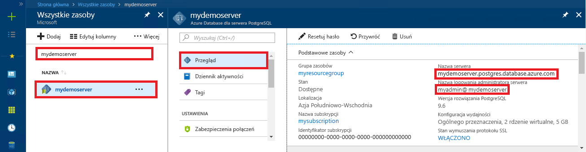

# <a name="azure-database-for-postgresql---single-server-use-net-c-to-connect-and-query-data"></a>Azure Database for PostgreSQL — pojedynczy serwer: używanie platformy .NET (C#) do nawiązywania połączenia i wykonywania zapytań dotyczących danych
Ten przewodnik Szybki start przedstawia sposób nawiązywania połączeń z usługą Azure Database for PostgreSQL przy użyciu aplikacji języka C#. Pokazano w nim, jak używać instrukcji języka SQL w celu wysyłania zapytań o dane oraz wstawiania, aktualizowania i usuwania danych w bazie danych. W krokach w tym artykule założono, że wiesz już, jak programować za pomocą języka C#, i dopiero zaczynasz pracę z usługą Azure Database for PostgreSQL.

## <a name="prerequisites"></a>Wymagania wstępne
Ten przewodnik Szybki start jako punktu wyjścia używa zasobów utworzonych w jednym z tych przewodników:
- [Tworzenie bazy danych — portal](quickstart-create-server-database-portal.md)
- [Tworzenie bazy danych — interfejs wiersza polecenia](quickstart-create-server-database-azure-cli.md)

Należy również:
- Zainstalować program [.NET Framework](https://www.microsoft.com/net/download). Postępuj zgodnie z instrukcjami z połączonego artykułu, aby zainstalować program .NET dla danej platformy (Windows, Ubuntu Linux lub macOS). 
- Zainstalować program [Visual Studio](https://www.visualstudio.com/downloads/) lub Visual Studio Code, aby wpisywać i edytować kod.
- Dodać odwołanie do pakietu Nuget [Npgsql](https://www.nuget.org/packages/Npgsql/).

## <a name="get-connection-information"></a>Pobieranie informacji o połączeniu
Uzyskaj parametry połączenia potrzebne do nawiązania połączenia z usługą Azure Database for PostgreSQL. Potrzebna jest w pełni kwalifikowana nazwa serwera i poświadczenia logowania.

1. Zaloguj się do witryny [Azure Portal](https://portal.azure.com/).
2. W menu po lewej stronie w witrynie Azure Portal kliknij pozycję **Wszystkie zasoby** i wyszukaj utworzony serwer, taki jak **mydemoserver**.
3. Kliknij nazwę serwera.
4. Po przejściu do panelu **Przegląd** serwera zanotuj **nazwę serwera** i **nazwę logowania administratora serwera**. Jeśli zapomnisz hasła, możesz również je zresetować z poziomu tego panelu.
 

## <a name="connect-create-table-and-insert-data"></a>Nawiązywanie połączenia, tworzenie tabeli i wstawianie danych
Użyj poniższego kodu, aby nawiązać połączenie i załadować dane przy użyciu instrukcji **CREATE TABLE** i **INSERT INTO** języka SQL. Kod używa klasy NpgsqlCommand z metodą [Open()](https://www.npgsql.org/doc/api/Npgsql.NpgsqlConnection.html#Npgsql_NpgsqlConnection_Open) w celu ustanowienia połączenia z bazą danych PostgreSQL. Następnie kod używa metody [CreateCommand()](https://www.npgsql.org/doc/api/Npgsql.NpgsqlConnection.html#Npgsql_NpgsqlConnection_CreateCommand), ustawia właściwość CommandText i wywołuje metodę [ExecuteNonQuery()](https://www.npgsql.org/doc/api/Npgsql.NpgsqlCommand.html#Npgsql_NpgsqlCommand_ExecuteNonQuery), aby uruchamiać polecenia bazy danych. 

Zastąp parametry hosta, nazwy bazy danych, użytkownika i hasła wartościami, które zostały określone podczas tworzenia serwera i bazy danych. 

```csharp
using System;
using Npgsql;

namespace Driver
{
    public class AzurePostgresCreate
    {
        // Obtain connection string information from the portal
        //
        private static string Host = "mydemoserver.postgres.database.azure.com";
        private static string User = "mylogin@mydemoserver";
        private static string DBname = "mypgsqldb";
        private static string Password = "<server_admin_password>";
        private static string Port = "5432";

        static void Main(string[] args)
        {
            // Build connection string using parameters from portal
            //
            string connString =
                String.Format(
                    "Server={0};Username={1};Database={2};Port={3};Password={4};SSLMode=Prefer",
                    Host,
                    User,
                    DBname,
                    Port,
                    Password);


            using (var conn = new NpgsqlConnection(connString))

            {
                Console.Out.WriteLine("Opening connection");
                conn.Open();

                using (var command = new NpgsqlCommand("DROP TABLE IF EXISTS inventory", conn))
                { 
                    command.ExecuteNonQuery();
                    Console.Out.WriteLine("Finished dropping table (if existed)");

                }

                using (var command = new NpgsqlCommand("CREATE TABLE inventory(id serial PRIMARY KEY, name VARCHAR(50), quantity INTEGER)", conn))
                {
                    command.ExecuteNonQuery();
                    Console.Out.WriteLine("Finished creating table");
                }

                using (var command = new NpgsqlCommand("INSERT INTO inventory (name, quantity) VALUES (@n1, @q1), (@n2, @q2), (@n3, @q3)", conn))
                {
                    command.Parameters.AddWithValue("n1", "banana");
                    command.Parameters.AddWithValue("q1", 150);
                    command.Parameters.AddWithValue("n2", "orange");
                    command.Parameters.AddWithValue("q2", 154);
                    command.Parameters.AddWithValue("n3", "apple");
                    command.Parameters.AddWithValue("q3", 100);
                    
                    int nRows = command.ExecuteNonQuery();
                    Console.Out.WriteLine(String.Format("Number of rows inserted={0}", nRows));
                }
            }

            Console.WriteLine("Press RETURN to exit");
            Console.ReadLine();
        }
    }
}
```

## <a name="read-data"></a>Odczyt danych
Użyj poniższego kodu, aby nawiązać połączenie i odczytać dane za pomocą instrukcji **SELECT** języka SQL. Kod używa klasy NpgsqlCommand z metodą [Open()](https://www.npgsql.org/doc/api/Npgsql.NpgsqlConnection.html#Npgsql_NpgsqlConnection_Open) w celu ustanowienia połączenia z językiem PostgreSQL. Następnie kod używa metod [CreateCommand()](https://www.npgsql.org/doc/api/Npgsql.NpgsqlConnection.html#Npgsql_NpgsqlConnection_CreateCommand) i [ExecuteReader()](https://www.npgsql.org/doc/api/Npgsql.NpgsqlCommand.html#Npgsql_NpgsqlCommand_ExecuteReader), aby uruchamiać polecenia bazy danych. W kolejnym kroku kod używa metody [Read()](https://www.npgsql.org/doc/api/Npgsql.NpgsqlDataReader.html#Npgsql_NpgsqlDataReader_Read) w celu przejścia do rekordu w wynikach. Na koniec kod używa metod [GetInt32()](https://www.npgsql.org/doc/api/Npgsql.NpgsqlDataReader.html#Npgsql_NpgsqlDataReader_GetInt32_System_Int32_) i [GetString()](https://www.npgsql.org/doc/api/Npgsql.NpgsqlDataReader.html#Npgsql_NpgsqlDataReader_GetString_System_Int32_) w celu przeanalizowania wartości w rekordzie.

Zastąp parametry hosta, nazwy bazy danych, użytkownika i hasła wartościami, które zostały określone podczas tworzenia serwera i bazy danych. 

```csharp
using System;
using Npgsql;

namespace Driver
{
    public class AzurePostgresRead
    {
        // Obtain connection string information from the portal
        //
        private static string Host = "mydemoserver.postgres.database.azure.com";
        private static string User = "mylogin@mydemoserver";
        private static string DBname = "mypgsqldb";
        private static string Password = "<server_admin_password>";
        private static string Port = "5432";

        static void Main(string[] args)
        {
            // Build connection string using parameters from portal
            //
            string connString =
                String.Format(
                    "Server={0}; User Id={1}; Database={2}; Port={3}; Password={4};SSLMode=Prefer",
                    Host,
                    User,
                    DBname,
                    Port,
                    Password);

            using (var conn = new NpgsqlConnection(connString))
            {

                Console.Out.WriteLine("Opening connection");
                conn.Open();


                using (var command = new NpgsqlCommand("SELECT * FROM inventory", conn))
                {

                    var reader = command.ExecuteReader();
                    while (reader.Read())
                    {
                        Console.WriteLine(
                            string.Format(
                                "Reading from table=({0}, {1}, {2})",
                                reader.GetInt32(0).ToString(),
                                reader.GetString(1),
                                reader.GetInt32(2).ToString()
                                )
                            );
                    }
                }
            }

            Console.WriteLine("Press RETURN to exit");
            Console.ReadLine();
        }
    }
}
```


## <a name="update-data"></a>Aktualizowanie danych
Użyj poniższego kodu, aby nawiązać połączenie i zaktualizować dane za pomocą instrukcji **UPDATE** języka SQL. Kod używa klasy NpgsqlCommand z metodą [Open()](https://www.npgsql.org/doc/api/Npgsql.NpgsqlConnection.html#Npgsql_NpgsqlConnection_Open) w celu ustanowienia połączenia z językiem PostgreSQL. Następnie kod używa metody [CreateCommand()](https://www.npgsql.org/doc/api/Npgsql.NpgsqlConnection.html#Npgsql_NpgsqlConnection_CreateCommand), ustawia właściwość CommandText i wywołuje metodę [ExecuteNonQuery()](https://www.npgsql.org/doc/api/Npgsql.NpgsqlCommand.html#Npgsql_NpgsqlCommand_ExecuteNonQuery), aby uruchamiać polecenia bazy danych.

Zastąp parametry hosta, nazwy bazy danych, użytkownika i hasła wartościami, które zostały określone podczas tworzenia serwera i bazy danych. 

```csharp
using System;
using Npgsql;

namespace Driver
{
    public class AzurePostgresUpdate
    {
        // Obtain connection string information from the portal
        //
        private static string Host = "mydemoserver.postgres.database.azure.com";
        private static string User = "mylogin@mydemoserver";
        private static string DBname = "mypgsqldb";
        private static string Password = "<server_admin_password>";
        private static string Port = "5432";

        static void Main(string[] args)
        {
            // Build connection string using parameters from portal
            //
            string connString =
                String.Format(
                    "Server={0}; User Id={1}; Database={2}; Port={3}; Password={4};SSLMode=Prefer",
                    Host,
                    User,
                    DBname,
                    Port,
                    Password);

            using (var conn = new NpgsqlConnection(connString))
            {

                Console.Out.WriteLine("Opening connection");
                conn.Open();

                using (var command = new NpgsqlCommand("UPDATE inventory SET quantity = @q WHERE name = @n", conn))
                {
                    command.Parameters.AddWithValue("n", "banana");
                    command.Parameters.AddWithValue("q", 200);
                    
                    int nRows = command.ExecuteNonQuery();
                    Console.Out.WriteLine(String.Format("Number of rows updated={0}", nRows));
                }
            }

            Console.WriteLine("Press RETURN to exit");
            Console.ReadLine();
        }
    }
}


```


## <a name="delete-data"></a>Usuwanie danych
Użyj poniższego kodu, aby nawiązać połączenie i usunąć dane za pomocą instrukcji **DELETE** języka SQL. 

Kod używa klasy NpgsqlCommand z metodą [Open()](https://www.npgsql.org/doc/api/Npgsql.NpgsqlConnection.html#Npgsql_NpgsqlConnection_Open) w celu ustanowienia połączenia z bazą danych PostgreSQL. Następnie kod używa metody [CreateCommand()](https://www.npgsql.org/doc/api/Npgsql.NpgsqlConnection.html#Npgsql_NpgsqlConnection_CreateCommand), ustawia właściwość CommandText i wywołuje metodę [ExecuteNonQuery()](https://www.npgsql.org/doc/api/Npgsql.NpgsqlCommand.html#Npgsql_NpgsqlCommand_ExecuteNonQuery), aby uruchamiać polecenia bazy danych.

Zastąp parametry hosta, nazwy bazy danych, użytkownika i hasła wartościami, które zostały określone podczas tworzenia serwera i bazy danych. 

```csharp
using System;
using Npgsql;

namespace Driver
{
    public class AzurePostgresDelete
    {
        // Obtain connection string information from the portal
        //
        private static string Host = "mydemoserver.postgres.database.azure.com";
        private static string User = "mylogin@mydemoserver";
        private static string DBname = "mypgsqldb";
        private static string Password = "<server_admin_password>";
        private static string Port = "5432";

        static void Main(string[] args)
        {
            // Build connection string using parameters from portal
            //
            string connString =
                String.Format(
                    "Server={0}; User Id={1}; Database={2}; Port={3}; Password={4};SSLMode=Prefer",
                    Host,
                    User,
                    DBname,
                    Port,
                    Password);

            using (var conn = new NpgsqlConnection(connString))
            {
                Console.Out.WriteLine("Opening connection");
                conn.Open();

                using (var command = new NpgsqlCommand("DELETE FROM inventory WHERE name = @n", conn))
                {
                    command.Parameters.AddWithValue("n", "orange");

                    int nRows = command.ExecuteNonQuery();
                    Console.Out.WriteLine(String.Format("Number of rows deleted={0}", nRows));
                }
            }

            Console.WriteLine("Press RETURN to exit");
            Console.ReadLine();
        }
    }
}

```

## <a name="next-steps"></a>Kolejne kroki
> [!div class="nextstepaction"]
> [Migrowanie bazy danych przy użyciu funkcji eksportowania i importowania](./howto-migrate-using-export-and-import.md)
