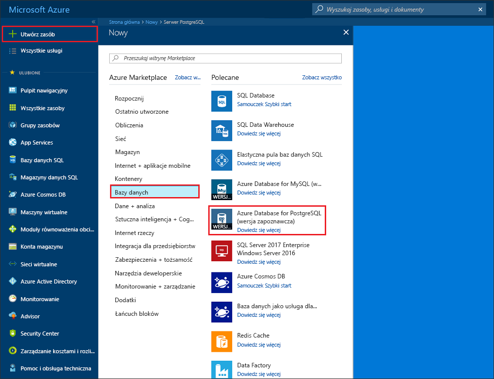
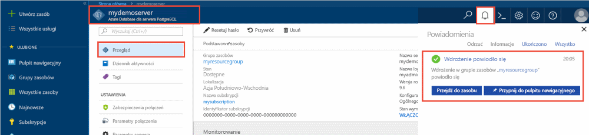

# <a name="tutorial-design-an-azure-database-for-postgresql---single-server-using-the-azure-portal"></a>Samouczek: Projektowanie usługi Azure Database for PostgreSQL — jeden serwer przy użyciu witryny Azure portal

Azure Database for PostgreSQL to usługa zarządzana, która umożliwia uruchamianie i skalowanie w chmurze baz danych PostgreSQL o wysokiej dostępności, a także zarządzanie nimi. Za pomocą witryny Azure Portal możesz łatwo zarządzać serwerem i zaprojektować bazę danych.

W tym samouczku nauczysz się wykonywać następujące czynności, używając witryny Azure Portal:
> [!div class="checklist"]
> * Tworzenie serwera usługi Azure Database for PostgreSQL
> * Konfigurowanie zapory serwera
> * Użycie narzędzia [**psql**](https://www.postgresql.org/docs/9.6/static/app-psql.html) do utworzenia bazy danych
> * Ładowanie przykładowych danych
> * Zapytania o dane
> * Aktualizowanie danych
> * Przywracanie danych

## <a name="prerequisites"></a>Wymagania wstępne
Jeśli nie masz subskrypcji platformy Azure, przed rozpoczęciem utwórz [bezpłatne](https://azure.microsoft.com/free/) konto.

## <a name="create-an-azure-database-for-postgresql"></a>Tworzenie serwera usługi Azure Database for PostgreSQL

Serwer usługi Azure Database for PostgreSQL jest tworzony ze zdefiniowanym zestawem [zasobów obliczeniowych i przestrzeni dyskowej](./concepts-compute-unit-and-storage.md). Serwer jest tworzony w ramach [grupy zasobów Azure](../azure-resource-manager/resource-group-overview.md).

Wykonaj następujące kroki, aby utworzyć serwer usługi Azure Database for PostgreSQL:
1. W lewym górnym rogu witryny Azure Portal kliknij polecenie **Utwórz zasób**.
2. Na stronie **Nowy** wybierz pozycję **Bazy danych**, a następnie na stronie **Bazy danych** wybierz pozycję **Azure Database for PostgreSQL**.
   

3. Wybierz **pojedynczego serwera** opcji wdrożenia.

   

4. Wypełnij **podstawy** formularza następujące informacje:

    

    Ustawienie|Sugerowana wartość|Opis
    ---|---|---
    Subskrypcja|Nazwa subskrypcji użytkownika|Subskrypcja platformy Azure, która ma być używana dla serwera. Jeśli masz wiele subskrypcji, wybierz tę, w ramach której są naliczane opłaty za ten zasób.
    Grupa zasobów|*myresourcegroup*| Nowa nazwa grupy zasobów lub istniejąca nazwa z subskrypcji.
    Nazwa serwera |*mydemoserver*|Unikatowa nazwę, która identyfikuje serwer usługi Azure Database for PostgreSQL. Nazwa domeny *postgres.database.azure.com* jest dołączana do podawanej nazwy serwera. Serwer może zawierać tylko małe litery, cyfry i znaki łącznika (-). Musi zawierać od 3 do 63 znaków.
    Źródło danych | *Brak* | Wybierz *Brak* Aby utworzyć nowy serwer od początku. (Opcję *Kopia zapasowa* należy wybrać w przypadku tworzenia serwera z geograficznej kopii zapasowej istniejącego serwera usługi Azure Database for PostgreSQL).
    Nazwa użytkownika administratora |*myadmin*| Własne konto logowania do użycia podczas łączenia z serwerem. Nazwą logowania administratora nie może być **azure_superuser**, **azure_pg_admin**, **admin**, **administrator**, **root**, **guest** ani **public**. Nie może ona zaczynać się od **pg_**.
    Hasło |Twoje hasło| Nowe hasło do konta administratora serwera. Musi zawierać od 8 do 128 znaków. Hasło musi zawierać znaki z trzech z następujących kategorii: wielkie litery z alfabetu angielskiego, małe litery z alfabetu angielskiego, cyfry (0–9) i znaki inne niż alfanumeryczne (!, $, #, % itd.).
    Lokalizacja|Region najbliżej Twoich użytkowników| Lokalizacja znajdująca się najbliżej użytkowników.
    Wersja|Najnowsza wersja główna| Najnowsza wersja główna usługi PostgreSQL, chyba że masz inne określone wymagania.
    Obliczenia i magazyn | **Ogólnego przeznaczenia**, **Generacja 5**, **2 rdzenie wirtualne**, **5 GB**, **7 dni**, **Geograficznie nadmiarowy** | Konfiguracje obliczania, magazynu i kopii zapasowej dla nowego serwera. Wybierz **skonfiguruj poświadczenia serwera**. Następnie wybierz kartę **Ogólnego przeznaczenia**. *Velikost haldy 5*, *4 rdzenie wirtualne*, *100 GB*, i *7 dni* są wartościami domyślnymi dla **Generowanie obliczeń**,  **Rdzeń wirtualny**, **magazynu**, i **okres przechowywania kopii zapasowej**. Możesz pozostawić te suwaki pierwotnej formie lub dostosować je. Aby włączyć kopie zapasowe serwera w magazynie geograficznie nadmiarowym, wybierz opcję **Geograficznie nadmiarowy** w pozycji **Opcje nadmiarowości kopii zapasowej**. Aby zapisać tę wybraną warstwę cenową, wybierz przycisk **OK**. Następny zrzut ekranu przedstawia te wybory.

   > [!NOTE]
   > Jeśli niewielkie zasoby obliczeniowe i we/wy są wystarczające dla Twojego obciążenia, warto rozważyć użycie warstwy cenowej Podstawowa. Pamiętaj, że serwerów utworzonych w warstwie cenowej Podstawowa nie można później przeskalować do warstwy Ogólnego przeznaczenia lub Zoptymalizowana pod kątem pamięci. Przejdź na [stronę cennika](https://azure.microsoft.com/pricing/details/postgresql/), aby uzyskać więcej informacji.
   > 

    

5. Wybierz **Przejrzyj + Utwórz** przejrzeć wybrane opcje. Wybierz pozycję **Utwórz**, aby aprowizować serwer. Ta operacja może potrwać kilka minut.

6. Na pasku narzędzi wybierz ikonę **Powiadomienia** (dzwonek), aby monitorować proces wdrażania. Po zakończeniu wdrażania możesz wybrać opcję **Przypnij do pulpitu nawigacyjnego**, która tworzy kafelek dla tego serwera na pulpicie nawigacyjnym witryny Azure Portal jako skrót do strony **Przegląd** serwera. Wybranie opcji **Przejdź do zasobu** spowoduje otworzenie strony **Przegląd** serwera.

    
   
   Domyślnie baza danych **postgres** zostanie utworzona na Twoim serwerze. Baza danych [postgres](https://www.postgresql.org/docs/9.6/static/app-initdb.html) to domyślna baza danych, która jest przeznaczona do użycia dla użytkowników oraz na potrzeby narzędzi i aplikacji innych firm. (Inną domyślną bazą danych jest **azure_maintenance**. Służy ona do oddzielania procesów usług zarządzanych od działań użytkownika. Nie możesz uzyskać dostępu do tej bazy danych).


## <a name="configure-a-server-level-firewall-rule"></a>Konfigurowanie reguły zapory na poziomie serwera

Usługa Azure Database for PostgreSQL używa zapory na poziomie serwera. Domyślnie ta zapora uniemożliwia wszystkim zewnętrznym aplikacjom i narzędziom łączenie się z serwerem i wszelkimi bazami danych na tym serwerze, chyba że zostanie utworzona reguła zapory otwierająca zaporę dla konkretnego zakresu adresów IP. 

1. Po zakończeniu wdrożenia kliknij pozycję **Wszystkie zasoby** w menu po lewej stronie i wpisz nazwę **mydemoserver**, aby wyszukać nowo utworzony serwer. Kliknij nazwę serwera wyświetlaną w wynikach wyszukiwania. Zostanie otwarta strona **Przegląd**, która zawiera dalsze opcje konfiguracji.

   

2. Na stronie serwera wybierz pozycję **Zabezpieczenia połączeń**. 

3. Kliknij w polu tekstowym w obszarze **Nazwa reguły** i dodaj nową regułę zapory, aby na liście dozwolonych umieścić zakres adresów IP służących do łączności. Wprowadź zakres adresów IP. Kliknij pozycję **Zapisz**.

   

4. Kliknij polecenie **Zapisz**, a następnie kliknij przycisk **X**, aby zamknąć stronę **Zabezpieczenia połączeń**.

   > [!NOTE]
   > Serwer Azure PostgreSQL komunikuje się przez port 5432. Jeśli próbujesz nawiązać połączenie z sieci firmowej, ruch wychodzący na porcie 5432 może być zablokowany przez zaporę sieciową. Jeśli wystąpi taka sytuacja, nie będzie można nawiązać połączenia z serwerem usługi Azure SQL Database, chyba że dział IT otworzy port 5432.
   >

## <a name="get-the-connection-information"></a>Pobieranie informacji o połączeniu

W ramach tworzenia serwera usługi Azure Database for PostgreSQL jest także tworzona domyślna baza danych **postgres**. Aby nawiązać połączenie z serwerem bazy danych, musisz podać informacje o hoście i poświadczenia dostępu.

1. W menu po lewej stronie w witrynie Azure Portal kliknij pozycję **Wszystkie zasoby** i wyszukaj właśnie utworzony serwer.

   

2. Kliknij nazwę serwera **mydemoserver**.

3. Wybierz stronę serwera **Przegląd**. Zanotuj wartości **Nazwa serwera** i **Identyfikator logowania administratora serwera**.

   


## <a name="connect-to-postgresql-database-using-psql-in-cloud-shell"></a>Nawiązywanie połączenia z bazą danych PostgreSQL w powłoce Cloud Shell za pomocą narzędzia psql

Teraz użyjmy narzędzia wiersza polecenia [psql](https://www.postgresql.org/docs/9.6/static/app-psql.html), aby nawiązać połączenie z serwerem usługi Azure Database for PostgreSQL. 
1. Uruchom powłokę Azure Cloud Shell za pośrednictwem ikony terminala w górnym okienku nawigacji.

   

2. Powłoka Azure Cloud Shell zostanie otwarta w przeglądarce, umożliwiając wpisywanie poleceń powłoki bash.

   

3. W wierszu polecenia powłoki Cloud Shell nawiąż połączenie z serwerem usługi Azure Database for PostgreSQL za pomocą poleceń psql. Następujący format służy do łączenia z serwerem usługi Azure Database for PostgreSQL przy użyciu narzędzia [psql](https://www.postgresql.org/docs/9.6/static/app-psql.html):
   ```bash
   psql --host=<myserver> --port=<port> --username=<server admin login> --dbname=<database name>
   ```

   Na przykład poniższe polecenie służy do nawiązywania połączenia z domyślną bazą danych o nazwie **postgres** na Twoim serwerze PostgreSQL **mydemoserver.postgres.database.azure.com** za pomocą poświadczeń dostępu. Po wyświetleniu monitu wprowadź hasło administratora serwera.

   ```bash
   psql --host=mydemoserver.postgres.database.azure.com --port=5432 --username=myadmin@mydemoserver --dbname=postgres
   ```

## <a name="create-a-new-database"></a>Tworzenie nowej bazy danych
Po nawiązaniu połączenia z serwerem utwórz pustą bazę danych za pomocą wiersza polecenia.
```bash
CREATE DATABASE mypgsqldb;
```

W wierszu polecenia wykonaj poniższe polecenie, aby przełączyć połączenie na nowo utworzoną bazę danych **mypgsqldb**.
```bash
\c mypgsqldb
```
## <a name="create-tables-in-the-database"></a>Tworzenie tabel w bazie danych
Teraz, gdy wiesz, jak nawiązać połączenie z usługą Azure Database for PostgreSQL, możesz wykonać niektóre podstawowe zadania:

Najpierw utwórz tabelę i załaduj do niej dane. Utwórzmy tabelę śledzącą informacje spisu przy użyciu następującego kodu SQL:
```sql
CREATE TABLE inventory (
    id serial PRIMARY KEY, 
    name VARCHAR(50), 
    quantity INTEGER
);
```

Teraz możesz wyświetlić nowo utworzoną tabelę na liście tabel, wpisując:
```sql
\dt
```

## <a name="load-data-into-the-tables"></a>Ładowanie danych do tabel
Teraz, gdy masz tabelę, wstaw do niej dane. W otwartym oknie wiersza polecenia uruchom następujące zapytanie, aby wstawić wiersze danych.
```sql
INSERT INTO inventory (id, name, quantity) VALUES (1, 'banana', 150); 
INSERT INTO inventory (id, name, quantity) VALUES (2, 'orange', 154);
```

W utworzonej wcześniej tabeli spisu znajdują się teraz dwa wiersze przykładowych danych.

## <a name="query-and-update-the-data-in-the-tables"></a>Wykonywanie zapytania względem danych w tabelach i aktualizowanie tych danych
Wykonaj następujące zapytanie, aby pobrać informacje z tabeli bazy danych ze spisem. 
```sql
SELECT * FROM inventory;
```

Możesz także zaktualizować dane w tabeli.
```sql
UPDATE inventory SET quantity = 200 WHERE name = 'banana';
```

Po pobraniu danych możesz zobaczyć zaktualizowane wartości.
```sql
SELECT * FROM inventory;
```

## <a name="restore-data-to-a-previous-point-in-time"></a>Przywracanie danych do określonego punktu w czasie
Załóżmy, że ta tabela została przypadkowo usunięta. W takiej sytuacji niełatwo jest odzyskać dane. Usługa Azure Database for PostgreSQL umożliwia powrót do dowolnego punktu w czasie, dla którego istnieją kopie zapasowe na serwerze (określa to skonfigurowany okres przechowywania kopii zapasowych), i przywrócenie tego punktu w czasie na nowym serwerze. Przy użyciu tego nowego serwera można odzyskać usunięte dane. Następujące kroki umożliwiają przywrócenie serwera **mydemoserver** do punktu w czasie przed dodaniem tabeli spisu.

1. Na stronie **Przegląd** usługi Azure Database for PostgreSQL dla serwera kliknij polecenie **Przywróć** na pasku narzędzi. Zostanie otwarta strona **Przywracanie**.

   

2. Wypełnij formularz **Przywracanie** wymaganymi informacjami:

   

   - **Punkt przywracania**: wybierz punkt w czasie przed zmianą serwera
   - **Serwer docelowy**: podaj nazwę nowego serwera, na który chcesz przywrócić dane
   - **Lokalizacja**: nie można wybrać regionu — domyślnie wartość jest taka sama jak w przypadku serwera źródłowego
   - **Warstwa cenowa**: nie możesz zmienić tej wartości podczas przywracania serwera. Jest taka sama jak w przypadku serwera źródłowego. 
3. Kliknij przycisk **OK**, aby [przywrócić serwer do punktu w czasie](./howto-restore-server-portal.md) sprzed usunięcia tabeli. Przywrócenie serwera do innego punktu w czasie spowoduje utworzenie nowego serwera będącego duplikatem oryginalnego serwera z określonego przez Ciebie punktu w czasie, o ile zawiera się on w okresie przechowywania dla Twojej [warstwy cenowej](./concepts-pricing-tiers.md).

## <a name="next-steps"></a>Kolejne kroki
W tym samouczku przedstawiono sposób użycia witryny Azure Portal i innych narzędzi do:
> [!div class="checklist"]
> * Tworzenie serwera usługi Azure Database for PostgreSQL
> * Konfigurowanie zapory serwera
> * Użycie narzędzia [**psql**](https://www.postgresql.org/docs/9.6/static/app-psql.html) do utworzenia bazy danych
> * Ładowanie przykładowych danych
> * Zapytania o dane
> * Aktualizowanie danych
> * Przywracanie danych

W następnym samouczku dowiesz się, jak wykonywać podobne zadania przy użyciu interfejsu wiersza polecenia platformy Azure: [Projektowanie pierwszej bazy danych Azure Database for PostgreSQL za pomocą interfejsu wiersza polecenia platformy Azure](tutorial-design-database-using-azure-cli.md)
