# <a name="quickstart-create-a-aspnet-web-app-with-redis-cache"></a>Szybki start: tworzenie aplikacji internetowej platformy ASP.NET za pomocą pamięci podręcznej Redis Cache

> [!div class="op_single_selector"]
> * [.NET](cache-dotnet-how-to-use-azure-redis-cache.md)
> * [ASP.NET](cache-web-app-howto.md)
> * [Node.js](cache-nodejs-get-started.md)
> * [Java](cache-java-get-started.md)
> * [Python](cache-python-get-started.md)
>

## <a name="introduction"></a>Wprowadzenie

W tym przewodniku Szybki start przedstawiono sposób tworzenia i wdrażania aplikacji internetowej platformy ASP.NET w usłudze Azure App Service przy użyciu programu Visual Studio 2017. Przykładowa aplikacja nawiązuje połączenie z usługą Azure Redis Cache w celu zapisywania i pobierania danych z pamięci podręcznej. Po zakończeniu przewodnika Szybki start będziesz mieć uruchomioną aplikację internetową hostowaną na platformie Azure, która odczytuje i zapisuje w usłudze Azure Redis Cache.

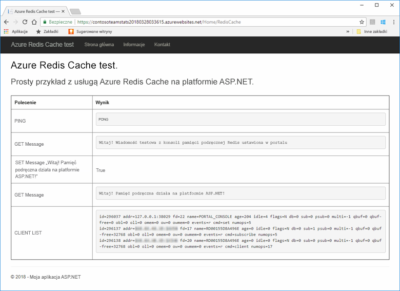

## <a name="prerequisites"></a>Wymagania wstępne

Aby ukończyć ten przewodnik Szybki start, niezbędne jest spełnienie następujących wymagań wstępnych:

* Zainstaluj program [Visual Studio 2017](https://www.visualstudio.com/downloads/) z następującymi pakietami roboczymi:
    * Tworzenie aplikacji na platformie ASP.NET i aplikacji internetowych
    * Programowanie na platformie Azure

[!INCLUDE [quickstarts-free-trial-note](../../includes/quickstarts-free-trial-note.md)]

## <a name="create-the-visual-studio-project"></a>Tworzenie projektu programu Visual Studio

Otwórz program Visual Studio i kliknij kolejno opcje **Plik**, **Nowy**, **Projekt**.

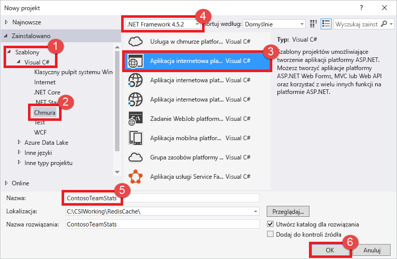

W oknie dialogowym Nowy projekt wykonaj następujące kroki:

1. Rozwiń węzeł **Visual C#** na liście **Szablony**
1. Wybierz pozycję **Chmura**
1. Kliknij pozycję **Aplikacja internetowa platformy ASP.NET**
1. Upewnij się, że został wybrany program **.NET Framework 4.5.2** lub nowszy
1. Nadaj projektowi nazwę w polu tekstowym **Nazwa**. W tym przykładzie użyliśmy nazwy **ContosoTeamStats**
1. Kliknij przycisk **OK**.

Zostanie wyświetlony ekran nowej aplikacji internetowej platformy ASP.NET:


Wybierz **MVC** jako typ projektu.

Upewnij się, że dla ustawienia **Uwierzytelnianie** wybrano pozycję **Bez uwierzytelniania**. Ustawienie domyślnie może być różne w różnych wersjach programu Visual Studio. Aby je zmienić, kliknij przycisk **Zmień uwierzytelnianie** i wybierz pozycję **Bez uwierzytelniania**.

Kliknij przycisk **OK**, aby utworzyć projekt.

## <a name="create-a-cache"></a>Tworzenie pamięci podręcznej

Następnie utworzysz pamięć podręczną dla aplikacji.

[!INCLUDE [redis-cache-create](../../includes/redis-cache-create.md)]

[!INCLUDE [redis-cache-access-keys](../../includes/redis-cache-access-keys.md)]

Utwórz na swoim komputerze plik o nazwie *CacheSecrets.config* i umieść go w lokalizacji, gdzie nie zostanie zaewidencjonowany za pomocą kodu źródłowego przykładowej aplikacji. W tym przewodniku Szybki start plik *CacheSecrets.config* znajduje się tu: *C:\AppSecrets\CacheSecrets.config*.

Edytuj plik *CacheSecrets.config* i dodaj następującą zawartość:

```xml
<appSettings>
    <add key="CacheConnection" value="<cache-name>.redis.cache.windows.net,abortConnect=false,ssl=true,password=<access-key>"/>
</appSettings>
```

Zastąp element `<cache-name>` nazwą hosta pamięci podręcznej.

Zastąp element `<access-key>` kluczem podstawowym pamięci podręcznej.

> [!TIP]
> Pomocniczy klucz dostępu jest używany podczas obrotu klucza jako klucz alternatywny, gdy następuje ponowne generowanie podstawowego klucza dostępu.
>

Zapisz plik.

## <a name="update-the-mvc-application"></a>Aktualizowanie aplikacji MVC

W tej sekcji zaktualizujesz aplikację do obsługi nowego widoku, który będzie wyświetlał prosty test dla usługi Azure Redis Cache.

* [Aktualizowanie pliku web.config ustawieniem aplikacji dla pamięci podręcznej](#Update-the-webconfig-file-with-an-app-setting-for-the-cache)
* [Konfigurowanie aplikacji do korzystania z klienta programu StackExchange.Redis](#configure-the-application-to-use-stackexchangeredis)
* [Aktualizowanie pliku HomeController i Layout](#update-the-homecontroller-and-layout)
* [Dodawanie nowego widoku RedisCache](#add-a-new-rediscache-view)

### <a name="update-the-webconfig-file-with-an-app-setting-for-the-cache"></a>Aktualizacja pliku web.config ustawieniem aplikacji dla pamięci podręcznej

Jeśli aplikacja jest uruchamiana lokalnie, informacje w pliku *CacheSecrets.config* są używane do łączenia z wystąpieniem usługi Azure Redis Cache. Później wdrożysz tę aplikację na platformie Azure. W tym czasie skonfigurujesz na platformie Azure ustawienie aplikacji, którego aplikacja będzie używać do pobierania informacji o połączeniu pamięci podręcznej zamiast tego pliku. Ponieważ plik *CacheSecrets.config* nie został wdrożony na platformie Azure za pomocą aplikacji, możesz go używać tylko podczas lokalnego testowania aplikacji. Aby zapobiec złośliwemu dostępowi do danych w pamięci podręcznej, maksymalnie zabezpiecz te informacje.

W **Eksploratorze rozwiązań** kliknij dwukrotnie plik *web.config*, aby go otworzyć.

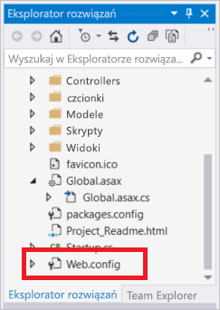

W pliku *web.config* znajdź element `<appSetting>` i dodaj następujący atrybut `file`. Jeśli wcześniej używana była inna nazwa pliku lub lokalizacja, podstaw te wartości w miejsce wyświetlonych w przykładzie.

* Przed: `<appSettings>`
* Po: ` <appSettings file="C:\AppSecrets\CacheSecrets.config">`

Środowisko uruchomieniowe ASP.NET scala zawartość pliku zewnętrznego ze znacznikami w elemencie `<appSettings>`. Środowisko uruchomieniowe ignoruje atrybut pliku, jeśli nie można odnaleźć określonego pliku. Klucze tajne (parametry połączenia do pamięci podręcznej) nie są dołączone jako część kodu źródłowego dla aplikacji. Podczas wdrażania aplikacji internetowej na platformie Azure plik *CacheSecrets.config* nie zostanie wdrożony.

### <a name="configure-the-application-to-use-stackexchangeredis"></a>Konfigurowanie aplikacji do korzystania z programu StackExchange.Redis

Aby skonfigurować aplikację do używania pakietu NuGet [StackExchange.Redis](https://github.com/StackExchange/StackExchange.Redis) dla programu Visual Studio, kliknij pozycje **Narzędzia > Menedżer pakietów NuGet > Konsola menedżera pakietów**.

W oknie `Package Manager Console` uruchom następujące polecenie:

```powershell
Install-Package StackExchange.Redis
```

Pakiet NuGet pobiera i dodaje wymagane odwołania do zestawu umożliwiające aplikacji klienta uzyskanie dostępu do usługi Azure Redis Cache przy użyciu klienta pamięci podręcznej StackExchange.Redis. Jeśli wolisz użyć wersji biblioteki klienckiej `StackExchange.Redis` o silnej nazwie, zainstaluj pakiet `StackExchange.Redis.StrongName`.

### <a name="update-the-homecontroller-and-layout"></a>Aktualizowanie plików HomeController i Layout

W **Eksploratorze rozwiązań** rozwiń folder **Kontrolery**, a następnie otwórz plik *HomeController.cs*.

Dodaj następujące dwie instrukcje `using` w górnej części pliku, aby obsłużyć klienta pamięci podręcznej i ustawienia aplikacji.

```csharp
using System.Configuration;
using StackExchange.Redis;
```

Dodaj następującą metodę do klasy `HomeController` w celu obsługi nowej akcji `RedisCache` wykonującej niektóre polecenia w stosunku do nowej pamięci podręcznej.

```csharp
    public ActionResult RedisCache()
    {
        ViewBag.Message = "A simple example with Azure Redis Cache on ASP.NET.";

        var lazyConnection = new Lazy<ConnectionMultiplexer>(() =>
        {
            string cacheConnection = ConfigurationManager.AppSettings["CacheConnection"].ToString();
            return ConnectionMultiplexer.Connect(cacheConnection);
        });

        // Connection refers to a property that returns a ConnectionMultiplexer
        // as shown in the previous example.
        IDatabase cache = lazyConnection.Value.GetDatabase();

        // Perform cache operations using the cache object...

        // Simple PING command
        ViewBag.command1 = "PING";
        ViewBag.command1Result = cache.Execute(ViewBag.command1).ToString();

        // Simple get and put of integral data types into the cache
        ViewBag.command2 = "GET Message";
        ViewBag.command2Result = cache.StringGet("Message").ToString();

        ViewBag.command3 = "SET Message \"Hello! The cache is working from ASP.NET!\"";
        ViewBag.command3Result = cache.StringSet("Message", "Hello! The cache is working from ASP.NET!").ToString();

        // Demostrate "SET Message" executed as expected...
        ViewBag.command4 = "GET Message";
        ViewBag.command4Result = cache.StringGet("Message").ToString();

        // Get the client list, useful to see if connection list is growing...
        ViewBag.command5 = "CLIENT LIST";
        ViewBag.command5Result = cache.Execute("CLIENT", "LIST").ToString().Replace(" id=", "\rid=");

        lazyConnection.Value.Dispose();

        return View();
    }
```

W **Eksploratorze rozwiązań** rozwiń folder **Widoki**>**Udostępnione**, a następnie otwórz plik *_Layout.cshtml*.

Zastąp:

```csharp
@Html.ActionLink("Application name", "Index", "Home", new { area = "" }, new { @class = "navbar-brand" })
```

Tym:

```csharp
@Html.ActionLink("Azure Redis Cache Test", "RedisCache", "Home", new { area = "" }, new { @class = "navbar-brand" })
```

### <a name="add-a-new-rediscache-view"></a>Dodawanie nowego widok RedisCache

W **Eksploratorze rozwiązań** rozwiń folder **Widoki**, a następnie kliknij prawym przyciskiem myszy folder **Główny**. Wybierz pozycje **Dodaj** > **Widok...**.

W oknie dialogowym Dodawanie widoku wprowadź **RedisCache** jako nazwę widoku, a następnie kliknij przycisk **Dodaj**.

Zastąp kod w pliku *RedisCache.cshtml* następującym kodem:

```csharp
@{
    ViewBag.Title = "Azure Redis Cache Test";
}

<h2>@ViewBag.Title.</h2>
<h3>@ViewBag.Message</h3>
<br /><br />
<table border="1" cellpadding="10">
    <tr>
        <th>Command</th>
        <th>Result</th>
    </tr>
    <tr>
        <td>@ViewBag.command1</td>
        <td><pre>@ViewBag.command1Result</pre></td>
    </tr>
    <tr>
        <td>@ViewBag.command2</td>
        <td><pre>@ViewBag.command2Result</pre></td>
    </tr>
    <tr>
        <td>@ViewBag.command3</td>
        <td><pre>@ViewBag.command3Result</pre></td>
    </tr>
    <tr>
        <td>@ViewBag.command4</td>
        <td><pre>@ViewBag.command4Result</pre></td>
    </tr>
    <tr>
        <td>@ViewBag.command5</td>
        <td><pre>@ViewBag.command5Result</pre></td>
    </tr>
</table>
```

## <a name="run-the-app-locally"></a>Lokalne uruchamianie aplikacji

Domyślnie projekt jest konfigurowany do lokalnego hostowania aplikacji w usługach [IIS Express](https://docs.microsoft.com/iis/extensions/introduction-to-iis-express/iis-express-overview) na potrzeby testowania i debugowania.

W menu programu Visual Studio kliknij pozycje **Debugowanie** > **Rozpocznij debugowanie**, aby lokalnie skompilować i uruchomić aplikację na potrzeby testowania i debugowania.

W przeglądarce kliknij pozycję **Test usługi Azure Redis Cache** na pasku nawigacyjnym.

W poniższym przykładzie widać, że klucz `Message` miał wartość wcześniej w pamięci podręcznej, która została ustawiona za pomocą konsoli Redis w portalu. Aplikacja zaktualizowała tę wartość w pamięci podręcznej. Aplikacja również wykonała polecenia `PING` i `CLIENT LIST`.

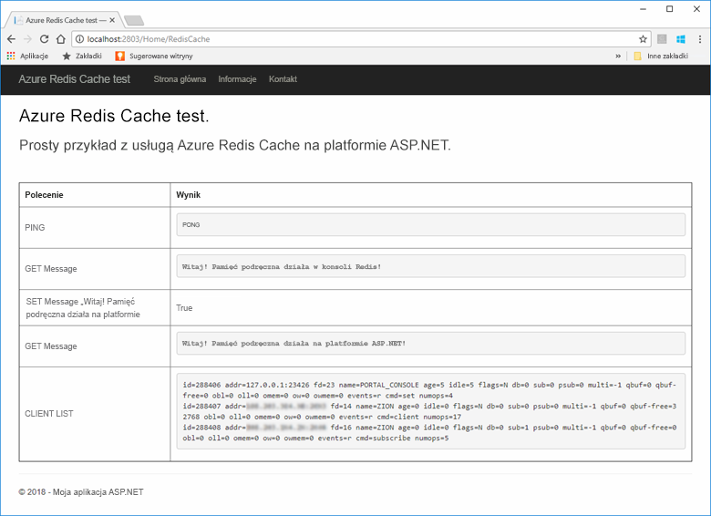

## <a name="publish-and-run-in-azure"></a>Publikowanie i uruchamianie na platformie Azure

Po pomyślnym przetestowaniu aplikacji lokalnie wdrożysz aplikację na platformie Azure i uruchomisz ją w chmurze.

### <a name="publish-the-app-to-azure"></a>Publikowanie aplikacji na platformie Azure

W programie Visual Studio kliknij prawym przyciskiem myszy węzeł projektu w Eksploratorze rozwiązań i wybierz pozycję **Opublikuj**.

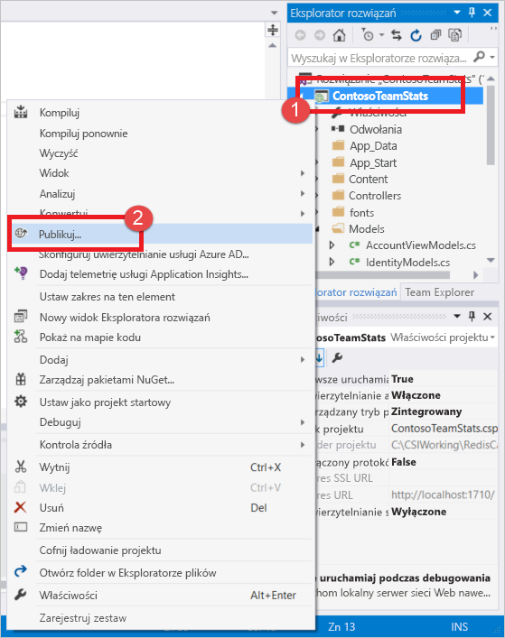

Kliknij pozycję **Microsoft Azure App Service**, wybierz pozycję **Utwórz nowy**, a następnie kliknij przycisk **Opublikuj**.

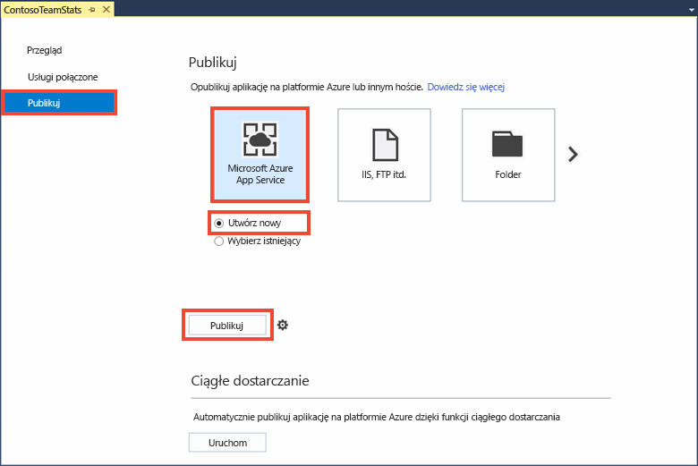

W oknie dialogowym **Tworzenie usługi App Service** wprowadź następujące zmiany:

| Ustawienie | Zalecana wartość | Opis |
| ------- | :---------------: | ----------- |
| **Nazwa aplikacji** | Używanie wartości domyślnej | Nazwa aplikacji będzie nazwą hosta dla aplikacji po wdrożeniu na platformie Azure. Nazwa może mieć dodany sufiks znacznika czasu, jeśli musi być unikatowa. |
| **Subskrypcja** | Wybieranie Twojej subskrypcji platformy Azure | Dla tej subskrypcji zostanie naliczona opłata za wszelkie powiązane koszty hostingu. Jeśli masz wiele subskrypcji platformy Azure, sprawdź, czy została wybrana odpowiednia subskrypcja.|
| **Grupa zasobów** | Użyj tej samej grupy zasobów, w której została utworzona pamięć podręczna. Na przykład *TestResourceGroup*. | Grupa zasobów pomaga w zarządzaniu wszystkimi zasobami jako grupą. Później, gdy zechcesz usunąć aplikację, wystarczy tylko usunąć grupę. |
| **Plan usługi App Service** | Kliknij przycisk **Nowy** i utwórz nowy Plan usługi App Service o nazwie *TestingPlan*. <br />Użyj tej samej **lokalizacji**, która była używana podczas tworzenia pamięci podręcznej. <br />Jako rozmiar wybierz wartość **Bezpłatny**. | Plan usługi App Service definiuje zestaw zasobów obliczeniowych dla aplikacji internetowej używanych podczas jej uruchamiania. |

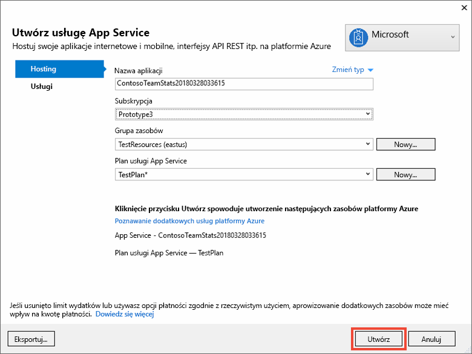

Po skonfigurowaniu ustawień hostowania usługi App Service kliknij przycisk **Utwórz**, aby utworzyć nową usługę App Service dla aplikacji.

Monitoruj okno **Dane wyjściowe** w programie Visual Studio, aby zobaczyć stan publikowania na platformie Azure. Po pomyślnym ukończeniu publikowania adres URL usługi App Service jest rejestrowany w sposób pokazany poniżej:

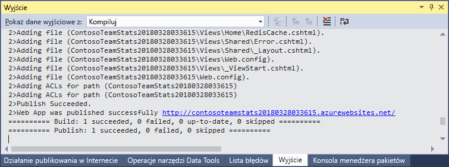

### <a name="add-the-app-setting-for-the-cache"></a>Dodawanie ustawienia aplikacji dla pamięci podręcznej

Po ukończeniu publikowania dla nowej usługi App Service dodaj nowe ustawienie aplikacji. To ustawienie zostanie użyte do zapisania informacji o połączeniu pamięci podręcznej. Wpisz nazwę aplikacji na pasku wyszukiwania w górnej części witryny Azure Portal, aby znaleźć nową usługę App Service, która właśnie została utworzona.

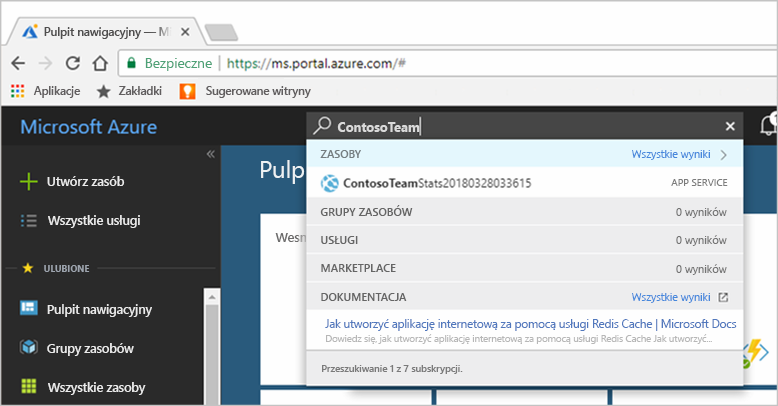

Dodaj ustawienie nowej aplikacji o nazwie **CacheConnection** dla aplikacji, aby jej używać do łączenia się z pamięcią podręczną. Użyj tej samej wartości, która została skonfigurowana dla `CacheConnection` w pliku *CacheSecrets.config*. Wartość zawiera nazwę hosta pamięci podręcznej i klucz dostępu.

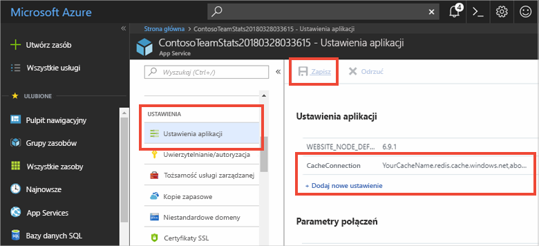

### <a name="run-the-app-in-azure"></a>Uruchamianie aplikacji na platformie Azure

W przeglądarce przejdź do adresu URL usługi App Service. Adres URL jest wyświetlany w wynikach operacji publikowania w oknie danych wyjściowych w programie Visual Studio. Jest on również udostępniany w witrynie Azure Portal na stronie omówienia utworzonej przez Ciebie usługi App Service.

Kliknij pozycję **Test usługi Azure Redis Cache** na pasku nawigacyjnym, aby przetestować dostęp do pamięci podręcznej.


## <a name="clean-up-resources"></a>Oczyszczanie zasobów

Jeśli zamierzasz przejść do kolejnego samouczka, możesz zachować zasoby utworzone w tym przewodniku Szybki start i użyć ich ponownie.

W przeciwnym razie po zakończeniu pracy z przykładową aplikacją poradnika Szybki start możesz usunąć zasoby platformy Azure utworzone w tym poradniku Szybki start, aby uniknąć naliczania opłat. 

> [!IMPORTANT]
> Usunięcie grupy zasobów jest nieodwracalne i grupa zasobów oraz wszystkie zawarte w niej zasoby zostaną trwale usunięte. Uważaj, aby nie usunąć przypadkowo niewłaściwych zasobów lub grupy zasobów. Jeśli zasoby do hostowania tego przykładu zostały utworzone wewnątrz istniejącej grupy zasobów zawierającej zasoby, które chcesz zachować, możesz usunąć każdy zasób oddzielnie z odpowiadającego mu bloku zamiast usuwać całą grupę zasobów.
>

Zaloguj się do witryny [Azure Portal](https://portal.azure.com) i kliknij pozycję **Grupy zasobów**.

W polu tekstowym **Filtruj według nazwy...** wpisz nazwę grupy zasobów. Instrukcje dla tego tematu korzystały z grupy zasobów o nazwie *TestResources*. Dla grupy zasobów na liście wyników kliknij pozycję **...**, a następnie kliknij pozycję **Usuń grupę zasobów**.

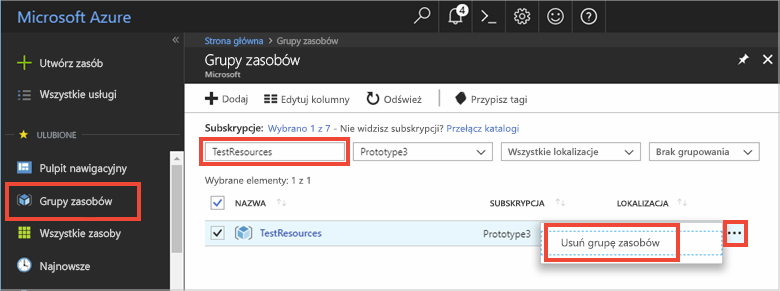

Zobaczysz prośbę o potwierdzenie usunięcia grupy zasobów. Wpisz nazwę grupy zasobów w celu potwierdzenia, a następnie kliknij pozycję **Usuń**.

Po krótkim czasie grupa zasobów i wszystkie zawarte w niej zasoby zostaną usunięte.

## <a name="next-steps"></a>Następne kroki

W następnym samouczku użyjesz usługi Azure Redis Cache w scenariuszu bardziej zbliżonym do rzeczywistego, aby poprawić wydajność aplikacji. Zaktualizujesz tę aplikację do buforowania wyników rankingu przy użyciu wzorca odkładania do pamięci podręcznej za pomocą platformy ASP.NET i bazy danych.

> [!div class="nextstepaction"]
> [Tworzenie rankingu z odkładaniem do pamięci podręcznej na platformie ASP.NET](cache-web-app-cache-aside-leaderboard.md)
