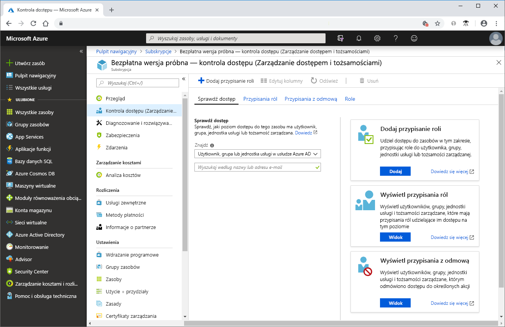
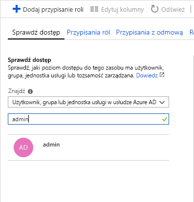
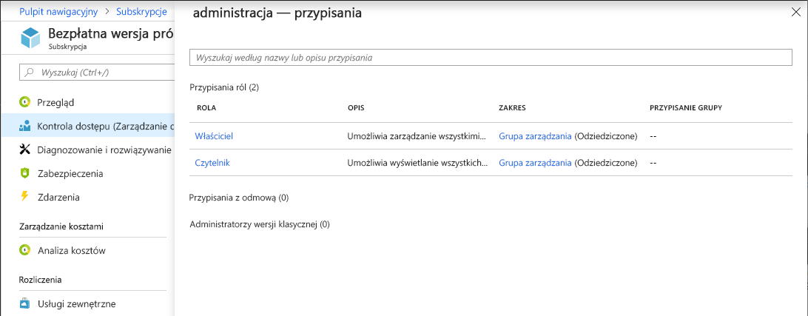

# Szybki start: Wyświetlanie informacji o dostępie użytkownika do zasobów platformy Azure

Informacje o dostępie użytkownika lub innego podmiotu zabezpieczeń do zasobów platformy Azure można wyświetlić w bloku **Kontrola dostępu (IAM)** w obszarze [Kontrola dostępu oparta na rolach (RBAC)](overview.md). Czasami jednak wystarczy szybki przegląd informacji o dostępie pojedynczego użytkownika lub innego podmiotu zabezpieczeń. Najłatwiej można to zrobić przy użyciu funkcji **Sprawdź dostęp** w witrynie Azure Portal.

## Wyświetlanie przypisań ról

 Aby sprawdzić informacje o dostępie użytkownika, należy wyświetlić jego przypisania ról. Wykonaj następujące kroki, aby wyświetlić przypisania ról dla jednego użytkownika, grupy, jednostki usługi lub tożsamości zarządzanej w zakresie subskrypcji.

1. W witrynie Azure Portal kliknij pozycję **Wszystkie usługi**, a następnie wybierz pozycję **Subskrypcje**.

1. Kliknij swoją subskrypcję.

1. Kliknij pozycję **Kontrola dostępu (IAM)**.

1. Kliknij kartę **Sprawdź dostęp**.

    

1. Na liście **Znajdź** wybierz typ podmiotu zabezpieczeń, dla którego chcesz sprawdzić dostęp.

1. W polu wyszukiwania wprowadź ciąg, aby wyszukać w katalogu nazwy wyświetlane, adresy e-mail lub identyfikatory obiektów.

    

1. Kliknij podmiot zabezpieczeń, aby otworzyć okienko **przypisania**.

    

    W tym okienku są wyświetlane role przypisane do wybranego podmiotu zabezpieczeń i zakresu. Jeśli istnieją przypisania odmowy występujące w tym zakresie lub dziedziczone przez ten zakres, zostaną wyświetlone.

## Kolejne kroki

> [!div class="nextstepaction"]
> [Samouczek: Udzielanie użytkownikowi dostępu do zasobów platformy Azure za pomocą kontroli dostępu opartej na rolach i witryny Azure Portal](quickstart-assign-role-user-portal.md)
